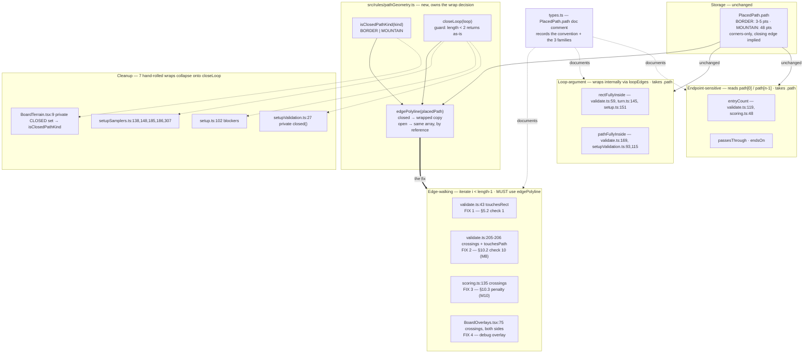

# Plan: Closed loops stored corners-only — the closing edge is invisible to touchesPath and crossings

Plan folder: `.claude/contract/SCRUM-16-closed-loop-closing-edge/`
Execution status: see `tasks.md` in this folder.

---

## Part 1 — Alignment

### Task reference

**Jira: SCRUM-16** — *Closed loops stored corners-only: the closing edge is invisible to `touchesPath` and `crossings`* (Bug, Medium, labels `latent-defect` / `rules-engine`, parent SCRUM-1, blocks SCRUM-5 and SCRUM-7). Filed 2026-08-01 on branch `SCRUM-2-4`, discovered by the defensive review of the SCRUM-3 / SCRUM-4 implementation.

The ticket's own statement of the defect:

> `generateSetup` is the first production code to create a `PlacedPath`, and it stores closed loops **corners-only** — the border as 3, 4 or 5 points and the mountain as 48, without repeating the first point to close the ring. Before this, only test fixtures produced a `PlacedPath`, so the convention had never been exercised.
>
> `PlacedPath.path` carries no doc comment stating whether a loop is stored wrapped or corners-only, so the convention is invisible to the compiler and to every reader. Two of the engine's core predicates — `containment.touchesPath` and `geometry.crossings` — iterate `j < other.length - 1`, meaning the closing edge from the last vertex back to the first is **never tested**.

Two named consequences, both silent:

1. **An illegal station placement can commit.** `validate.ts` runs `touchesRect(placedPath.path, rect, tangencyTolerance)` over all paths including the border. On a 4-player board the untested closing edge is a full 1000 of 4000 world units of wall (1333 on the triangle). A station card placed flush against that stretch passes the §5.2 "touches string" check, and `rectFullyInside` wraps internally so it lets the card through too. Contradicts SCRUM-1 Definition of Done item 10 ("Illegal placements are impossible to commit through the UI") and corrupts `search.ts`'s `hasLegalStationPlacement`, which drives the M4 "no legal placement" skip.
2. **A mountain crossing can score 0 instead of −1.** `scoring.ts` calls `crossings(newPath.path, otherPath.path)` and misses the mountain's 48th edge. That is the §5.4 page-7 penalty, and the failure mode is a board that silently scores wrong.

> The debug crossing overlay in `BoardOverlays.tsx` has the same gap, so the instrument a play-tester would use to catch this agrees with the bug.
>
> For contrast, `pathFullyInside` and `rectFullyInside` **do** wrap their loop argument internally. That mixture — some predicates wrap, some do not, with nothing on the type to say which input is which — is why this went unnoticed.

**Expected behaviour** (verbatim): "The closing edge of a closed loop is treated as real geometry. A station flush against it is rejected with the §10.2 'touches string' reason, and a string crossing it is detected and scores −1."

**Dependencies & Risks** (verbatim, condensed): latent today because no UI path can place a station or string yet; becomes live the moment SCRUM-5 and SCRUM-6 land. Two candidate fixes: (a) store closed loops wrapped at the producer and audit every length-measuring site that would then double-count, or (b) keep corners-only and add one exported helper in `src/rules/` that every consumer uses instead of touching `.path` directly. Either way, record the convention on `PlacedPath.path`. Regression coverage should assert the closing edge specifically. Three of the four affected call sites are pre-existing SCRUM-2 engine code, outside the SCRUM-3 / SCRUM-4 contract's file list. Blocks SCRUM-1 Definition of Done items 5, 6 and 10.

**Developer decisions confirmed interactively, 2026-08-01:**

- **Fix shape (b) — corners-only storage plus one shared helper.** Storage is unchanged; a new `src/rules/pathGeometry.ts` owns the wrap decision and every geometry consumer calls it instead of reading `.path` directly.
- **No Jira step in this contract.** The developer transitions SCRUM-16 themselves when the PR lands. `management-jira` is therefore not in the skill list.

### Restated goal

The border and the mountain are rings stored as corners only — the edge from the last vertex back to the first exists in the game but not in the array. Predicates that walk `points[i] → points[i+1]` therefore stop one edge short, so a whole wall of the board is geometrically absent: a station can be placed flush against it and a string can cross it for free. This task keeps the storage exactly as it is and makes the omission impossible to repeat, by giving `src/rules/` one small module that owns the wrap decision — `closeLoop`, `isClosedPathKind`, `edgePolyline(placedPath)` — recording the convention in a doc comment on `PlacedPath.path` where the compiler cannot, routing the four broken call sites (station-placement check 1, §10.2 check 10, the §10.3 crossing penalty, and the debug crossing overlay) through the helper, and collapsing the seven hand-rolled `[...loop, loop[0]]` wraps already scattered through the setup code onto the same function. Two regression tests assert the closing edge by name: a card flush against the border's final edge is rejected `TOUCHES_STRING`, and a string crossing the mountain's final edge scores −1.

### In scope

- A new pure module `src/rules/pathGeometry.ts` exporting `closeLoop(loop)`, `isClosedPathKind(kind)` and `edgePolyline(placedPath)`, with its own Vitest spec.
- A doc comment on `PlacedPath.path` in `src/rules/types.ts` stating the corners-only convention, naming the helper, and stating which of the three predicate families takes which form.
- A doc note on `rectFullyInside` and `pathFullyInside` in `src/rules/containment.ts` recording that their `loop` parameter takes the stored corners-only array because they wrap internally.
- **Fix 1** — `validate.ts:43`, `validateStationPlacement` check 1: `touchesRect(edgePolyline(placedPath), …)`. Regression test: a card flush against the border's closing edge is rejected `TOUCHES_STRING`.
- **Fix 2** — `validate.ts:205-206`, §10.2 check 10's path half: both `crossings` and `touchesPath` take `edgePolyline(otherPath)`. Regression test: a string running inside `tangencyTolerance` of the mountain's closing edge without crossing it is rejected `DEGENERATE_TANGENCY`.
- **Fix 3** — `scoring.ts:135`, the §10.3 crossing penalty: `crossings(edgePolyline(newPath), edgePolyline(otherPath))`. Regression test: a string crossing the mountain's closing edge scores `lost: 1`, `net: -1`.
- **Fix 4** — `BoardOverlays.tsx:75`, the debug crossing overlay: both arguments through `edgePolyline`.
- Collapse the duplicated wrap knowledge onto the shared helper: `setupValidation.ts`'s private `closed()` (1 definition, 4 uses), `setupSamplers.ts`'s five hand-rolled `[...loop, loop[0]]` expressions, `setup.ts:102`'s one, and `BoardTerrain.tsx`'s private `CLOSED` set.

### Explicitly out of scope

- **Changing how closed loops are stored.** Fix shape (a) was considered and rejected by the developer; `generateSetup` keeps writing corners-only.
- **Any `rules.json` change.** No tunable is added, renamed, or revalued.
- **Any `Move`, `GameState` or persisted-shape change.** The only edit to `types.ts` is a comment.
- **The station-placement and string-drag UI** — SCRUM-5 and SCRUM-6. This contract is why they will be correct when they land, not part of them.
- **A component test for `BoardOverlays.tsx`.** The suite runs `environment: 'node'` and collects `*.test.ts` only (the SCRUM-8 debt item); adding a DOM environment split is that story's work, not this one.
- **Rewriting `containment.ts`'s predicates to auto-detect a wrapped loop.** Making `loopEdges` strip a trailing duplicate would let all three predicate families take one uniform argument, but it buys uniformity with a float comparison inside the hottest primitive in the engine. Rejected — see Risks.
- **Reworking `entryCount` / `passesThrough` / `endsOn` for loops.** They are endpoint-sensitive and are only ever called on open railway strings; wrapping their input would collapse start onto end. Documented, not changed.
- **Any caching or memoisation of the wrap.** See Runtime quality notes for the allocation bound that makes it unnecessary.

### Pattern Reference

- **The ticket supplies the affected file list** and it is authoritative: `src/rules/types.ts`, `src/rules/setup.ts`, `src/rules/validate.ts`, `src/rules/scoring.ts`, `src/ui/BoardOverlays.tsx`. The audit below adds `src/rules/setupValidation.ts`, `src/rules/setupSamplers.ts` and `src/ui/BoardTerrain.tsx` as duplicate-knowledge sites, and clears `src/rules/turn.ts`, `src/rules/search.ts` and `src/rules/reducer.ts` as unaffected.
- **`src/rules/setupValidation.ts:24-28` is the pattern for the helper itself.** Its private `closed()` is already the right function with the right doc comment, written locally because nothing shared existed. `pathGeometry.ts` is that function promoted, and `setupValidation.ts` becomes its first consumer.
- **`src/rules/__tests__/validate.test.ts:283-302`** (`rejects a degenerate tangency against another placed path`) is the fixture pattern for Fix 2's regression test — same two-station scaffold, retargeted from a near-parallel `LONG_RAIL` onto the mountain's closing edge.
- **`src/rules/__tests__/scoring.test.ts:82-88`** is the fixture pattern for Fix 3's regression test — it already builds a `PATH_KIND.MOUNTAIN` square via `makePath` inside the default 500×500 border.
- Rulebook sections the behaviour comes from: **§4.1 steps 2–4** (border and mountain are closed, river is an open arc), **§5.2 / §10.2 check 1** (a station may not touch any string), **§10.2 check 10 / M8** (degenerate tangency), **§10.3 / M10** (terrain counts as a previously-placed string for crossing penalties), **§5.4** (the page-7 worked example this penalty comes from), **§10.1** (the predicates themselves).
- Conventions: `.claude/skills/react-frontend/SKILL.md`.

### Constraints flagged on the brief

- **"Record the convention on `PlacedPath.path`."** Stated by the ticket as a requirement of *either* fix shape, not an optional extra. The doc comment is a deliverable, not documentation of a deliverable.
- **"Regression coverage should assert the closing edge specifically"** — a station flush against the border's final edge must be rejected, and a string crossing the mountain's final edge must score −1. Both are named tests in this plan, not incidental coverage.
- **Use one exported helper that every consumer calls** instead of touching `.path` directly (fix shape (b), developer-confirmed). A second local wrap left behind anywhere in production source defeats the point of the fix.
- **Three of the four call sites are pre-existing SCRUM-2 code**, outside the SCRUM-3/4 contract's file list — so this contract legitimately edits files no open contract owns.
- **Blocks SCRUM-1 Definition of Done items 5, 6 and 10.** The fix has to make illegal placement genuinely impossible, not merely less likely.
- Project standing constraints that bite here: `src/rules/` stays React-free and DOM-free; the intersection epsilon is `geometry.EPSILON` and is not retuned; no tunable may become a literal; no new dependency.

### Assumptions made

- **The helper lives in a new `src/rules/pathGeometry.ts` rather than inside `containment.ts` or `geometry.ts`.** It is about the `PlacedPath` domain type, not about raw geometry, and `geometry.ts` currently imports no domain type beyond `Point`/`Polyline`/`Segment`. A new ~55-line module keeps that separation and gives the convention an obvious home to read.
- **`isClosedPathKind` is exported from `pathGeometry.ts` rather than a `CLOSED_PATH_KINDS` set from `src/constants/game.ts`.** `BoardTerrain.tsx` needs the same fact for its `Z` command, and one exported predicate is one name to keep aligned instead of two. The private `Set` stays inside the module.
- **`closeLoop` guards on `length < 2`, not `length === 0`.** `setupValidation.ts`'s existing `closed()` uses `=== 0`, which turns a one-point loop into two identical points and hence a zero-length segment — precisely the degenerate input `web-project.md` warns poisons a coordinate. The stricter guard is a deliberate behaviour change on an input no production path produces; it is covered by a unit test.
- **`edgePolyline` returns the stored array by reference for open kinds** (river, both rails), allocating only for `BORDER` and `MOUNTAIN`. This makes "always call the helper when the source is a `PlacedPath` and the predicate walks edges" a rule with no cost to obey, so no call site needs a judgement call about whether wrapping is needed.
- **Three predicate families, documented rather than unified.** Edge-walking predicates (`touchesPath`, `touchesRect`, `crossings`, `selfIntersects`, `arcLength`, `pointTouchesPath`) take `edgePolyline(p)`; loop-argument predicates (`rectFullyInside`, `pathFullyInside`) take `p.path` because they wrap internally; endpoint-sensitive predicates (`entryCount`, `passesThrough`, `endsOn`) take `p.path` because a wrap collapses start onto end. Constrains the design — see Approach and Risks.
- **`scoring.ts` uses `edgePolyline(newPath)` for the crossing scan even though `newPath` is always a railway string.** A no-op by construction, but it removes the "why is this side not wrapped?" question a reviewer would otherwise have to answer from context. `entryCount(newPath.path, …)` at line 48 stays on `.path` — it is endpoint-sensitive.
- **`setupSamplers.ts` is a cleanup site, not a bug site.** Its five hand-rolled wraps are all correct today; they are collapsed onto `closeLoop` so the wrap decision has one owner, and the change is behaviour-preserving by inspection.
- **`boardBounds`, `search.boundingBox` and the vertex overlay stay on `.path`.** All three read vertices, never edges; wrapping would duplicate one vertex — harmless in the two bounding boxes and a visible duplicate circle in the overlay.
- **No existing test is expected to need a fixture change.** The audit walked the low-coordinate fixtures and found none that newly trips a closing edge; the assumption is recorded so that a test which *does* fail is treated as a finding, not as a fixture to loosen. See Risks.

### Config and persisted-shape audit

Run in full — the task touches a name-bound surface (`PlacedPath.path`, `PATH_KIND` values, the two rejection-reason codes the regression tests assert) even though it changes no config.

- **`rules.json` keys renamed, retyped or removed: none.** `public/rules.json` ships `configVersion: 1` with eight `geometry` keys and nine `deck.composition` counts; this contract reads none of them differently and adds none. `Select-String` over `src/**` for the M2 literals is unchanged by the design — no number enters source.
- **`.path` member access across `src/`: 45 hits in 12 files.** Broken down: `src/rules/validate.ts` 6 (lines 43, 59, 119, 169, 205, 206), `src/rules/setupValidation.ts` 13, `src/rules/scoring.ts` 2 (48, 135), `src/rules/setup.ts` 1 (238), `src/rules/search.ts` 1 (135), `src/rules/turn.ts` 1 (145), `src/rules/reducer.ts` 2 (145, 154), `src/ui/BoardOverlays.tsx` 2 (41, 75), `src/ui/BoardTerrain.tsx` 2 (26, 33), `src/ui/HeroScene.tsx` 4, plus 11 in `__tests__/`. **Two of those groups are false positives and must not be swept in:** `reducer.ts:145,154` are `move.path` on a `PLACE_STRING` `Move`, not a `PlacedPath`; `HeroScene.tsx`'s four are `rail.path`, an SVG `d` string on a decorative hero object with no relation to the domain type.
- **Of the 29 real `PlacedPath.path` reads in `src/rules/` and `src/ui/`, four are defects and the rest are correct as written.** Defects: `validate.ts:43` (edge-walk on a possibly-closed path), `validate.ts:205` and `:206` (same, mountain only — `BORDER` is `continue`d at line 202), `scoring.ts:135`, `BoardOverlays.tsx:75`. Correct-as-written and deliberately untouched: `validate.ts:59,169`, `turn.ts:145`, `setup.ts:151` — all loop arguments to `rectFullyInside`/`pathFullyInside`, which wrap internally via `containment.loopEdges`; `validate.ts:119` and `scoring.ts:48` — `entryCount` on railway strings, endpoint-sensitive and never closed; `setup.ts:238` and `search.ts:135` — vertex reads for bounding boxes; `BoardOverlays.tsx:41` — vertex read for the debug dots; `BoardTerrain.tsx:26,33` — vertex read plus a correct `Z`.
- **Hand-rolled `[...loop, loop[0]]` wraps: 11 hits, 7 in production source.** `setupSamplers.ts` 5 (lines 138, 148, 185, 186, 307), `setup.ts` 1 (line 102), `setupValidation.ts` 1 (line 27, the body of the private `closed()`, called at 68, 82, 132, 160). All seven are correct today; all seven become `closeLoop`. The remaining 4 are in `__tests__/setup.test.ts` (28, 59, 67) and `__tests__/containment.test.ts` (232) and stay as they are — a test that spells the wrap out is asserting against the convention, not consuming it.
- **Duplicated closed-kind knowledge: 2 sites.** `BoardTerrain.tsx:9` holds `const CLOSED: ReadonlySet<PathKind> = new Set([PATH_KIND.BORDER, PATH_KIND.MOUNTAIN])`; `pathGeometry.ts` will hold the same set. One of them has to go — `BoardTerrain.tsx` imports `isClosedPathKind`.
- **Persisted shapes affected: none, and nothing is persisted yet.** `Select-String` for `localStorage` / `sessionStorage` / `JSON.stringify` over `src/` returns no save or move-log persistence — `GameState` and `moveLog` live only in the `useReducer` for the session. `PlacedPath` gains no field, loses no field, and changes no type; `Move` is untouched. **The window for changing a stored shape without migration is still open as of this contract** — recording that here is what lets a later change know it has closed.
- **Type changes: none.** The `types.ts` edit is a doc comment on an existing `readonly path: Polyline`. No `number → string`, no array → object, no required → optional, no widened union, so no `switch` grows a case and no consumer's assumption changes.
- **Consumers of the changed predicates: enumerated, not estimated.** `crossings` has 4 call sites (`validate.ts:205`, `scoring.ts:135`, `BoardOverlays.tsx:75`, and its own spec) — three of them production, two of them feeding *different* decisions (check-10 rejection and §10.3 scoring), exactly the split the ticket flags. `touchesPath` has 6 (`validate.ts:206`, `setupValidation.ts:96,99,132`, `setupSamplers.ts:151,227`). `touchesRect` has 5 (`validate.ts:43`, `setupValidation.ts:149,160,166`, `setupSamplers.ts:283,307`). Every one is accounted for in a task's `**Files:**` block or explicitly cleared above.
- **String-bound names asserted by the new tests:** `STATION_REJECTION_REASON.TOUCHES_STRING`, `REJECTION_REASON.DEGENERATE_TANGENCY`, `PATH_KIND.BORDER`, `PATH_KIND.MOUNTAIN`. All four already exist in `src/constants/game.ts` and are imported by name in the tests, never spelled as string literals. No `data-testid`, CSS class, SVG id or `aria-*` id changes — `BoardTerrain.tsx` keeps `board-terrain__path--${kind.toLowerCase()}` and its `aria-label`s verbatim, and `BoardOverlays.tsx` keeps every class name.
- **The `src/rules/` boundary holds.** `pathGeometry.ts` imports `PATH_KIND` from `../constants/game` and three types from `./types` — no `react`, no DOM global. The boundary grep is a Final-verification step.

---

## Part 2 — Technical design

### Approach

The bug is not four bugs; it is one missing piece of knowledge — *is this array a ring or an arc?* — that the type system cannot carry and that nothing in the codebase states. Every consumer has been re-deriving it, and four of them got it wrong. The fix therefore has to put that knowledge somewhere singular and make the correct call cheaper to write than the wrong one. `src/rules/pathGeometry.ts` is that place: a ~55-line pure module holding a private `ReadonlySet` of the closed kinds and three exports. `closeLoop(loop)` is the wrap primitive — `setupValidation.ts`'s private `closed()` promoted, with a `length < 2` guard instead of `length === 0` so a one-point input cannot become a zero-length segment. `isClosedPathKind(kind)` answers the question for a `PathKind`, which is what `BoardTerrain.tsx` needs for its `Z`. `edgePolyline(placedPath)` composes the two and is what every geometry consumer calls: it returns a wrapped copy for `BORDER` and `MOUNTAIN`, and the stored array **by reference** for the river and both railway kinds. That by-reference no-op is load-bearing — it makes "always call `edgePolyline` when the source is a `PlacedPath` and the predicate walks edges" a rule with no cost to obey, so no call site has to reason about whether wrapping applies. All of it is plain TypeScript over `Polyline` and `PathKind`, so it sits in `src/rules/` with no React and no DOM, and its spec runs under the existing `environment: 'node'` config.

The alternative the developer weighed and rejected was fix shape (a): wrap at the producer in `generateSetup`. It is a two-line change and every edge-walking predicate then works untouched, which is genuinely attractive — but it makes the wrapped form a property of stored state, so `boardBounds`, `search.boundingBox`, the vertex overlay, `BoardTerrain`'s `Z`, `setupValidation`'s `closed()` and `setup.ts`'s `blockers` all need auditing for a duplicated vertex, and a `PlacedPath` built any other way (a fixture, a future irregular-border generator per §4.2, a replayed move log) silently reverts to the broken form with nothing to catch it. Shape (b) keeps storage canonical and puts the correction at the point of use, where a reviewer can see it. A third option — teaching `containment.loopEdges` to detect and strip a trailing duplicate, which would let all three predicate families take one uniform argument — was rejected because it buys uniformity by putting a float comparison inside the hottest primitive in the engine, and because "the predicate guesses what you meant" is the failure mode this ticket exists to remove.

What the helper cannot do is collapse the three predicate families into one calling convention, and pretending otherwise would be the next version of this bug. `containment.ts` genuinely has three kinds of polyline parameter. **Edge-walking** (`touchesPath`, `touchesRect`, `crossings`, `selfIntersects`, `arcLength`, `pointTouchesPath`) iterates `i < length - 1` and needs `edgePolyline(p)`. **Loop-argument** (`rectFullyInside`, `pathFullyInside`, second parameter) already wraps internally through `loopEdges` and needs `p.path` as stored. **Endpoint-sensitive** (`entryCount`, `passesThrough`, `endsOn`) reads `path[0]` and `path[length - 1]` to decide whether a run touches the string's own start or end, so handing it a wrapped loop would collapse those onto the same vertex; it needs `p.path`, and in practice is only ever called on railway strings. That three-way split is the real shape of the API, so the plan records it in the two places a reader will actually be standing when they need it: the doc comment on `PlacedPath.path`, which names the helper and lists the three families, and a one-line note on `rectFullyInside` and `pathFullyInside` saying their `loop` parameter takes the stored form. That comment is a deliverable the ticket asked for by name, not a nicety.

The four fixes are then one-line call-site changes, each landing with a test that fails first. Fix 1 (`validate.ts:43`, §5.2 check 1) is the one with a user-visible consequence today: on the default 500×500 test border the closing edge is the left wall at `x = 0`, and a `20×20` card at `(0, 240)` currently passes every check — `touchesRect` misses the wall, and `rectFullyInside` accepts it because the card's left edge is *collinear* with the border's, so `pointOnSegment` calls those corners inside and no rect edge crosses a loop edge transversally. Fix 2 (`validate.ts:205-206`, §10.2 check 10) applies to the mountain only, since `BORDER` is `continue`d at line 202 by prior design; both `crossings` and `touchesPath` take the same `edgePolyline(otherPath)` value, hoisted to a local so the two branches of the check cannot drift apart. Fix 3 (`scoring.ts:135`) is the §10.3 / M10 penalty and the one the ticket calls the silent scoring failure. Fix 4 (`BoardOverlays.tsx:75`) wraps **both** arguments, because either side of a path pair can be a loop; it is verified by typecheck and by the tested helper rather than by a spec, since the suite runs `environment: 'node'` and collects `*.test.ts` only. A final cleanup phase collapses the seven hand-rolled wraps in `setupSamplers.ts`, `setup.ts` and `setupValidation.ts` and the duplicate `CLOSED` set in `BoardTerrain.tsx` onto the shared exports — all behaviour-preserving, and the reason a future reader will find one wrap function instead of eight.

### Skills to invoke during execution

- **`react-frontend`** — governs every task in this contract. Owns the `src/rules/` purity boundary the new module must satisfy, the "adjudicate rules only in `src/rules/`" rule that keeps `BoardOverlays.tsx` a pure call-site change, the Vitest posture for `src/rules/__tests__/`, the 400-line file budget, and the no-hard-coded-tunable rule. Read it before writing anything under `src/`; do not work from a summary.
- **`management-jira`** — **not used.** Developer confirmed on 2026-08-01 that SCRUM-16's transition stays theirs; no task in this contract writes to Jira.

Shared rules: `Glob .claude/rules/*.md` returns `README.md` only — the folder is empty of rules by design, so the scan finds nothing and execution proceeds. Re-scan rather than trusting this line.

Always read: `.claude/workflow/web-project.md` (paths, runners, the boundary grep, the correctness traps — the epsilon and `NaN` entries are directly relevant here).

Specification: `.docs/Game_Rules/Rules.md` §4.1 steps 2–4, §5.2, §5.4, §10.1, §10.2 check 10 (M8), §10.3 (M10).

### Diagram



### Data shapes

No `rules.json` key, no `Move` variant, no `GameState` field, no persisted shape, and no exported type changes. The only new surface is one module.

#### New module: `src/rules/pathGeometry.ts`

```ts
import { PATH_KIND } from '../constants/game'
import type { PathKind, PlacedPath, Polyline } from './types'

/** §4.1 steps 2 and 4 — the two path kinds stored as a closed ring. RIVER is an
 *  open arc (§4.1 step 3); SHORT_RAIL and LONG_RAIL are open strings. */
const CLOSED_PATH_KINDS: ReadonlySet<PathKind> = new Set([PATH_KIND.BORDER, PATH_KIND.MOUNTAIN])

export function isClosedPathKind(kind: PathKind): boolean

/** Repeats the first point at the end so consecutive-pair iteration reaches the
 *  closing edge. A loop of fewer than two points has no closing edge and is
 *  returned unchanged — wrapping a single point would manufacture a zero-length
 *  segment, which is the degenerate input every predicate here has to guard. */
export function closeLoop(loop: Polyline): Polyline

/** The polyline to hand any predicate that walks `points[i] -> points[i + 1]`.
 *  Returns a wrapped copy for a closed kind and the STORED ARRAY BY REFERENCE
 *  for an open one, so calling it unconditionally costs nothing on a railway
 *  string. Not for endpoint-sensitive predicates — see PlacedPath.path. */
export function edgePolyline(placedPath: PlacedPath): Polyline
```

#### Modified: `src/rules/types.ts` — doc comment only, no type change

```ts
export interface PlacedPath {
  readonly id: PathId
  readonly kind: PathKind
  readonly owner: ColourId | null
  /**
   * Vertices in order. A CLOSED loop (BORDER, MOUNTAIN — §4.1 steps 2 and 4) is
   * stored CORNERS-ONLY: the first point is NOT repeated at the end, so the
   * ring's closing edge is implied, never present. RIVER (§4.1 step 3) and both
   * railway kinds are open and need no wrap.
   *
   * SCRUM-16 — three predicate families, three calling conventions:
   *  - EDGE-WALKING (touchesPath, touchesRect, crossings, selfIntersects,
   *    arcLength, pointTouchesPath) iterates `i < length - 1` and MISSES the
   *    closing edge if handed this array. Pass `edgePolyline(placedPath)`
   *    from './pathGeometry' instead.
   *  - LOOP-ARGUMENT (rectFullyInside, pathFullyInside — their `loop`
   *    parameter) wraps internally via containment.loopEdges. Pass this array.
   *  - ENDPOINT-SENSITIVE (entryCount, passesThrough, endsOn) reads path[0] and
   *    path[length - 1]. Pass this array — a wrapped copy collapses start onto
   *    end. Only ever called on open railway strings.
   */
  readonly path: Polyline
  readonly placedOnTurn: number
}
```

#### Modified call sites — exact signatures unchanged, arguments only

```ts
// validate.ts:43 — §5.2 check 1
touchesRect(edgePolyline(placedPath), rect, config.tangencyTolerance)

// validate.ts:205-206 — §10.2 check 10 (M8), hoisted so both branches agree
const otherEdges = edgePolyline(otherPath)
const genuinelyCrosses = crossings(path, otherEdges).length > 0
if (!genuinelyCrosses && touchesPath(path, otherEdges, config.tangencyTolerance)) { … }

// scoring.ts:135 — §10.3 crossing penalty (M10)
for (const point of crossings(edgePolyline(newPath), edgePolyline(otherPath))) { … }

// BoardOverlays.tsx:75 — both sides, either can be a loop
points.push(...crossings(edgePolyline(state.paths[i]), edgePolyline(state.paths[j])))

// BoardTerrain.tsx:33 — private CLOSED set removed
d={toPathData(path.path, isClosedPathKind(kind))}

// setupValidation.ts — private closed() removed, 4 uses become closeLoop(...)
// setupSamplers.ts:138,148,185,186,307 · setup.ts:102 — [...x, x[0]] becomes closeLoop(x)
```

#### New spec files

- `src/rules/__tests__/pathGeometry.test.ts` — new.
- `src/rules/__tests__/validate.test.ts` — two added cases, no existing case modified.
- `src/rules/__tests__/scoring.test.ts` — one added case, no existing case modified.

No `package.json`, `tsconfig.json`, `vite.config.ts` or `eslint.config.js` change. No new dependency.

### Runtime quality notes

- **Purity and adjudication.** `pathGeometry.ts` imports `PATH_KIND` from `../constants/game` and three types from `./types`; it touches no DOM global and no React import, so the `eslint.config.js` override on `src/rules/**` passes and the module is unit-testable with no renderer. Adjudication does not move: `BoardOverlays.tsx` still only *asks* `crossings` where the intersections are, and `BoardTerrain.tsx` still only asks whether a kind is closed — neither decides anything. No limit, marker trigger or connection map is touched, so the `ColourId`-versus-`PlayerId` surface is untouched by this contract. No tunable is read, added, or hard-coded: the only numbers entering `pathGeometry.ts` are the array-length guard `2` and the index `0`, neither of which is a game value. `geometry.EPSILON` is not read and not retuned.
- **Effects, mount and teardown.** No effect, listener, observer, timer, `requestAnimationFrame`, `AbortController` or pointer-capture is created, changed, or removed. `BoardOverlays.tsx` and `BoardTerrain.tsx` remain pure render functions with no `useEffect` at all, so StrictMode double-invocation is a non-issue and there is nothing to release. `pathGeometry.ts` holds one module-level `const CLOSED_PATH_KINDS` — a frozen-by-convention `ReadonlySet` of two string literals, never written after construction, so it needs no reset and cannot leak between tests in a file or survive an HMR update in a mutated state. Removing `BoardTerrain.tsx`'s private `CLOSED` set is a strict reduction in module-level state. A second new game is unaffected: nothing here is per-game.
- **Hot-path cost.** `edgePolyline` allocates one array per call for a closed kind and allocates nothing for an open one. The worst caller is `search.hasLegalStationPlacement`, which drives M4: on the real 4-player board (`borderPerimeter: 4000` → 1000×1000 bounding box, `cardSize: 120`) the coarse grid is ~9×9 = 81 candidates, and bisection at `REFINEMENT_DEPTH = 3` adds ~504 per axis, so ~1089 `validateStationPlacement` calls, each now allocating a 5-element and a 49-element array of existing `Point` references — about 2,200 shallow arrays per M4 check, and M4 runs at most three times per turn. That is well under a millisecond and is not on the drag path at all. **No cache, `WeakMap` or memoisation is added**, per the skill's rule against memoising without profiling evidence; if the M4 check ever does read as slow in play, the right lever is hoisting the wrap out of `validateStationPlacement`'s signature, not a hidden cache — recorded in Risks. Crossing detection stays whole-path here because that is what it already was; making it incremental is SCRUM-6's concern, and this change adds no per-pointer-event work because no drag exists yet. `BoardOverlays.allCrossings` gains at most 2 small allocations per path pair (3 pairs on a generated board) on a component that already recomputes crossings every render by documented design.
- **Determinism and numeric safety.** No `Math.random()`, no `Date.now()`, no object-key or `Set` iteration order is introduced into any generation path — `CLOSED_PATH_KINDS` is only ever queried with `.has()`, never iterated, so its insertion order cannot reach a board. `closeLoop` is a pure array copy with no arithmetic, so it cannot produce a `NaN`; its `length < 2` guard exists specifically to stop a one-point input becoming a zero-length segment that would later divide `Math.hypot(...)` by zero inside `pointOnSegment` or `segmentsCrossTransversally`. Both of those already guard their divisors against `EPSILON`, and this change tightens the input rather than relying on that. `generateSetup` is byte-identical in output: the sampler cleanup in Phase 3 replaces `[...x, x[0]]` with a function that returns the same array contents, and draws no RNG value, so the same seed still produces the same board — asserted by the existing `setup.test.ts` determinism specs running unmodified. The M6 ±2% arc-length check is not touched; the one arc-length site that sees a wrap (`setupValidation`'s border and mountain perimeters) already wrapped before this change and still does.
- **Error paths.** `closeLoop` cannot throw: an empty or single-point input returns unchanged rather than indexing out of bounds. `edgePolyline` cannot throw: `isClosedPathKind` on an unknown `PathKind` returns `false`, which yields the stored array — the conservative outcome, matching today's behaviour rather than inventing a wrap. Nothing here catches, so nothing can swallow a failure into a success shape, and no `catch { return DEFAULTS }` is introduced anywhere near the config load. The fixes make rejection *stricter*, never looser: an illegal placement that previously committed now cannot, and it fails with a specific named reason — `STATION_REJECTION_REASON.TOUCHES_STRING` for Fix 1 and `REJECTION_REASON.DEGENERATE_TANGENCY` for Fix 2 — preserving §10.2's normative reject order, since neither fix moves a check or changes which one fires first. No new async surface, so the four async states do not arise; the only `fetch` in the project (`rules.json`) is untouched.

### Risks and judgement calls

- **The three-family calling convention is documented, not enforced.** Nothing stops a future author writing `touchesPath(border.path, …)` again; only the doc comment and review catch it. Making it compiler-enforced would mean branding the wrapped form as a distinct type (`ClosedPolyline`) and threading it through every `containment.ts` signature — a much larger change than this bug warrants, and one that would touch every existing spec. **Judgement call: accept documentation plus review now.** If it regresses once more, the branded type is the answer and should be its own ticket.
- **`closeLoop`'s `length < 2` guard differs from the `closed()` it replaces.** `setupValidation.ts:27` currently guards on `length === 0`, so a one-point loop becomes two identical points there today. No production path produces a one-point loop and no existing test exercises one, so this should be invisible — but it is a real behaviour change on that edge, made deliberately, and it is worth a glance during review.
- **An existing test failing after Fix 1 would be a finding, not a fixture problem.** The audit walked every low-coordinate fixture and expects none to trip: `reducer.test.ts:176`'s `(0,0)` rect already touches the border's *top* edge (which was always walked) and the test asserts a throw for an unrelated reason; `search.test.ts`'s three `false` expectations can only stay false under a stricter check, and its one `true` expectation lands at `y = 20` on a gap at `x ∈ (28,32)`, clear of the `x = 0` closing edge; `scoring.test.ts:83`'s mountain closing edge is `x = 0` and its rail sits at `x ∈ [40,80]`. **If a spec nonetheless fails, the executor must report it rather than adjusting the fixture** — a newly-failing placement test is very likely a second instance of the bug, and loosening it would re-hide exactly what this ticket exists to expose.
- **`BoardOverlays.tsx` ships without a test.** The Vitest config is `environment: 'node'` with an `include` glob of `*.test.ts` only (the SCRUM-8 debt item), so a `.test.tsx` would not even be collected. The change is a one-line call-site edit onto a helper that *is* unit-tested, and it is covered by `npm run typecheck` — but it is verified by inspection, not by execution, and this plan says so rather than implying parity.
- **No cache on `edgePolyline`, by choice.** The allocation bound above says it does not matter, and the skill forbids memoising without profiling evidence. The risk is that the M4 legal-placement search is the one caller with a multiplier on it, and nobody has profiled it on a real board. **If the developer sees M4 stall during play-testing**, the fix is to hoist the wrap above `validateStationPlacement`'s per-candidate loop — not a `WeakMap`, which would be module-level mutable state with no reset.
- **`setupSamplers.ts` is touched despite being neither in the ticket's file list nor buggy.** Five correct hand-rolled wraps become `closeLoop` calls. The upside is that the wrap has exactly one owner afterwards; the downside is that this contract edits the seeded generator, and a mistake there changes every board. The mitigation is that the change is textual and behaviour-preserving by inspection, and `setup.test.ts`'s determinism specs run unmodified against it. **Say no if you would rather keep the generator untouched in a bug-fix contract** — Phase 3 can be dropped whole without affecting Fixes 1–4.
- **Tuning values: none needed.** No `rules.json` key is added, and no number in this contract is a game value. Nothing here is blocked on a developer decision about a tunable.
- **Rulebook readings: none overturned.** No `[MADE UP — M#]` decision is changed. The design leans on M8 (transversal-only crossing) and M10 (terrain counts as a previously-placed string) exactly as `.docs/Game_Rules/Rules.md` already states them. The contract makes the code match the spec; it does not reinterpret the spec.
- **Behaviour only the developer can judge (all deferred to SCRUM-5 / SCRUM-6, nothing to look at today).** Once station placement lands, whether a card refusing to sit flush against that stretch of wall *feels* right, or reads as the board being needlessly cramped — that is an M2 `borderPerimeter` / `cardSize` question surfaced by a now-correct rule, and §12's symptom table is the place to start. Nothing in this contract can be observed by running the app now: the board renders identically, and the debug crossing overlay is empty on a fresh board by construction.
