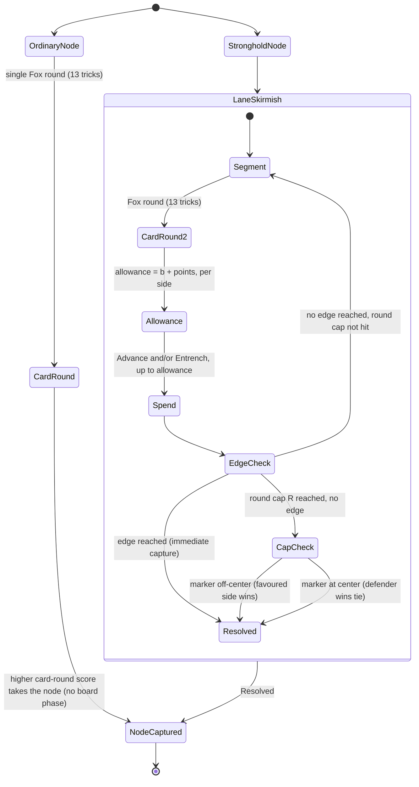

# Plan: Design a replacement for the Hex layer in the Skirmish

Plan folder: `.claude/contract/SCRUM-17-design-skirmish-board-replacement/`
Execution status: see `tasks.md` in this folder.

---

## Part 1 — Alignment

### Task reference

**Jira issue:** SCRUM-17 — "Design a replacement for the Hex layer in the Skirmish"

**Acceptance criteria (verbatim from the ticket):**

1. A written design for the replacement board layer lands in `.docs/design/`, and `hybrid-concept.md` plus `concept-critique.md` are updated to reference it rather than describing Hex as settled.
2. The design states a points-to-allowance conversion function with an explicit non-zero intercept, meaning a default allowance both sides receive regardless of card result, so the 0-point "Greedy" band never leaves a player unable to act.
3. The design demonstrates, by worked example on a specific named position, that a defensive spend and an offensive spend of the same allowance produce materially different board states. This is the falsification test for the whole switch.
4. The design specifies a termination rule and what happens on a tie.
5. All randomness remains in the card layer. Board resolution is deterministic.
6. The design states expected Skirmish length in card rounds and shows the resulting campaign total (rounds × 13 tricks) against a stated target session length.
7. The design names the AI approach replacing Hex's Monte Carlo rollouts and states why the replacement is tractable.
8. A single-page HTML report explains the concept to the developer, with examples: the full enumeration of card-round outcomes mapped to allowances under the AC2 conversion function; the AC3 worked example rendered as before-and-after board diagrams; the AC6 campaign arithmetic against a stated target session length. Must be interactive and at least semi-functional.

**Scope boundaries (verbatim):** In scope — selecting/specifying the replacement mechanic, the conversion function (slope and intercept), termination/tiebreak rules, how the map layer feeds the Skirmish, updating the design documents, the HTML report. Out of scope — any `src/` implementation, a CPU opponent for either layer, implementing Fox in the Forest, the campaign/map layer's own rules and UI, Fox expansion modules, art/audio/animation, and committing to final tuning values, board dimensions, or feel judgements.

**Candidate directions the ticket names, none chosen:** lane advance with entrenchment; Halma/Chinese-Checkers chained jumps on a hexagram board; a two-tier Skirmish (ordinary cities resolve in one card round, strongholds/goal get a full board battle) — orthogonal to the first two.

**Hard constraint from Dependencies & Risks (verbatim):** "Total pieces per round is at least spread × (ratio+1)/(ratio-1), where spread is the winner's pieces minus the loser's and ratio is the winner's divided by the loser's."

### Restated goal

Produce a written, developer-reviewable design for what replaces the Hex board inside a Skirmish, plus a self-contained interactive HTML report that lets the developer inspect the mechanic's numbers and a concrete worked example without building anything. No code under `src/` changes; the only executable artifact is the standalone HTML report. The design must select one replacement mechanic (from the ticket's candidates or a combination), specify its conversion function, termination rule, and AI-tractability argument, and prove — with a real example, not a flavour argument — that spending the same allowance offensively versus defensively produces genuinely different board states.

### In scope

- Selecting and fully specifying one replacement board mechanic (with rationale for what was rejected and why).
- The points-to-allowance conversion function: general form, the non-zero-intercept requirement, and an illustrative parameterisation used consistently through the worked example and the report.
- A termination rule and a deterministic tiebreak rule.
- A concrete rule for how the map layer's adjacency/ownership feeds a Skirmish's starting state (AC's "how the map layer feeds the Skirmish").
- Updating `hybrid-concept.md` and `concept-critique.md` to point at the new design doc instead of describing Hex as the resolved substrate.
- The AC8 interactive HTML report, built as a standalone file with no build step.

### Explicitly out of scope

- Any file under `src/`, any CPU implementation, any Fox in the Forest implementation — per the ticket.
- The campaign/map layer's own rules (node count, whether a lost node is permanently closed, war victory condition) beyond the single interface point the Skirmish needs (a starting-position offset).
- The critique's Fill 1 (suit-coupled board regions) and Fill 2 (Treasures buy placement rights) — both are about card↔board *coupling*, which is a different, larger design question than *replacing the board substrate*. They're cited as compatible future directions in the new design doc, not designed here. Folding them in now would answer a question the ticket didn't ask and put a second undecided variable inside AC3's falsification test.
- Committing to final values for board length, the intercept, the round cap, or the entrenchment stack cap — every parameter the worked example and report use is explicitly illustrative (see Assumptions and Risks below).
- A numeric target session length. The ticket's User Story says "fits a single session" but states no minutes. The design computes campaign totals against a placeholder target and flags the real number as the developer's to set (Risks).

### Pattern Reference

- Method and report structure: `.claude/skills/game-designer/SKILL.md` — critique/development method (enumerate before reasoning, quantify against a benchmark, trace coupling both ways, fix with existing pieces, close with what would disprove the claim).
- Frameworks: `.docs/design/design-principles.md`, specifically Meier (interesting decisions), Knizia (scoring drives gameplay), Sirlin (slippery slope / perpetual comeback), Cook (loops and arcs), the hybrid-coupling precedents (Puzzle Quest, Friedrich, Arcs).
- Parent-game rules, read in full: `.docs/game_rules/fox-in-the-forest.md` (band table, odd-card abilities, Fox/Woodcutter timing), `.docs/game_rules/hex.md` (why Hex never draws, bridge strength, no evaluation function).
- Existing documents this design must update, not duplicate: `.docs/design/hybrid-concept.md` (the "Settled" and "Battle loop" sections currently describe Hex as final), `.docs/design/concept-critique.md` (Problems 1–3 and Fills 1–2, all written against Hex).

### Constraints flagged on the brief

- Non-zero intercept is mandatory (AC2) — this is a structural requirement, not a tuning suggestion.
- No dice or random board resolution; all randomness is confined to the card layer (AC5).
- No final tuning values, board dimensions, or feel judgements may be committed (Scope Boundaries) — only this ticket's own worked-example illustration numbers, which must be visibly marked as illustrative.
- No parent Jira epic exists yet for this game; do not invent one.
- The report "must be interactive and at least semi functional" (AC8) — a static screenshot-style mockup does not satisfy this.

### Assumptions made

- **Chosen mechanic: single-track lane-advance-with-entrenchment, combined with the two-tier escalation structure.** Rationale below (Approach); this is the single biggest judgement call in the plan and the one most worth red-lining.
- **Rejected: Halma/Chinese-Checkers chained jumps**, despite being "least invention for the most structure." A jump-chain board has no native move that *only* defends — every legal action is a jump that changes your own position, so there is no clean analogue to "spend this allowance to not move but make the position harder to take." That is a direct miss on AC3, which asks specifically for an offense/defense fork, not just a movement-vs-movement fork. Flagged here so the developer can override if they weight "reuses a proven deterministic rule" more heavily than AC3's specific ask.
- **Single lane, not three.** The ticket's own candidate description doesn't specify lane count. A single track is the minimum structure that satisfies every AC (entrenchment, termination, worked example) and keeps the report's diagrams to one strip instead of three, which matters for AC8's "readable by someone who has not played either parent game." Multiple lanes (one per Fox suit, enabling the critique's Fill 1 later) are noted as a compatible extension in the design doc, not built now — see "Explicitly out of scope."
- **Two-tier escalation is combined with lane-advance, not treated as a separate alternative.** The ticket lists it as "orthogonal," meaning compatible with either other candidate. It's adopted because it is the only lever available that structurally shrinks AC6's campaign total (fewer nodes ever reach the multi-round board loop at all) without touching the card layer or the 13-trick round, which the concept doc explicitly forbids shortening.
- **Ordinary (non-stronghold) nodes are decided by the card round's own point comparison alone, no board phase at all.** This reuses Fox's existing band table as the resolution rule (higher-scoring side takes the node) rather than inventing a second mechanic for the common case — directly following the game-designer skill's "fix with pieces that already exist."
- **Illustrative parameterisation, all flagged as placeholders the developer may override:** intercept b = 2, lane half-length N = 3 (positions −3..+3), round cap R = 4 for an escalated Skirmish, entrenchment stack cap = 3 per cell, dislodge cost = 1 + (opposing stacks at that cell). These exist so the worked example (AC3) and the enumeration (AC8) have concrete numbers to show; none is a claim about the shipped game.
- **Map-layer interface kept to one integration point:** a Skirmish's starting marker position may be offset by however many adjacent nodes the attacker already controls (one step per adjacency, capped at the lane's own bound). This is the minimum hook the ticket asks for ("adjacent owned nodes granting a starting advantage") without designing the map layer itself.
- **The HTML report is a standalone file with no build step**, placed in `.docs/design/` alongside the design doc it illustrates, not under `src/`. It is opened directly (`file://`) or via any static server; it is not part of the Vite app and does not go through `npm run dev`/`build`.

### Config and persisted-shape audit

Skipped — this ticket touches no configuration key, no persisted or stored shape, no exported constant map, and no string-bound name under `src/`. Every file this plan touches is under `.docs/design/`; nothing here is read by the compiler, a test fixture, or a stylesheet selector.

---

## Part 2 — Technical design

### Approach

**Why lane-advance-with-entrenchment, and why one lane.** AC3 is a falsification test on a specific structural property: the same allowance, spent two different ways, must land in visibly different states. A jump-chain board (Halma-style) fails this before it starts, because every legal action is a jump — there is no action that costs allowance but *doesn't* move you, so "defensive spend" has no referent. A single discrete track solves it with the minimum possible machinery: two action types, **Advance** (push the shared marker one step toward the opponent's edge) and **Entrench** (plant a token at the marker's current cell; the marker doesn't move). Entrenchment tokens are permanent once placed (Hex's permanence carries over) and raise the cost of a future opposing Advance through that cell: crossing a cell holding `k` opposing tokens costs `1 + k` instead of `1`. That single rule *is* the offense/defense fork: an all-Advance spend maximises ground gained now; an all-Entrench spend gains no ground but taxes every future attempt to retake this cell, which is exactly the "a losing round is a tempo setback, not an elimination" framing in the ticket's User Story — because it lets the currently-favoured side insure against being reversed later, not just bank points now.

**Why the intercept is load-bearing, not decorative.** The ticket's hard-constraint formula — `total ≥ spread × (ratio+1)/(ratio-1)`, with `spread = a_w − a_l` and `ratio = a_w / a_l` for winner/loser allowances `a_w, a_l` — is worth expanding once, because it explains *why* AC2 mandates a non-zero intercept rather than merely suggesting it. Substituting `ratio = a_w/a_l` shows `(ratio+1)/(ratio-1) = (a_w+a_l)/(a_w-a_l)`, so `spread × (ratio+1)/(ratio-1) = a_w + a_l = total` **exactly**, for any two positive allowances — it is an accounting identity, not a violable inequality. The real content is what it implies about the loser's absolute pieces `a_l`: for a fixed total, a *higher* ratio forces `a_l` toward zero (that is exactly Hex's 6/0 ambush — `a_l = 0`, no contest at all, confirmed by `concept-critique.md` Problem 1). A conversion function `allowance = b + points` with `b > 0` puts a floor under `a_l` regardless of how lopsided the card round was: the worst case (0 points) still yields `a_l = b`. That is the mechanism, not just the requirement, and it's what makes AC2's "never leaves a player unable to act" true by construction rather than by convention.

**Why two-tier, and how it composes with the lane.** AC6 needs the campaign to shrink from the concept doc's own ~550-trick estimate. Nothing about a better board mechanic changes trick count *per escalated node* — a multi-round Skirmish is still several 13-trick rounds. The lever that actually reduces total tricks is escalating fewer nodes to begin with. The two-tier structure reuses Fox's own band table as the entire resolution rule for an ordinary node (whichever side's card-round score is higher takes the node — no board phase, no new mechanic) and reserves the lane-advance board for strongholds and the goal node only. This is compatible with the lane design without modification: an ordinary node simply never instantiates a lane at all.

**Termination and the tiebreak reuse an existing asymmetry rather than inventing one.** A lane Skirmish ends immediately if the marker reaches either edge (`±N`) — the attacking side that pushed it there captures the node, mirroring Hex's decisive-connection ending and keeping AC5's determinism. If the round cap `R` elapses first, the side with the marker on their favourable half wins; an exact-center tie is broken in the *defender's* favour (whoever currently holds the node per the map layer keeps it) — reusing the map layer's existing attacker/defender roles as the tiebreak, per the game-designer skill's "fix with pieces that already exist" rather than adding a new resolution mechanic.

**AI tractability (AC7).** Hex needed Monte Carlo rollouts specifically because a Hex position has no cheap evaluation function mid-game — only a filled board can be scored. A lane position is the opposite case: marker offset plus a linear entrenchment differential (`position + w·(own forward stacks) − w·(opposing forward stacks)`) *is* a usable evaluation function at every intermediate state, and the action space per turn (how many of your allowance to spend as Advance vs. Entrench, and where, on one lane) is small and finite. That makes exact or shallow-depth minimax tractable where Hex's search space made rollouts the only practical option — the design doc states this comparison; no AI is implemented (out of scope).

**What goes where.** This is a documentation-only deliverable with one executable artifact. The mechanic specification, worked example, and campaign arithmetic are prose/formulas in a new Markdown file. The interactive report is a single static HTML file (inline `<style>`/`<script>`, no dependencies, no build step) that recomputes its enumeration table and worked-example diagram live from an adjustable intercept input — which doubles as a legible demonstration of the exact tuning dial the Approach section above identifies as load-bearing.

### Skills to invoke during execution

- `game-designer` — owns `.docs/design/`, the critique/development method, and the frameworks index. Governs every task that writes or revises `hybrid-concept.md`, `concept-critique.md`, and the new design doc.
- `none — standalone static HTML file outside src/, no framework, no build step` — for the AC8 report. `react-frontend` is scoped to `src/` per `CLAUDE.md` and does not apply to a file this ticket explicitly keeps out of the Vite app.
- Read on demand: `.claude/workflow/web-project.md` (paths, runners, the "no `src/` implementation" boundary) and `.claude/rules/README.md` (scanned; currently empty, no rule file applies).
- No developer override — only one skill matched, so there was nothing to put to a multi-select `AskUserQuestion` (the tool requires ≥2 options); the developer confirmed the plan as a whole at the Step 3 approval gate instead.

### Diagram



### Data shapes

No TypeScript changes — nothing under `src/` is touched. This section instead pins down the exact formulas and structures the design doc and the HTML report must use identically, since both are hand-written prose/markup with no compiler to keep them in sync.

#### Conversion function

```
allowance(points) = b + points        // b > 0, the mandatory non-zero intercept (AC2)
```

Applied to Fox's band table (`.docs/game_rules/fox-in-the-forest.md`), with illustrative `b = 2`:

| Tricks won | Points | Allowance (b=2) |
|---|---|---|
| 0–3 | 6 | 8 |
| 4 | 1 | 3 |
| 5 | 2 | 4 |
| 6 | 3 | 5 |
| 7–9 | 6 | 8 |
| 10–13 | 0 | 2 |

#### Lane state

```
position:            integer in [-N, +N]           // 0 = center; +N = CPU's edge (Player capture); -N = Player's edge (CPU capture)
entrenchment(cell):   { owner: Player | CPU, stacks: integer in [0, stackCap] }   // at most one owner per cell
allowanceRemaining:   integer >= 0, per side, per segment
```

Illustrative: `N = 3`, `stackCap = 3`.

#### Actions (cost in allowance)

```
Advance(direction):  cost = 1 + opposingStacksAt(destinationCell)     // dislodges on entry; opposing stacks there are cleared
Entrench:            cost = 1 + opposingStacksAt(currentCell)         // dislodges first if the current cell is opponent-held, then adds 1 own stack
```

#### Termination

```
if position == ±N:                    Resolved — side who pushed it there captures the node
elif segmentsPlayed == R (illustrative R = 4) and position != 0:  Resolved — side favoured by sign(position) captures
elif segmentsPlayed == R and position == 0:                        Resolved — defender (per map layer) captures
else: continue to next segment
```

#### Map-layer interface (the one hook this ticket owns)

```
startingPosition = clamp(ownedAdjacentNodes(attacker) - ownedAdjacentNodes(defender), -N, +N)
```

One integer in, from a map layer this ticket does not otherwise design.

#### Two-tier resolution

```
if node.kind == Ordinary:     winner = higherCardRoundScore(Player, CPU)   // no lane instantiated
if node.kind == Stronghold | Goal:  instantiate LaneSkirmish per above
```

#### Worked example (AC3 illustration)

The specific named position `tasks.md` must transcribe, using the illustrative parameters above (`b=2`, `N=3`, `stackCap=3`):

```
Before: position = -1 (CPU slightly ahead), cell(-1) = { owner: CPU, stacks: 1 }
Round outcome: Player wins the card round 6/3 (pitched battle)
  → Player allowance = b + 6 = 8
  → CPU allowance    = b + 3 = 5  (spent identically in both branches; only Player's spend forks)

Branch (a) — Offensive (all 8 allowance spent as Advance):
  -1 → 0   destination 0 is empty: cost = 1   (running total 1, remaining 7)
   0 → +1  destination +1 is empty: cost = 1  (running total 2, remaining 6)
  +1 → +2  destination +2 is empty: cost = 1  (running total 3, remaining 5)
  +2 → +3  destination +3 is empty: cost = 1  (running total 4, remaining 4)
  position reaches +3 = the edge → Resolved: Player captures the node immediately.
  (The CPU's stack at -1 is the cell the marker LEFT, never a destination, so Advance never
  dislodges it in this branch — dislodging only happens to stacks at the cell being entered. 4
  allowance left over is moot — the Skirmish already ended.)

Branch (b) — Defensive (all 8 allowance spent as Entrench, no Advance):
  Entrench #1 at -1 (CPU-held, 1 opposing stack): cost = 1 + 1 = 2  (remaining 6)
    Dislodges CPU's stack, plants 1 Player stack: cell(-1) = { owner: Player, stacks: 1 }.
  Entrench #2 at -1 (now Player-held, 0 opposing stacks): cost = 1  (remaining 5)
    cell(-1) stacks → 2.
  Entrench #3 at -1 (still 0 opposing stacks): cost = 1  (remaining 4)
    cell(-1) stacks → 3 = stackCap, the illustrative cap.
  Total spent: 2 + 1 + 1 = 4. The stack cap is reached at the only cell reachable without an
  Advance (which this branch deliberately avoids, to isolate the "pure defense" spend) — the
  remaining 4 allowance has nowhere further to go and is unspent/moot, mirroring the offensive
  branch's leftover.
  Final: position stays at -1 (unresolved, Skirmish continues), cell(-1) = { owner: Player, stacks: 3 }.
  A future CPU Advance back through -1 now costs CPU 1+3 = 4 allowance just to retake ground
  it already held before this round — the tempo-setback effect the User Story asks for.
```

Same starting position, same allowance (8), two branches: one ends the Skirmish outright at a different position (+3 vs -1); the other leaves the Skirmish open but changes who it favours going forward and by how much. That is the materially-different-states proof AC3 asks for.

#### Report artifact

`.docs/design/skirmish-board-report.html` — single file, no external requests, no dependencies. Holds one adjustable input (`b`, the intercept) that live-recomputes the allowance table and re-renders the AC3 before/after diagram pair, so the report doubles as the illustration of the tuning dial the Approach section names.

### Runtime quality notes

- **Purity and adjudication:** Not applicable in the code sense (no component, no application state) — the analogous requirement is that the report's recomputation logic (allowance table, position math) lives in a small number of plain JS functions with no hidden globals, so the intercept slider produces the same numbers as the design doc's worked example at `b = 2`.
- **Effects, mount and teardown:** The report is a static page with a single input listener; no timers, no observers, nothing that needs cleanup. Confirm this stays true in review — the moment the report needs `setInterval` or animation, it has grown beyond "semi-functional."
- **Hot-path cost:** Irrelevant at this scale (one lane, at most a handful of DOM nodes); no profiling needed.
- **Determinism and numeric safety:** The design's own board resolution must have no `Math.random()`-equivalent anywhere (AC5). Guard the report's division-free arithmetic — there is no divisor in the conversion function or the position math, so no `NaN` case exists, but the self-review task should confirm this stays true if the report's JS is extended.
- **Error paths:** Not applicable — there is no user input to the report beyond the intercept slider, which should be clamped to a sane illustrative range (e.g. 0–6) in the report's own JS rather than allowed to produce a nonsensical negative intercept.

### Risks and judgement calls

- **The mechanic choice itself is the biggest call in this plan.** Lane-advance-with-entrenchment + two-tier is chosen over Halma-style jumps and over a plain single-tier lane. Read the Approach section's rationale before approving; this is the thing most worth overriding if the developer's instinct disagrees.
- **Every illustrative parameter is unchosen and needs the developer's eventual number:** intercept `b`, lane half-length `N`, round cap `R`, entrenchment stack cap, and how many nodes on the campaign route are strongholds vs. ordinary. The design doc and report must state these as illustrative and adjustable, never as conclusions.
- **No numeric target session length exists yet.** AC6 asks the campaign total to be shown "against a stated target session length," but neither the ticket nor prior design docs state one in minutes. The design doc will present the arithmetic and flag the target itself as open — the developer should supply a number (e.g., "under 90 minutes") before this can be judged pass/fail.
- **The campaign arithmetic likely still won't hit a tight target even with two-tier.** Illustrative math (9 ordinary + 3 escalated nodes, R=4 cap) lands around 117–273 tricks depending on how often an escalated Skirmish ends early via a pushed-to-the-edge win versus running the full cap — well down from ~550, but still potentially multiple hours at typical trick-taking pace. The remaining levers (fewer stronghold nodes, a shorter route, a smaller `R`) are all developer-owned tuning, not something this design can resolve on its own authority.
- **Rejecting Halma-jumps is a judgement call, not a proof.** It is defensible against AC3 specifically, but "least invention for the most structure" was a real property of that candidate and the developer may weigh it differently once they see the lane-advance rule count.
- **The map-layer starting-position hook is a stub interface, not a design.** It assumes a map layer will eventually supply an integer count of owned-adjacent-nodes; if the eventual map layer's node-adjacency model looks nothing like that, this one line needs revisiting, but redesigning the map layer itself is out of scope here.
- **AC8's "interactive and at least semi functional" bar is judged by the developer, not provable by a script.** QA can confirm the report's slider updates the DOM without a console error; whether the report actually explains the concept well to someone who hasn't played either parent game is a reading only the developer can make.
