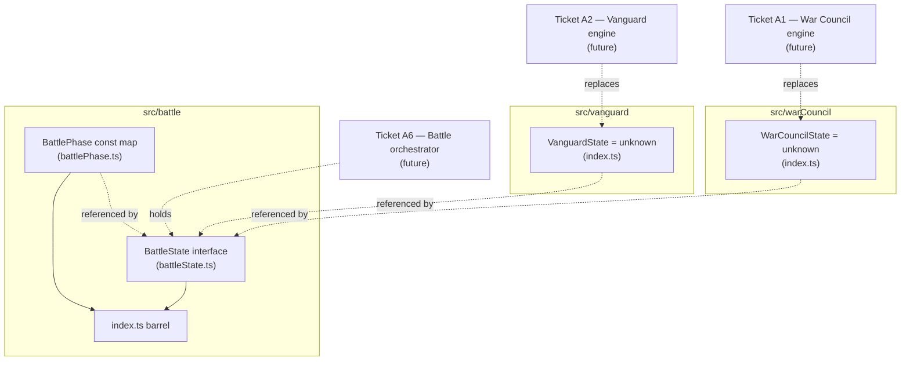

# Plan: Battle module scaffold and shared game-state types

Plan folder: `.claude/contract/SCRUM-19-battle-module-scaffold/`
Execution status: see `tasks.md` in this folder.

---

## Part 1 — Alignment

### Task reference

**Jira issue:** [SCRUM-19](https://amazerbeam.atlassian.net/browse/SCRUM-19) — "Battle module scaffold and shared game-state types"

**Acceptance criteria (verbatim from the ticket):**

1. A documented module layout exists under `src/` separating War Council, Vanguard, and battle-orchestration concerns (exact folder names are this ticket's call — e.g. `src/warCouncil/`, `src/vanguard/`, `src/battle/`).
2. A shared `BattlePhase` type/enum exists covering at minimum: War Council round in progress, Muster conversion, The Clash in progress, Breach reached / battle resolved.
3. A shared top-level `BattleState` type exists that a later orchestrator (Battle loop orchestrator ticket) can hold as its single source of truth, referencing (not duplicating) each engine's own state shape.
4. `npm run typecheck` and `npm run lint` pass with only this scaffold in place (empty engines are fine — this ticket does not implement rules).
5. No React component, CPU logic, or rendering code is added in this ticket — types and folders only.

**Scope boundaries (verbatim):** In scope — module folder layout, shared phase/state types, barrel/index files if useful. Out of scope — any actual War Council, Vanguard, or Muster logic; UI.

**Dependencies & Risks (verbatim):** No dependencies — this is the first ticket in the epic. Risk: over-designing the shared state shape before the engines it wraps exist. Keep it minimal; each engine ticket may need to extend it, and that's expected, not a defect in this ticket.

**Epic context (not itself a source of acceptance criteria, cited for continuity):** SCRUM-19 is Ticket A0 in the SCRUM-18 epic breakdown recorded at `.claude/contract/tasks.md` — the same scaffold ticket, transcribed verbatim into Jira. That breakdown's sequencing diagram shows A0 blocking A1 (War Council engine), A2 (Vanguard engine), and A3 (Muster conversion) — this ticket exists so those three don't each invent an incompatible module shape.

### Restated goal

Establish the module layout this repository's next prototype has not chosen yet (per `CLAUDE.md`: "no architecture the next prototype has not chosen"): three folders under `src/` — one for the War Council card engine, one for the Vanguard board engine (which per `CLAUDE.md`'s naming pointer also owns Muster, The Clash, and The Breach as concepts within a Vanguard round), and one for battle-orchestration — plus two shared types, `BattlePhase` and `BattleState`, that later tickets compose against instead of each inventing their own. No engine logic, no UI, no CPU. The only executable surface is a small unit test locking down the `BattlePhase` value set so a future accidental rename or deletion is caught by a red test instead of silently breaking whichever ticket first switches on it.

### In scope

- Three folders under `src/`: `src/warCouncil/`, `src/vanguard/`, `src/battle/`.
- A `BattlePhase` const-map type covering the four states named in AC2.
- A `BattleState` interface referencing each engine's own (currently placeholder) state type.
- A placeholder state type per engine (`WarCouncilState`, `VanguardState`) that later engine tickets replace with real shapes.
- Establishing the pure-core ESLint boundary (`no-restricted-imports` / `no-restricted-globals`) for `src/warCouncil/` and `src/vanguard/`, since both engine tickets (A1, A2) state their module "has no React import and no DOM access" as an acceptance criterion, and the `react-frontend` skill recommends establishing this before the first violation rather than retrofitting it.
- One unit test for `BattlePhase`'s value set.

### Explicitly out of scope

- Any War Council, Vanguard, or Muster rules logic — deck, board, conversion function, turn alternation, Breach detection. All deferred to their own tickets.
- Any React component, hook, or rendering code.
- Any CPU logic.
- Extending `BattleState` with fields an orchestrator will eventually want (round count, dealer, active side, winner) — per the ticket's own stated risk, this is deliberately minimal and left for the orchestrator ticket to add when it exists to need them.
- Applying the pure-core ESLint boundary to `src/battle/` — neither this ticket nor any ticket read so far states that the orchestrator module must be React/DOM-free, and inventing that constraint here would impose a requirement on a later ticket's design that hasn't been decided.
- A separate `src/muster/` or `src/clash/` folder — see Assumptions.

### Pattern Reference

- `CLAUDE.md` → "Game naming": War Council (Fox in the Forest layer), Vanguard (hex board layer), and — "within a round of the Vanguard" — Muster, The Clash, The Breach. This placement is why Muster conversion, Clash turn alternation, and Breach detection are treated as living inside `src/vanguard/` rather than a fourth folder.
- `.claude/contract/tasks.md` (Ticket A0, A1, A2, A3, A5, A6) — the epic breakdown this ticket's acceptance criteria were transcribed from; A1/A2's "no React import and no DOM access" ACs are the direct justification for the ESLint boundary this plan adds.
- `.claude/skills/react-frontend/SKILL.md` → "The pure-core boundary" — the paste-back ESLint override and its explicit "cheap to establish before the first component imports a helper... expensive to retrofit after" guidance.
- `.docs/design/hybrid-concept.md` and `.docs/design/skirmish-board-replacement.md` — confirm the battle loop's four stages (War Council round → Muster → The Clash → Breach check) that `BattlePhase` names.

### Constraints flagged on the brief

- No engine logic, no UI, no CPU — types and folders only (AC5).
- `npm run typecheck` and `npm run lint` must pass with only the scaffold in place (AC4) — both are required gates per `CLAUDE.md`.
- `BattleState` must reference, not duplicate, each engine's own state shape (AC3) — ruled out inlining War Council/Vanguard fields directly into `BattleState`.
- Do not over-design the shared state shape before the engines it wraps exist (Dependencies & Risks) — kept explicit as a scope boundary above.

### Assumptions made

- **Three folders, not four or five.** `CLAUDE.md`'s "Game naming" section places Muster, The Clash, and The Breach explicitly "within a round of the Vanguard," and AC1's own example lists exactly three folder names (`warCouncil`, `vanguard`, `battle`). A3 (Muster conversion), A4 (The Clash), and A5 (The Breach) therefore all land inside `src/vanguard/` once built, not in a separate coupling folder. Confirmed by the naming doc, not a bare guess — but flagged since it's the one structural call this ticket makes that every later engine ticket must follow.
- **Placeholder engine state types, typed `unknown`, not empty interfaces.** `eslint.config.js` extends `tseslint.configs.recommended`, which includes `@typescript-eslint/no-empty-object-type` — an empty `interface WarCouncilState {}` would fail lint. `export type WarCouncilState = unknown` says exactly what's true today (nothing decided yet) without tripping that rule, and is a one-line change for A1/A2 to replace with a real shape later.
- **`BattleState` holds only `phase`, `warCouncil`, and `vanguard`.** No `round`, `dealer`, or `winner` field — see "Explicitly out of scope." The ticket's own Dependencies & Risks section names over-design as the specific risk to avoid here.
- **The pure-core ESLint boundary is established now, scoped to `src/warCouncil/**` and `src/vanguard/**` only.** This is the single biggest judgement call in this plan — AC5 says "types and folders only," and an ESLint config change is arguably neither, but it's also not logic, UI, or CPU code, and the `react-frontend` skill's explicit recommendation is to add this boundary before the first line of real logic lands rather than after. Doing it in the scaffold ticket means A1 and A2 inherit an already-enforced guarantee instead of each having to remember to add it under their own time pressure. Flagged here so the developer can veto and push it to A1/A2 instead if "types and folders only" should be read strictly.
- **One smoke test for `BattlePhase`, none for `BattleState`.** `BattlePhase`'s four string literals are the kind of string-bound name the `web-project.md` correctness traps section warns about — a future accidental rename or deletion type-checks cleanly right up until something switches on the old string. A test asserting the four expected keys/values exist catches that. `BattleState` is a pure interface with no runtime values to assert against; `npm run typecheck` is its verification.

### Config and persisted-shape audit

- **`BattlePhase`'s four string literals are new names, not a rename.** Grepped `src/**` for `BattlePhase`, `warCouncilRound`, `musterConversion`, `"clash"`, and `"resolved"` before writing this plan — zero hits anywhere in `src/`. Nothing currently reads or writes these strings, so there is no existing consumer to migrate; the audit's purpose here is confirming these are genuinely new, not verifying a rename's blast radius.
- **No persisted or stored shape exists yet.** `Glob src/**` shows only `main.tsx`, `App.tsx`, `styles/global.css`, and `__tests__/smoke.test.ts` — no `localStorage` access, no save format, nothing this ticket's new types could invalidate.
- **No type change, only new types.** `WarCouncilState`, `VanguardState`, `BattlePhase`, and `BattleState` are all newly introduced; there is nothing narrowing, widening, or restructuring an existing shape.
- **No existing consumer of any changed constant** — nothing changed, only added.
- **Names align across the one chain that exists:** `BattlePhase` (the const map) ↔ its derived type (`typeof BattlePhase[keyof typeof BattlePhase]`) ↔ the test asserting its four values. All three are written in the same task in `tasks.md` so they cannot drift apart within this ticket.
- **Architectural boundary grepped in Final verification, not here** — the boundary is established by this plan (see Assumptions), so `tasks.md`'s closing phase includes the boundary-confirmation grep from `.claude/workflow/web-project.md` rather than skipping it.

---

## Part 2 — Technical design

### Approach

This ticket produces exactly two kinds of artifact: folders that exist because a file inside them exists, and types that give later tickets a shared vocabulary. Nothing here executes at runtime except the one `BattlePhase` regression test.

**Module layout.** `src/warCouncil/` and `src/vanguard/` each get a single `index.ts` that both creates the folder (git does not track empty directories) and exports that engine's placeholder state type — `WarCouncilState` and `VanguardState` respectively, both `unknown` for now. `src/battle/` gets three files: `battlePhase.ts` (the `BattlePhase` const map and its derived type), `battleState.ts` (the `BattleState` interface, importing the two placeholder types via `import type`), and `index.ts` (a barrel re-exporting both). Three files in `battle/` rather than one keeps each artifact independently readable and matches "one module per task" from the planning conventions — `battlePhase.ts` and `battleState.ts` are genuinely separate concerns (an enumeration vs. a composite record) even though both are small.

**Why `BattleState` references rather than duplicates.** AC3 states this explicitly, and it is also the entire reason this ticket exists per its own Problem Statement — "each subsequent ticket invents its own incompatible shape" is exactly what duplicating fields into `BattleState` would risk, since a later engine ticket's real state shape would then have to be kept in sync with a copy living in `battle/`. Composition (`warCouncil: WarCouncilState`) means A1 and A2 each own their own shape outright and `BattleState` simply holds a reference to whatever that shape currently is.

**Why `unknown`, not an empty interface, for the two placeholder types.** `eslint.config.js` extends `tseslint.configs.recommended`, which enables `@typescript-eslint/no-empty-object-type` — an empty `interface WarCouncilState {}` (or `type WarCouncilState = {}`) fails that rule. `unknown` is not an empty object type, passes lint cleanly, and is honest about the actual state of the design: nothing about the War Council or Vanguard engine's internal shape has been decided yet. When A1 lands, `export type WarCouncilState = unknown` becomes `export interface WarCouncilState { ... }` (or similar) in a one-line change to `src/warCouncil/index.ts` — `BattleState`'s own definition does not need to change, because it already just references the type by name.

**Why the pure-core boundary is established here, in the scaffold ticket, rather than in A1/A2.** The `react-frontend` skill states the boundary is "cheap to establish before the first component imports a helper... expensive to retrofit after that happens even once." This ticket is the one creating `src/warCouncil/` and `src/vanguard/` in the first place — adding the `eslint.config.js` override in the same change means A1 and A2 inherit an already-enforced guarantee rather than each needing to remember to add it themselves while under the "Highest" priority and "hardest half of the epic" pressure both tickets' own descriptions call out. The override is scoped to exactly those two folders via `files` globs, matching the skill's documented paste-back block verbatim (including the `globals.browser` preservation note, since removing it would silently stop the restriction from firing anywhere, not just inside the two new folders).

**What stays out.** `src/battle/` is not given the same boundary, because nothing read so far states the orchestrator must be DOM/React-free — imposing that now would be inventing a constraint for a ticket (A6) that hasn't specified it. `BattleState` gets no `round`/`dealer`/`winner` field, because the ticket's own Dependencies & Risks section names over-design as the risk to actively avoid, and A6 is where those fields have an actual consumer to be designed against.

### Skills to invoke during execution

- `react-frontend` — owns everything under `src/`, including a project's first module-layout decision, the `as const` pattern required by `erasableSyntaxOnly`, the `verbatimModuleSyntax`-driven `import type`/`export type` requirement, and the pure-core boundary override this plan pastes into `eslint.config.js`.
- Read on demand: `.claude/workflow/web-project.md` (paths, runners, the "no architectural boundary yet" note this ticket resolves for two of the three folders) and `.claude/rules/README.md` (scanned; currently empty, no rule file applies).
- No developer override — only one skill matched (`react-frontend`); per the precedent set in `.claude/contract/SCRUM-17-design-skirmish-board-replacement/plan.md`, a single-option match has nothing to put to a `multiSelect` `AskUserQuestion` (the tool requires ≥2 options), so the developer confirms the plan as a whole at the Step 3 gate instead.

### Diagram



### Data shapes

#### `src/warCouncil/index.ts`

```ts
export type WarCouncilState = unknown
```

#### `src/vanguard/index.ts`

```ts
export type VanguardState = unknown
```

#### `src/battle/battlePhase.ts`

```ts
export const BattlePhase = {
  WarCouncilRound: 'warCouncilRound',
  MusterConversion: 'musterConversion',
  Clash: 'clash',
  Resolved: 'resolved',
} as const

export type BattlePhase = (typeof BattlePhase)[keyof typeof BattlePhase]
```

`erasableSyntaxOnly` forbids `enum`; this is the `as const` object-map form the skill names as the replacement. Four keys map 1:1 to AC2's four named states: `WarCouncilRound` (War Council round in progress), `MusterConversion` (Muster conversion), `Clash` (The Clash in progress), `Resolved` (Breach reached / battle resolved — one phase for both descriptions, since AC2 phrases them as the same terminal state).

#### `src/battle/battleState.ts`

```ts
import type { WarCouncilState } from '../warCouncil'
import type { VanguardState } from '../vanguard'
import { BattlePhase } from './battlePhase'

export interface BattleState {
  readonly phase: BattlePhase
  readonly warCouncil: WarCouncilState
  readonly vanguard: VanguardState
}
```

`readonly` on all three fields matches the reducer-driven state-update pattern the `react-frontend` skill's engineering standards call for elsewhere in this project (state transitions produce a new object rather than mutating fields in place) — worth setting from the first definition rather than adding later once mutation-in-place patterns have already crept in.

#### `src/battle/index.ts`

```ts
export { BattlePhase } from './battlePhase'
export type { BattleState } from './battleState'
```

`verbatimModuleSyntax` (on in `tsconfig.app.json`) requires `export type` for the type-only re-export; `BattlePhase` re-exports as a value because the const map itself (not just its derived type) is a real export later code will read from (`BattlePhase.Clash`, etc.).

#### `eslint.config.js` — pure-core boundary addition

```js
{
  files: ['src/warCouncil/**/*.{ts,tsx}', 'src/vanguard/**/*.{ts,tsx}'],
  rules: {
    'no-restricted-imports': [
      'error',
      {
        patterns: [
          {
            group: ['react', 'react-dom', 'react/*', 'react-dom/*'],
            message: 'src/warCouncil/ and src/vanguard/ are pure TypeScript — no React.',
          },
        ],
      },
    ],
    'no-restricted-globals': [
      'error',
      { name: 'window', message: 'This module must not touch the DOM.' },
      { name: 'document', message: 'This module must not touch the DOM.' },
      { name: 'navigator', message: 'This module must not touch the DOM.' },
      { name: 'localStorage', message: 'This module must not touch browser storage.' },
      { name: 'sessionStorage', message: 'This module must not touch browser storage.' },
      { name: 'fetch', message: 'This module must not touch the network or the DOM.' },
      { name: 'location', message: 'This module must not touch the DOM.' },
      { name: 'history', message: 'This module must not touch the DOM.' },
      { name: 'XMLHttpRequest', message: 'This module must not touch the network or the DOM.' },
      { name: 'requestAnimationFrame', message: 'This module must not touch the DOM.' },
      { name: 'cancelAnimationFrame', message: 'This module must not touch the DOM.' },
      { name: 'alert', message: 'This module must not touch the DOM.' },
      { name: 'confirm', message: 'This module must not touch the DOM.' },
      { name: 'matchMedia', message: 'This module must not touch the DOM.' },
      { name: 'getComputedStyle', message: 'This module must not touch the DOM.' },
      { name: 'Image', message: 'This module must not touch the DOM.' },
      { name: 'Worker', message: 'This module must not touch the DOM.' },
    ],
  },
},
```

Inserted as an additional entry in the `defineConfig([...])` array in `eslint.config.js`, alongside (not replacing) the existing `files: ['**/*.{ts,tsx}']` block — that block's `languageOptions.globals: globals.browser` must stay intact, since removing it would silently stop `no-restricted-globals` firing anywhere in the project, not just outside these two folders.

#### `src/battle/__tests__/battlePhase.test.ts`

```ts
import { describe, expect, it } from 'vitest'
import { BattlePhase } from '../battlePhase'

describe('BattlePhase', () => {
  it('names exactly the four battle-loop stages', () => {
    expect(Object.values(BattlePhase)).toEqual([
      'warCouncilRound',
      'musterConversion',
      'clash',
      'resolved',
    ])
  })

  it('has no duplicate phase values', () => {
    const values = Object.values(BattlePhase)
    expect(new Set(values).size).toBe(values.length)
  })
})
```

No config keys, no persisted shapes, no `package.json` script changes.

### Runtime quality notes

- **Purity and adjudication:** `src/warCouncil/` and `src/vanguard/` are enforced pure by the new ESLint boundary (no React import, no DOM global) from the moment they exist. `src/battle/` holds only type definitions in this ticket — no adjudication logic exists yet to misplace.
- **Effects, mount and teardown:** None — no component, no effect, nothing that mounts.
- **Hot-path cost:** None — no runtime code path exists yet beyond the two trivial test assertions.
- **Determinism and numeric safety:** Not applicable — no arithmetic, no randomness, nothing that could produce `NaN`.
- **Error paths:** Not applicable — no async surface, no I/O, nothing that can fail at runtime. The only "failure" this ticket can produce is a type error, which `npm run typecheck` catches.

### Risks and judgement calls

- **Establishing the pure-core ESLint boundary in this ticket, not A1/A2, is the biggest judgement call here.** AC5's "types and folders only" could be read to exclude an `eslint.config.js` change. The counter-argument (cheap now, expensive to retrofit, both engine tickets already state the requirement as their own AC) is in Approach — but if the developer wants A0 to be strictly folders-and-types with zero tooling changes, this moves to A1/A2 and should be red-lined out of this plan's Task list.
- **Three folders, with Muster/Clash/Breach folded into `src/vanguard/`, is a structural precedent every later engine ticket inherits.** Grounded in `CLAUDE.md`'s naming pointer, but it's still this ticket's call to make concrete as actual folders on disk — worth the developer's explicit sign-off since A3/A4/A5 will all be scoped against it.
- **`BattleState`'s two-field-plus-phase shape is deliberately thin.** If the developer already knows the orchestrator will need a `round` counter or `dealer` flag on day one, adding it now is cheap; the plan defaults to leaving it out per the ticket's own over-design warning.
- **No dependency, config value, or behaviour here needs the developer's judgement to play the app** — there is no app-visible surface in this ticket.
