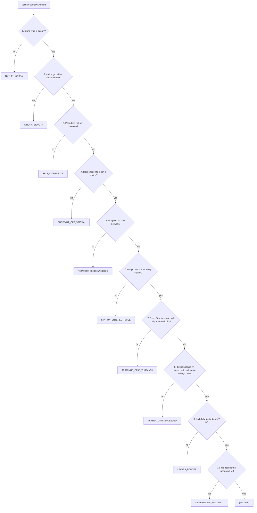

# Plan: Rules engine — geometry, validation, scoring and turn loop

Plan folder: `.claude/contract/SCRUM-2-rules-engine/`
Execution status: see `tasks.md` in this folder.

---

## Part 1 — Alignment

### Task reference

Jira **SCRUM-2** — "Rules engine — geometry, validation, scoring and turn loop" (Story, parent epic SCRUM-1, status To Do). Brief primed as `https://amazerbeam.atlassian.net/browse/SCRUM-2`.

Acceptance criteria, verbatim from the ticket:

1. All nine predicates in §10.1 are implemented — `selfIntersects`, `arcLength`, `touchesRect`, `rectsOverlapOrTouch`, `rectFullyInside`, `crossings`, `pointInAnyRect`, `entryCount`, `passesThrough`/`endsOn` — each with unit tests including degenerate cases.
2. `crossings` returns transversal intersections only; a tangency that does not change sides is not reported as a crossing (M8). A test covers a path that touches another and returns to the same side.
3. `entryCount` counts contiguous runs inside a rect, not raw boundary intersections, so a string grazing a station edge twice in one pass counts as one entry.
4. String validation runs the ten checks of §10.2 in that exact order and returns the first failure as a typed reason code, never a boolean or a generic error.
5. Scoring implements §10.3 and reproduces the rulebook page 7 worked example as a passing test: +3 for a Scenic station inside the mountain, +2 for another first connection, −1 −1 for two mountain crossings, and 0 for a crossing that falls on a station card — net +3.
6. The turn loop implements §10.4 including the Rural chain cap (`drewRuralAlready`), the 3-consecutive-failure skip (M4), empty-deck skip (M5) and the no-legal-placement forfeit (M9).
7. All 10 station types carry their §8 values and behaviours: Terminus pass-through ban, Railyard repeat scoring at grey (M12), Landmark/Depot marker side effects (M13), Rural limit of 1, Depot's inverted 0/2.
8. Pass-through consumes a player-limit slot (M15) — a string running over a full station is rejected even though neither endpoint is on it.
9. Scores may go negative (M14); nothing floors at zero.
10. `src/rules/` contains zero imports from `react`, `react-dom` or any DOM global, enforced by a lint rule or an import test.
11. **The engine is colour-first.** Player limits, marker triggers, `PlacedStation.connections` and `firstConnector` are keyed on `ColourId` and never on `PlayerId`. A test asserts that two colour-seats sharing an owner each consume their own slot against a station's player limit.
12. `ColourSeat` carries an `owner: PlayerId` per §10, and two seats may share an owner. Owner is used only for game-end score summing, never for legality or trigger decisions.
13. `turnOrder` is a `ColourId[]` supplied at game start, supporting `[A, B, C]`, `[A, B, C, D]`, `[A, B, C, D, E]` and the §9 two-player order `[A1, B1, A2, B2]`. The loop runs five rounds over whatever array it is given.
14. A test covers the §9 derived case: one owner's colour scoring at a Landmark, Depot or Starting Station belonging to that owner's *other* colour still fires the marker penalty or bonus, because the comparison is between colours.
15. Game end returns per-colour scores and per-owner totals, with ties reported as shared rather than broken.

Follow-up decisions confirmed interactively with the developer, **2026-07-31**:

- **Legality oracle — implement the real search now.** The bounded board-wide legal-placement search moves into SCRUM-2 rather than being injected as a stub for SCRUM-5 to supply later. SCRUM-5 criterion 8 then consumes this module instead of building its own.
- **Tangency tolerance — 0.5 world units.** The §10.2 check-10 degenerate-tangency threshold (M8) is a chosen value, carried in the injected config. Rationale recorded: ~0.4% of a card width, above any plausible intentional placement and far below anything visible.
- **Skills — `react-frontend` only.** `management-jira` declined; this contract does not transition the ticket.
- **Epic ordering — straight through, no drag spike.** Agreed sequence is SCRUM-2 → SCRUM-3a (config load only) → SCRUM-4 → SCRUM-5 → SCRUM-6, then a feel test. This plan is the first item in that sequence.

### Restated goal

Build the complete String Railway rules engine as pure TypeScript under `src/rules/`, with no React and no DOM, so every rule in the game is decided in one testable place and the UI stories that follow only render state and dispatch moves. That means the §10.1 geometry predicates the rest of the game rests on, the §10.2 placement validator returning typed reason codes in the rulebook's exact reject order, §10.3 scoring returning an itemised breakdown rather than a number, the §10.4 turn loop with its Rural chain cap and its three skip/forfeit paths, a bounded search answering "does any legal placement exist", and a `(state, move) => state` reducer over a move log. Throughout, every player limit, marker trigger and connection map is keyed on `ColourId` and never on `PlayerId`, so the 2-player variant is a turn-order array and a sum at game end rather than a refactor through every rule path.

### In scope

- `src/rules/types.ts` — the §10 data model: `GameState`, `ColourSeat`, `StationCard`, `PlacedStation`, `PlacedPath`, `Move`, plus branded `ColourId` / `PlayerId` / `StationId` / `PathId`.
- `src/rules/config.ts` — the `RulesConfig` shape the engine is injected with (string lengths, arc-length tolerance, tangency tolerance, card size). Type only; SCRUM-3a wires the file.
- `src/rules/geometry.ts` and `src/rules/containment.ts` — all of §10.1, split across two modules for the line budget.
- `src/rules/validate.ts` — the ten §10.2 checks in order, first failure returned as a typed `RejectionReason`.
- `src/rules/scoring.ts` — §10.3 resolution returning a `ScoringBreakdown` with per-connection, per-crossing and per-marker-effect lines.
- `src/rules/search.ts` — the bounded legal-placement search backing M4 and M9 (developer decision, 2026-07-31).
- `src/rules/turn.ts` — the §10.4 loop: draw/recycle sequence, Rural chain cap, M4 three-failure skip, M5 empty-deck skip, M9 forfeit, round advance over an arbitrary `turnOrder`.
- `src/rules/gameEnd.ts` — per-colour scores, per-owner totals, shared-victory ties.
- `src/rules/reducer.ts` — `(state, move) => state` and the move log.
- `src/constants/stations.ts` — `STATION_TYPE` and the §8 printed card values and flags for all 10 station types.
- `src/constants/game.ts` — `REJECTION_REASON`, `MOVE_KIND`, `PATH_KIND`, `TURN_PHASE`.
- `eslint.config.js` — extend the purity override to `src/constants/**` (see the audit).
- Vitest specs under `src/rules/__tests__/` covering predicates and their degenerate cases, validation ordering, scoring including the page-7 worked example, the §9 same-owner trigger, the colour-first limit assertion, the turn loop's branches, and the reducer.

### Explicitly out of scope

- Any React component, SVG, CSS or rendering — SCRUM-4, SCRUM-5, SCRUM-6, SCRUM-7 own those.
- The setup generator (M3) — SCRUM-4. This story consumes a `GameState` it is handed; it does not generate boards.
- Reading `rules.json`, its loader, its validator and its debug panel — SCRUM-3. This story defines the shape the loader must produce and nothing more.
- Populating `rules.json` with M2 values, and the M17 deck composition — SCRUM-3a. This engine takes a `deck: StationCard[]` already built.
- Presenting per-owner totals, the itemised breakdown, or any HUD — SCRUM-7 consumes what this returns.
- Undo and replay behaviour beyond the move log existing and the reducer being pure enough to support them; no undo UI or replay driver.
- Persistence of any kind — no `localStorage`, no save format, no migration.
- Performance tuning of the drag hot path — there is no drag here.

### Pattern Reference

None supplied by the brief beyond the specification. References chosen:

- `.docs/Game_Rules/Rules.md` §10 (data model), §10.1 (predicates), §10.2 (validation order), §10.3 (scoring pseudocode), §10.4 (turn loop pseudocode), §5.4 including the page-7 worked example, §7.1–7.3 (player limit, connection bonus, icon glossary), §8 (station values table), §9 (two-player variant), §5.5 (shared victory).
- M-numbers this design depends on: **M4** (three-failure skip), **M5** (empty-deck skip), **M6** (±2% arc length), **M7** (strings inside the border), **M8** (transversal-only crossing, degenerate tangency rejected), **M9** (no-legal-placement forfeit), **M10** (river and border count as previously-placed strings), **M11** (whole card inside the mountain), **M12** (Railyard repeats at grey), **M13** (Landmark/Depot trigger on every scoring event), **M14** (scores may go negative), **M15** (pass-through consumes a limit slot), **M16** (marker placement mandatory).
- `.claude/skills/react-frontend/SKILL.md` and its `references/engineering-standards.md` for the `src/rules/` purity contract, colour-first keying, the constants-versus-tunables split, the 400-line budget and the testing posture.
- No existing production module in `src/rules/` to match — the tree holds only `__tests__/scaffold.test.ts`. `src/rules/__tests__/scaffold.test.ts` is the only existing file whose style the new specs should follow (bare `describe`/`it`, no setup harness).

### Constraints flagged on the brief

- **Colour-first keying is the make-or-break constraint.** The ticket states criteria 11 and 12 are "the cheap-versus-expensive fork for the 2-player variant, and they are almost impossible to retrofit once the UI is consuming the engine. Treat a `PlayerId` appearing in any limit or trigger path as a defect, not a shortcut."
- **`src/rules/` purity** (criterion 10) — zero `react`, `react-dom` or DOM globals, lint-enforced.
- **Floating-point tolerance is a stated risk.** The ±2% arc-length tolerance is specified by M6; intersection epsilon is not — "pick one, state it in code, and cover it with tests rather than tuning it later by feel."
- **`crossings` counts each intersection point separately** — the page-7 example scores −2 for two crossings of one string, and "a naive implementation returning a boolean per path pair will silently under-count."
- **Validation returns a typed reason code, never a boolean or a generic error** (criterion 4).
- **Scoring must return a breakdown, not a total.** Not in SCRUM-2's own text, but SCRUM-7's Dependencies & Risks says explicitly: "If the engine story implements it as returning a number, this story forces a rework — worth agreeing the return shape before the engine is built." Treated here as binding.
- **Two runtime dependencies only.** No geometry library; predicates are hand-rolled because the game needs transversal-only intersection with a controlled epsilon, which general libraries do not distinguish cleanly.
- **No tunable may be hard-coded** in source. Every M2 value reaches the engine through the injected `RulesConfig`.

### Assumptions made

- **Axis-aligned `Rect`, not §10's `OrientedRect`.** SCRUM-5's Scope Boundaries put card rotation out of scope on the grounds that "the 120×120 footprint is square, so orientation is not meaningful for legality". An axis-aligned rect is simpler, faster to test against, and loses nothing. Recorded as a deviation from §10's literal field name.
- **Terrain lives only in `paths`, not in separate `border` / `river` / `mountain` fields.** §10 lists both, which duplicates the same polyline in two places and invites drift. `PlacedPath.kind` already distinguishes them, so accessors derive the three terrain paths from `paths`. Deliberate deviation, chosen because a stored duplicate of derived state is the trap the engineering standards call out by name.
- **`GameState` gains four fields §10 does not list** — `phase`, `pendingCard`, `stationStepFailures`, `drewRuralAlready`/`extraDraws`. §10.4 is written as imperative pseudocode with local variables; a reducer-driven engine has to hold that mid-turn progress in state or the turn cannot be resumed between dispatches. Extension, not contradiction.
- **`STATION_DEFINITIONS` is a constant, not a tunable.** The §8 card values are read off printed card art and are unflagged rulebook text, so they belong in `src/constants/` alongside `STATION_TYPE`. Only the M17 *composition* (how many of each) is a tunable, and that is SCRUM-3a's.
- **Branded string types for `ColourId`, `PlayerId`, `StationId`, `PathId`.** `web-project.md` names `PlayerId` where `ColourId` belongs as a correctness trap and says "brand the types or accept that review is the only gate". Given criteria 11 and 12 are the ticket's stated highest risk, branding buys compiler enforcement for the one mistake the ticket most wants prevented.
- **`PlacedStation.connections` is a `ReadonlyMap<ColourId, number>`, not a `Record`.** A branded key survives on a `Map` and not on an object index signature, and `Map` iteration order is insertion order — deterministic, where object-key order is a determinism hazard the shared-rules README flags as a candidate rule.
- **§10.1 splits across two modules** — `geometry.ts` (path↔path: `arcLength`, `selfIntersects`, `crossings`, segment primitives) and `containment.ts` (rect predicates: `touchesRect`, `rectsOverlapOrTouch`, `rectFullyInside`, `pathFullyInside`, `pointInAnyRect`, `entryCount`, `passesThrough`, `endsOn`). One module would land near the 400-line blocking budget with no room to grow. Deviates from the skill's layout diagram, which names `geometry.ts` as §10.1's home.
- **Test fixtures use synthetic geometry, not the real M2 constants.** A predicate test does not need a 4000-unit board; small round numbers read better and keep the "no hard-coded tunable" grep meaningful over `src/`. The page-7 example is reproduced on a synthetic board that preserves the example's topology, not its measurements.
- **The intersection epsilon is a named code constant, not config.** It is float-noise robustness in a cross-product sign test — unitless and scale-relative, not a design lever. The geometric threshold that *is* a lever, `tangencyTolerance`, is in `RulesConfig`. The ticket asks for the epsilon to be "stated in code", which this satisfies.
- **`RulesConfig` for this story carries only what the engine reads** — `shortStringLength`, `longStringLength`, `arcLengthTolerance`, `tangencyTolerance`, `cardSize`. Border perimeter, per-player-count edge lengths, mountain and river lengths are setup concerns and belong to SCRUM-4/SCRUM-3a's wider config type, which may extend this one.
- **An explicit `BEGIN_TURN` move runs the §10.4 draw-and-recycle sequence.** The alternative — normalising implicitly inside the reducer whenever `pendingCard` is null — is invisible in the move log and therefore unreplayable. Explicit is testable.
- **`createInitialState` is not in this story.** SCRUM-4 owns board generation; SCRUM-2's tests build `GameState` fixtures directly.

### Config and persisted-shape audit

Run in full — this story introduces string-bound names (`RejectionReason` codes, `Move` kinds, `STATION_TYPE` keys) and defines the shape `rules.json` must later match.

- **`rules.json` keys renamed, retyped or removed: none.** `Select-String -Path src\*.tsx,src\**\*.ts,src\**\*.tsx -Pattern "rules\.json|configVersion|geometry|deck"` → **0 hits**. `public/rules.json` currently ships `configVersion: 1`, `geometry: {}`, `deck: {}` — both objects deliberately empty, and nothing in `src/` reads the file. This story adds no key to `rules.json`; it declares the `RulesConfig` TypeScript shape that SCRUM-3a's `geometry` block must satisfy. The five field names in `RulesConfig` are therefore the contract SCRUM-3a is bound to, and are listed under Data shapes for that reason.
- **Persisted shapes affected: none exist yet, and that window is open now.** `Select-String -Path src\*.tsx,src\**\*.ts,src\**\*.tsx -Pattern "localStorage|sessionStorage|JSON\.parse|indexedDB"` → **0 hits**. Nothing in the repository persists anything. This story introduces the `Move` union that a saved game will later be a JSON array of, so its kinds and fields can still be renamed for free. Recording that explicitly: the window closes the moment SCRUM-3 or SCRUM-7 writes a move log anywhere, after which any `Move` change needs a migration.
- **Type changes with loss potential: none.** Every type in Data shapes is new. No `number` → `string`, no array → object, no required → optional, and no existing `switch` that a widened union would silently leave incomplete.
- **Consumers of changed exported constants or predicates: zero pre-existing.** `Get-ChildItem -Path src\rules -Recurse -File` → **one file**, `src/rules/__tests__/scaffold.test.ts`, which exports and imports nothing. Fan-out created *within* this contract is the part to hold consistent: `crossings()` has **2** consumers (`validate.ts` check 10, `scoring.ts` penalty loop); `touchesRect()` has **4** (`validate.ts` checks 4 and 8, `scoring.ts` connection loop, `search.ts` candidate filtering); `REJECTION_REASON` has **2** (`validate.ts`, its spec). Each is named in the task that introduces it.
- **Name alignment across the chain.** `Select-String -Path src\*.tsx,src\**\*.ts,src\**\*.tsx -Pattern "ColourId|PlayerId|ColourSeat|GameState"` → **0 hits**; every domain name is new, so there is no existing spelling to match. The chains this contract must keep aligned internally: `REJECTION_REASON` keys ↔ the `RejectionReason` union ↔ the §10.2 numbered order ↔ the spec's test names; `STATION_TYPE` keys ↔ `STATION_DEFINITIONS` keys ↔ the §8 table rows; `MOVE_KIND` ↔ the `Move` union's `kind` discriminants ↔ the reducer's `switch`. No `data-testid`, CSS class or `aria-*` id is touched — there is no DOM in this story.
- **The `src/rules/` boundary holds, but the guard has a gap this story must close.** `Select-String -Path src\rules\*.ts,src\rules\**\*.ts -Pattern "from 'react'|from ""react""|\bwindow\.|\bdocument\.|localStorage"` → **0 hits**, and nothing in the design needs a DOM global or a React import. **New finding:** `eslint.config.js:24` scopes the purity override to `src/rules/**/*.{ts,tsx}` only. This story creates `src/constants/` (which does not exist — `Test-Path src\constants` → **False**) and imports it from `src/rules/`, so rules-engine purity would come to depend on a tree the lint rule does not guard. The override glob is widened to cover `src/constants/**` in the same task that creates the folder.
- **Hard-coded tunables: none present.** `Select-String -Path src\*.tsx,src\**\*.ts,src\**\*.tsx -Pattern "\b(350|700|1400|4000|120)\b"` → **0 hits**. The Final verification phase re-runs this over production source only; test fixtures are excluded by the synthetic-geometry assumption above rather than by grep exclusion.

---

## Part 2 — Technical design

### Approach

The engine is nine pure modules under `src/rules/` layered so that each depends only on the ones below it: geometry primitives → containment predicates → validation → scoring → search → turn loop → reducer, with `types.ts` and `config.ts` underneath everything and `gameEnd.ts` hanging off the side. Nothing above the geometry layer re-derives a predicate, and nothing below the reducer knows a move exists. That layering is what makes the §11 warning tractable — when a score comes out wrong, the failing test is in the lowest layer that can produce it, not in a 600-line adjudication function.

Two modules carry §10.1 rather than one. `geometry.ts` owns path-against-path work — segment intersection with a named epsilon, `arcLength`, `selfIntersects`, and `crossings` returning a `Point[]` of transversal intersections only. `containment.ts` owns everything measured against a rect — `touchesRect`, `rectsOverlapOrTouch`, `rectFullyInside`, `pathFullyInside`, `pointInAnyRect`, `entryCount`, and the `passesThrough` / `endsOn` pair the Terminus rule needs. The split is by what the function compares, which keeps both under half the blocking line budget and puts the two hardest predicates — `crossings` (M8 transversality) and `entryCount` (contiguous runs, not raw boundary hits) — in separate files with separate specs. `crossings` is the one to get right first: it counts each intersection point separately, because the page-7 example scores −2 for two crossings of a single string, and it must classify a tangency that returns to the same side as a non-crossing. The implementation is a signed-area sign test per segment pair, with the unitless `EPSILON` constant guarding the degenerate case and the world-unit `tangencyTolerance` from config deciding, separately and at validation time, whether a near-touch is rejected outright per §10.2 check 10.

`validate.ts` is deliberately a straight-line function, not a rule table. §10.2's ordering is normative — the ticket's criterion 4 says "in that exact order" — and the first failure is what the player sees, so a ten-branch sequence that returns `{ ok: false, reason: REJECTION_REASON.X }` reads identically to the spec and is trivially testable by feeding it a path that violates two rules and asserting the earlier one wins. The alternative considered and rejected was an array of predicate objects iterated in order: more elegant, harder to read against §10.2, and it makes the "which check ran first" test assert on array indices rather than behaviour. Check 8 is the subtle one — M15 makes pass-through consume a player-limit slot, so the limit test runs over *every* station the path touches, not just the two endpoints, and it counts distinct `ColourId`s after the hypothetical placement.

`scoring.ts` returns a `ScoringBreakdown`, never a number. Every line of §10.3 becomes a record: a `ConnectionLine` per station touched (carrying whether it scored at all, whether the tier was black or grey, and the mountain bonus itemised separately rather than merged into the base), a `CrossingLine` per intersection point (carrying whether it fell on a card and was therefore free), and a `MarkerEffectLine` per Landmark/Depot/Starting trigger (carrying the affected `ColourId` and a `sameOwner` flag). That shape is driven directly by SCRUM-7's criteria 1–7 and 12, and by its stated risk that a number-returning engine forces a rework. The `sameOwner` flag exists purely so SCRUM-7 criterion 12 can explain the §9 self-inflicted penalty in words instead of presenting it as an unexplained loss — the engine computes the comparison between colours, as §9 requires, and reports that the two colours happened to share an owner.

`search.ts` implements the bounded legal-placement search the developer pulled forward from SCRUM-5. It answers two questions — does any legal rect exist for this card, and does any legal string placement exist for this seat — by sampling candidate positions at card-width granularity across the border's bounding box, filtering by the §5.2 constraints, and refining by bisection near a hit with a fixed recursion depth. Sampling granularity comes from `config.cardSize`; the refinement depth is a code constant, because it trades runtime against false negatives rather than shaping the game. The search is what makes M4's three-failure skip and M9's forfeit real rather than stubbed, and because it is a pure deterministic function of state, the reducer's draw-and-recycle sequence stays replayable from the move log. It is also the module most likely to need bounding later, so it is isolated behind two exported functions with no other callers.

`turn.ts` translates §10.4's imperative pseudocode into resumable state. The loop's local variables — `extraDraws`, `drewRuralAlready`, `failures` — become `GameState` fields, because a reducer cannot hold a `while` loop open across dispatches. `reducer.ts` sits on top as `(state, move) => state` with a `switch` over `MOVE_KIND`, appending each applied move to `moveLog`, and is the only module that mutates anything conceptually. `gameEnd.ts` sums per-colour scores into per-owner totals and reports ties as shared — the single place in the entire engine where `PlayerId` is read, which is what criterion 12 asks for and what the Final verification grep asserts.

### Skills to invoke during execution

- `react-frontend` — owns everything under `src/`. For this contract specifically: the `src/rules/` purity boundary, colour-first keying over `PlayerId`, the constants-versus-tunables split that puts §8 values in `src/constants/` and M2 values in config, the 400-line measured budget, and the Vitest posture that requires tests be run and their numbers reported. Its `references/engineering-standards.md` carries the constants taxonomy and the testing order (predicates → validation → scoring → turn loop) this plan's phase order follows.

Developer override: `management-jira` was offered and declined — this contract does not transition SCRUM-2.

Shared rules to Read: none. `Glob .claude/rules/*.md` returns only `README.md`; the folder is empty by design. Re-scan before starting rather than trusting this line — its README names determinism and save-data versioning as the likely first rules, and both would constrain this engine.

Always Read: `.claude/workflow/web-project.md`.

### Diagram

The §10.2 validation order, which criterion 4 makes normative:



### Data shapes

#### `src/constants/game.ts`

```ts
export const PATH_KIND = {
  SHORT_RAIL: 'SHORT_RAIL',
  LONG_RAIL: 'LONG_RAIL',
  MOUNTAIN: 'MOUNTAIN',
  RIVER: 'RIVER',
  BORDER: 'BORDER',
} as const

export const TURN_PHASE = {
  STATION: 'STATION',
  STRING: 'STRING',
  COMPLETE: 'COMPLETE',
} as const

export const MOVE_KIND = {
  BEGIN_TURN: 'BEGIN_TURN',
  PLACE_STATION: 'PLACE_STATION',
  SKIP_STATION_STEP: 'SKIP_STATION_STEP',
  PLACE_STRING: 'PLACE_STRING',
  FORFEIT_STRING: 'FORFEIT_STRING',
  END_TURN: 'END_TURN',
} as const

/** §10.2, in reject order. The numeric comment is the check's position. */
export const REJECTION_REASON = {
  NOT_IN_SUPPLY: 'NOT_IN_SUPPLY', //          1
  WRONG_LENGTH: 'WRONG_LENGTH', //            2  (M6)
  SELF_INTERSECTS: 'SELF_INTERSECTS', //      3
  ENDPOINT_OFF_STATION: 'ENDPOINT_OFF_STATION', // 4
  NETWORK_DISCONNECTED: 'NETWORK_DISCONNECTED', // 5
  STATION_ENTERED_TWICE: 'STATION_ENTERED_TWICE', // 6
  TERMINUS_PASS_THROUGH: 'TERMINUS_PASS_THROUGH', // 7
  PLAYER_LIMIT_EXCEEDED: 'PLAYER_LIMIT_EXCEEDED', // 8  (M15)
  LEAVES_BORDER: 'LEAVES_BORDER', //          9  (M7)
  DEGENERATE_TANGENCY: 'DEGENERATE_TANGENCY', // 10 (M8)
} as const

export const SKIP_REASON = {
  DECK_EMPTY: 'DECK_EMPTY', //          M5
  NO_LEGAL_PLACEMENT: 'NO_LEGAL_PLACEMENT', // M4, after 3 consecutive failures
} as const
```

#### `src/constants/stations.ts`

```ts
export const STATION_TYPE = {
  STARTING: 'STARTING',
  HAMLET: 'HAMLET',
  VILLAGE: 'VILLAGE',
  TOWN: 'TOWN',
  SCENIC: 'SCENIC',
  RURAL: 'RURAL',
  TERMINUS: 'TERMINUS',
  RAILYARD: 'RAILYARD',
  LANDMARK: 'LANDMARK',
  DEPOT: 'DEPOT',
} as const

/** §8 printed card values. Rulebook data, not a tunable — M17 composition is config. */
export const STATION_DEFINITIONS: Readonly<Record<StationType, StationDefinition>>
```

`StationDefinition` = `{ bonusFirst: number; bonusLater: number; playerLimit: number; flags: StationFlags }`, populated from the §8 table: Starting 3/2/5 markerPenalty, Hamlet 2/2/2, Village 2/2/3, Town 3/3/5, Scenic 1/1/3 mountainBonus, Rural 1/1/1 drawStation, Terminus 3/3/5 terminus, Railyard 1/1/3 multiplier, Landmark 3/2/5 needsMarker+markerPenalty, Depot 0/2/5 needsMarker+markerBonus.

#### `src/rules/types.ts`

```ts
export type ColourId = string & { readonly __brand: 'ColourId' }
export type PlayerId = string & { readonly __brand: 'PlayerId' }
export type StationId = string & { readonly __brand: 'StationId' }
export type PathId = string & { readonly __brand: 'PathId' }

export interface Point { readonly x: number; readonly y: number }
export type Polyline = readonly Point[]
export interface Segment { readonly a: Point; readonly b: Point }
export interface Rect { readonly x: number; readonly y: number; readonly width: number; readonly height: number }

export type StationType = (typeof STATION_TYPE)[keyof typeof STATION_TYPE]
export type PathKind = (typeof PATH_KIND)[keyof typeof PATH_KIND]
export type TurnPhase = (typeof TURN_PHASE)[keyof typeof TURN_PHASE]
export type RejectionReason = (typeof REJECTION_REASON)[keyof typeof REJECTION_REASON]
export type SkipReason = (typeof SKIP_REASON)[keyof typeof SKIP_REASON]

export interface StationFlags {
  readonly drawStation: boolean
  readonly mountainBonus: boolean
  readonly terminus: boolean
  readonly multiplier: boolean
  readonly needsMarker: boolean
  readonly markerPenalty: boolean
  readonly markerBonus: boolean
}

export interface StationCard {
  readonly id: StationId
  readonly type: StationType
  readonly bonusFirst: number
  readonly bonusLater: number
  readonly playerLimit: number
  readonly flags: StationFlags
}

export interface PlacedStation {
  readonly card: StationCard
  readonly rect: Rect
  readonly markerOwner: ColourId | null
  readonly connections: ReadonlyMap<ColourId, number>
  readonly firstConnector: ColourId | null
  readonly insideMountain: boolean
}

export interface PlacedPath {
  readonly id: PathId
  readonly kind: PathKind
  readonly owner: ColourId | null
  readonly path: Polyline
  readonly placedOnTurn: number
}

export interface ColourSeat {
  readonly colour: ColourId
  readonly owner: PlayerId
  readonly shortStringsLeft: number
  readonly longStringsLeft: number
  readonly markersLeft: number
  readonly startingStationId: StationId
  readonly score: number
}

export interface GameState {
  readonly seats: readonly ColourSeat[]
  readonly turnOrder: readonly ColourId[]
  readonly round: number
  readonly activeSeatIndex: number
  readonly phase: TurnPhase
  readonly pendingCard: StationCard | null
  readonly stationStepFailures: number
  readonly extraDraws: number
  readonly drewRuralAlready: boolean
  readonly deck: readonly StationCard[]
  readonly stations: readonly PlacedStation[]
  readonly paths: readonly PlacedPath[]
  readonly moveLog: readonly Move[]
  readonly lastScoring: ScoringBreakdown | null
  readonly status: 'IN_PLAY' | 'ENDED'
}

export type Move =
  | { readonly kind: typeof MOVE_KIND.BEGIN_TURN }
  | { readonly kind: typeof MOVE_KIND.PLACE_STATION; readonly cardId: StationId; readonly rect: Rect }
  | { readonly kind: typeof MOVE_KIND.SKIP_STATION_STEP; readonly reason: SkipReason }
  | { readonly kind: typeof MOVE_KIND.PLACE_STRING; readonly stringKind: 'SHORT_RAIL' | 'LONG_RAIL'; readonly path: Polyline }
  | { readonly kind: typeof MOVE_KIND.FORFEIT_STRING }
  | { readonly kind: typeof MOVE_KIND.END_TURN }
```

#### `src/rules/config.ts`

Injected object. **No values ship in this story** — SCRUM-3a populates `rules.json` and its loader produces this shape.

| Field | Type | Unit | M-number | Value |
|---|---|---|---|---|
| `shortStringLength` | `number` | world units | M2 | developer decision (SCRUM-3a); §3 suggests 350 |
| `longStringLength` | `number` | world units | M2 | developer decision (SCRUM-3a); §3 suggests 700 |
| `arcLengthTolerance` | `number` | fraction of nominal | M6 | 0.02, specified by §5.3.1 |
| `tangencyTolerance` | `number` | world units | M8 | **0.5** — chosen by the developer, 2026-07-31 |
| `cardSize` | `number` | world units | M2 | developer decision (SCRUM-3a); §3 suggests 120 |

```ts
export interface RulesConfig {
  readonly shortStringLength: number
  readonly longStringLength: number
  readonly arcLengthTolerance: number
  readonly tangencyTolerance: number
  readonly cardSize: number
}
```

#### `src/rules/geometry.ts`

```ts
/** Unitless float-noise guard for cross-product sign tests. Not a tuning lever — the
 *  geometric threshold that is one is RulesConfig.tangencyTolerance (M8). */
export const EPSILON = 1e-9

export function arcLength(path: Polyline): number
export function selfIntersects(path: Polyline): boolean
export function crossings(newPath: Polyline, existing: Polyline): Point[]
export function segmentsCrossTransversally(a: Segment, b: Segment): Point | null
```

#### `src/rules/containment.ts`

```ts
export function touchesRect(path: Polyline, rect: Rect, tolerance: number): boolean
export function rectsOverlapOrTouch(a: Rect, b: Rect): boolean
export function rectFullyInside(rect: Rect, loop: Polyline): boolean
export function pathFullyInside(path: Polyline, loop: Polyline): boolean
export function pointInAnyRect(point: Point, rects: readonly Rect[]): boolean
export function entryCount(path: Polyline, rect: Rect): number
export function passesThrough(path: Polyline, rect: Rect): boolean
export function endsOn(path: Polyline, rect: Rect): boolean
```

#### `src/rules/validate.ts`

```ts
export type PlacementResult =
  | { readonly ok: true }
  | { readonly ok: false; readonly reason: RejectionReason; readonly stationId?: StationId }

export function validateStringPlacement(
  state: GameState,
  colour: ColourId,
  stringKind: 'SHORT_RAIL' | 'LONG_RAIL',
  path: Polyline,
  config: RulesConfig,
): PlacementResult

/** §5.2 — the three station-placement constraints. */
export function validateStationPlacement(
  state: GameState,
  rect: Rect,
  config: RulesConfig,
): PlacementResult
```

#### `src/rules/scoring.ts`

```ts
export interface ConnectionLine {
  readonly stationId: StationId
  readonly stationType: StationType
  readonly scored: boolean
  readonly tier: 'BLACK' | 'GREY' | null
  readonly base: number
  readonly mountainBonus: number
  readonly total: number
}

export interface CrossingLine {
  readonly point: Point
  readonly otherPathId: PathId
  readonly otherPathKind: PathKind
  readonly onCard: boolean
  readonly cost: number
}

export interface MarkerEffectLine {
  readonly stationId: StationId
  readonly markerOwner: ColourId
  readonly delta: number
  readonly sameOwner: boolean
}

export interface ScoringBreakdown {
  readonly colour: ColourId
  readonly connections: readonly ConnectionLine[]
  readonly crossings: readonly CrossingLine[]
  readonly markerEffects: readonly MarkerEffectLine[]
  readonly gained: number
  readonly lost: number
  readonly net: number
}

export function resolveScoring(
  state: GameState,
  colour: ColourId,
  newPath: PlacedPath,
  config: RulesConfig,
): ScoringBreakdown

export function applyScoring(state: GameState, breakdown: ScoringBreakdown): GameState
```

#### `src/rules/search.ts`

```ts
/** M4 — does any legal rect exist for this card? Samples at cardSize granularity,
 *  refines near hits to REFINEMENT_DEPTH. */
export function hasLegalStationPlacement(
  state: GameState,
  card: StationCard,
  config: RulesConfig,
): boolean

/** M9 — does this seat have any legal string placement at all? */
export function hasAnyLegalStringPlacement(
  state: GameState,
  colour: ColourId,
  config: RulesConfig,
): boolean
```

#### `src/rules/turn.ts`

```ts
export interface StationStepOutcome {
  readonly state: GameState
  readonly skipped: SkipReason | null
}

/** §10.4 draw-and-recycle: needsMarker redraw, M4 three-failure skip, M5 empty deck. */
export function beginStationStep(state: GameState, config: RulesConfig): StationStepOutcome

/** Applies the Rural chain cap (drewRuralAlready) and the mandatory marker (M16). */
export function commitStationPlacement(state: GameState, rect: Rect, config: RulesConfig): GameState

export function advanceTurn(state: GameState): GameState
export function isGameOver(state: GameState): boolean
```

#### `src/rules/gameEnd.ts`

```ts
export interface ColourStanding { readonly colour: ColourId; readonly score: number }
export interface OwnerStanding {
  readonly owner: PlayerId
  readonly colours: readonly ColourStanding[]
  readonly total: number
}
export interface FinalStandings {
  readonly byColour: readonly ColourStanding[]
  readonly byOwner: readonly OwnerStanding[]
  readonly winners: readonly PlayerId[] // §5.5 — more than one entry means a shared victory
}

export function finalStandings(state: GameState): FinalStandings
```

#### `src/rules/reducer.ts`

```ts
export function gameReducer(state: GameState, move: Move, config: RulesConfig): GameState
```

#### `eslint.config.js`

The `files` glob on the purity override changes from `['src/rules/**/*.{ts,tsx}']` to `['src/rules/**/*.{ts,tsx}', 'src/constants/**/*.{ts,tsx}']`. No rule bodies change.

No `package.json`, `tsconfig.json` or `vite.config.ts` change. No new dependency.

### Runtime quality notes

- **Purity and adjudication:** every module in this story is under `src/rules/` or `src/constants/`, both DOM-free plain TypeScript after the eslint glob widens. No component exists to adjudicate anything. `PlacedStation.connections`, `firstConnector`, `markerOwner`, every player-limit check in `validate.ts` check 8, and every marker trigger in `scoring.ts` are keyed on branded `ColourId`; `PlayerId` appears in exactly two places — the `ColourSeat.owner` declaration and `gameEnd.ts`'s per-owner summing — and the Final verification grep asserts that. Every tunable arrives through `RulesConfig`; the only numeric literals in production source are `EPSILON`, the search refinement depth, and §8's printed card values, none of which is a tuning lever.
- **Effects, mount and teardown:** trivial — no React, no effects, no listeners, no timers, no `requestAnimationFrame`, no `AbortController`, nothing to clean up. There is no module-level mutable state: every module exports functions and frozen constant objects only, so nothing survives HMR or leaks between tests in a file. `gameReducer` returns new objects rather than mutating, so a second new game shares no structure with the first.
- **Hot-path cost:** no pointer path exists in this story, but two functions will be called from one later. `crossings()` is written to take two polylines so SCRUM-6 can call it with a single newest segment against each existing path rather than re-testing the whole in-progress path per frame — the signature is what makes incremental checking possible, and taking a `Segment` overload later is additive. `search.ts` is the one genuinely unbounded surface: sampling is at `config.cardSize` granularity across the border's bounding box with a fixed refinement depth, giving a bound proportional to board area over card area rather than to a continuous space. No memoisation anywhere; there is no profiling evidence and no renderer to profile.
- **Determinism and numeric safety:** no `Math.random()` appears — this story generates nothing, and the deck it receives is already shuffled by SCRUM-4's seeded generator. Iteration is over arrays and `Map`s, both insertion-ordered, never over object keys or a `Set`, so a replayed move log produces an identical state. `arcLength` and every direction calculation guard a zero-length segment before dividing, so a duplicated consecutive point cannot produce `NaN` and poison a coordinate. `segmentsCrossTransversally` compares signed areas against `EPSILON` rather than testing `=== 0`. The M6 arc-length check is `Math.abs(arcLength(path) - nominal) <= nominal * config.arcLengthTolerance` — **inclusive**, so a path exactly at ±2% passes, and there is a test at each boundary.
- **Error paths:** `validate.ts` returns a discriminated `PlacementResult` rather than throwing — an illegal placement is an expected outcome, and the reducer refuses to apply `PLACE_STRING` or `PLACE_STATION` when validation fails, returning state unchanged so nothing can commit. The reducer *throws* on a genuinely impossible input — a `Move` naming a `cardId` not in the deck, a `PLACE_STRING` whose `stringKind` the seat has none of, or a move dispatched in the wrong `phase` — because those are programming errors in the caller, not player mistakes, and swallowing them would let the board and the move log diverge silently. No `catch` returns a success shape anywhere. No async surface exists in this story, so the four async states do not apply; `rules.json` loading is SCRUM-3a's and carries that obligation.

### Risks and judgement calls

- **The contract is large — eight phases, seventeen tasks, nine new modules.** That is proportionate to a ticket carrying fifteen acceptance criteria and the whole rules engine, but it is the biggest single contract this project has run. If it should be split, the natural seam is after Phase 4 (scoring): criteria 1–5, 7–9 and 11–12 would be complete and testable, leaving the turn loop, search, game end and reducer as a second contract. Worth deciding at this gate rather than mid-execution.
- **Pulling the legal-placement search into SCRUM-2 is a scope expansion you chose.** It makes M4 and M9 real rather than stubbed and keeps the move log deterministic, but it moves SCRUM-5's criterion 8 here — SCRUM-5 then consumes `hasLegalStationPlacement` rather than writing it. Its performance characteristics cannot be judged without a board and a UI, so a bound that looks fine in a unit test may still stall SCRUM-5's drag. Flagging now: if it does, that is a tuning problem in `search.ts`, not a defect in the story.
- **§10.1 splits across `geometry.ts` and `containment.ts`,** which deviates from the layout diagram in `react-frontend/SKILL.md`. Reason is the 400-line blocking budget. If you would rather the skill's layout stay literally true, the alternative is one `geometry.ts` accepted as a 350-line file with no headroom.
- **Branded string types are a judgement call with a cost.** They make `PlayerId` unassignable to `ColourId`, which is exactly the protection criteria 11 and 12 ask for, but every id has to be constructed through a cast or a helper at the boundary, and SCRUM-4's generator and SCRUM-7's HUD will both feel that. The alternative is plain `string` aliases and review as the only gate — which `web-project.md` explicitly names as the weaker option.
- **`GameState` extends §10's model with `phase`, `pendingCard`, `stationStepFailures`, `extraDraws` and `drewRuralAlready`.** §10.4's pseudocode holds these as loop locals, which a reducer cannot do. This is an extension rather than a rule change, but it is a documented data model being deviated from, and overturning that is a design call rather than mine.
- **`Rect` is axis-aligned, where §10 says `OrientedRect`.** Every predicate in `containment.ts` is written against an axis-aligned box, which is materially simpler and faster than the oriented case. The justification is SCRUM-5's scope boundary — a square footprint makes rotation meaningless for legality — so this holds only as long as that stays true. Rotating cards later means rewriting eight predicates, not adding a field.
- **Terrain lives only in `paths`, dropping §10's separate `border` / `river` / `mountain` fields.** Cleaner and drift-proof, but SCRUM-4 will construct `paths` with three terrain entries rather than three named fields, so it is a contract on a story not yet planned.
- **`tangencyTolerance = 0.5` is chosen but unvalidated.** You picked it on reasoning about card width, not on play. §10.2 check 10 is the only consumer. If placements that look plainly legal start being rejected, this is the value to move first — and it lives in config precisely so that costs a JSON edit.
- **M12 and M13 are medium-confidence inventions this engine hard-implements.** Railyard repeating at grey, and Landmark/Depot firing on every scoring event rather than first connections only. Both are testable and both may be wrong readings of the rulebook. Disagreement in play-testing is a §14 tuning signal, not a defect — but overturning either is your call, not a reviewer's.
- **The page-7 example is reproduced on synthetic geometry, not on real M2 constants.** It preserves the example's topology — a Scenic station inside the mountain, a second first-connection, two mountain crossings, one on-card crossing — and asserts the net +3. It does not prove the real board produces that example, only that the resolution rules do.
- **Nothing is persisted yet, and this story fixes the `Move` shape that a saved game will be made of.** Renaming a move kind or field is free right now and expensive after SCRUM-7. If you want a different move granularity — for instance, one move per turn rather than five — this gate is the cheap moment to say so.
- **Unchosen tuning values this story needs but must not invent:** `shortStringLength`, `longStringLength` and `cardSize` all reach the engine through `RulesConfig` and are chosen in SCRUM-3a. No value for any of them appears in production source here; test fixtures use synthetic numbers. `arcLengthTolerance` is 0.02 by §5.3.1 and `tangencyTolerance` is 0.5 by your decision above — both still live in config rather than in code.
