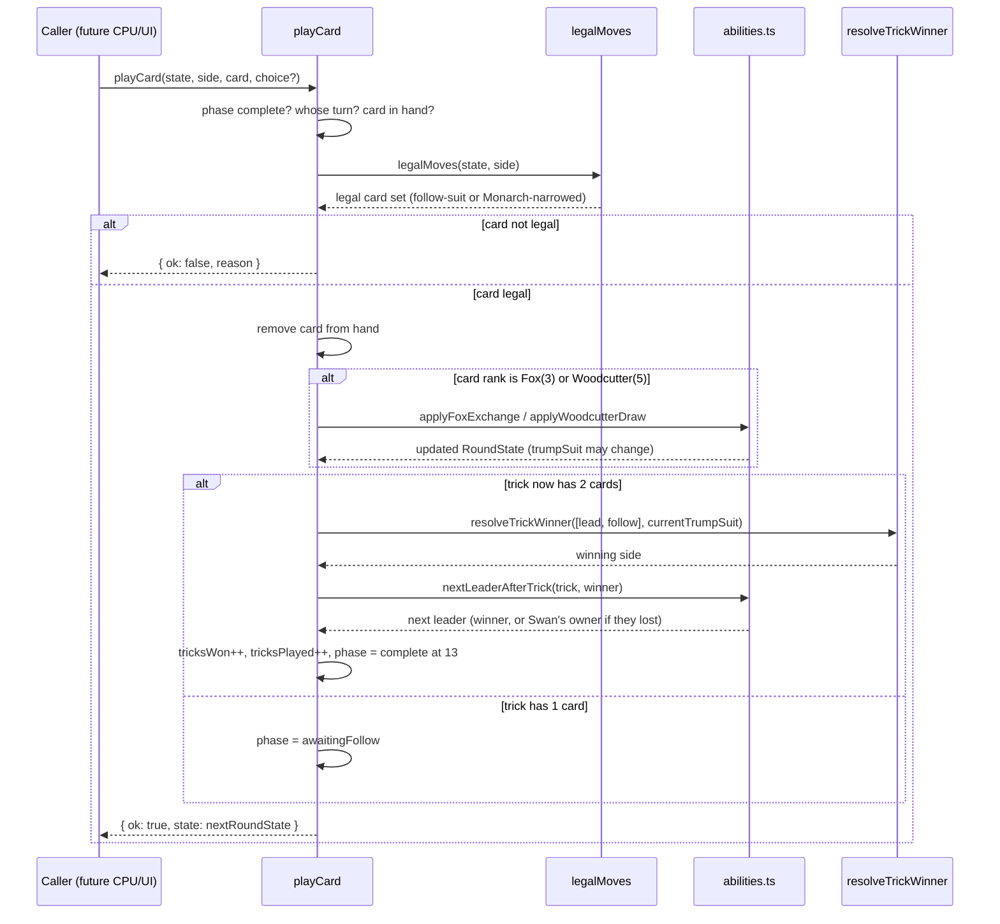

# Plan: War Council rules engine — Fox in the Forest, base 33-card deck

Plan folder: `.claude/contract/SCRUM-20-war-council-rules-engine/`
Execution status: see `tasks.md` in this folder.

---

## Part 1 — Alignment

### Task reference

**Jira issue:** [SCRUM-20](https://amazerbeam.atlassian.net/browse/SCRUM-20) — "War Council rules engine — Fox in the Forest, base 33-card deck"

**Acceptance criteria (verbatim from the ticket):**

1. A full round deals and plays out exactly 13 tricks using the base 33-card deck only — no special/goal/poison modules (explicit scope note in `hybrid-concept.md`).
2. Trick-taking, trump/decree resolution, and any odd-card ability that mutates the trump suit mid-trick are implemented per `../game_rules/fox-in-the-forest.md` and enforced as legal-move constraints — an illegal play cannot be submitted by either side.
3. End-of-round scoring produces the correct points → band per the scenario table in `hybrid-concept.md`: 0–3 tricks → 6 pts, 4 → 1 pt, 5 → 2 pts, 6 → 3 pts, 7–9 → 6 pts, 10–13 → 0 pts, and this always sums to a valid pair (both sides' bands are locked together, since tricks always sum to 13).
4. The engine module has no React import and no DOM access (pure logic, testable headless) — establishes the pure-core boundary CLAUDE.md notes was dropped with the previous prototype and is worth re-establishing.
5. Unit tests (Vitest) cover: a full round dealing exactly 13 tricks, trump/decree resolution, the odd-card trump-mutation ability, and the scoring-band table for every possible trick split.

**Scope boundaries (verbatim):** In scope — deck, deal, trick resolution, trump/decree, scoring bands, legal-move validation. Out of scope — any CPU decision-making, any rendering, the Treasure-7s mid-round bonus question (open in `hybrid-concept.md` — implement the base end-of-round band only; do not invent a Treasure-7s rule here).

**Dependencies & Risks (verbatim):** Depends on the battle module scaffold ticket. Risk: this is explicitly called out as the harder half of the whole epic (hidden hands, 13 tricks of lookahead-relevant state, an ability that mutates trump mid-trick) — budget review time accordingly. Open question carried forward, not resolved here: dealer alternation across a battle (whether it resets or continues) — implement dealer alternation per-round and flag the cross-round-boundary question rather than guessing; the battle loop orchestrator ticket is where that boundary actually gets decided.

**Dependency status:** SCRUM-19 (battle module scaffold) is `Status: COMPLETE` at `.claude/contract/SCRUM-19-battle-module-scaffold/tasks.md` — `src/warCouncil/index.ts` already exists with a placeholder `export type WarCouncilState = unknown`, and `src/battle/battleState.ts` already imports and references it. This plan replaces the placeholder with the real engine state shape (see Config and persisted-shape audit).

### Restated goal

Build the War Council's rules engine as a pure, headless TypeScript module under `src/warCouncil/`: construct the base 33-card deck, deal a round (13 cards per side, a 6-card draw pile, and a decree card that sets trump), validate and apply legal card plays through all 13 tricks — including the base follow-suit rule and the base game's odd-card abilities (Swan, Fox, Woodcutter, Witch, Monarch; Treasure's mid-round scoring is explicitly excluded per the ticket's own scope note) — determine each trick's winner, and score the completed round against the fixed points-per-tricks-won band table. No CPU decision-making and no rendering; this ticket produces the engine only, ready for a later ticket to drive from either side.

### In scope

- Card/suit/side types and the 33-card base deck (`createDeck`).
- A pure, dependency-injected shuffle (`shuffle(items, rng)`) — no internal `Math.random()` call, so tests can drive it deterministically.
- Round setup (`dealRound`): 13-card hands, a 6-card draw pile, and a decree card whose suit sets the round's trump suit; takes `dealer` as an input parameter rather than deciding alternation itself (see Assumptions — dealer alternation across a battle is explicitly out of this ticket's authority).
- Legal-move computation (`legalMoves`): the base follow-suit-if-able rule, plus the Monarch (11) forced-response constraint when Monarch is the led card.
- A single reducer-shaped entry point (`playCard`) that validates a proposed play against `legalMoves`, rejects an illegal play with a named reason code instead of committing it, and — for a legal play — applies whichever odd-card ability the card carries, resolves the trick once both cards are in, and advances round state (trick count, leader for the next trick, phase).
- Trick-winner resolution (`resolveTrickWinner`): the base trump-suit-then-lead-suit rule, plus the Witch (9) "treat as trump when exactly one Witch is in the trick" rule.
- The Fox (3) ability: optionally exchanging the decree card for a hand card, mutating the round's trump suit **mid-trick** — the specific ability AC2 calls out by name, and the one this plan tests explicitly against the "illegal play cannot be submitted" requirement.
- The Woodcutter (5) ability: draw one card from the draw pile, then discard one card (drawn or held) to the bottom of the draw pile.
- The Swan (1) ability: if its owner loses the trick, that side leads the next trick instead of the trick's winner.
- The Monarch (11) ability: when led, narrows the follower's legal moves to their Swan of that suit and/or their highest card of that suit, when they hold any card of that suit.
- End-of-round scoring (`tricksToPoints`, `scoreRound`) against the fixed band table.
- Replacing the SCRUM-19 placeholder `WarCouncilState = unknown` with the real per-round state shape, and re-exporting the public engine surface from `src/warCouncil/index.ts`.
- Unit tests for every module above, plus one integration-style test that plays a full round to exactly 13 tricks.

### Explicitly out of scope

- Any CPU decision-making — no heuristic, no evaluation function, no "what should the CPU play" logic. `playCard` accepts a proposed play from either side; nothing in this ticket chooses one.
- Any rendering, component, or hook — this ticket touches nothing under React.
- The special, goal, and poison expansion modules and their cards (per AC1 and `hybrid-concept.md`'s scope note: base 33-card deck only).
- The Treasure (7) ability's mid-trick point award and any rule for how those points would feed Muster — explicitly flagged as an open, undecided question in `hybrid-concept.md` ("Do the Treasure 7s feed the Muster?") and the ticket text says plainly not to invent an answer here. Treasure cards are ordinary playable cards in this engine (rank 7, no special effect) — only the scoring bonus is omitted, not the card itself.
- Dealer alternation *across* rounds of a battle (whether it resets or continues per city/battle) — `dealRound` takes `dealer` as a parameter; deciding what value to pass across a sequence of rounds is the battle loop orchestrator ticket's job, per the ticket's own Dependencies & Risks note.
- Persisting or serialising `RoundState` — nothing in this ticket writes to storage.
- Any multi-round or `BattleState`-level orchestration — this ticket's surface is a single round.

### Pattern Reference

- `.docs/game_rules/fox-in-the-forest.md` — the full rules transcription named by the ticket as the implementation source: Setup, Gameplay (leading/following/trick-winner), the full Abilities table, and the End-of-round scoring table. Every rule this plan implements cites a specific section of this file.
- `.docs/design/hybrid-concept.md` → "The scenario table" — the points-per-tricks-won band table (also present in the rules doc; both agree) and the framing that "tricks always sum to 13, so both sides' bands are locked together."
- `.docs/design/hybrid-concept.md` → "Open questions" — "Dealer alternation across a long battle" is listed as open; this plan's Assumptions section addresses exactly what the ticket asks (implement per-round, flag the boundary, don't decide it).
- `.claude/contract/SCRUM-19-battle-module-scaffold/plan.md` and its `tasks.md` — establishes `src/warCouncil/index.ts` (currently `export type WarCouncilState = unknown`), the pure-core ESLint boundary already scoped to `src/warCouncil/**`, and the naming precedent (`BattlePhase`, `BattleState`) this plan's own const-map types (`Suit`, `PlayerSide`, `RoundPhase`, `IllegalMoveReason`, `AbilityChoiceKind`) follow.
- `CLAUDE.md` → "Game naming" — confirms "War Council" is the Fox in the Forest card layer; no naming ambiguity to resolve.

### Constraints flagged on the brief

- Base 33-card deck only — no special/goal/poison cards, ever reachable from this module (AC1).
- Every play must be validated before it commits; an illegal play cannot be submitted (AC2) — this plan uses a rejection-with-reason-code result type rather than a throw, so a caller (a future CPU or UI ticket) can inspect *why* a play was rejected.
- Trump/decree resolution and the Fox's trump-mutating ability specifically must be correct **mid-trick** — the trump suit used to resolve a trick must be whatever it is *after* any Fox exchange that happened during that same trick, not before (AC2, and the rules doc's Appendix: "the new trump suit is used to determine the winner of the current trick").
- The scoring-band table must be exact and its two halves must always be a locked pair, since tricks always sum to 13 (AC3).
- No React import, no DOM access anywhere in this module (AC4) — already enforced by the ESLint boundary SCRUM-19 established for `src/warCouncil/**`; this plan does not need to add it, only comply with it and re-confirm it in Final verification.
- Dealer alternation across a battle is explicitly **not** this ticket's decision — implement dealer as a per-round input parameter and do not guess at cross-round behaviour (Dependencies & Risks).
- Do not invent a Treasure-7s rule (Scope Boundaries) — the ability's point award is omitted entirely, not approximated.

### Assumptions made

- **All five non-Treasure base-game odd-card abilities are implemented (Swan, Fox, Woodcutter, Witch, Monarch), not just the Fox trump-mutation ability AC2 names explicitly.** This is the single biggest scope call in this plan. AC2 calls out only "any odd-card ability that mutates the trump suit mid-trick" (the Fox) as a **named** requirement, and AC5's test list similarly names only "the odd-card trump-mutation ability" among the required tests. But the User Story asks for a round "played correctly," Scope Boundaries lists "trick resolution" and "legal-move validation" as in-scope without narrowing to one card, and every one of these five abilities is transcribed in the same Pattern Reference document (`fox-in-the-forest.md`) as the base game's actual rules — omitting Witch or Monarch would make trick-winner determination and follow-suit legality *wrong* for the base deck whenever those ranks appear, which contradicts "correctly reflects my play." Treasure is the one ability with a genuinely open design question attached (how its points feed Muster) — none of the other four have any open question blocking them. If the developer wants a smaller first slice, the natural cut is to Task-level: drop Woodcutter first (it only affects hand composition, not trick legality or trump), then Swan (only affects who leads next, not the current trick's outcome or score) — see Risks.
- **`RoundState` (this ticket's real engine state) becomes the concrete type behind `WarCouncilState`.** SCRUM-19 defined `WarCouncilState = unknown` explicitly as a placeholder for "whatever the War Council engine ticket needs." A single `RoundState` is the natural fit today because this ticket's whole scope is one round; a later multi-round or battle-level ticket is what extends this, not this one (confirmed by SCRUM-19's own "Explicitly out of scope" — extending `BattleState` is deferred to the orchestrator ticket).
- **Randomness is caller-injected (`rng: () => number`), never called internally.** Neither the brief nor CLAUDE.md's "Constraints flagged" template asks for a specific seeded PRNG algorithm, but the correctness-traps section (`.claude/workflow/web-project.md`) and this plan's own Runtime quality notes require "no `Math.random()` reachable from anything that must be reproducible." Dependency-injecting the random source (rather than picking and shipping a specific seeded-PRNG implementation, which nobody asked for) is the minimal way to satisfy that: production wiring can pass `Math.random`, tests pass a fixed/deterministic generator, and `src/warCouncil/` itself never references `Math.random` at all.
- **`playCard` returns a discriminated result (`{ ok: true, state } | { ok: false, reason }`) rather than throwing.** AC2 requires that "an illegal play cannot be submitted" be enforced and testable; a typed rejection with a named reason code is more directly assertable in a unit test than a thrown exception's message string, and it gives a future CPU/UI caller a stable, string-bound set of reasons to branch on (the reason codes are enumerated in Data shapes and are exactly the kind of string-bound name the audit below tracks).
- **Card equality is structural (`suit` + `rank`), not by object identity or a synthetic id.** The 33-card deck has exactly one card per (suit, rank) pair, so structural equality is sufficient and needs no id field or generation scheme.
- **Player identity is `PlayerSide` = `'player' | 'cpu'`, matching `skirmish-board-replacement.md`'s "purple (Player) ... green (CPU)" naming**, not a generic `north`/`south` or `A`/`B` scheme — this keeps the same two names a later Vanguard/battle ticket already uses for the two sides.
- **The trick tuple passed to trick-winner resolution is always `[leadCard, followCard]` in that order** — the function is not order-independent, since lead-suit determination requires knowing which card was led. Documented at the function, enforced by construction inside `playCard` (the first card added to `currentTrick` is always the lead).
- **No runtime guard on `tricksToPoints`' input range.** `tricks` is only ever produced internally by `playCard`'s own trick counter, which is bounded 0–13 by construction (one winner assigned per trick, 13 tricks per round) — this is an internal invariant, not a system boundary, so per CLAUDE.md ("only validate at system boundaries") this plan relies on the type system and tests rather than adding a defensive throw for an unreachable input.

### Config and persisted-shape audit

- **`WarCouncilState` is renamed in effect (its definition changes from `unknown` to a real interface), and every consumer is accounted for.** Grepped `src/` for `WarCouncilState`: 2 hits outside its own definition — `src/battle/battleState.ts:1` (`import type { WarCouncilState } from '../warCouncil'`) and `src/battle/battleState.ts:7` (`readonly warCouncil: WarCouncilState`). Both are structural references by type name only; `BattleState` does not need to change, since `WarCouncilState` continues to exist as an exported name from `src/warCouncil/index.ts` — only its underlying shape does. No other file references it (confirmed by the same grep, one file, two lines).
- **No type-loss case applies.** `unknown → RoundState` is a **narrowing from "accepts anything" to "accepts a specific real shape,"** not a `number → string`, array → object, or required → optional change — the one type-loss category from the audit checklist that can apply here (required → optional, making a consumer's assumption wrong) does not, because `BattleState.warCouncil` was never destructured or read anywhere yet (grep above shows zero read-sites beyond the type-level reference).
- **No persisted or stored shape exists yet.** `Glob src/**` (repeated from SCRUM-19's own audit, re-confirmed here) shows no `localStorage` access and no save/serialisation code anywhere in `src/`. Nothing this ticket introduces is persisted, so there is no migration concern.
- **New string-bound names introduced by this ticket, none of them renames:** the `Suit`, `PlayerSide`, `RoundPhase`, `AbilityChoiceKind`, and `IllegalMoveReason` const-map values (e.g. `'bells'`, `'player'`, `'awaitingLead'`, `'foxExchange'`, `'mustFollowLeadSuit'`) are all new. Grepped `src/**` for each of these literal strings before writing this plan: zero hits anywhere outside `src/battle/battlePhase.ts`'s own unrelated `'clash'`/`'resolved'` values (which belong to `BattlePhase`, a different const map at a different level — no collision, confirmed by inspecting both files directly). Nothing currently reads or writes any of this ticket's new string literals.
- **Names align across the one chain this ticket creates:** each const map (`Suit`, `PlayerSide`, `RoundPhase`, `AbilityChoiceKind`, `IllegalMoveReason`) ↔ its derived `typeof X[keyof typeof X]` type ↔ every function signature that consumes it ↔ the test asserting its exact value set. All defined in the same task per const map (see `tasks.md`), so they cannot drift apart within this ticket the way a rename split across tasks could.
- **Architectural boundary already established, re-confirmed rather than re-created.** SCRUM-19 already added the `no-restricted-imports` / `no-restricted-globals` ESLint override scoped to `src/warCouncil/**` and `src/vanguard/**` (confirmed by reading `eslint.config.js:23-58`, live on disk). This plan adds no new ESLint config — Final verification re-runs the boundary grep from `.claude/workflow/web-project.md` to confirm the engine code this ticket adds still complies, plus an explicit `Math.random()` grep for the determinism constraint from Assumptions.

---

## Part 2 — Technical design

### Approach

The engine is a single pure-TypeScript module tree under `src/warCouncil/`, structured as one small file per concern rather than one large file, so no file approaches the 400-line budget and each concern is independently unit-testable. Nothing in this tree imports React or touches the DOM — the ESLint boundary SCRUM-19 already scoped to this folder enforces that at lint time, and Final verification re-confirms it holds.

**State shape.** `RoundState` is the single source of truth for one War Council round: both hands, the draw pile, the current decree/trump, each side's tricks-won count, the in-progress trick (0 or 1 cards), who leads next, how many tricks have been played, and a `RoundPhase` marker (`awaitingLead` / `awaitingFollow` / `complete`). This becomes the concrete type behind `WarCouncilState` (currently `unknown`, per SCRUM-19's placeholder), so `src/battle/battleState.ts` needs no change — `BattleState.warCouncil` simply becomes properly typed instead of `unknown`.

**State transitions go through one reducer-shaped entry point, `playCard`.** This matches the project's "route state change through a single reducer where state is non-trivial" convention, applied here to a pure engine rather than a React reducer: `playCard(state, side, card, abilityChoice?) => PlayCardResult`. It never mutates `state` — every legal play returns a new `RoundState`; every illegal play returns a named rejection reason and leaves the input untouched (`{ ok: false, reason }`, no partial state, no thrown exception). This is what makes AC2's "an illegal play cannot be submitted" independently testable: a test asserts the returned `state` is `undefined`/absent and the `reason` matches, rather than asserting on a caught exception's message.

**Legal-move computation is a separate, pure query (`legalMoves`), consulted by `playCard` before any state changes.** Splitting validation from application means a future CPU or UI ticket can call `legalMoves` directly to build a picker or an evaluation function, without needing to attempt-and-catch a play to discover what's legal. `legalMoves` implements the base follow-suit-if-able rule and the one legality-narrowing ability in the base game, Monarch (11)'s forced response — every other ability (Swan, Fox, Woodcutter, Witch) affects trick *outcome* or *state*, not what's legal to play, so they live in `playCard`'s post-validation ability application instead.

**Trick-winner resolution is a third pure function (`resolveTrickWinner`), called by `playCard` only once both cards of a trick are known.** It implements the base trump-then-lead-suit rule plus the Witch (9) "treat as trump when exactly one Witch is present" rule from the Abilities table. It is given the *already-current* trump suit at the moment the second card is played — which is what makes the Fox's mid-trick mutation correct "for free": if Fox was played as either card of the trick, `playCard` has already applied `applyFoxExchange` (updating `state.trumpSuit`) before `resolveTrickWinner` is ever called for that trick, per the rules doc's Appendix ("the new trump suit is used to determine the winner of the current trick").

**Ability application is grouped into one small module (`abilities.ts`) separate from `playCard.ts`'s orchestration**, because `playCard.ts` is already the file most at risk of growing past a comfortable size (turn validation, hand-membership check, legal-move check, ability dispatch, trick-completion bookkeeping) — pushing the three state-mutating ability effects (`applyFoxExchange`, `applyWoodcutterDraw`, `nextLeaderAfterTrick`) into their own file keeps `playCard.ts` focused on sequencing rather than mechanics, and each ability effect becomes independently testable against a hand-built `RoundState` fixture without needing to drive a whole `playCard` call.

**Scoring is fully independent of the trick engine** — `tricksToPoints` is a pure lookup over an integer 0–13, and `scoreRound` just applies it to both sides' final `tricksWon`. It has no dependency on `RoundState` beyond the two integers, so it is planned and tested first among the game-logic modules (after types/deck/shuffle/deal), giving an early, low-risk correctness win before the harder trick-resolution and ability work.

**Card equality is structural**, via a small shared `cardUtils.ts` (`sameCard`, `containsCard`, `removeCard`, `cardsOfSuit`, `highestOfSuit`) used by `legalMoves`, `resolveTrickWinner`'s callers, and `abilities.ts` alike — centralising this avoids five slightly-different reimplementations of "does this hand contain this card" scattered across the modules that need it.

### Skills to invoke during execution

- `react-frontend` — owns everything under `src/`, including the `as const` object-map pattern this plan uses for every enum-shaped type (`erasableSyntaxOnly` forbids `enum`), the `import type`/`export type` split (`verbatimModuleSyntax`), the pure-core boundary this module lives inside, the 400-line file budget, and the Vitest testing posture ("pure logic tested without a renderer" — every file in this plan).
- Read on demand: `.claude/workflow/web-project.md` (paths, runners, the correctness-traps section on determinism and string-bound names) and `.claude/rules/README.md` (scanned; currently empty, no rule file applies).
- No developer override — only one skill matched (`react-frontend`); consistent with the precedent in `SCRUM-19-battle-module-scaffold/plan.md`, a single-option match has nothing to put to a `multiSelect` `AskUserQuestion`, so the developer confirms the plan as a whole at the Step 3 gate instead.

### Diagram



### Data shapes

#### `src/warCouncil/types.ts`

```ts
export const Suit = {
  Bells: 'bells',
  Keys: 'keys',
  Moons: 'moons',
} as const
export type Suit = (typeof Suit)[keyof typeof Suit]

export const ALL_SUITS: readonly Suit[] = [Suit.Bells, Suit.Keys, Suit.Moons]
export const RANKS: readonly number[] = [1, 2, 3, 4, 5, 6, 7, 8, 9, 10, 11]

export interface Card {
  readonly suit: Suit
  readonly rank: number
}

export const PlayerSide = {
  Player: 'player',
  Cpu: 'cpu',
} as const
export type PlayerSide = (typeof PlayerSide)[keyof typeof PlayerSide]

export function otherSide(side: PlayerSide): PlayerSide {
  return side === PlayerSide.Player ? PlayerSide.Cpu : PlayerSide.Player
}

export const RoundPhase = {
  AwaitingLead: 'awaitingLead',
  AwaitingFollow: 'awaitingFollow',
  Complete: 'complete',
} as const
export type RoundPhase = (typeof RoundPhase)[keyof typeof RoundPhase]

export interface TrickCard {
  readonly side: PlayerSide
  readonly card: Card
}

export interface RoundState {
  readonly dealer: PlayerSide
  readonly hands: Readonly<Record<PlayerSide, readonly Card[]>>
  readonly drawPile: readonly Card[]
  readonly decree: Card
  readonly trumpSuit: Suit
  readonly tricksWon: Readonly<Record<PlayerSide, number>>
  readonly currentTrick: readonly TrickCard[]
  readonly leader: PlayerSide
  readonly tricksPlayed: number
  readonly phase: RoundPhase
}

export function currentTurn(state: RoundState): PlayerSide {
  return state.currentTrick.length === 0 ? state.leader : otherSide(state.currentTrick[0].side)
}

export const AbilityChoiceKind = {
  FoxExchange: 'foxExchange',
  FoxDecline: 'foxDecline',
  WoodcutterDiscard: 'woodcutterDiscard',
} as const
export type AbilityChoiceKind = (typeof AbilityChoiceKind)[keyof typeof AbilityChoiceKind]

export type AbilityChoice =
  | { readonly kind: typeof AbilityChoiceKind.FoxExchange; readonly handCard: Card }
  | { readonly kind: typeof AbilityChoiceKind.FoxDecline }
  | { readonly kind: typeof AbilityChoiceKind.WoodcutterDiscard; readonly discard: Card }

export const IllegalMoveReason = {
  RoundComplete: 'roundComplete',
  NotYourTurn: 'notYourTurn',
  CardNotInHand: 'cardNotInHand',
  MustFollowLeadSuit: 'mustFollowLeadSuit',
  MustFollowMonarch: 'mustFollowMonarch',
  MissingAbilityChoice: 'missingAbilityChoice',
  UnexpectedAbilityChoice: 'unexpectedAbilityChoice',
  InvalidFoxExchangeCard: 'invalidFoxExchangeCard',
  InvalidWoodcutterDiscard: 'invalidWoodcutterDiscard',
} as const
export type IllegalMoveReason = (typeof IllegalMoveReason)[keyof typeof IllegalMoveReason]

export type PlayCardResult =
  | { readonly ok: true; readonly state: RoundState }
  | { readonly ok: false; readonly reason: IllegalMoveReason }
```

#### `src/warCouncil/cardUtils.ts`

```ts
import type { Card, Suit } from './types'

export function sameCard(a: Card, b: Card): boolean
export function containsCard(hand: readonly Card[], card: Card): boolean
export function removeCard(hand: readonly Card[], card: Card): Card[]
export function cardsOfSuit(hand: readonly Card[], suit: Suit): Card[]
export function highestOfSuit(hand: readonly Card[], suit: Suit): Card | undefined
```

#### `src/warCouncil/deck.ts`

```ts
import type { Card } from './types'

export function createDeck(): Card[] // 33 cards: ALL_SUITS x RANKS, one of each
```

#### `src/warCouncil/shuffle.ts`

```ts
export function shuffle<T>(items: readonly T[], rng: () => number): T[] // Fisher-Yates, no internal Math.random()
```

#### `src/warCouncil/deal.ts`

```ts
import type { PlayerSide, RoundState } from './types'

export function dealRound(dealer: PlayerSide, rng: () => number): RoundState
// 13 cards to each side, 6-card drawPile, decree = the 7th card (trumpSuit = decree.suit),
// leader = the non-dealer side, tricksPlayed = 0, phase = RoundPhase.AwaitingLead
```

#### `src/warCouncil/scoring.ts`

```ts
import type { PlayerSide } from './types'

export function tricksToPoints(tricks: number): number
// 0-3 -> 6, 4 -> 1, 5 -> 2, 6 -> 3, 7-9 -> 6, 10-13 -> 0

export function scoreRound(
  tricksWon: Readonly<Record<PlayerSide, number>>,
): Record<PlayerSide, number>
```

#### `src/warCouncil/legalMoves.ts`

```ts
import type { Card, PlayerSide, RoundState } from './types'

export function legalMoves(state: RoundState, side: PlayerSide): readonly Card[]
// currentTrick empty -> whole hand (leader has no restriction)
// currentTrick has 1 card, led card rank !== 11 -> cards of lead suit if any held, else whole hand
// currentTrick has 1 card, led card rank === 11 (Monarch) and side holds a card of that suit ->
//   { their Swan of that suit, if held } U { their highest card of that suit } (deduplicated)
// currentTrick has 1 card, led card rank === 11 and side holds no card of that suit -> whole hand
```

#### `src/warCouncil/resolveTrick.ts`

```ts
import type { PlayerSide, Suit, TrickCard } from './types'

export function resolveTrickWinner(
  trick: readonly [TrickCard, TrickCard], // [leadCard, followCard], order load-bearing
  trumpSuit: Suit,
): PlayerSide
// a card is "effectively trump" if its suit === trumpSuit, OR
//   (exactly one rank-9 card is present in the trick AND this card is that rank-9 card)
// if either card is effectively trump: the higher-ranked effectively-trump card wins
// else: if both cards share a suit (the lead suit), higher rank wins; otherwise the lead card wins
```

#### `src/warCouncil/abilities.ts`

```ts
import type { Card, PlayerSide, RoundState, TrickCard } from './types'

export function applyFoxExchange(state: RoundState, side: PlayerSide, handCard: Card): RoundState
// removes handCard from side's hand, adds the old decree to side's hand instead,
// sets state.decree = handCard, state.trumpSuit = handCard.suit

export function applyWoodcutterDraw(state: RoundState, side: PlayerSide, discard: Card): RoundState
// draws the top card of drawPile into side's hand, then removes `discard` from side's hand
// and appends it to the bottom of drawPile (net drawPile length unchanged)

export function nextLeaderAfterTrick(
  trick: readonly [TrickCard, TrickCard],
  winner: PlayerSide,
): PlayerSide
// winner leads next, UNLESS a rank-1 (Swan) card in the trick belongs to the losing side,
// in which case that side leads next instead (covers the two-Swans case per the rules doc's
// own Appendix answer: the trick's loser leads next)
```

#### `src/warCouncil/playCard.ts`

```ts
import type { AbilityChoice, Card, PlayCardResult, PlayerSide, RoundState } from './types'

export function playCard(
  state: RoundState,
  side: PlayerSide,
  card: Card,
  choice?: AbilityChoice,
): PlayCardResult
// order: phase-complete check -> turn check -> hand-membership check -> legalMoves check ->
// remove card from hand -> dispatch ability (Fox rank 3 / Woodcutter rank 5, each requiring a
// matching AbilityChoice, else MissingAbilityChoice / UnexpectedAbilityChoice /
// InvalidFoxExchangeCard / InvalidWoodcutterDiscard) -> append to currentTrick ->
// if 1 card: phase = AwaitingFollow; if 2 cards: resolveTrickWinner, nextLeaderAfterTrick,
// increment tricksWon/tricksPlayed, clear currentTrick, phase = Complete at 13 else AwaitingLead
```

#### `src/warCouncil/index.ts`

```ts
export type { RoundState as WarCouncilState } from './types' // replaces SCRUM-19's `= unknown` placeholder

export {
  Suit, PlayerSide, RoundPhase, AbilityChoiceKind, IllegalMoveReason, otherSide, currentTurn,
} from './types'
export type { Card, TrickCard, RoundState, AbilityChoice, PlayCardResult } from './types'
export { createDeck } from './deck'
export { shuffle } from './shuffle'
export { dealRound } from './deal'
export { legalMoves } from './legalMoves'
export { resolveTrickWinner } from './resolveTrick'
export { playCard } from './playCard'
export { tricksToPoints, scoreRound } from './scoring'
```

No `package.json` script changes, no configuration-file changes, no persisted shapes.

### Runtime quality notes

- **Purity and adjudication:** Every file under `src/warCouncil/` is plain TypeScript with no React import and no DOM global — enforced by the ESLint boundary SCRUM-19 already scoped to this folder, re-confirmed in Final verification. No tunable values exist in this ticket (the scoring bands and card ranks are the game's own fixed rules, not developer-tunable numbers).
- **Effects, mount and teardown:** Not applicable — no component, no effect, nothing that mounts. This module has zero React surface.
- **Hot-path cost:** Every operation here runs at most once per card play (13 tricks × 2 plays = 26 calls per round) over collections of at most 13 elements — no loop, filter, or search here is a performance concern at this scale, so no memoisation or incremental-update design is needed.
- **Determinism and numeric safety:** All randomness enters through the caller-supplied `rng: () => number` parameter to `shuffle`/`dealRound` — `src/warCouncil/` never calls `Math.random()` internally, confirmed by grep in Final verification. No division occurs anywhere in this module (scoring is a fixed lookup table, not a formula), so there is no `NaN`-producing divisor to guard.
- **Error paths:** Every illegal play is rejected through `PlayCardResult`'s `{ ok: false, reason }` branch with one of nine named `IllegalMoveReason` values — no play can partially commit, and no rejection is swallowed into a success shape. There is no async surface in this ticket (no loading/error/empty states apply) — everything here is synchronous, pure computation.

### Risks and judgement calls

- **Implementing all five non-Treasure odd-card abilities, not just the Fox trump-mutation ability AC2 names, is the single biggest judgement call in this plan** (see Assumptions for the full reasoning). If the developer wants a smaller first slice that still satisfies AC2 and AC5 literally, the two most independent abilities to cut are Woodcutter (Task 12 below — only touches hand/draw-pile composition, no other module depends on it) and Swan (folded into Task 13's `nextLeaderAfterTrick` — only affects who leads next, not the current trick's winner or score). Cutting either narrows `tasks.md` by one task each without touching the Fox, Witch, or Monarch work AC2 and the base trick-taking rules actually need.
- **`playCard`'s rejection-by-reason-code design, rather than throwing, is a judgement call with no brief precedent to cite** — it is the more testable and more UI/CPU-friendly shape, but it is this plan's choice, not a requirement quoted from the ticket. Worth the developer's explicit sign-off since a later CPU ticket will be the first real caller and will inherit this contract.
- **No dependency, config value, or behaviour in this ticket needs the developer's judgement to play the app** — this module has no UI surface; every acceptance criterion here is machine-verifiable by Vitest and `npm run typecheck`. There is nothing to observe by running `npm run dev`.
- **`RoundState` becoming the concrete `WarCouncilState` shape is a one-way door for the next engine ticket (Vanguard) to follow the same pattern** (replace its own `VanguardState = unknown` placeholder with a real per-round-or-per-clash state) — not a risk to this ticket specifically, but worth the developer knowing this plan sets that precedent.
