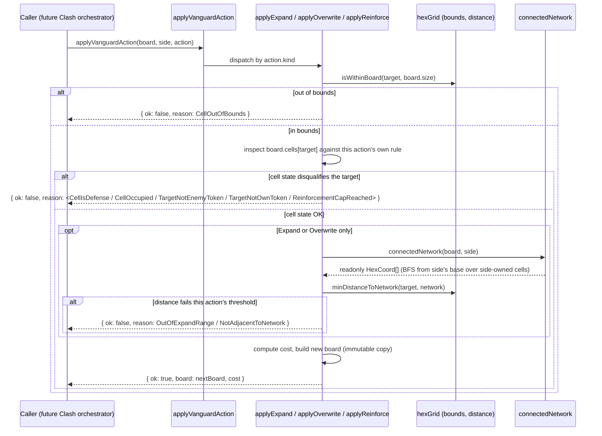

# Plan: Vanguard board engine — hex grid, bases, Expand/Overwrite/Reinforce

Plan folder: `.claude/contract/SCRUM-21-vanguard-board-engine/`
Execution status: see `tasks.md` in this folder.

---

## Part 1 — Alignment

### Task reference

**Jira issue:** [SCRUM-21](https://amazerbeam.atlassian.net/browse/SCRUM-21) — "Vanguard board engine — hex grid, bases, Expand/Overwrite/Reinforce"

**Acceptance criteria (verbatim from the ticket):**

1. A hex-grid rhombus board exists with two fixed base cells (Player, CPU) in roughly opposite corners, each pre-seeded with a small starting cluster of that side's own connected tokens (cluster size is an illustrative/tunable constant, not hardcoded logic).
2. Permanent grey "defense" cells exist as a per-map fixed set that no side may ever place on.
3. **Expand** places a token on an empty cell within 2 hex-spaces of the acting side's existing connected network (a 1-cell gap is legal); illegal outside that range.
4. **Overwrite** replaces an enemy token only on a cell adjacent (touching) to the acting side's existing network — no gap allowed; illegal otherwise. Cost is 2 moves normally, 3 if the target cell is reinforced.
5. **Reinforce** adds defense to a token the acting side already holds; a token can hold at most +1 reinforcement (does not stack further); illegal to reinforce an unowned or already-maxed cell.
6. The engine module has no React import and no DOM access (pure logic, headless-testable), consistent with the War Council engine's boundary.
7. Unit tests cover: Expand range/gap legality at the boundary (exactly 2 away, exactly 3 away), Overwrite adjacency legality and the 2-vs-3-move reinforced-target cost, and the Reinforce +1 cap.

**Scope boundaries (verbatim):** In scope — hex grid model, base cells, defense cells, the three actions' legality + cost. Out of scope — the Breach connectivity check, CPU action selection, rendering, any stalemate/tiebreak rule (explicitly out of scope for the whole epic).

**Dependencies & Risks (verbatim):** Depends on the battle module scaffold ticket. Risk: board size, starting-cluster size, and the 2/3 overwrite cost are all illustrative numbers in `skirmish-board-replacement.md`, implement them as named constants the developer can retune after first playtest, not inlined magic numbers. No stalemate handling means a battle can theoretically run indefinitely if neither side reaches the Breach — accepted per the epic's explicit out-of-scope list; the battle loop orchestrator should still expose round count so this is visible, not silent.

**Dependency status:** SCRUM-19 (battle module scaffold) is complete — `src/vanguard/index.ts` already exists with a placeholder `export type VanguardState = unknown`, and `src/battle/battleState.ts` already imports and references it. This plan replaces the placeholder with the real engine state shape (see Config and persisted-shape audit). SCRUM-20 (War Council rules engine) is also complete and is the closest sibling pattern: a pure `src/warCouncil/` tree with a `PlayerSide` const map (`'player' | 'cpu'`) this plan reuses directly rather than redefining.

### Restated goal

Build the Vanguard board as a pure, headless TypeScript module under `src/vanguard/`: a hex-grid rhombus board with two fixed base cells seeded with a small connected starting cluster per side, a fixed set of permanent defense cells neither side may ever occupy, and the three Clash actions — Expand, Overwrite, Reinforce — each enforcing its documented legality (range, adjacency, ownership, the reinforcement cap) and returning its documented move cost. No Muster/turn-order bookkeeping, no Breach detection, no CPU decision-making, and no rendering — this ticket produces the board engine only, ready for a later ticket (the Clash orchestrator) to drive turn-by-turn from either side.

### In scope

- Hex coordinate math: axial coordinates, neighbour lookup, distance, board-bounds check, and a small reusable BFS helper.
- `VanguardBoard` state: cell contents (empty / owned token with a reinforcement level / permanent defense), board size, and each side's base coordinate.
- Board construction (`createVanguardBoard`): places both bases in opposite corners, pre-seeds each with a connected starting cluster grown outward from its base, and marks the fixed defense cells.
- A pure query for a side's "existing connected network" (the set of that side's tokens reachable from its base through an unbroken chain of adjacency) — the shared primitive both Expand's range check and Overwrite's adjacency check are built on.
- Legality + cost + board update for each of the three actions (`applyExpand`, `applyOverwrite`, `applyReinforce`), each returning a typed `{ ok: true, board, cost }` or `{ ok: false, reason }` result — never throwing, never mutating the input board.
- A single reducer-shaped dispatch entry point (`applyVanguardAction`) that routes to the correct action by kind.
- Named, retunable configuration for every illustrative number the ticket calls out (board size, starting cluster size, defense-cell layout, the two overwrite costs, the reinforce cost, the reinforcement cap) plus named constants for the two range/adjacency thresholds (Expand's 2-hex range, Reinforce's cost) so nothing is inlined.
- Replacing the SCRUM-19 placeholder `VanguardState = unknown` with the real board shape, and exporting the public engine surface from `src/vanguard/index.ts`.
- Unit tests for every module above, including the exact boundary cases AC7 names.

### Explicitly out of scope

- **The Breach connectivity check** (does a side's network reach all the way to the opponent's base) — explicitly named out of scope by the ticket. `connectedNetwork` (this plan's shared primitive) computes the same *kind* of adjacency-chain reachability the Breach will eventually need, but nothing in this plan checks whether that chain reaches the opponent's base, and no win/loss state is produced.
- **CPU action selection** — nothing here chooses a move; every action function takes an already-decided `target` coordinate from its caller.
- **Rendering, components, or hooks** — this ticket touches nothing under React.
- **Any stalemate/tiebreak rule** — out of scope for the whole epic per the ticket's own scope note.
- **Muster (the move budget) and whose-turn-it-is bookkeeping.** Actions report their own `cost`; nothing in this module tracks a running budget or decides alternation between sides — that is the future Clash-orchestrator ticket's job, mirroring how `dealRound` in `src/warCouncil/` takes `dealer` as a parameter instead of deciding it internally.
- **Any multi-round or `BattleState`-level orchestration** — this ticket's surface is a single, already-constructed board and the three actions that can be applied to it.
- **Persisting or serialising `VanguardBoard`** — nothing in this ticket writes to storage.

### Pattern Reference

- `.docs/design/skirmish-board-replacement.md` → "The replacement: The Vanguard" and its "Board" / "Actions, spent during The Clash" tables — the source of every legality and cost rule this plan implements (Expand's 2-hex range with a 1-cell gap, Overwrite's adjacency-only rule and 2/3 cost, Reinforce's +1 cap). Its "Open, not yet decided" section is the source for every value this plan treats as an unchosen placeholder (board size, starting-cluster size, base distance, the 2/3 overwrite cost as a *named-constant* requirement, and the +1 reinforce cap).
- `.docs/game_rules/hex.md` — confirms the board shape precedent ("rhombus of hexagonal cells", cells adjacent when they share a hex side) the design doc explicitly borrows ("A hex-grid rhombus (same shape Hex used)").
- `.claude/contract/SCRUM-20-war-council-rules-engine/plan.md` and its `tasks.md` — the closest sibling pattern: a pure `src/warCouncil/` tree with the same "reject with a named reason code, never throw" result shape this plan reuses for `VanguardActionResult`, the same `as const` object-map convention for every fixed value set, and the `PlayerSide` type (`'player' | 'cpu'`) this plan imports directly rather than redefining.
- `.claude/contract/SCRUM-19-battle-module-scaffold/` — establishes `src/vanguard/index.ts` (currently `export type VanguardState = unknown`) and the pure-core ESLint boundary already scoped to `src/vanguard/**` (confirmed live in `eslint.config.js`).
- `CLAUDE.md` → "Game naming" — confirms "The Vanguard" is the correct name for this mechanic, and "Muster" / "The Clash" / "The Breach" are the correct names for the concepts this plan deliberately keeps out of scope.

### Constraints flagged on the brief

- Expand, Overwrite, and Reinforce legality must be enforced **exactly** per the Problem Statement ("Its legality rules ... are the entire offense/defense tension the design is built on and must be enforced exactly") — this is why every action's boundary case (exactly-2 vs exactly-3, adjacent vs gap-of-one, first reinforce vs second) gets an explicit test, not just a representative one.
- Board size, starting-cluster size, and the overwrite costs must be **named, retunable constants**, never inlined magic numbers (Dependencies & Risks, verbatim).
- The engine module must have no React import and no DOM access (AC6) — already enforced by the ESLint boundary SCRUM-19 established for `src/vanguard/**`; this plan does not add to that config, only complies with it and re-confirms it in Final verification.
- Do not implement the Breach check, CPU selection, rendering, or a stalemate rule (Scope Boundaries) — flagged explicitly so no task in `tasks.md` drifts into any of these.

### Assumptions made

- **`PlayerSide` is imported from `../warCouncil` rather than redefined.** Both `skirmish-board-replacement.md` ("purple (Player) ... green (CPU)") and the already-shipped `src/warCouncil/types.ts` use the same two-side identity (`'player' | 'cpu'`); redefining a second, structurally-identical type in `src/vanguard/` would be exactly the kind of duplicated fact `CLAUDE.md`'s single-source-of-truth rule warns against. Cross-importing between `src/warCouncil/` and `src/vanguard/` stays inside the pure-core boundary (the ESLint override at `eslint.config.js:23-45` restricts React/DOM, not cross-imports between the two pure trees).
- **Reinforcement is a numeric stack level (`reinforced: number`, gated by a named `REINFORCE_MAX_STACK` constant defaulting to `1`), not a boolean.** AC5 states the cap as "+1", but `skirmish-board-replacement.md`'s "Open, not yet decided" section explicitly lists "the +1 reinforce cap" among the numbers that are the developer's to retune — a plain boolean would make that number implicit in the type shape rather than a named, retunable constant, which is exactly what the Dependencies & Risks note asks this plan to avoid for every illustrative number. A future retune to allow deeper stacking then needs only a constant change, not a type change. Flagged for developer confirmation in Risks below in case the cap is meant to be permanently fixed at exactly one.
- **A side's "existing connected network" (used by both Expand's range check and Overwrite's adjacency check) is computed fresh each time as a breadth-first search from that side's base, over cells currently owned by that side** — not an incrementally-maintained field on `VanguardBoard`. The board is small (the placeholder `BOARD_SIZE` yields at most 121 cells, the same order of magnitude as Hex's 11×11), each action call triggers at most one such search, and this is a turn-based action, not a per-frame or per-pointer-event hot path — so recompute-from-scratch is the simplest correct design and no caching is justified without profiling evidence, per the performance order in `references/engineering-standards.md`.
- **`connectedNetwork` returns an empty set if a side's base cell is not currently owned by that side**, rather than special-casing base loss. Whether a base itself can ever be overwritten, and what that means, is a Breach/loss-condition question this ticket explicitly does not answer (Breach is out of scope). This assumption just makes the degenerate case well-defined (no legal Expand/Overwrite for that side) rather than undefined behaviour, without inventing a rule about base capture.
- **Overwrite always resets the captured cell's reinforcement to `0` for the new owner.** Nothing in the brief or design doc states this explicitly, but the alternative (the new owner inheriting the previous owner's fortification) has no support anywhere in the source material either; resetting is the more defensible default and is called out explicitly in Risks for developer sign-off.
- **No turn-order or "is it this side's turn" check exists anywhere in this module.** `applyVanguardAction` takes `side` as a parameter for every call, exactly as `dealRound` takes `dealer` as a parameter in `src/warCouncil/` — deciding *when* each side acts (the alternating exchange within The Clash) belongs to a future orchestrator ticket, not this one.
- **Board size and starting-cluster-size placeholders (`BOARD_SIZE = 11`, `STARTING_CLUSTER_SIZE = 4`) are chosen only to make the engine constructible and testable**, following the design doc's own citation of Hex's 11×11 rhombus as "same shape Hex used." Neither value is a real decision — both are named, retunable configuration per the Dependencies & Risks note, and both are listed under Risks below for the developer to retune after first playtest.
- **`DEFENSE_CELLS` is a small, invented placeholder layout** (five cells in a plus-shape near board centre, verified by construction to sit far from both starting clusters at the placeholder board size) — the design doc gives no layout at all, only that such a fixed set must exist. Flagged under Risks as throwaway until playtested.

### Config and persisted-shape audit

- **`VanguardState` changes from `unknown` to a real interface, and every consumer is accounted for.** Grepped `src/` for `VanguardState`: 2 hits outside its own definition — `src/battle/battleState.ts:2` (`import type { VanguardState } from '../vanguard'`) and `src/battle/battleState.ts:8` (`readonly vanguard: VanguardState`). Both are structural references by type name only; `BattleState` needs no change, since `VanguardState` continues to be exported by name from `src/vanguard/index.ts` — only its underlying shape does.
- **No type-loss case applies.** `unknown → VanguardBoard` is a narrowing from "accepts anything" to "accepts a specific real shape" — the same category SCRUM-20 documented for `WarCouncilState`, not a `number → string`, array → object, or required → optional change. `BattleState.vanguard` has never been read or destructured anywhere (confirmed by the same grep: zero non-type-position hits).
- **No persisted or stored shape exists yet.** Grepped `src/` for `localStorage`/`sessionStorage`: zero hits anywhere in the tree. Nothing this ticket introduces is persisted, so there is no migration concern.
- **New string-bound names introduced by this ticket, none of them renames:** `VanguardCellKind` (`'token'`, `'defense'`), `VanguardActionKind` (`'expand'`, `'overwrite'`, `'reinforce'`), and eight `IllegalActionReason` values. Grepped `src/` for the literal strings `'expand'`, `'overwrite'`, `'reinforce'`, `'token'`, `'defense'` before writing this plan: zero hits anywhere. No collision with `BattlePhase`'s existing `'clash'` / `'resolved'` values (a different const map, confirmed by inspecting both files directly).
- **Names align across the one chain this ticket creates:** each const map (`VanguardCellKind`, `VanguardActionKind`, `IllegalActionReason`) ↔ its derived `typeof X[keyof typeof X]` type ↔ every function signature that consumes it ↔ the test asserting its exact value. All defined in the same task (Task 1, `types.ts`), so they cannot drift apart within this ticket.
- **Architectural boundary already established, re-confirmed rather than re-created.** SCRUM-19 already added the `no-restricted-imports` / `no-restricted-globals` ESLint override scoped to both `src/warCouncil/**` and `src/vanguard/**` (confirmed by reading `eslint.config.js:23-45`, live on disk). This plan adds no new ESLint config — Final verification re-runs the boundary grep from `.claude/workflow/web-project.md` to confirm the engine code this ticket adds still complies.

---

## Part 2 — Technical design

### Approach

The engine is a single pure-TypeScript module tree under `src/vanguard/`, one small file per concern, mirroring the shape SCRUM-20 already established for `src/warCouncil/`. Nothing in this tree imports React or touches the DOM — the ESLint boundary SCRUM-19 already scoped to this folder enforces that at lint time, and Final verification re-confirms it holds.

**Coordinates and a reusable graph search come first.** `HexCoord { q, r }` uses axial coordinates, which give a closed-form hex distance and a fixed six-direction neighbour list — the natural fit for a rhombus board generated as `q, r ∈ [0, size)`. Rather than writing three separate flood-fill loops (one to grow each side's starting cluster, one to compute a side's connected network), this plan factors a single generic `hexBfs(start, size, canEnter)` helper: it walks outward from `start`, following only neighbours that are in-bounds and satisfy the caller's `canEnter` predicate, and — critically — it also gates `start` itself through `canEnter`, so the same primitive naturally produces an empty result when a side's base is no longer theirs to search from (see Assumptions), with no special case in the caller. `createVanguardBoard`'s cluster seeding and `connectedNetwork`'s network query become two thin call sites over the same traversal, differing only in their `canEnter` predicate — this is the "reusability over duplication" principle applied directly rather than three near-identical loops drifting apart over time.

**`VanguardBoard` is a sparse cell map.** Only non-empty cells (a token or a permanent defense marker) are stored, keyed by a `"q,r"` string; any in-bounds coordinate absent from the map is empty by construction. This avoids pre-populating and threading around ~121 "empty" entries for a board where the overwhelming majority of cells start empty, and it matches the `Record<string, T>` keying style `src/warCouncil/` already uses for hands/`tricksWon` (keyed by `PlayerSide` there, by cell coordinate here).

**Each of the three actions is a small, independent pure function** (`applyExpand`, `applyOverwrite`, `applyReinforce`), each following the same shape: bounds check → cell-state check (is the target empty / an enemy token / an owned token, as that action requires) → for Expand and Overwrite only, a `connectedNetwork` + distance check against the action's own threshold → on success, an immutable board update plus the action's cost; on any failure, a named `IllegalActionReason` and no board change. Splitting these into one file per action (rather than one large `actions.ts`) keeps each file well under the 400-line budget and keeps each action's boundary logic independently readable and testable — directly answering AC7's requirement that Expand's range boundary, Overwrite's adjacency boundary, and Reinforce's cap each get their own explicit test.

**A single reducer-shaped entry point, `applyVanguardAction`, dispatches by `action.kind`.** This matches the project's "route state change through a single reducer where state is non-trivial" convention (the same shape `playCard` uses in `src/warCouncil/`), giving a future Clash-orchestrator ticket exactly one function to call regardless of which action a side chooses. It contains no legality logic itself — that stays in the three action modules — so it stays small and its own correctness is just "did it route to the right handler," which is what its tests assert.

**Configuration is fully separated from the fixed-rule constants it sits beside**, in one `config.ts`: `BOARD_SIZE`, `STARTING_CLUSTER_SIZE`, and `DEFENSE_CELLS` are genuinely unchosen placeholders per the Dependencies & Risks note (flagged for the developer in Risks below); `EXPAND_RANGE`, `EXPAND_COST`, `OVERWRITE_COST`, `OVERWRITE_COST_REINFORCED`, `REINFORCE_COST`, and `REINFORCE_MAX_STACK` are named constants for values the ticket's own acceptance criteria already state (2-hex range, the 2/3 overwrite split, the +1 cap) — naming them still matters even though their value is already decided, because it is what keeps them out of the action modules as inline literals and keeps the Final-verification grep meaningful.

### Skills to invoke during execution

- `react-frontend` — owns everything under `src/`, including the `as const` object-map pattern this plan uses for every fixed value set (`erasableSyntaxOnly` forbids `enum`), the `import type`/`export type` split, the pure-core boundary this module lives inside, the 400-line file budget, the constants-vs-configuration taxonomy this plan's `config.ts` follows explicitly, and the Vitest testing posture ("pure logic tested without a renderer" — every file in this plan).
- Read on demand: `.claude/workflow/web-project.md` (paths, runners, the correctness-traps section — string-bound names and module-level mutable state are the two traps most relevant here) and `.claude/rules/README.md` (scanned; currently empty, no rule file applies).
- No developer override — only one skill matched (`react-frontend`); consistent with the precedent in `SCRUM-20-war-council-rules-engine/plan.md`, a single-option match has nothing to put to a `multiSelect` `AskUserQuestion`, so the developer confirms the plan as a whole at the Step 3 gate instead.

### Diagram



### Data shapes

#### `src/vanguard/types.ts`

```ts
import type { PlayerSide } from '../warCouncil'

export interface HexCoord {
  readonly q: number
  readonly r: number
}

export type CellKey = string // `${q},${r}`

export const VanguardCellKind = {
  Token: 'token',
  Defense: 'defense',
} as const
export type VanguardCellKind = (typeof VanguardCellKind)[keyof typeof VanguardCellKind]

export interface TokenCell {
  readonly kind: typeof VanguardCellKind.Token
  readonly owner: PlayerSide
  readonly reinforced: number // stacked reinforcement level, 0..REINFORCE_MAX_STACK
}

export interface DefenseCell {
  readonly kind: typeof VanguardCellKind.Defense
}

export type VanguardCell = TokenCell | DefenseCell

export interface VanguardBoard {
  readonly size: number
  readonly bases: Readonly<Record<PlayerSide, HexCoord>>
  // Sparse: an in-bounds coordinate absent from this record is an empty cell. Typed
  // with `| undefined` explicitly — `noUncheckedIndexedAccess` is not on in this
  // project's tsconfig, so without this the compiler would treat every lookup as
  // always-present and let an unguarded `.kind` read on a genuinely empty cell
  // compile cleanly and crash at runtime.
  readonly cells: Readonly<Record<CellKey, VanguardCell | undefined>>
}

export const VanguardActionKind = {
  Expand: 'expand',
  Overwrite: 'overwrite',
  Reinforce: 'reinforce',
} as const
export type VanguardActionKind = (typeof VanguardActionKind)[keyof typeof VanguardActionKind]

export type VanguardAction =
  | { readonly kind: typeof VanguardActionKind.Expand; readonly target: HexCoord }
  | { readonly kind: typeof VanguardActionKind.Overwrite; readonly target: HexCoord }
  | { readonly kind: typeof VanguardActionKind.Reinforce; readonly target: HexCoord }

export const IllegalActionReason = {
  CellOutOfBounds: 'cellOutOfBounds',
  CellIsDefense: 'cellIsDefense',
  CellOccupied: 'cellOccupied',
  OutOfExpandRange: 'outOfExpandRange',
  TargetNotEnemyToken: 'targetNotEnemyToken',
  NotAdjacentToNetwork: 'notAdjacentToNetwork',
  TargetNotOwnToken: 'targetNotOwnToken',
  ReinforcementCapReached: 'reinforcementCapReached',
} as const
export type IllegalActionReason = (typeof IllegalActionReason)[keyof typeof IllegalActionReason]

export type VanguardActionResult =
  | { readonly ok: true; readonly board: VanguardBoard; readonly cost: number }
  | { readonly ok: false; readonly reason: IllegalActionReason }
```

#### `src/vanguard/hexGrid.ts`

```ts
import type { CellKey, HexCoord } from './types'

export function cellKey(coord: HexCoord): CellKey
// `${coord.q},${coord.r}`

export function isWithinBoard(coord: HexCoord, size: number): boolean
// 0 <= q < size && 0 <= r < size

export function hexNeighbors(coord: HexCoord): HexCoord[]
// the 6 axial-direction neighbours, unfiltered (caller applies isWithinBoard/canEnter)

export function hexDistance(a: HexCoord, b: HexCoord): number
// (|a.q-b.q| + |a.q+a.r-b.q-b.r| + |a.r-b.r|) / 2

export function allBoardCoords(size: number): HexCoord[]
// every {q, r} with 0 <= q,r < size — exactly size*size coords, no duplicates

export function hexBfs(
  start: HexCoord,
  size: number,
  canEnter: (coord: HexCoord) => boolean,
): HexCoord[]
// Breadth-first search from `start`. Returns [] immediately if `start` is out of
// bounds or canEnter(start) is false. Otherwise visits in-bounds, canEnter-passing
// neighbours in a fixed direction order, returning coords in visiting order — every
// prefix of the result is itself connected back to `start`, which callers rely on
// (createVanguardBoard truncates this array to a cluster size).
```

#### `src/vanguard/config.ts`

```ts
import type { HexCoord } from './types'

// --- Configuration: values with no chosen number yet, retunable without a design
// change (see plan.md Part 1 -> Risks and judgement calls) ---
export const BOARD_SIZE = 11
export const STARTING_CLUSTER_SIZE = 4
export const DEFENSE_CELLS: readonly HexCoord[] = [
  { q: 5, r: 4 },
  { q: 5, r: 5 },
  { q: 5, r: 6 },
  { q: 4, r: 5 },
  { q: 6, r: 5 },
]

// --- Constants: values the ticket's acceptance criteria already state; named so
// they are never inlined in an action module ---
export const EXPAND_RANGE = 2
export const EXPAND_COST = 1
export const OVERWRITE_COST = 2
export const OVERWRITE_COST_REINFORCED = 3
export const REINFORCE_COST = 1
export const REINFORCE_MAX_STACK = 1
```

#### `src/vanguard/network.ts`

```ts
import type { PlayerSide } from '../warCouncil'
import type { HexCoord, VanguardBoard } from './types'

export function connectedNetwork(board: VanguardBoard, side: PlayerSide): readonly HexCoord[]
// hexBfs from board.bases[side], canEnter = "this coord currently holds a TokenCell
// owned by side". Returns [] if the base itself is not currently owned by side.

export function minDistanceToNetwork(target: HexCoord, network: readonly HexCoord[]): number
// Infinity if network is empty, else the minimum hexDistance from target to any
// coord in network.
```

#### `src/vanguard/createBoard.ts`

```ts
import type { VanguardBoard } from './types'

export function createVanguardBoard(): VanguardBoard
// bases: Player at {0,0}, Cpu at {BOARD_SIZE-1, BOARD_SIZE-1}
// cells: DEFENSE_CELLS marked as DefenseCell first, then for each side (Player, then
// Cpu) hexBfs from its base with canEnter = "coord not yet present in cells", sliced
// to STARTING_CLUSTER_SIZE, each placed as a TokenCell{owner: side, reinforced: 0}
```

#### `src/vanguard/expand.ts`

```ts
import type { PlayerSide } from '../warCouncil'
import type { HexCoord, VanguardActionResult, VanguardBoard } from './types'

export function applyExpand(
  board: VanguardBoard,
  side: PlayerSide,
  target: HexCoord,
): VanguardActionResult
// reject: CellOutOfBounds, CellIsDefense, CellOccupied (any existing token),
// OutOfExpandRange (minDistanceToNetwork(target, connectedNetwork(board, side)) > EXPAND_RANGE)
// accept: cost EXPAND_COST, cells[target] = { kind: Token, owner: side, reinforced: 0 }
```

#### `src/vanguard/overwrite.ts`

```ts
import type { PlayerSide } from '../warCouncil'
import type { HexCoord, VanguardActionResult, VanguardBoard } from './types'

export function applyOverwrite(
  board: VanguardBoard,
  side: PlayerSide,
  target: HexCoord,
): VanguardActionResult
// reject: CellOutOfBounds, TargetNotEnemyToken (empty, defense, or owned by side),
// NotAdjacentToNetwork (minDistanceToNetwork(target, connectedNetwork(board, side)) > 1)
// accept: cost = existing.reinforced > 0 ? OVERWRITE_COST_REINFORCED : OVERWRITE_COST,
// cells[target] = { kind: Token, owner: side, reinforced: 0 } (capture resets fortification)
```

#### `src/vanguard/reinforce.ts`

```ts
import type { PlayerSide } from '../warCouncil'
import type { HexCoord, VanguardActionResult, VanguardBoard } from './types'

export function applyReinforce(
  board: VanguardBoard,
  side: PlayerSide,
  target: HexCoord,
): VanguardActionResult
// reject: CellOutOfBounds, TargetNotOwnToken (empty, defense, or owned by the other side),
// ReinforcementCapReached (existing.reinforced >= REINFORCE_MAX_STACK)
// accept: cost REINFORCE_COST, cells[target] = { ...existing, reinforced: existing.reinforced + 1 }
// No connectedNetwork check — AC5 places no range requirement on Reinforce.
```

#### `src/vanguard/applyVanguardAction.ts`

```ts
import type { PlayerSide } from '../warCouncil'
import type { VanguardAction, VanguardActionResult, VanguardBoard } from './types'

export function applyVanguardAction(
  board: VanguardBoard,
  side: PlayerSide,
  action: VanguardAction,
): VanguardActionResult
// switch on action.kind -> applyExpand / applyOverwrite / applyReinforce with action.target
```

#### `src/vanguard/index.ts`

```ts
export type { VanguardBoard as VanguardState } from './types' // replaces SCRUM-19's `= unknown` placeholder

export {
  VanguardCellKind,
  VanguardActionKind,
  IllegalActionReason,
} from './types'
export type {
  HexCoord,
  CellKey,
  TokenCell,
  DefenseCell,
  VanguardCell,
  VanguardBoard,
  VanguardAction,
  VanguardActionResult,
} from './types'
export { cellKey, isWithinBoard, hexNeighbors, hexDistance, allBoardCoords, hexBfs } from './hexGrid'
export {
  BOARD_SIZE,
  STARTING_CLUSTER_SIZE,
  DEFENSE_CELLS,
  EXPAND_RANGE,
  EXPAND_COST,
  OVERWRITE_COST,
  OVERWRITE_COST_REINFORCED,
  REINFORCE_COST,
  REINFORCE_MAX_STACK,
} from './config'
export { connectedNetwork, minDistanceToNetwork } from './network'
export { createVanguardBoard } from './createBoard'
export { applyExpand } from './expand'
export { applyOverwrite } from './overwrite'
export { applyReinforce } from './reinforce'
export { applyVanguardAction } from './applyVanguardAction'
```

No `package.json` script changes, no other configuration-file changes, no persisted shapes.

### Runtime quality notes

- **Purity and adjudication:** Every file under `src/vanguard/` is plain TypeScript with no React import and no DOM global — enforced by the ESLint boundary SCRUM-19 already scoped to this folder, re-confirmed in Final verification. Every tunable value (`BOARD_SIZE`, `STARTING_CLUSTER_SIZE`, `DEFENSE_CELLS`) and every named rule constant (`EXPAND_RANGE`, the four cost/cap values) is read from `config.ts`, never inlined in an action module — checked by name in Final verification.
- **Effects, mount and teardown:** Not applicable — no component, no effect, nothing that mounts. This module has zero React surface.
- **Hot-path cost:** `connectedNetwork` runs a BFS over at most `BOARD_SIZE * BOARD_SIZE` cells (121 at the placeholder size) once per action call. This is a discrete, turn-based action — not a per-frame or per-pointer-event path — so recompute-from-scratch is the simplest correct design; no caching or incremental network tracking is justified without profiling evidence, per the performance order in `references/engineering-standards.md`.
- **Determinism and numeric safety:** No randomness anywhere in this module — board layout is fully deterministic from `config.ts`, with no shuffle or RNG parameter anywhere in this ticket's surface. `hexDistance`'s division by 2 is over a hex-coordinate identity that is always even by construction (not a runtime-dependent divisor), so no guard is needed — still covered by a unit test asserting known-distance pairs return exact integers.
- **Error paths:** Every illegal action returns a typed `{ ok: false, reason }` rejection with one of eight named `IllegalActionReason` values — no action can partially commit, and no rejection is swallowed into a success shape. The `ok: true` path always returns a full replacement `VanguardBoard` built via an immutable spread; the input board is never mutated. No async surface exists in this ticket.

### Risks and judgement calls

- **Reinforcement as a numeric stack level (`reinforced: number`, capped by `REINFORCE_MAX_STACK = 1`) rather than a boolean** is this plan's biggest structural judgement call (see Assumptions for the reasoning) — confirm this reading of "the +1 reinforce cap is itself illustrative" matches intent, or say so if the cap is meant to be permanently fixed at exactly one, in which case a boolean would be simpler.
- **`BOARD_SIZE = 11` and `STARTING_CLUSTER_SIZE = 4` are placeholders with no chosen value anywhere in the brief or design doc** — both are named, retunable configuration per the Dependencies & Risks note. Retune after the board is first playable.
- **`DEFENSE_CELLS`' exact five-cell placeholder layout is invented for this plan**, not specified anywhere — treat the coordinates as throwaway until playtested; the shape of the constant (a plain coordinate array) is what matters, not these specific five cells.
- **Overwrite resets the captured cell's reinforcement to `0` for the new owner** — a reasonable default with no explicit support in the brief either way. Flag if capturing a fortified position should instead inherit (or partially inherit) its fortification.
- **No dependency, config *value* choice, or behaviour in this ticket needs the developer's judgement to play the app** — this module has no UI surface; every acceptance criterion here is machine-verifiable by Vitest and `npm run typecheck`. There is nothing to observe by running `npm run dev`. The board-size/cluster-size/defense-layout numbers above are configuration values to retune later, not runtime behaviour to watch.
- **`connectedNetwork`'s empty-set behaviour when a side's base is no longer theirs is untested territory beyond this ticket's own unit test for it**, since base capture and any consequence of losing a base are Breach/loss-condition questions explicitly out of scope here. Worth the developer knowing this plan's degenerate-case choice (empty network, not a thrown error) is the assumption whichever future ticket designs base vulnerability will inherit.
