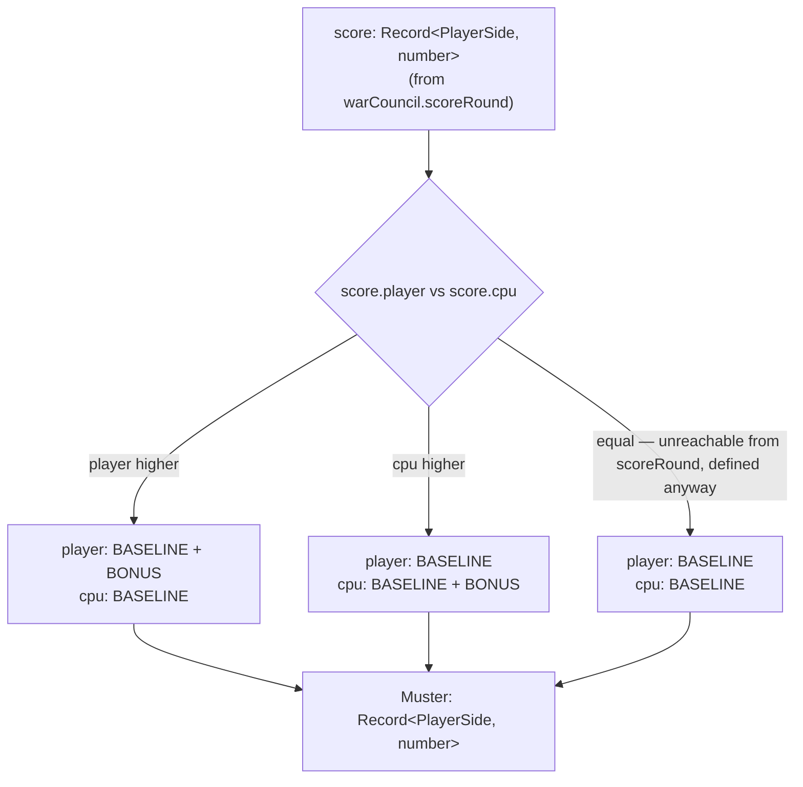

# Plan: Muster conversion — War Council score band to move budget

Plan folder: `.claude/contract/SCRUM-22-muster-conversion/`
Execution status: see `tasks.md` in this folder.

---

## Part 1 — Alignment

### Task reference

**Jira issue:** [SCRUM-22](https://amazerbeam.atlassian.net/browse/SCRUM-22) — "Muster conversion — War Council score band to move budget"

**Acceptance criteria (verbatim from the ticket):**

1. A pure function converts a War Council score band into a Muster: a fixed baseline move count for both sides (illustrative: 7, per `skirmish-board-replacement.md`), plus bonus moves for the round's winner only.
2. The losing side's Muster is never zero — the baseline floor applies regardless of how lopsided the War Council round was (this is the specific fix for the old Hex board's 6–0 ambush problem; do not let bonus-move logic override the floor).
3. The function is pure (same score band always produces the same Muster) and has no React import or DOM access.
4. Unit tests cover the full scenario table from `hybrid-concept.md` (four ambush intensities, three pitched-battle margins) confirming both sides' Muster values for each.

**Scope boundaries (verbatim):** In scope — the conversion function only. Out of scope — how the Muster is spent, whether Treasure 7s grant extra moves (open question in `hybrid-concept.md`, not resolved by this ticket — implement the end-of-round band only).

**Dependencies & Risks (verbatim):** Depends on the battle module scaffold ticket; feeds The Clash turn engine, the battle loop orchestrator, and the Muster/Clash HUD. The baseline (7) and bonus values are illustrative — implement as named, easily-retuned constants.

**Dependency status:** SCRUM-19 (battle module scaffold) is complete — `src/vanguard/index.ts` already exists as a real barrel (SCRUM-21 replaced its original `unknown` placeholder), and `BattlePhase.MusterConversion` already exists in `src/battle/battlePhase.ts` naming the phase this ticket's output feeds. SCRUM-21 (Vanguard board engine) is also complete and is the closest sibling pattern: a pure `src/vanguard/` tree with a `config.ts` "Configuration vs. Constants" split, a `types.ts` holding every shared shape, and an `index.ts` barrel this plan extends rather than replaces.

### Restated goal

Add one pure function to `src/vanguard/` that turns a War Council round's score (the `Record<PlayerSide, number>` `scoreRound` in `src/warCouncil/` already produces) into that round's Muster — each side's move budget for The Clash. Both sides always receive a fixed baseline; only the side with the higher score additionally receives a bonus. Because the baseline is unconditional, the losing side's Muster can never be zero, which is the concrete fix for the ambush problem `concept-critique.md` Problem 1 documents against the old Hex board. This ticket implements the conversion function and its configuration only — no wiring into `BattleState`, no spending logic, no Treasure-7 handling.

### In scope

- A `Muster` type: each side's move budget for the round.
- A pure function, `convertScoreToMuster`, taking a War Council score band and returning a `Muster` — baseline for both sides, bonus added only for the side with the strictly higher score.
- Two named, retunable configuration constants: `MUSTER_BASELINE` and `MUSTER_BONUS`.
- Unit tests covering the full seven-row scenario table from `hybrid-concept.md` (the four ambush trick-splits and the three pitched-battle trick-splits), an explicit non-zero-floor assertion, and a tied-score edge case for well-defined purity even though `scoreRound` can never actually produce one.
- Exporting the new function, type, and config constants from `src/vanguard/index.ts`.

### Explicitly out of scope

- **Wiring the Muster into `BattleState` or a battle orchestrator.** No ticket read so far defines the orchestrator's shape; `BattleState` still holds only `phase`, `warCouncil`, `vanguard` per SCRUM-19, and this ticket does not extend it.
- **Spending the Muster** — Expand/Overwrite/Reinforce cost accounting already exists in `src/vanguard/config.ts` and the action modules (SCRUM-21); nothing here changes how a Muster is drawn down during The Clash.
- **Turn alternation or "who opens The Clash."** Untouched — a future Clash-orchestrator ticket's job, same boundary SCRUM-21 already drew around itself.
- **Treasure 7s feeding the Muster.** Explicitly named out of scope by the ticket; `hybrid-concept.md` lists this as its own open question, unresolved here.
- **Any UI or HUD surface.** The ticket names "the Muster/Clash HUD" only as a future consumer, not a deliverable of this ticket.
- **Any change to `tricksToPoints` or `scoreRound`** in `src/warCouncil/` — this ticket's function consumes their existing output verbatim; it does not alter how tricks become points.

### Pattern Reference

- `.docs/design/skirmish-board-replacement.md` → "Muster and turn order" — the source of AC1's baseline-plus-bonus shape and the "illustrative: 7" baseline figure, and the explicit statement that "a side that loses the War Council still gets its full baseline Muster, it just doesn't get the bonus."
- `.docs/design/hybrid-concept.md` → "The scenario table" and "Why the move economy is sound" — the seven-row scenario table (four ambush trick-splits mapping to the same 6/0 score pair, three pitched-battle trick-splits at 1/6, 2/6, 3/6) this plan's tests transcribe directly, and the explicit statement that under the current design "both sides always get their baseline Muster regardless of the War Council's result."
- `.docs/design/concept-critique.md` → "Problem 1 — the ambush is very likely to end the battle outright" — the failure mode AC2's non-zero floor exists to prevent; cited, not re-derived.
- `src/warCouncil/scoring.ts` — `tricksToPoints` and `scoreRound`, whose `Record<PlayerSide, number>` output shape is this ticket's function's input shape, reused verbatim rather than redefined.
- `.claude/contract/SCRUM-21-vanguard-board-engine/plan.md` and its `tasks.md` — the closest sibling pattern: the `config.ts` "Configuration" vs. "Constants" comment-block split this plan extends, the `types.ts` single-file-for-shared-shapes convention, and the barrel-export style in `src/vanguard/index.ts`.
- `CLAUDE.md` → "Game naming" — confirms Muster is a concept "within a round of the Vanguard," which is why this function lives in `src/vanguard/` rather than a new folder (the same reading SCRUM-19's plan already committed to for this exact ticket).

### Constraints flagged on the brief

- The function must be pure with no React import or DOM access (AC3) — already enforced for `src/vanguard/**` by the ESLint boundary SCRUM-19 established (confirmed live in `eslint.config.js:24-58`); this plan adds no new ESLint config, only complies with the existing one.
- The baseline and bonus must be named, easily-retuned constants, not inlined literals (Dependencies & Risks, verbatim).
- Bonus logic must never override the floor (AC2, verbatim) — the design in Approach below makes this true by construction, not by a runtime guard, and a test asserts it explicitly.
- Tests must cover the full scenario table "four ambush intensities, three pitched-battle margins" (AC4, verbatim) — all seven trick-split rows, not just the four distinct score pairs they collapse to.

### Assumptions made

- **The function's input is the already-computed score (`Record<PlayerSide, number>`), not raw trick counts.** The ticket title and AC1 both say "War Council score band," and `src/warCouncil/scoring.ts` already produces exactly this shape via `scoreRound`. Tests still exercise the full trick-level scenario table by calling `scoreRound` first, matching how a real caller (the future battle orchestrator) will have a score already in hand at the point it needs a Muster.
- **The bonus is a flat amount for the round's winner, not scaled to the score margin.** AC1 says "plus bonus moves for the round's winner only" with no mention of scaling by how much the round was won by, and `skirmish-board-replacement.md`'s own description ("plus bonus moves for winning that round's War Council") reads the same way. This means the four ambush trick-splits (which all collapse to the same 6/0 score pair) and the three pitched-battle splits produce only two distinct Muster outcomes each side of the winner/loser line — AC4's full-table test coverage is still worth writing verbatim, since it's a regression guard confirming that trick-level detail genuinely washes out at the score-band boundary, not an assumption that it might not.
- **A tied score band grants the bonus to neither side.** `scoreRound` can never actually produce a tie — tricks always split to 13 and no split yields equal points on both sides (verified by exhaustive check across all fourteen possible trick splits, 0–13 through 13–0, during planning). But the function's own parameter type is a generic `Record<PlayerSide, number>`, so a caller could pass one; "neither side wins, neither gets the bonus" is the natural reading of "winner only" and keeps the function total and well-defined rather than throwing or guessing. Flagged for developer sign-off since no source document states this case.
- **`MUSTER_BASELINE = 7` is taken directly from the design doc's own illustrative figure**, per this project's standing guidance that a documented default with its reasoning gets taken and reported, not treated as a blocking question.
- **`MUSTER_BONUS = 3` is invented, with no documented figure anywhere in the design corpus to transcribe.** `hybrid-concept.md`'s "Open questions" section and `skirmish-board-replacement.md`'s "Open, not yet decided" section both list "the 7-move baseline Muster" among numbers still to be set, but neither ever proposes a bonus figure — the whole concept of a separate bonus-on-top-of-baseline is new to `skirmish-board-replacement.md` and post-dates every numeric example in `hybrid-concept.md`. `3` is chosen only so the conversion function is concretely testable: roughly 40% of the baseline, enough that winning is worth something without turning a single War Council round into a 2:1 move advantage. This is the least-grounded number in the plan and needs the developer's explicit attention — see Risks and judgement calls.
- **`Muster` is a new named type (`Readonly<Record<PlayerSide, number>>`), not a bare `Record` return type.** `scoreRound`'s own return type is an unaliased `Record<PlayerSide, number>`, but the project already names similarly-shaped concepts elsewhere (`VanguardActionResult`, `IllegalActionReason`) once they're a first-class concept a signature wants to advertise by name; a future orchestrator reading `BattleState` will want to say "this field is a `Muster`," not "this field is a `Record<PlayerSide, number>` that happens to mean Muster."

### Config and persisted-shape audit

- **`MUSTER_BASELINE`, `MUSTER_BONUS`, `convertScoreToMuster`, and `Muster` are all new names, not renames.** Grepped `src/` for `MUSTER_BASELINE|MUSTER_BONUS|convertScoreToMuster|\bMuster\b` before writing this plan — the only hit is `src/battle/battlePhase.ts:3`, the unrelated string literal `'musterConversion'` (the `BattlePhase.MusterConversion` phase name, a different identifier entirely, case-sensitive match on `\bMuster\b` does not match `musterConversion`). Zero collisions.
- **No persisted or stored shape exists yet.** Grepped `src/` for `localStorage|sessionStorage` — zero hits anywhere. Nothing this ticket adds is persisted, so there is no migration concern.
- **No type change, only new types.** `Muster` is newly introduced; `convertScoreToMuster`'s parameter type (`Readonly<Record<PlayerSide, number>>`) matches `scoreRound`'s existing parameter shape for `tricksWon` verbatim — no narrowing, widening, or restructuring of anything that exists today.
- **No existing consumer of any changed constant or predicate** — this ticket only adds; `scoreRound` and `tricksToPoints` are read, not modified, and every reader of them today (their own tests) is unaffected.
- **Names align across the one chain this ticket creates:** `MUSTER_BASELINE`/`MUSTER_BONUS` (config.ts) ↔ `convertScoreToMuster`'s implementation (musterConversion.ts) ↔ the `Muster` type (types.ts) ↔ the barrel re-export (index.ts) ↔ the test file. All four production files are written in the same phase in `tasks.md`, so they cannot drift apart within this ticket.
- **Architectural boundary already established, re-confirmed rather than re-created.** `eslint.config.js:24-58` already scopes the `no-restricted-imports`/`no-restricted-globals` pure-core override to `src/vanguard/**`, which covers every file this plan adds. This plan adds no new ESLint config; Final verification re-runs the boundary grep from `.claude/workflow/web-project.md` to confirm the new file complies.

---

## Part 2 — Technical design

### Approach

This ticket adds one small pure module to the existing `src/vanguard/` tree, following the same three-artifact shape SCRUM-21 already established there: a shared type in `types.ts`, retunable numbers in `config.ts`, and the logic itself in its own file, all re-exported from `index.ts`.

**The floor is structural, not a runtime guard.** AC2's requirement — "do not let bonus-move logic override the floor" — is satisfied by never subtracting from or conditioning the baseline at all: every side's Muster starts as `MUSTER_BASELINE` unconditionally, and the winner's side has `MUSTER_BONUS` *added* on top. There is no code path in which a side's Muster can be computed as less than `MUSTER_BASELINE`, so the floor cannot be "overridden" by a future edit to the winner-detection logic without also deleting the baseline term itself — a much more visible change. This is the same "prove it by construction, not by a check" instinct already used for `VanguardBoard`'s immutable action results (SCRUM-21): the invariant lives in the shape of the computation, not in a defensive `Math.max(muster, MUSTER_BASELINE)` clamp that would silently paper over a logic error instead of surfacing it.

**Winner detection is a plain three-way comparison, not a call into `src/warCouncil/`.** `scoreRound`'s output already tells the whole story — whichever side has the strictly higher number won that round — so `convertScoreToMuster` compares the two supplied scores directly rather than importing any War Council round-state logic. This keeps the function's contract narrow: it converts a score band to a Muster, and nothing about *how* that score was produced (trick counts, ability resolutions, dealer) is its concern. The tie branch (see Assumptions) exists purely so the function is total over its declared input type, not because a tie is reachable from `scoreRound` today.

**Configuration follows the existing `config.ts` taxonomy exactly.** `MUSTER_BASELINE` and `MUSTER_BONUS` join `BOARD_SIZE`, `STARTING_CLUSTER_SIZE`, and `DEFENSE_CELLS` under a `// --- Configuration ---` comment block — both are "the right number here is a judgement call, not a fact" values per `engineering-standards.md`'s taxonomy, not fixed rule constants like `EXPAND_RANGE`. They get their own comment header (rather than folding into the existing SCRUM-21 block) so a reader can trace which ticket's plan is the source of reasoning for which number, matching how the existing block already cites `plan.md` by name.

**Tests transcribe the design doc's own scenario table rather than only the score-band boundary.** AC4 explicitly asks for "four ambush intensities, three pitched-battle margins" — seven rows, not four. Because `convertScoreToMuster` only ever sees a score, not tricks, the four ambush rows will assert identical Muster values; the test file states this directly rather than treating it as redundancy to be trimmed, since the redundancy is itself the thing worth confirming (that trick-level detail is genuinely irrelevant once the score band is fixed — a claim this plan makes in Assumptions and that a test should therefore verify, not just state).

### Skills to invoke during execution

- `react-frontend` — owns everything under `src/`, including the `as const`/no-`enum` requirement (not needed by this ticket's shapes, but governs anything nearby), the `Readonly<Record<...>>` typing convention this plan reuses from `scoreRound`, the configuration-vs-constants taxonomy this plan's `config.ts` addition follows, the 400-line file budget, and the "pure logic tested without a renderer" testing posture every test in this plan follows.
- Read on demand: `.claude/workflow/web-project.md` (paths, runners, the correctness-traps section — string-bound config-key names are the trap most relevant here) and `.claude/rules/README.md` (scanned; currently empty, no rule file applies).
- No developer override — only one skill matched (`react-frontend`); consistent with the precedent in `SCRUM-19-battle-module-scaffold/plan.md` and `SCRUM-21-vanguard-board-engine/plan.md`, a single-option match has nothing to put to a `multiSelect` `AskUserQuestion`, so the developer confirms the plan as a whole at the Step 3 gate instead.

### Diagram



### Data shapes

#### `src/vanguard/types.ts` — addition

```ts
export type Muster = Readonly<Record<PlayerSide, number>>
```

#### `src/vanguard/config.ts` — addition

```ts
// --- Configuration: Muster baseline and bonus for SCRUM-22, illustrative only —
// retunable without a design change (see plan.md Part 1 -> Risks and judgement calls) ---
export const MUSTER_BASELINE = 7
export const MUSTER_BONUS = 3
```

`MUSTER_BASELINE`'s unit is moves-per-round-per-side; `MUSTER_BONUS`'s unit is additional moves-per-round for the round's winner only. Both are developer-owned tuning values — `MUSTER_BASELINE = 7` is taken from `skirmish-board-replacement.md`'s own illustrative figure; `MUSTER_BONUS = 3` has no source-document figure and is this plan's own placeholder (see Assumptions and Risks).

#### `src/vanguard/musterConversion.ts` — new file

```ts
import { PlayerSide } from '../warCouncil'
import { MUSTER_BASELINE, MUSTER_BONUS } from './config'
import type { Muster } from './types'

// Both sides always receive MUSTER_BASELINE; only the round's winner adds
// MUSTER_BONUS on top, so the losing side's Muster can never fall below the
// floor no matter how lopsided the round was (concept-critique.md Problem 1).
export function convertScoreToMuster(score: Readonly<Record<PlayerSide, number>>): Muster {
  const winner =
    score[PlayerSide.Player] > score[PlayerSide.Cpu]
      ? PlayerSide.Player
      : score[PlayerSide.Cpu] > score[PlayerSide.Player]
        ? PlayerSide.Cpu
        : undefined

  return {
    [PlayerSide.Player]: MUSTER_BASELINE + (winner === PlayerSide.Player ? MUSTER_BONUS : 0),
    [PlayerSide.Cpu]: MUSTER_BASELINE + (winner === PlayerSide.Cpu ? MUSTER_BONUS : 0),
  }
}
```

`score` mirrors `scoreRound`'s own `tricksWon` parameter typing (`Readonly<Record<PlayerSide, number>>`) in `src/warCouncil/scoring.ts`, for signature consistency across the two engines' score-adjacent functions. Return type `Muster` (new — see `types.ts` addition above).

#### `src/vanguard/index.ts` — additions to the existing barrel

```ts
export type { Muster } from './types'
export { MUSTER_BASELINE, MUSTER_BONUS } from './config'
export { convertScoreToMuster } from './musterConversion'
```

No `package.json` script or dependency change. No `BattleState` change — out of scope per Part 1.

### Runtime quality notes

- **Purity and adjudication:** `convertScoreToMuster` is the only logic this ticket adds, and it is a pure comparison-and-arithmetic function with no side effects — enforced by the existing `no-restricted-imports`/`no-restricted-globals` ESLint boundary on `src/vanguard/**`. Both tunables (`MUSTER_BASELINE`, `MUSTER_BONUS`) are read from `config.ts`, never inlined.
- **Effects, mount and teardown:** None — no component, no effect, no subscription; this ticket adds no runtime surface beyond a plain function call.
- **Hot-path cost:** Not applicable — the function runs once per War Council round (at most a few dozen times in a full battle), does two number comparisons and two additions, and allocates one small object. No memoisation is warranted or added.
- **Determinism and numeric safety:** Fully deterministic — same score band always produces the same Muster (AC3), no `Math.random()`, no division anywhere in the computation, so no `NaN` path exists. The tie branch (Assumptions) makes the function total over its declared input type rather than leaving an implicit "this never happens" gap.
- **Error paths:** The function never throws and has no async surface. It does not validate that `score.player`/`score.cpu` are within `scoreRound`'s actual output range (0, 1, 2, 3, or 6) — its only caller today is a future orchestrator that will always supply a real `scoreRound` result, and adding range validation for an input shape the type system and the sole real producer already constrain would be defending against a case that cannot occur through any code path in this codebase, not a system boundary.

### Risks and judgement calls

- **`MUSTER_BONUS = 3` is invented outright — no design document proposes any figure.** Unlike `MUSTER_BASELINE`, which transcribes `skirmish-board-replacement.md`'s own "illustrative: 7," the bonus concept itself is new to that document and nothing in the design corpus ever names a number for it. `3` was chosen so AC4's tests have concrete numbers to assert against; it has no other justification and is the single most likely number in this plan to be wrong. Flagging for explicit developer attention, though per this project's standing guidance on tuning values during early prototyping, the plan proceeds with it now and the developer can retune post-playtest without a design change (it's a named `config.ts` constant, not an inlined literal).
- **Winner-take-bonus is flat, not scaled to score margin.** An ambush (6–0) and the tightest pitched battle (3–6) produce the identical two Muster values under this design — see Assumptions. If the developer wants the bonus to scale with how decisively the round was won (closer to `hybrid-concept.md`'s Fill 2 idea of differentiating the two 6-point routes), that's a different function shape and should be red-lined now rather than discovered after `tasks.md` is written.
- **The tied-score branch (both sides get baseline only) is this plan's own invention, not sourced from any document**, since no design text ever considers the case (it cannot arise from `scoreRound`). Low-risk since it's unreachable in practice today, but worth a sentence of developer sign-off since a later change to the War Council's scoring could conceivably make ties reachable.
- **No dependency, config *key*, or behaviour here needs the developer's judgement to play the app** — there is no app-visible surface in this ticket; only the two tunable *values* above are the developer's to sanity-check.
