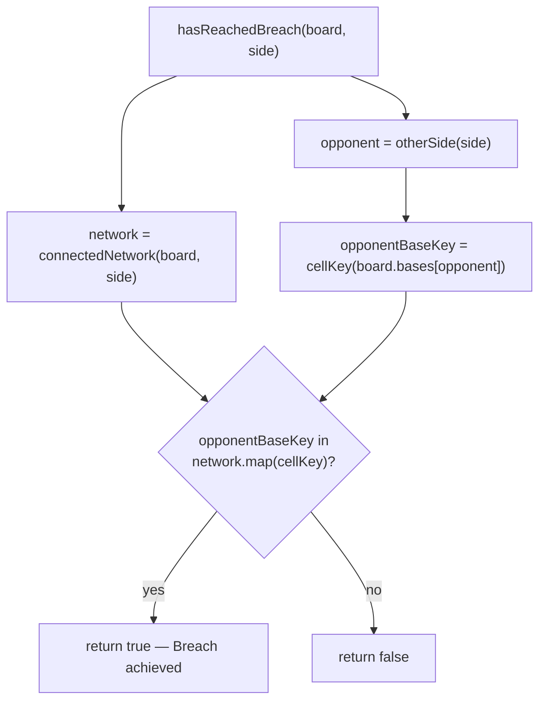

# Plan: The Breach — win-condition detection

Plan folder: `.claude/contract/SCRUM-23-breach-win-condition/`
Execution status: see `tasks.md` in this folder.

---

## Part 1 — Alignment

### Task reference

Jira **SCRUM-23** — "The Breach — win-condition detection", child of epic **SCRUM-18** ("Prototype: single-city War Council → Vanguard battle loop").

> **Problem Statement:** The Breach is the epic's win condition, and it's specifically stricter than the Expand action's own gap rule — a gap that's legal for scouting is *not* legal for winning. Getting this wrong either lets a scouted-but-unfilled path falsely win, or fails to detect a genuine win.
>
> **User Story:** As a player, I want the game to detect the instant my tokens form an unbroken, gap-free chain from my base to the opponent's base, so that reaching the Breach ends the battle immediately and fairly.
>
> **Acceptance Criteria:**
> 1. A pure function takes a Vanguard board state and a side, and returns whether that side has an unbroken chain of its own adjacent tokens connecting its base to the opponent's base.
> 2. A path that includes any Expand-style 1-cell gap does **not** count — only fully adjacent, solid chains satisfy the Breach.
> 3. The function correctly detects a Breach on a minimal hand-built board fixture and correctly rejects a chain that has a single gap cell in it (regression test for Acceptance Criterion 2).
> 4. The function is pure, headless-testable, no React import or DOM access.
> 5. Unit tests cover: no chain exists, a solid chain exists, a gapped near-chain is correctly rejected, and a chain that only the opponent (not the checked side) holds is correctly rejected.
>
> **Scope Boundaries — In scope:** connectivity/reachability check only. **Out of scope:** what happens if neither side ever reaches the Breach (explicitly out of scope for the whole epic — no stalemate/tiebreak rule).
>
> **Dependencies & Risks:** Depends on the Vanguard board engine ticket (SCRUM-21, already built). Low risk — standard graph-reachability once the adjacency model exists; the subtlety is AC2 (gap exclusion), most likely to be missed in a naive flood-fill.
>
> **Design Assets:** N/A

Cross-referenced against `.docs/design/skirmish-board-replacement.md` → "The Breach — win condition": *"A side achieves the Breach when it holds an unbroken chain of adjacent tokens connecting its own base all the way to the opponent's base. The gap-of-1 rule that's legal for expansion does not count toward this."*

### Restated goal

Add one pure function to the already-built `src/vanguard/` board engine that answers a single yes/no question: given a `VanguardBoard` and a `PlayerSide`, has that side built a fully-adjacent, gap-free chain of its own tokens all the way from its own base to the opponent's base? This is a read-only query over existing state — it does not decide what happens when the answer is `true`, does not run during a Clash orchestration loop (none exists yet), and does not touch React or the DOM.

### In scope

- A pure function `hasReachedBreach(board, side): boolean` in `src/vanguard/`.
- Reuse of the existing `connectedNetwork` reachability query (already adjacency-only, already excludes Expand's 1-cell gap) rather than a new flood-fill.
- Export from `src/vanguard/index.ts` alongside the module's other public exports.
- Unit tests for all four scenarios AC5 names, using a minimal hand-built fixture per AC3.

### Explicitly out of scope

- Anything that *acts* on a detected Breach — ending the battle, declaring a winner at the `BattleState` level, or any UI/HUD surface. `.docs/implementation/vanguard.md` → Deferred already names this as a future Clash-orchestrator ticket's job.
- Stalemate/tiebreak detection (neither side ever reaching the Breach) — explicitly out of scope for the whole epic per the ticket's own Scope Boundaries and `skirmish-board-replacement.md`'s "Open, not yet decided".
- Turn order, Muster spending/tracking, or CPU move selection — all separately deferred in `vanguard.md`, untouched by this ticket.
- Any change to `connectedNetwork`, `hexBfs`, or any existing Clash action (`applyExpand`/`applyOverwrite`/`applyReinforce`) — this ticket only adds a new read-only query on top of them.
- Base-capture/base-loss *consequences* beyond what `connectedNetwork` already does (returning `[]` when a side no longer owns its base cell) — this ticket consumes that existing behaviour, it does not change it.

### Pattern Reference

- `src/vanguard/network.ts` — `connectedNetwork(board, side)` is the direct pattern: it already runs `hexBfs` from `board.bases[side]`, gated to cells the side owns, so it is already a solid (gap-free) adjacency-chain reachability query and never leapfrogs the way Expand does. The Breach check is a membership test against this same result, not a new traversal.
- `src/vanguard/musterConversion.ts` — the closest sibling in size and shape: a small, single-purpose pure function file with its own `__tests__` spec, no new types, no new config. This ticket follows the same shape.
- `src/warCouncil/types.ts` → `otherSide(side)` — the existing, single-source-of-truth "flip the side" helper, already imported into `src/vanguard/` elsewhere (`createBoard.ts`, `musterConversion.ts` import `PlayerSide` the same way). Reused here rather than re-deriving "the other side" inline.
- `src/vanguard/__tests__/network.test.ts` and `expand.test.ts` — the test-shape pattern to follow: `describe`/`it`, hand-built cell maps, `PlayerSide` from `../../warCouncil`.

### Constraints flagged on the brief

- **AC2 is the one that must not be gotten wrong**: a chain that would be legal for Expand's scouting (up to a 1-cell gap) must **not** register as a Breach. The ticket itself calls out that a naive flood-fill is the most likely place to get this wrong.
- **Purity**: AC4 requires no React import, no DOM access — this project's existing ESLint pure-core boundary already scopes `src/vanguard/**/*.{ts,tsx}` (confirmed in `eslint.config.js` line 24), so placing the new file inside `src/vanguard/` gets this enforced for free, no new ESLint config needed.
- **Headless-testable**: the function must be a plain value-in/value-out call, no renderer needed — matches this project's existing pure-logic testing convention (Vitest, `environment: 'node'`).

### Assumptions made

- **Module placement: `src/vanguard/breach.ts`, not a new folder.** The ticket's subject matter (win-condition detection over a `VanguardBoard`) is squarely inside the existing `src/vanguard/` module per `CLAUDE.md` → Game naming ("The Breach — a solid base-to-base connection — the win condition" is explicitly named as living "within a round of the Vanguard"), and `vanguard.md`'s Responsibility section already lists "The Breach" as this module's territory, just not yet built. *Confirmed by the codebase, not a guess.*
- **Function name: `hasReachedBreach(board, side)`.** No name was supplied in the ticket. Chosen to read naturally at a call site (`if (hasReachedBreach(board, PlayerSide.Player))`) and to match the existing verb-first, boolean-returning naming style used nowhere else yet in this module but consistent with `isWithinBoard` in `hexGrid.ts`.
- **Implementation reuses `connectedNetwork` rather than a new BFS.** `connectedNetwork` already performs exactly the "unbroken chain of adjacent tokens from base" traversal the Breach needs — it uses `hexNeighbors` (physical adjacency only), never the Expand action's 2-range leapfrog. Reusing it is both DRY and structurally avoids AC2's naive-flood-fill trap, rather than avoiding it by discipline in a second hand-written traversal.
- **The Breach check is a network-membership test, not a new traversal.** `hasReachedBreach(board, side)` = "does `connectedNetwork(board, side)` include the coordinate at `board.bases[otherSide(side)]`?" This is O(network size) per call, matching `connectedNetwork`'s own already-accepted recompute-from-scratch performance posture (`vanguard.md`: "this is a discrete, turn-based action, not a hot path").
- **`otherSide` is imported from `../warCouncil`, not re-derived.** `src/vanguard/network.ts` and `createBoard.ts` already import `PlayerSide` from `../warCouncil` for the same single-source-of-truth reason stated in `vanguard.md`'s Rules & invariants; `otherSide` is exported from that same module (`src/warCouncil/index.ts`) and is the existing "flip the side" primitive used across the codebase (`src/warCouncil/deal.ts`).
- **Test fixtures are hand-built directly as `VanguardBoard` object literals, not via `__tests__/testBoard.ts`'s `boardWith()`.** `boardWith()` hardcodes `size: 5` and bases 8 hex-spaces apart (`{0,0}`/`{4,4}`), which would force every fixture in this ticket to an 8-cell chain — the opposite of AC3's "minimal hand-built board fixture." This ticket's tests build their own small `VanguardBoard` literals (`size: 3`, bases 2 hex-spaces apart) local to `breach.test.ts`, following the same literal-cell-map style `boardWith()`'s callers already use, just without going through that specific helper. *Confirmed judgement call, not a change to `testBoard.ts`.*
- **No new `IllegalActionReason` or result-shape type.** Unlike the three Clash actions, a query has no legality to reject — it returns a plain `boolean`, matching AC1's stated return type exactly. No `VanguardActionResult`-style wrapper is introduced.

### Config and persisted-shape audit

- **No configuration key is added, renamed, or removed.** This ticket introduces one new function and zero new tunables — grep confirms zero existing hits for `hasReachedBreach` anywhere under `src/` (checked; the name is new).
- **No persisted or stored shape exists in this project yet** (confirmed in `vanguard.md` → Deferred: "Persisting or serialising `VanguardBoard` — nothing here writes to storage"), so there is nothing to migrate.
- **No type is renamed, retyped, or widened.** `VanguardBoard`, `HexCoord`, `PlayerSide`, `CellKey` are all consumed exactly as `network.ts` already consumes them — read-only, no edits to `types.ts`.
- **The one exported name this ticket adds (`hasReachedBreach`) is new** — zero pre-existing consumers to update, confirmed by grep across `src/` returning no hits for "Breach" in any casing before this plan.
- **Names align across the chain**: the function lives in `src/vanguard/breach.ts`, is re-exported by `src/vanguard/index.ts` next to its sibling exports (`connectedNetwork`, `convertScoreToMuster`), and its test lives at `src/vanguard/__tests__/breach.test.ts` — matching the one-module-one-file-one-test-file pattern every other file in this module already follows.
- **Architectural boundary check**: `src/vanguard/**/*.{ts,tsx}` is already covered by the pure-core ESLint override (`eslint.config.js` line 24) — the new file needs no new boundary and trips no `no-restricted-imports`/`no-restricted-globals` rule, since it imports only from `./hexGrid`, `./network`, `./types`, and `../warCouncil`, all of which are already pure.

---

## Part 2 — Technical design

### Approach

The function is a thin, one-line-of-logic wrapper over machinery that already exists and is already correct for this exact problem. `connectedNetwork(board, side)` (`src/vanguard/network.ts`) runs a breadth-first search from `board.bases[side]`, using `hexBfs`'s `canEnter` predicate to admit only cells that are a `TokenCell` owned by `side`, and `hexBfs` only ever steps to a coordinate's *physical* `hexNeighbors` — the six adjacent hexes, never a 2-range leapfrog. That is precisely "an unbroken chain of adjacent tokens" per the design doc's own wording, and it structurally cannot include an Expand-style gap, because the traversal has no leapfrog step to exploit one. The Breach question therefore reduces to: is the opponent's base cell a member of that already-correct reachability set?

`hasReachedBreach(board, side)` computes `otherSide(side)` (imported from `../warCouncil`, the existing single-source-of-truth "flip the side" helper), looks up that side's base coordinate via `board.bases[otherSide(side)]`, and checks whether `cellKey` of that coordinate appears among the `cellKey`s of `connectedNetwork(board, side)`. If the checked side no longer owns its *own* base, `connectedNetwork` already returns `[]` (documented, tested degenerate case in `network.test.ts`) — `hasReachedBreach` inherits that behaviour for free and correctly reports no Breach, with no special-cased branch needed.

This is deliberately **not** a new BFS or flood-fill. Writing a second traversal — even one that "should" behave the same way — is exactly the shape of defect the ticket's own Dependencies & Risks section warns about ("the only subtlety is Acceptance Criterion 2, which is also the thing most likely to be missed in a naive flood-fill implementation"). Delegating to `connectedNetwork` means AC2's gap-exclusion is guaranteed by the one BFS this module already trusts and already tests, not by a second implementation that has to independently get the same property right.

The whole function is pure: it takes `VanguardBoard` and `PlayerSide` by value, reads only `board.bases` and calls `connectedNetwork` (itself pure), and returns a `boolean`. No React import, no DOM global, no mutation — it lives inside `src/vanguard/`, which is already covered by this project's pure-core ESLint boundary, so purity is enforced by the existing lint rule as well as by design.

### Skills to invoke during execution

- `react-frontend` — governs everything under `src/`, including this pure-TypeScript module: file layout (one module, one `__tests__` file), strict TypeScript, the "no hard-coded tunable" rule (not triggered here — no new tunable), and the Vitest testing conventions (`describe`/`it`, pure logic tested without a renderer, specs under `src/**/__tests__/`).
- No other skill applies — this is a single pure-TypeScript function with no Jira-workflow, design-document, or implementation-doc-writing work of its own (the `.docs/implementation/vanguard.md` update is a separate, standing responsibility of the `implementation-doc-writer` skill, triggered after `/fb-apply` lands, not part of this plan).

Rules read: `.claude/rules/README.md` — folder is empty, no topic-matched rule file exists yet, confirmed by `Glob .claude/rules/*.md` returning only `README.md`.

Always read: `.claude/workflow/web-project.md` (verification commands, correctness traps, pure-core boundary confirmation).

### Diagram



### Data shapes

#### New export

```ts
// src/vanguard/breach.ts
import { otherSide } from '../warCouncil'
import type { PlayerSide } from '../warCouncil'
import { cellKey } from './hexGrid'
import { connectedNetwork } from './network'
import type { VanguardBoard } from './types'

export function hasReachedBreach(board: VanguardBoard, side: PlayerSide): boolean
```

No new `type`, `interface`, action kind, reason code, or configuration key. `VanguardBoard`, `PlayerSide`, `HexCoord`, `CellKey` are all consumed as already defined in `src/vanguard/types.ts` and `src/warCouncil/types.ts` — no field, no shape, and no persisted structure changes. `src/vanguard/index.ts` gains one re-export line:

```ts
export { hasReachedBreach } from './breach'
```

No `package.json`, `tsconfig.json`, `vite.config.ts`, or `eslint.config.js` change — the new file is already inside the ESLint pure-core glob and the existing Vitest `test.include` glob.

### Runtime quality notes

- **Purity and adjudication:** The entire function is pure — no side effects, no DOM, no React. It does not decide what happens on a Breach (ending the battle, declaring a winner); it only answers the reachability question, matching the ticket's explicit "connectivity/reachability check only" scope boundary. No tunable is introduced, so there is nothing to read from `config.ts`.
- **Effects, mount and teardown:** Not applicable — no component, no hook, no effect, no listener, no timer. This module has no React surface at all.
- **Hot-path cost:** Not a hot path — `vanguard.md` already establishes that `connectedNetwork` is a discrete, turn-based, recompute-from-scratch query, and `hasReachedBreach` adds only a single `.some()` scan over that same already-computed array (at most `board.size * board.size` cells in the worst case, bounded by the board itself). No memoisation is warranted or added.
- **Determinism and numeric safety:** Fully deterministic — no randomness anywhere in the call graph (`connectedNetwork`, `hexBfs`, and `hasReachedBreach` itself are all deterministic given `board` and `side`). No division anywhere in this function, so no `NaN`/zero-divisor risk to guard.
- **Error paths:** The function is total over its declared parameter types — every `VanguardBoard`/`PlayerSide` pair produces a `boolean`, never a thrown error or an undefined return. There is no invalid input to reject (unlike the three Clash actions, this is a query, not a state-mutating action, so there is no `IllegalActionReason`-style rejection to design). No new async surface is introduced.

### Risks and judgement calls

- **Function name (`hasReachedBreach`) is invented, not specified.** The ticket names no identifier. If the developer wants a different name (e.g. `checkBreach`, `hasBreach`) for consistency with a naming scheme not yet visible in this module, that's a one-line rename to red-line now rather than after tasks.md is written.
- **Reliance on `connectedNetwork`'s existing degenerate-case behaviour (returns `[]` when a side has lost its own base) is a design decision, not a re-derivation.** This plan treats "a side that has lost its base cannot have a Breach" as the correct, already-established contract (documented in `network.test.ts` and `vanguard.md`), rather than opening that question fresh. Worth a sanity check: is "lost your base ⇒ cannot Breach even if your network is otherwise huge" the intended rule, or should losing a base be a separate, harsher loss condition? The ticket's own Scope Boundaries mark base-loss *consequences* as out of scope for this ticket specifically, so this plan takes the conservative reading (inherit the existing behaviour, decide nothing new) — flagging it in case the developer's intent differs.
- **Test fixtures deliberately bypass `testBoard.ts`'s `boardWith()` helper** (see Assumptions) to get a genuinely minimal fixture per AC3. This is a one-off local fixture pattern inside `breach.test.ts` rather than a change to the shared helper — worth confirming the developer doesn't instead want `boardWith()` itself extended to accept configurable bases/size, which would be a slightly larger, more reusable change than this ticket's scope implies.
- **No tuning value is introduced by this ticket** — nothing to route to configuration or developer sign-off on that front.
- **No dependency, browser behaviour, or visual/copy judgement is involved** — this is a pure function with no UI surface, so there is nothing here that requires running the app to judge.
