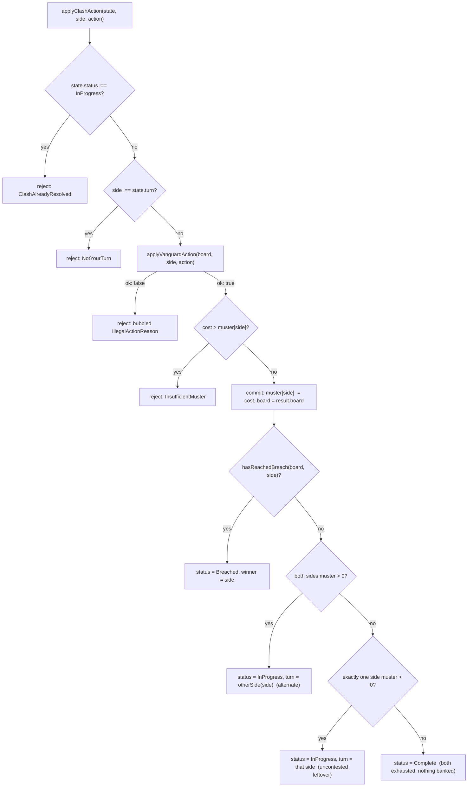

# Plan: The Clash — turn engine (alternating spend, uncontested leftover)

Plan folder: `.claude/contract/SCRUM-24-the-clash-turn-engine/`
Execution status: see `tasks.md` in this folder.

---

## Part 1 — Alignment

### Task reference

**Jira issue:** [SCRUM-24](https://amazerbeam.atlassian.net/browse/SCRUM-24) — "The Clash — turn engine (alternating spend, uncontested leftover)", child of epic SCRUM-18.

**Acceptance criteria (verbatim from the ticket):**

1. Both sides alternate exactly one action (Expand/Overwrite/Reinforce) at a time until one side's Muster is exhausted.
2. Once one side is out of moves, the other side's remaining moves are spent consecutively, uncontested — no further alternation once one side is out.
3. Which side opens The Clash follows the stated default: CPU opens round 1, alternates every round thereafter (no default existed in the design docs; this ticket implements the stated default and exposes it as a single named function/flag so the developer can flip it after playtest without touching the rest of the engine).
4. The engine checks for the Breach after every single action, not just at the end of the exchange, per `hybrid-concept.md`'s "assumed to fire after every single action" note — a round can end with moves unspent if a Breach fires mid-exchange.
5. Unspent moves at the natural end of a Clash (both sides exhausted, no Breach) are lost, not banked to the next round.
6. Unit tests cover: strict alternation while both sides have moves, uncontested leftover spend once one side is exhausted, a Breach firing mid-exchange (round ends immediately, remaining moves are simply unspent), and the round-opener alternation across two consecutive rounds.

**Scope boundaries (verbatim):** In scope — turn alternation, leftover-spend handling, per-action Breach check, opener alternation. Out of scope — what either side actually chooses to do with an action (CPU or human UI choice); this ticket only enforces _whose turn it is_ and _when the round ends_, not _what_ gets played.

**Dependencies & Risks (verbatim):** Depends on the Vanguard board engine (action legality), Muster conversion (amounts), and the Breach detection ticket. Risk: the round-opener default and unspent-moves-lost default are both this ticket's own stated defaults, not settled developer decisions — implement them as named, single-point-of-change choices so a later developer call doesn't require re-touching the whole turn engine.

### Restated goal

Build the state machine that actually spends a round's Muster: given a `VanguardBoard`, each side's starting `Muster`, and which side opens, process one submitted action at a time — checking it's the right side's turn, delegating legality and cost to the existing `applyVanguardAction`, decrementing a running Muster balance, checking for the Breach after every action, and deciding who moves next (strict alternation while both sides can still act, uncontested consecutive spend once one side is exhausted). It does not choose *what* either side plays — that stays a future CPU/UI concern — and it does not touch `BattleState` or any orchestrator wiring; it is a pure, callable reducer plus a small pure function for which side opens a given round number.

### In scope

- A `ClashState` type tracking the board, each side's remaining Muster, whose turn it is (while in progress), and whether the exchange is still running, has ended in a Breach, or has ended naturally.
- `startClash(board, muster, openingSide)` — builds the initial `ClashState`.
- `applyClashAction(state, side, action)` — the turn-engine reducer: turn-order check, delegates to `applyVanguardAction` for legality and cost, Muster-affordability check, Muster decrement, per-action Breach check, and next-turn/end-of-exchange computation.
- `openingSideForRound(roundNumber)` — the round-opener alternation, driven by one named config constant so the CPU-opens-round-1 default is a single-point-of-change.
- Unit tests for all four scenarios named in AC6: strict alternation, uncontested leftover spend, Breach mid-exchange, round-opener alternation across two consecutive rounds — plus the turn-engine's own rejection paths (wrong side's turn, insufficient Muster for the submitted action's cost, action submitted after the exchange has already ended).

### Explicitly out of scope

- **What either side chooses to play.** No CPU decision logic, no UI, no "pick the best action" heuristic — every action arrives as an already-decided `VanguardAction` from a caller this ticket doesn't build.
- **Any stalemate/no-legal-or-affordable-action handling.** If a side has Muster left but no action it can currently afford or legally play, this ticket does not detect or resolve that — it only defines what happens when a *submitted* action is rejected (the caller tries again). Not one of AC6's four required scenarios.
- **Wiring `ClashState` into `BattleState` or any orchestrator.** `src/battle/battleState.ts` is untouched — no `round` counter, no `activeSide`, no `winner` field added there. A future orchestrator ticket (per `.docs/implementation/battle.md`'s Deferred section) owns supplying `roundNumber` to `openingSideForRound` and reading `ClashState.status === Breached` to end a battle.
- **Treasure 7s, stalemate/tiebreak rules, or any other item still open in `hybrid-concept.md` / `skirmish-board-replacement.md`'s "Open, not yet decided" sections.** Untouched by this ticket.
- **Persisting or serialising `ClashState`.** In-memory only.
- **Rendering or any UI/HUD surface for the exchange.** Nothing under `src/vanguard/` touches React.

### Pattern Reference

- `CLAUDE.md` → "Game naming": The Clash lives "within a round of the Vanguard," alongside Muster and The Breach — this is why the turn engine is built inside `src/vanguard/`, matching where Muster conversion (`musterConversion.ts`) and Breach detection (`breach.ts`) already live, not a new `src/clash/` folder.
- `src/vanguard/applyVanguardAction.ts`, `expand.ts`, `overwrite.ts`, `reinforce.ts` — the existing per-action legality/cost functions this ticket delegates to via `applyVanguardAction`. Every `apply*` function already returns `{ ok: true, board, cost }` or `{ ok: false, reason }` without mutating its input; the turn engine follows the same never-mutate, always-return-a-full-replacement shape.
- `src/vanguard/breach.ts` (`hasReachedBreach`) — the per-action Breach check AC4 requires.
- `src/vanguard/musterConversion.ts` (`convertScoreToMuster`) and `src/vanguard/types.ts` (`Muster`) — the starting-budget shape `startClash` consumes; `ClashState`'s remaining-Muster field reuses the same `Muster` type rather than inventing a second one for the same `Record<PlayerSide, number>` shape.
- `src/warCouncil/types.ts` (`PlayerSide`, `otherSide`) — the two-side identity this module already cross-imports elsewhere in `src/vanguard/`; the turn engine follows the same import, not a redefinition.
- `.docs/design/skirmish-board-replacement.md` → "Muster and turn order" — the source of AC1/AC2's alternation-then-uncontested-leftover rule.
- `.docs/design/hybrid-concept.md` → "Win-check timing" — the source of AC4's "assumed to fire after every single action" note, cited verbatim in the ticket.
- `.docs/implementation/vanguard.md` → "Deferred / not yet implemented" — explicitly names this exact gap ("Spending, tracking, or alternating turns against a Muster balance... A future Clash-orchestrator ticket owns this, mirroring how `dealRound` takes `dealer` as a parameter in `src/warCouncil/`") and is the confirmation that this ticket is that future ticket.
- `.claude/contract/SCRUM-19-battle-module-scaffold/plan.md` — precedent for the single-skill `AskUserQuestion` skip (see Skills to invoke, below) and for `BattleState`'s deliberately-thin shape that this ticket does not extend.

### Constraints flagged on the brief

- Turn alternation, leftover-spend, and the per-action Breach check are all this ticket's job; action *selection* is explicitly not (Scope Boundaries).
- Both the round-opener default and the unspent-moves-lost default are the ticket's own stated defaults, not yet developer-confirmed — implement as named, single-point-of-change values (Dependencies & Risks).
- The four AC6 test scenarios are a floor, not a suggestion — each must have its own passing test.
- No React, no DOM, no persistence — `src/vanguard/` inherits the pure-core ESLint boundary established in SCRUM-19 and re-confirmed through SCRUM-21–23; this ticket must not be the one that breaks it.

### Assumptions made

- **Module placement: `src/vanguard/`, not a new `src/clash/`.** Directly grounded in `CLAUDE.md`'s naming pointer and `.docs/implementation/vanguard.md`'s own Deferred section, which already names this as "a future Clash-orchestrator ticket" living alongside Muster and Breach. Not a bare guess — confirmed by two independent documents.
- **`ClashState` is a discriminated union on a `status` field (`InProgress` / `Breached` / `Complete`), not one flat interface with optional fields.** Matches this module's existing precedent — `VanguardActionResult` discriminates on `ok`, `VanguardCell` discriminates on `kind`, `VanguardAction` discriminates on `kind`. A flat `{ turn?: PlayerSide; winner?: PlayerSide }` shape would let calling code read `winner` while `status` is `InProgress`, which the discriminated form makes a compile error instead of a runtime bug.
- **"Exhausted" means a side's remaining Muster reaches exactly 0** — not "no legal or affordable action remains for that side." A side with, say, 1 Muster left that submits an Overwrite it can't afford gets that single action rejected (`InsufficientMuster`); the exchange does not treat them as exhausted and does not advance the turn. This follows directly from the Scope Boundary that this ticket doesn't decide what gets played — it only reacts to what's submitted. Flagged in Risks since a caller that keeps submitting unaffordable actions has no built-in escape, but building one is exactly the "what gets played" logic this ticket excludes.
- **A new `ClashRejectionReason` type, kept separate from the existing `IllegalActionReason`.** `applyClashAction` bubbles `IllegalActionReason` through unchanged whenever the underlying `applyVanguardAction` call rejects (wrong cell, out of range, etc.), and adds three of its own reasons for turn-engine-specific rejections: `NotYourTurn`, `InsufficientMuster`, `ClashAlreadyResolved`. Confirmed via grep (Config and persisted-shape audit, below) that none of these three names collide with anything existing.
- **`applyClashAction` rejects a call made after the exchange has already ended (`ClashAlreadyResolved`)**, rather than silently no-op'ing or throwing. Not named in the ACs, but the reducer is meant to be called repeatedly by a future caller loop, and a defensive, named rejection for "you called this after `Breached`/`Complete`" is cheap and keeps every failure mode explicit rather than letting a stale caller silently corrupt a resolved board. Flagged in Risks — the developer can veto this and let the function simply be **assumed** never called post-resolution instead.
- **`openingSideForRound` takes an explicit `roundNumber: number` parameter (1-indexed)** rather than reading a round counter from anywhere, because `BattleState` has no round field yet (SCRUM-19's deliberate scope decision, unchanged since) — supplying and tracking `roundNumber` is left to whatever future orchestrator ticket adds that field.
- **The round-opener default itself (`CLASH_FIRST_ROUND_OPENER = PlayerSide.Cpu`) is not a placeholder — it's transcribed directly from the ticket's own AC3 text**, which states the default outright ("CPU opens round 1, alternates every round thereafter") rather than leaving it for the developer to choose. It is still exposed as a single named `config.ts` constant so a later retune is one line, per the ticket's own stated risk — but it is not listed under "developer decides" in `tasks.md`, since the value is already given.

### Config and persisted-shape audit

- **New identifiers checked for collisions, zero hits.** Grepped `src/**` for `Clash|clash` before writing this plan: the only hits are `src/battle/battlePhase.ts` (the existing `BattlePhase.Clash = 'clash'` phase-name constant) and its test. Neither is a type or function this ticket introduces (`ClashState`, `ClashStatus`, `ClashRejectionReason`, `ClashActionResult`, `startClash`, `applyClashAction`, `openingSideForRound`, `CLASH_FIRST_ROUND_OPENER`) — all eight are new names with zero existing hits. No rename is occurring; nothing to migrate.
- **No persisted or stored shape exists yet.** Unchanged from every prior Vanguard-epic ticket's audit — no `localStorage`, no save format anywhere in `src/`. `ClashState` is transient, in-memory, constructed fresh by `startClash` and threaded through `applyClashAction` calls only.
- **No type change, only new types and one new config constant.** `Muster` (existing) is reused verbatim for `ClashState`'s remaining-budget field rather than duplicated — no widening, narrowing, or restructuring of any existing shape.
- **No existing consumer of any changed constant** — nothing renamed or removed, only added. `src/battle/battleState.ts` is not touched by this ticket (see Explicitly out of scope), so `BattleState`'s existing shape and its one prior consumer (the whole-project typecheck) are unaffected.
- **Names align across the one new chain this ticket creates:** `ClashStatus`'s three string values ↔ `ClashState`'s discriminant field ↔ the test asserting exchange-ending behaviour under each status, all written in the same task in `tasks.md` so they cannot drift apart within this ticket.
- **Architectural boundary confirmed in Final verification**, not here — this ticket adds code to a folder (`src/vanguard/`) whose pure-core ESLint boundary already exists (established SCRUM-19), so `tasks.md`'s closing phase re-runs the existing boundary grep rather than skipping it.

---

## Part 2 — Technical design

### Approach

This ticket adds four new exports to `src/vanguard/`: a data-shape addition to `types.ts` and `config.ts`, and two new logic files, `clashOpener.ts` and `clash.ts`. Nothing here renders, persists, or decides what to play — it is the same pure, DOM-free, immutable-update style already established by `expand.ts`/`overwrite.ts`/`reinforce.ts`, applied one level up: instead of deciding whether a single action is legal on a board, it decides whether a single action is legal *right now, for this side, in this exchange*, and what state that leaves the exchange in afterward.

**`clashOpener.ts` is a standalone, trivial pure function** (`openingSideForRound`) kept separate from the turn-engine reducer because it answers a different question — "who starts round N" is a per-round scheduling decision with no dependency on a board, a Muster balance, or an in-progress exchange, while `clash.ts` is entirely about a single exchange already in motion. Splitting them means a future orchestrator can call `openingSideForRound` once per round without pulling in anything about mid-exchange state, and keeps each file well under the 400-line budget the `react-frontend` skill sets.

**`clash.ts` holds `startClash` and `applyClashAction`.** `startClash(board, muster, openingSide)` is a one-line constructor — it exists mainly so nothing outside this module has to know `ClashState`'s exact field names to build the first one. `applyClashAction(state, side, action)` is the actual turn engine, and follows a fixed check order so its rejection behaviour is predictable and testable in isolation:

1. **Already resolved?** If `state.status !== InProgress`, reject `ClashAlreadyResolved` — no further checks run.
2. **Whose turn?** If `side !== state.turn`, reject `NotYourTurn`.
3. **Legal on the board?** Delegate to the existing `applyVanguardAction(state.board, side, action)`. Any rejection here bubbles through unchanged as the existing `IllegalActionReason` — the turn engine adds no board-legality logic of its own, exactly mirroring how `applyVanguardAction` itself adds no legality logic beyond routing to the three `apply*` functions.
4. **Affordable?** If the action's reported `cost` exceeds `state.muster[side]`, reject `InsufficientMuster` — the board is not touched (the pure `applyVanguardAction` call already ran without side effects, so simply not using its result is enough).
5. **Commit.** Decrement `muster[side]` by `cost`, replace `board` with the result's board.
6. **Breach check (AC4).** Call `hasReachedBreach(newBoard, side)` — only the mover's own connectivity can have changed, since every action either extends or reinforces the mover's own network or converts an enemy cell to the mover's own token; it can never increase the *opponent's* connectivity. If true, the new state is `{ status: Breached, winner: side, board, muster }` and no further turn computation happens — the round ends immediately, mid-exchange, with whatever moves either side had left simply not reflected anywhere further (AC4/AC5's "moves are simply unspent").
7. **Next turn / natural end (AC1/AC2/AC5).** With no Breach: if both sides still have `muster > 0`, alternate (`turn = otherSide(side)`) — strict alternation. If exactly one side still has `muster > 0`, that side keeps `turn` locked to itself (whether that's the mover continuing because the opponent just ran out, or the opponent taking over because the mover just ran out) — the uncontested leftover spend. If both sides are now at `0`, the state becomes `{ status: Complete, board, muster }` with no `turn` field at all — the exchange is over and there is nothing to bank, by construction (the discriminated union has no field to hold a "leftover for next round" value).

This same six/seven-step order is what the tasks below implement test-first, one behaviour at a time, rather than as one large untested function.

### Skills to invoke during execution

- `react-frontend` — owns everything under `src/`, including the `as const` pattern this ticket's new `ClashStatus`/`ClashRejectionReason` maps use (`erasableSyntaxOnly` forbids `enum`), the discriminated-union style already established in this module, the pure-core boundary this ticket's new files inherit, and the Vitest testing posture (pure logic, no renderer, one `describe` per new file).
- Read on demand: `.claude/workflow/web-project.md` (paths, runners, the pure-core boundary and its Final-verification grep) and `.claude/rules/README.md` (scanned; currently empty, no rule file applies).
- **No developer override.** Only one skill matched the classification. Per the precedent set in `.claude/contract/SCRUM-19-battle-module-scaffold/plan.md` (itself citing an earlier single-option precedent), `AskUserQuestion`'s `multiSelect` form requires at least two options to be a genuine choice — a lone match has nothing to put to that gate, so the developer's confirmation happens at the overall Step 3 approval instead.

### Diagram



### Data shapes

#### `src/vanguard/types.ts` — additions

```ts
export const ClashStatus = {
  InProgress: 'inProgress',
  Breached: 'breached',
  Complete: 'complete',
} as const
export type ClashStatus = (typeof ClashStatus)[keyof typeof ClashStatus]

export type ClashState =
  | {
      readonly status: typeof ClashStatus.InProgress
      readonly board: VanguardBoard
      readonly muster: Muster
      readonly turn: PlayerSide
    }
  | {
      readonly status: typeof ClashStatus.Breached
      readonly board: VanguardBoard
      readonly muster: Muster
      readonly winner: PlayerSide
    }
  | {
      readonly status: typeof ClashStatus.Complete
      readonly board: VanguardBoard
      readonly muster: Muster
    }

export const ClashRejectionReason = {
  NotYourTurn: 'notYourTurn',
  InsufficientMuster: 'insufficientMuster',
  ClashAlreadyResolved: 'clashAlreadyResolved',
} as const
export type ClashRejectionReason = (typeof ClashRejectionReason)[keyof typeof ClashRejectionReason]

export type ClashActionResult =
  | { readonly ok: true; readonly state: ClashState }
  | { readonly ok: false; readonly reason: IllegalActionReason | ClashRejectionReason }
```

(`PlayerSide` is already imported in `types.ts` for `TokenCell.owner`; `Muster` and `IllegalActionReason` are already defined in the same file — no new imports needed for this block.)

#### `src/vanguard/config.ts` — addition

```ts
// --- Configuration: the round-opener default AC3 states outright (not a
// placeholder) — exposed as one constant so a later retune is one line ---
export const CLASH_FIRST_ROUND_OPENER: PlayerSide = PlayerSide.Cpu
```

Requires adding `import { PlayerSide } from '../warCouncil'` to `config.ts` (not currently imported there; already the established cross-import pattern used throughout `src/vanguard/`).

#### `src/vanguard/clashOpener.ts` (new file)

```ts
import { otherSide } from '../warCouncil'
import type { PlayerSide } from '../warCouncil'
import { CLASH_FIRST_ROUND_OPENER } from './config'

export function openingSideForRound(roundNumber: number): PlayerSide {
  const isOddRound = roundNumber % 2 === 1
  return isOddRound ? CLASH_FIRST_ROUND_OPENER : otherSide(CLASH_FIRST_ROUND_OPENER)
}
```

#### `src/vanguard/clash.ts` (new file)

```ts
import { PlayerSide, otherSide } from '../warCouncil'
import { applyVanguardAction } from './applyVanguardAction'
import { hasReachedBreach } from './breach'
import { ClashRejectionReason, ClashStatus } from './types'
import type { ClashActionResult, ClashState, Muster, VanguardAction, VanguardBoard } from './types'

export function startClash(board: VanguardBoard, muster: Muster, openingSide: PlayerSide): ClashState {
  return { status: ClashStatus.InProgress, board, muster, turn: openingSide }
}

export function applyClashAction(
  state: ClashState,
  side: PlayerSide,
  action: VanguardAction,
): ClashActionResult {
  // full body per Approach's numbered steps 1-7
}
```

The full body of `applyClashAction` is specified step-by-step in Approach, above — `tasks.md` implements it test-first rather than restating it a third time here.

#### `src/vanguard/index.ts` — barrel additions

```ts
export { ClashStatus, ClashRejectionReason } from './types'
export type { ClashState, ClashActionResult } from './types'
export { CLASH_FIRST_ROUND_OPENER } from './config'
export { startClash, applyClashAction } from './clash'
export { openingSideForRound } from './clashOpener'
```

No `package.json`, `tsconfig.json`, or `eslint.config.js` changes — the pure-core boundary already covers `src/vanguard/**` from SCRUM-19.

### Runtime quality notes

- **Purity and adjudication:** All new code lives under `src/vanguard/`, inheriting the existing pure-core ESLint boundary (no React, no DOM). `applyClashAction` decides nothing about board legality itself — it delegates entirely to `applyVanguardAction` and only adjudicates turn-order and Muster affordability, which are this ticket's own stated responsibility. No tunable is inlined: `CLASH_FIRST_ROUND_OPENER` is the only new configuration value and lives in `config.ts` alone.
- **Effects, mount and teardown:** None — no component, no effect, no listener, nothing that mounts. This is plain synchronous function logic.
- **Hot-path cost:** Not a hot path — one function call per discrete player action in a turn-based exchange, matching the existing `apply*` action functions' own performance posture (recompute-from-scratch is correct here per `references/engineering-standards.md`'s performance order). `hasReachedBreach` is called at most once per `applyClashAction` call, exactly matching AC4's "after every single action," not more.
- **Determinism and numeric safety:** No randomness anywhere in this ticket. Muster arithmetic is always `current - cost` where `cost` has already been checked `<= current` in the same call (step 4 above), so `muster[side]` can never go negative and no guard against a stray negative value is needed elsewhere. No division anywhere in this module, so no `NaN` risk.
- **Error paths:** Every failure path is a named, typed rejection reason (`IllegalActionReason` bubbled through, or one of the three new `ClashRejectionReason` values) — `applyClashAction` never throws and never silently no-ops. No async surface exists in this ticket; the "four async states" standard does not apply.

### Risks and judgement calls

- **`ClashAlreadyResolved` as an explicit rejection, rather than assuming the caller never calls `applyClashAction` after `Breached`/`Complete`.** This is a judgement call, not an AC — the developer may prefer the simpler assumption instead (fewer branches, one fewer named reason) if a future orchestrator is trusted to stop calling once `status !== InProgress`. Flagged for sign-off; easy to remove if unwanted.
- **`ClashState` as a three-way discriminated union rather than one flat interface with optional `turn`/`winner` fields.** Matches this module's existing style (see Assumptions) but is still a structural choice worth the developer's eyes before three test files are written against its exact shape.
- **A side with Muster left but no affordable/legal action has no built-in resolution.** `InsufficientMuster` and any board-legality rejection just leave the exchange exactly where it was, waiting for a different submitted action. This is correct per the ticket's own scope boundary (this ticket doesn't decide what gets played), but it does mean a naive future caller that keeps submitting the same unaffordable action would loop forever — that caller's problem to solve, not this ticket's, but worth the developer's awareness since it's a real gap in the state machine as delivered.
- **No config value in this ticket is left for the developer to choose.** Both `CLASH_FIRST_ROUND_OPENER` and the "unspent moves are lost" behaviour are transcribed directly from the ticket's own acceptance criteria, not invented — nothing here needs a placeholder or a pause. The developer may still want to override the *default* itself after first playtest, which is exactly why it's a single named constant rather than inlined.
- **Nothing in this ticket needs the developer to play the app.** `src/vanguard/` has no UI; every behaviour this ticket adds is fully exercised by the unit tests planned in `tasks.md`.
