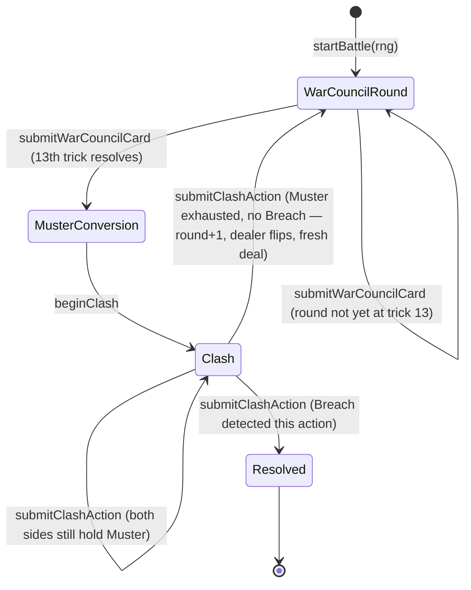

# Plan: Battle loop orchestrator — War Council → Muster → Clash → Breach/loop

Plan folder: `.claude/contract/SCRUM-25-battle-loop-orchestrator/`
Execution status: see `tasks.md` in this folder.

---

## Part 1 — Alignment

### Task reference

**Jira issue:** [SCRUM-25](https://amazerbeam.atlassian.net/browse/SCRUM-25) — "Battle loop orchestrator — War Council → Muster → Clash → Breach/loop"

**Acceptance criteria (verbatim from the ticket):**

1. The orchestrator holds a single `BattleState` through the full sequence: deal and play a War Council round → convert its score to Muster → run The Clash (which itself checks the Breach) → if no Breach, start the next War Council round with the _same_ Vanguard board state (tokens persist, per `hybrid-concept.md`: "never reset between rounds").
2. Dealer alternates every War Council round; the alternation is a single, named piece of state that a later ticket could carry across a hypothetical multi-battle boundary without rewriting this orchestrator (the campaign layer itself is out of scope for this epic).
3. The loop terminates cleanly the instant a Breach is detected mid-Clash, producing a final `BattleState` that unambiguously names the winning side.
4. No round count cap exists (none is in scope) — the loop must not hang or throw if many rounds pass without a Breach; it simply keeps dealing War Council rounds.
5. Integration-level Vitest tests run at least 2 full simulated battles (using scripted or randomized-but-seeded card play and CPU-free scripted board actions) to a Breach, confirming the board state truly persists round-to-round and the final winner matches the side that achieved the Breach.

**Scope boundaries (verbatim):** In scope — the phase-sequencing loop, board persistence across rounds, dealer alternation, clean termination on Breach. Out of scope — CPU decision-making, any UI, anything above "one battle" (no campaign, no map — explicitly out of scope for the whole epic).

**Dependencies & Risks (verbatim):** Depends on the War Council engine, Muster conversion, The Clash turn engine, and Breach detection tickets all being complete. This is the integration point for all of Phase A — schedule it last within Phase A, and expect it to surface any interface mismatches between the engines built independently.

### Restated goal

Build the code that sequences a full battle end to end: it holds one `BattleState` that starts a War Council round, accepts card plays until the round's 13 tricks are complete, converts the round's score into Muster for both sides, runs The Clash action by action (bubbling every legality and affordability check to the existing engines), and on a natural end without a Breach deals straight into the next War Council round — same Vanguard board, alternated dealer, incremented round counter — repeating indefinitely until a Breach fires mid-Clash and the battle resolves with a named winner. All four engines it wires together (War Council, Vanguard board actions, Muster conversion, The Clash, Breach detection) already exist in `src/warCouncil/` and `src/vanguard/`, built by SCRUM-20 through SCRUM-24; this ticket only sequences them. No CPU logic, no UI — the "who plays what" decision stays external to this module, supplied by whatever calls it (a test script today, a future UI or CPU ticket later).

### In scope

- Redesigning `BattleState` (currently a SCRUM-19 placeholder) into the shape a real orchestrator needs: which phase, which round, whose deal, the persistent Vanguard board, and whichever engine's own state is live for the current phase.
- One function per phase-boundary transition named in the ticket's own sequence: start a battle, submit a War Council card, begin The Clash once Muster is converted, submit a Clash action.
- Dealer alternation as the single named `dealer` field AC2 asks for, flipped exactly once per round at the point a Clash ends without a Breach.
- Vanguard board persistence structurally guaranteed by construction: `createVanguardBoard()` is called exactly once, in the battle-start function; every later transition threads the same board object forward.
- Clean, unambiguous resolution: a terminal `BattleState` variant that names the winning side the instant a Breach fires, with no further actions accepted afterward.
- No round cap of any kind (AC4) — round is a plain incrementing number with no upper bound check anywhere in this module.
- Integration tests simulating at least 2 full battles to a Breach with a fixed, non-adaptive card-play and board-action script (AC5).

### Explicitly out of scope

- CPU decision-making of any kind — the orchestrator's functions take a card or an action as input from the caller; they never choose one themselves. (The test-only script that drives the integration tests is a fixed, deterministic policy, not adaptive CPU logic — see Risks.)
- Any UI, component, or rendering code.
- A campaign or multi-battle layer — `round` counts War Council rounds within one battle only; nothing here persists across a battle boundary or exposes a "next battle" concept.
- Modifying the four already-established engine modules (`src/warCouncil/`, `src/vanguard/`) beyond importing from their existing public barrels — no change to `playCard`, `applyClashAction`, `convertScoreToMuster`, `hasReachedBreach`, or any type they already export.
- Modifying `BattlePhase`'s four values — SCRUM-19 established `WarCouncilRound`, `MusterConversion`, `Clash`, `Resolved` as the complete set; this ticket uses all four as real, reachable `BattleState.phase` values rather than adding a fifth.
- Extending the pure-core ESLint boundary to `src/battle/` — SCRUM-19 explicitly declined this for the orchestrator module and nothing in this brief revisits that call.
- Any round-count cap or timeout — AC4 states none is in scope, and adding one defensively would contradict the acceptance criterion.

### Pattern Reference

- `.docs/design/hybrid-concept.md` → "The battle loop" (lines 36-66) — the four-stage diagram (War Council → Muster → The Clash → Breach check, loop or resolve) this orchestrator implements directly, plus the explicit "never reset between rounds" line AC1 quotes.
- `.claude/contract/SCRUM-19-battle-module-scaffold/plan.md` — the placeholder `BattlePhase`/`BattleState` this ticket replaces/extends; its own Assumptions section flags `round`, `dealer`, and `winner` as fields deliberately left for "the orchestrator ticket to add when it exists to need them" — this is that ticket.
- `.claude/contract/SCRUM-24-the-clash-turn-engine/plan.md` → Restated goal: "it does not touch `BattleState` or any orchestrator wiring" — confirms SCRUM-25 (this ticket) is where that wiring belongs.
- `src/vanguard/config.ts` → `CLASH_FIRST_ROUND_OPENER` — the direct precedent for how this ticket's own new "first dealer" constant is declared, commented, and placed alongside the module that owns the concept it configures.
- `src/vanguard/clash.ts` (`startClash`, `applyClashAction`) and `src/vanguard/types.ts` (`ClashState`, `ClashActionResult`) — the discriminated-union reducer pattern this orchestrator's own action functions and `BattleState` follow.
- `src/vanguard/__tests__/testBoard.ts` and `src/vanguard/__tests__/clash.test.ts` — the existing test-fixture-helper convention (a non-`.test.ts` helper file under `__tests__/`) this ticket's integration-test script follows.

### Constraints flagged on the brief

- `BattleState` must remain a single source of truth threaded through the whole sequence (AC1) — no second, parallel copy of round/board/muster state anywhere in this module.
- Dealer alternation must be exactly one named piece of state, not re-derived ad hoc each round (AC2).
- Resolution must be unambiguous — a `Resolved` `BattleState` must name the winner directly, not require the caller to re-derive it from board state (AC3).
- No round cap, no defensive termination after N rounds (AC4) — this is a explicit non-requirement, not an oversight to "fix."
- Tests must be integration-level, running real full battles to a real Breach — not mocked or stubbed engine calls (AC5).

### Assumptions made

- **All four `BattlePhase` values become real, reachable `BattleState.phase` values**, including `MusterConversion` as its own explicit, callable transition (`beginClash`) rather than folding score-conversion silently into the War-Council-completion step. Muster conversion and starting the Clash both need zero external input (no card, no action — pure functions of already-known state), so collapsing them into `submitWarCouncilCard`'s return was the alternative considered. Kept separate because: (a) it matches the four-phase model SCRUM-19 established as "at minimum" the states to cover, literally; (b) every phase transition maps to exactly one named function, which is easier to unit-test and reason about in isolation; (c) it leaves a natural hook for a future UI to show a distinct "converting Muster..." beat. Flagged in Risks — the alternative (auto-collapse) is one function fewer for a driver to call and is a legitimate red-line if the developer prefers it.
- **`submitClashAction` deals the next War Council round itself** when a Clash ends naturally (both sides' Muster exhausted, no Breach) rather than requiring the caller to separately notice "Clash reached `Complete`" and call a second function. This needs threading a `rng: () => number` parameter into every `submitClashAction` call (mirroring `dealRound`'s own signature), even though it is only consumed on the rare turn that naturally ends the exchange. The alternative — a separate `startNextWarCouncilRound(state, rng)` the driver must remember to call — creates a failure class this design avoids: forgetting that call would leave the battle permanently stuck (`applyClashAction` rejects any further action once a Clash's status is no longer `InProgress`). Flagged in Risks as the more consequential of the two collapsing-vs-splitting calls in this plan.
- **Config placement mirrors `CLASH_FIRST_ROUND_OPENER`'s precedent**: since which side deals the very first War Council round of a battle is an orchestration-level concern (it needs to know there is a "round 1" at all, which no single-round engine does), the new constant lives in a new `src/battle/config.ts`, not in `src/warCouncil/`.
- **`BattleState` is a four-variant discriminated union keyed on `phase`**, not a flat interface with optional fields — matching the pattern already established by `ClashState` and `PlayCardResult` elsewhere in this codebase, and preventing a caller from reading (say) `.clash` while `phase === 'warCouncilRound'` at the type level.
- **Wrong-phase calls get a specific, named rejection reason per function** (`NotWarCouncilPhase`, `NotMusterConversionPhase`, `NotClashPhase`) rather than one generic `WrongPhase` value, matching the specificity of existing reason enums (`IllegalMoveReason`, `ClashRejectionReason`) rather than introducing a less-specific style.
- **The integration test's card-play and board-action policy is a fixed, non-adaptive script**, not randomized: cards always play the first `legalMoves()` result (declining Fox, discarding the just-drawn card on Woodcutter); Clash actions always prefer overwriting the opponent's base once reachable, otherwise expand toward the opponent's base by shortest hex distance, otherwise overwrite the nearest cell that reduces that distance, otherwise reinforce the lowest-keyed un-reinforced own token. This is deterministic and requires no seeded `rng` for the board-action half (AC5 permits "scripted or randomized-but-seeded" for cards and asks specifically for "CPU-free scripted" — not randomized — board actions). Flagged in Risks since "nearest-cell-first" is itself a simple policy a reviewer could read as adjacent to CPU decision-making; it contains no branching on hidden information or lookahead, which is the line this plan draws.

### Config and persisted-shape audit

- **`BattleState`'s shape is changing from a flat interface to a discriminated union — a real type change, not an addition.** Grepped `src/**` for `BattleState`, `BattlePhase`, `WarCouncilState`, `VanguardState`: 6 hits, all inside `src/battle/`, `src/warCouncil/index.ts`, and `src/vanguard/index.ts` (the barrels that define/re-export the type names themselves) plus `src/battle/__tests__/battlePhase.test.ts` (which only imports `BattlePhase`, never `BattleState`). There is exactly one real consumer of the `BattleState` type today — `src/battle/index.ts`'s barrel re-export — and it is in this ticket's own file map. No application code, test, or other module reads a `BattleState` value yet, so this is a safe, fully contained widening with nothing to migrate outside `src/battle/`.
- **No persisted or stored shape exists.** Nothing under `src/` touches `localStorage`, a save file, or any serialisation — `BattleState` is an in-memory reducer value only, held by whatever calls this module (a test today). Nothing this ticket changes can invalidate stored data because none exists.
- **Type-loss check on the `BattleState` widening:** going from one fixed shape to four phase-keyed variants is additive at the type level (every field that existed — `phase`, `warCouncil`, `vanguard` — still exists, now scoped to the phases where it is actually meaningful) and removes no capability from the one real consumer (the barrel re-export, which only needs the type name to exist). No narrowing, no array/object shape change, no required-to-optional flip.
- **New name, not a rename: `WAR_COUNCIL_FIRST_DEALER`.** Grepped `src/**` for `WAR_COUNCIL_FIRST_DEALER` and, for comparison, its direct precedent `CLASH_FIRST_ROUND_OPENER` (4 hits — declaration in `vanguard/config.ts`, its use in `vanguard/clashOpener.ts` twice, and its re-export in `vanguard/index.ts`). Zero hits for `WAR_COUNCIL_FIRST_DEALER` anywhere — confirms it is a genuinely new constant with no existing consumer to migrate.
- **New rejection reasons (`BattleRejectionReason`) and result type (`BattleActionResult`) are new names, zero existing hits** — grepped `src/**` for both identifiers, no hits outside this ticket's planned files.
- **Architectural boundary:** not applicable — `src/battle/` was deliberately left outside the pure-core ESLint boundary by SCRUM-19 (see Pattern Reference), and this ticket doesn't revisit that call, so there is no boundary grep to run against this module in Final verification.

---

## Part 2 — Technical design

### Approach

The orchestrator is one small state machine living entirely in `src/battle/`, built as four pure, standalone functions — one per arrow in `hybrid-concept.md`'s battle-loop diagram — plus a `BattleState` discriminated union that makes illegal reads (like touching `.clash` while the phase is `warCouncilRound`) a compile error rather than a runtime `undefined`. Each function takes the current `BattleState` (plus whatever external input that step needs — a card, a Clash action, an `rng` function) and returns either a rejection naming exactly why, or the next `BattleState`. This mirrors the reducer style already established by `playCard` and `applyClashAction` — a deliberate choice for consistency over inventing a different shape for the one module that happens to sit above both.

`startBattle(rng)` is the only function with no rejection path: it calls `createVanguardBoard()` exactly once (this is what makes board persistence structural rather than a rule someone has to remember — no other function in this module ever creates a board, only threads the one it was given forward) and `dealRound(WAR_COUNCIL_FIRST_DEALER, rng)` to produce round 1's War Council state. `submitWarCouncilCard` delegates every legality question to the existing `playCard`, bubbling its `IllegalMoveReason` unchanged on rejection; its only orchestration-level decision is noticing when the returned round's `phase` is `RoundPhase.Complete` and, if so, transitioning `BattleState.phase` to `MusterConversion` while carrying the completed round state forward (so the next function can read `tricksWon` off it). `beginClash` is the one function with no possible engine-level rejection — reading a phase-`MusterConversion` `BattleState` and calling `scoreRound` → `convertScoreToMuster` → `openingSideForRound` → `startClash` in sequence, all pure, all already fully specified by SCRUM-22/23/24 — its only rejection is the orchestration-level wrong-phase check. `submitClashAction` delegates to `applyClashAction` exactly as `submitWarCouncilCard` delegates to `playCard`, then branches on the returned `ClashState.status`: `Breached` produces a `Resolved` `BattleState` naming the winner directly from `ClashState.winner`; `Complete` (both sides exhausted, no Breach) deals straight into the next round — incrementing `round`, flipping `dealer` via `otherSide`, dealing a fresh War Council round with the caller's `rng` — all inside the same function call, so a caller can never observe a stuck, in-between "Clash finished but nobody dealt the next round" state; `InProgress` just carries the updated `ClashState` forward.

Every rejection path in this module names a specific reason rather than a generic failure, continuing the pattern `IllegalMoveReason` and `ClashRejectionReason` already set: three new `BattleRejectionReason` values (`NotWarCouncilPhase`, `NotMusterConversionPhase`, `NotClashPhase`) cover the orchestration-level checks, and every engine-level rejection (`IllegalMoveReason`, `IllegalActionReason`, `ClashRejectionReason`) bubbles through `BattleActionResult` unchanged rather than being re-wrapped or summarised — a caller inspecting a rejection always gets the real underlying reason, never a laundered "something went wrong."

All of this is pure logic with a testable invariant at every step (a round transitions to Muster exactly at trick 13, a Clash resolves exactly on the action that reaches the Breach, the board threaded into round *N+1* is exactly the board `submitClashAction` returned at the end of round *N*) — there is no React import, no DOM access, and nothing here needs a hook or a component; the entire module is unit-testable as plain function calls.

### Skills to invoke during execution

- `react-frontend` — owns everything under `src/`, including the discriminated-union/reducer pattern this module follows, the `as const` object-map requirement (`erasableSyntaxOnly`), `verbatimModuleSyntax`'s `import type`/`export type` split, the constants-taxonomy call on `WAR_COUNCIL_FIRST_DEALER` (configuration, not a fixed constant — a value the developer may want to retune without a design change), and the pure-logic testing posture (function-in/value-out, no renderer) this ticket's tests follow throughout.
- Read on demand: `.claude/workflow/web-project.md` (paths, runners, and the note confirming `src/battle/` carries no pure-core ESLint boundary) and `.claude/rules/README.md` (scanned; currently empty, no rule file applies).
- No developer override — only one skill matched (`react-frontend`); consistent with the single-skill precedent in `SCRUM-19-battle-module-scaffold/plan.md` and `SCRUM-24-the-clash-turn-engine/plan.md`, the developer confirms the plan as a whole at the Step 3 gate instead of a `multiSelect` question with one option.

### Diagram



### Data shapes

#### `src/battle/config.ts` (new)

```ts
import { PlayerSide } from '../warCouncil'

// --- Configuration: no stated default in the brief or design docs for who deals
// round 1 of a battle — placeholder pending developer confirmation (see plan.md
// Part 1 -> Risks and judgement calls) ---
export const WAR_COUNCIL_FIRST_DEALER: PlayerSide = PlayerSide.Player
```

#### `src/battle/battleAction.ts` (new)

```ts
import type { IllegalMoveReason } from '../warCouncil'
import type { IllegalActionReason, ClashRejectionReason } from '../vanguard'
import type { BattleState } from './battleState'

export const BattleRejectionReason = {
  NotWarCouncilPhase: 'notWarCouncilPhase',
  NotMusterConversionPhase: 'notMusterConversionPhase',
  NotClashPhase: 'notClashPhase',
} as const
export type BattleRejectionReason = (typeof BattleRejectionReason)[keyof typeof BattleRejectionReason]

export type BattleActionResult =
  | { readonly ok: true; readonly state: BattleState }
  | {
      readonly ok: false
      readonly reason:
        | BattleRejectionReason
        | IllegalMoveReason
        | IllegalActionReason
        | ClashRejectionReason
    }
```

#### `src/battle/battleState.ts` (modified — replaces the SCRUM-19 placeholder interface)

```ts
import type { PlayerSide, WarCouncilState } from '../warCouncil'
import type { VanguardState, ClashState } from '../vanguard'
import { BattlePhase } from './battlePhase'

export type BattleState =
  | {
      readonly phase: typeof BattlePhase.WarCouncilRound
      readonly round: number
      readonly dealer: PlayerSide
      readonly vanguard: VanguardState
      readonly warCouncil: WarCouncilState
    }
  | {
      readonly phase: typeof BattlePhase.MusterConversion
      readonly round: number
      readonly dealer: PlayerSide
      readonly vanguard: VanguardState
      readonly warCouncil: WarCouncilState // guaranteed complete: warCouncil.phase === RoundPhase.Complete
    }
  | {
      readonly phase: typeof BattlePhase.Clash
      readonly round: number
      readonly dealer: PlayerSide
      readonly clash: ClashState
    }
  | {
      readonly phase: typeof BattlePhase.Resolved
      readonly round: number
      readonly vanguard: VanguardState
      readonly winner: PlayerSide
    }
```

#### `src/battle/startBattle.ts` (new)

```ts
export function startBattle(rng: () => number): BattleState
```

Builds round 1: `createVanguardBoard()` (the only call to it in this module), `dealRound(WAR_COUNCIL_FIRST_DEALER, rng)`, `phase: BattlePhase.WarCouncilRound`, `round: 1`, `dealer: WAR_COUNCIL_FIRST_DEALER`.

#### `src/battle/submitWarCouncilCard.ts` (new)

```ts
export function submitWarCouncilCard(
  state: BattleState,
  side: PlayerSide,
  card: Card,
  choice?: AbilityChoice,
): BattleActionResult
```

Rejects `BattleRejectionReason.NotWarCouncilPhase` unless `state.phase === BattlePhase.WarCouncilRound`. Otherwise delegates to `playCard(state.warCouncil, side, card, choice)`, bubbling its `IllegalMoveReason` on failure unchanged. On success, if the returned round's `phase === RoundPhase.Complete`, returns a `MusterConversion`-phase `BattleState` carrying that completed round; otherwise returns a `WarCouncilRound`-phase `BattleState` with the updated round.

#### `src/battle/beginClash.ts` (new)

```ts
export function beginClash(state: BattleState): BattleActionResult
```

Rejects `BattleRejectionReason.NotMusterConversionPhase` unless `state.phase === BattlePhase.MusterConversion`. Otherwise: `scoreRound(state.warCouncil.tricksWon)` → `convertScoreToMuster(score)` → `openingSideForRound(state.round)` → `startClash(state.vanguard, muster, openingSide)`, returned as a `Clash`-phase `BattleState`.

#### `src/battle/submitClashAction.ts` (new)

```ts
export function submitClashAction(
  state: BattleState,
  side: PlayerSide,
  action: VanguardAction,
  rng: () => number,
): BattleActionResult
```

Rejects `BattleRejectionReason.NotClashPhase` unless `state.phase === BattlePhase.Clash`. Otherwise delegates to `applyClashAction(state.clash, side, action)`, bubbling its `IllegalActionReason | ClashRejectionReason` on failure unchanged. On success, branches on the returned `ClashState.status`:
- `Breached` → `Resolved`-phase `BattleState`: `vanguard: result.state.board`, `winner: result.state.winner`.
- `Complete` (exhausted, no Breach) → `WarCouncilRound`-phase `BattleState`: `round: state.round + 1`, `dealer: otherSide(state.dealer)`, `vanguard: result.state.board`, `warCouncil: dealRound(newDealer, rng)`.
- `InProgress` → `Clash`-phase `BattleState` carrying the updated `ClashState`.

#### `src/battle/index.ts` (modified — barrel)

```ts
export { BattlePhase } from './battlePhase'
export type { BattleState } from './battleState'
export { WAR_COUNCIL_FIRST_DEALER } from './config'
export { BattleRejectionReason } from './battleAction'
export type { BattleActionResult } from './battleAction'
export { startBattle } from './startBattle'
export { submitWarCouncilCard } from './submitWarCouncilCard'
export { beginClash } from './beginClash'
export { submitClashAction } from './submitClashAction'
```

#### `src/battle/__tests__/battleTestHelpers.ts` (new, test-only — not re-exported from `index.ts`)

```ts
export function autoPlayWarCouncilRound(state: BattleState): BattleState
export function scriptedClashAction(state: Extract<BattleState, { phase: typeof BattlePhase.Clash }>, side: PlayerSide): VanguardAction
```

`autoPlayWarCouncilRound` loops `submitWarCouncilCard`, always playing `legalMoves(state.warCouncil, currentTurn(state.warCouncil))[0]`, declining Fox and discarding the just-drawn card on Woodcutter, until the phase leaves `WarCouncilRound`. `scriptedClashAction` picks, in order: overwrite the opponent's base if it is currently a legal Overwrite target; otherwise the empty cell within `EXPAND_RANGE` of the side's network with the smallest `hexDistance` to the opponent's base; otherwise the nearest legal Overwrite target that reduces that distance; otherwise the lowest-`cellKey` un-reinforced own token, reinforced.

No config keys beyond `WAR_COUNCIL_FIRST_DEALER` change, no persisted shape changes, no `package.json` script changes.

### Runtime quality notes

- **Purity and adjudication:** Every function in `src/battle/` is a pure reducer — no side effects beyond the `rng` calls `dealRound` itself already makes. No component or hook exists to misplace this logic into; `submitWarCouncilCard`/`submitClashAction` never decide *what* to play, only validate whose turn it is and sequence the phase, exactly matching this ticket's scope boundary.
- **Effects, mount and teardown:** Not applicable — no component, no effect, nothing that mounts. This module has no runtime lifecycle beyond function calls.
- **Hot-path cost:** Not a hot path — one function call per card played or Clash action submitted, each delegating to an already-O(board size) engine call (`applyVanguardAction` internally runs a bounded `hexBfs`). No loop in this module itself beyond the test-only auto-play helpers, which are test code, not shipped runtime code.
- **Determinism and numeric safety:** `rng` is threaded explicitly into `startBattle` and `submitClashAction` (used only on natural Clash completion) exactly as `dealRound` requires — no `Math.random()` reachable from anywhere in this module. No arithmetic in this module can produce `NaN`: `round` only ever increments by 1, and Muster/board arithmetic all happens inside the already-guarded engine functions this module calls.
- **Error paths:** Every function that can fail returns a typed rejection (`BattleActionResult`'s `ok: false` arm) naming a specific reason — orchestration-level (`BattleRejectionReason`) or bubbled unchanged from the delegated engine call. Nothing is caught and silently downgraded to a success shape; there is no `try`/`catch` anywhere in this module because none of its calls are I/O or otherwise capable of throwing under normal operation.

### Risks and judgement calls

- **`WAR_COUNCIL_FIRST_DEALER` is an unchosen tuning value.** Nothing in the brief, the linked design docs, or any prior ticket states which side deals round 1 of a battle (unlike `CLASH_FIRST_ROUND_OPENER`, which SCRUM-24's own AC3 stated outright as "CPU opens round 1"). This plan defaults to `PlayerSide.Player` as a documented placeholder — flip it in one line in `src/battle/config.ts` if the developer wants the other side, or wants it to match/contrast with `CLASH_FIRST_ROUND_OPENER`'s `Cpu` default deliberately.
- **`MusterConversion` is kept as its own explicit, callable phase (`beginClash`)** rather than collapsed silently into `submitWarCouncilCard`'s return. Both are legitimate; this plan's reasoning is in Assumptions. If the developer would rather a round's completion jump straight to a live Clash in one call, that's a small change (drop `beginClash`, inline its body into `submitWarCouncilCard`'s round-complete branch) — worth flagging now since it changes the public function count from four to three.
- **`submitClashAction` auto-deals the next round** rather than exposing a separate `startNextWarCouncilRound(state, rng)` the driver calls explicitly on `ClashStatus.Complete`. This plan's reasoning (avoiding a stuck-battle failure mode) is in Assumptions — the tradeoff is that `rng` must be threaded into every `submitClashAction` call even though the overwhelming majority of calls never consume it.
- **The integration test's Clash-action script (nearest-cell-first, then nearest-overwrite, then reinforce-fallback) is a fixed heuristic, not randomized.** AC5 asks for "CPU-free scripted" board actions specifically (contrasted with "randomized-but-seeded," which it explicitly permits only for card play), so this plan reads a deterministic distance-minimizing script as compliant — it contains no lookahead, no evaluation of alternatives, no hidden-information reasoning, just "always move toward the fixed, known target." Worth the developer's eyes since "nearest cell" is the simplest form of goal-seeking behaviour and a stricter reading of "CPU-free" could ask for a literal hardcoded coordinate sequence instead. This plan's script is preferred because a hardcoded path is brittle against the board's actual `DEFENSE_CELLS` layout (a fixed sequence could path directly into an impassable defense cell and stall the test), while distance-minimization naturally routes around them.
- **No dependency, config value beyond the one named above, or behaviour in this ticket needs the developer's judgement to play the app** — this ticket has no UI surface; every observable outcome is asserted by a test.
