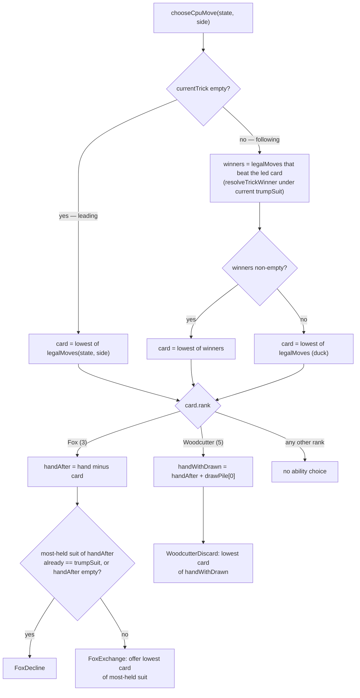

# Plan: War Council CPU — heuristic card player

Plan folder: `.claude/contract/SCRUM-26-war-council-cpu-heuristic/`
Execution status: see `tasks.md` in this folder.

---

## Part 1 — Alignment

### Task reference

**SCRUM-26** — "War Council CPU — heuristic card player"

> **Problem Statement:** The epic's Definition of Done requires a player to "play a full War
> Council round against the CPU." `hybrid-concept.md` calls this CPU "the hard half" of the
> design (hidden hands, 13 tricks, an ability that mutates trump mid-trick) — but the epic's own
> scope caps ambition here deliberately: heuristic/random-level play that's always legal, not the
> eventual search-based AI.
>
> **User Story:** As a player, I want the CPU to always play a legal card on its turn using a
> simple heuristic (not pure random, not deep search), so that a full round is playable
> end-to-end without the CPU stalling or cheating.
>
> **Acceptance Criteria:**
> 1. The CPU selects a legal card every turn, respecting all of the War Council engine's
>    legal-move constraints (suit-following, trump/decree rules, the trump-mutating odd-card
>    ability) with zero illegal plays across a full 13-trick round.
> 2. The CPU's card choice uses a stated, simple heuristic (e.g. "follow suit with the lowest
>    card that still wins the trick if ahead, otherwise play lowest legal card" or an equivalent
>    documented rule) — not a uniformly random legal card, and explicitly not
>    determinized/Monte Carlo search (out of scope, per the epic and `hybrid-concept.md`).
> 3. The CPU completes a full round within a reasonable per-decision time bound suitable for a
>    synchronous UI turn (no artificial "thinking" delay required, but no unbounded search
>    either).
> 4. Unit tests confirm zero illegal plays across many simulated full rounds (e.g. 50+ seeded
>    runs) against a range of hands.
>
> **Scope Boundaries:** In scope: legal-move selection via a simple, stated heuristic. Out of
> scope: any awareness of Vanguard board state when choosing card play (flagged in
> `hybrid-concept.md` as future difficulty, not this epic's scope) — this CPU treats every War
> Council round the same way regardless of board state; search-based/Monte Carlo play (explicitly
> out of scope for the epic).
>
> **Dependencies & Risks:** Depends on the War Council engine and the battle loop orchestrator
> (needs a loop to plug into for the "full round against the CPU" DoD item to be checkable at
> all). Risk: even a simple heuristic still has to correctly navigate the trump-mutating odd-card
> ability — verify that specifically, not just suit-following.

**Skill confirmation (interactive, this session):** classified `react-frontend` as the sole
matching skill; developer confirmed it via `AskUserQuestion` before this plan was written.

### Restated goal

Give the War Council card-play engine a CPU opponent that always picks a legal card and, on the
odd cards that require an extra choice (the Fox's trump-mutating exchange, the Woodcutter's
draw-and-discard), always makes a legal, deterministic, stated choice — so a full 13-trick round
can be played to completion against the CPU without it ever stalling or being rejected by the
engine's own legality checks. The decision logic is a small, pure, unit-testable module; a thin
composition function makes it callable from the battle module wherever it's the CPU's turn.

### In scope

- A pure heuristic function that picks a card for a `PlayerSide` to play, given the current
  `RoundState`, always drawn from `legalMoves()`'s own output (so it can never select an illegal
  card).
- A stated, documented rule for the two ability choices the engine can demand mid-play: the Fox
  (rank 3, trump exchange) and the Woodcutter (rank 5, draw-and-discard).
- A thin `src/battle/` composition function that plugs the heuristic into the existing
  `submitWarCouncilCard` battle action, so the battle module has something to call on the CPU's
  turn (the "loop to plug into" the brief's Dependencies section calls for).
- Unit tests for the heuristic's card and ability-choice logic in isolation.
- Simulation tests driving 50+ seeded full 13-trick rounds end to end through the real engine
  (`playCard`), confirming zero illegal-move rejections and that both the Fox and the Woodcutter
  paths are actually exercised at least once across the sample.

### Explicitly out of scope

- Any use of Vanguard board state, Muster need, or "how badly the CPU needs this round" when
  choosing a card — explicitly excluded by the brief; `hybrid-concept.md` flags this as a later
  difficulty, not this ticket's.
- Determinized/Monte Carlo search, lookahead, or any multi-trick planning — the brief explicitly
  rules this out in favor of a stated heuristic.
- Any UI surface for playing against the CPU. No UI exists yet in this repository and none is
  requested by this brief; this ticket delivers the decision logic and its battle-level plug-in
  point only.
- Changing `src/battle/__tests__/battleTestHelpers.ts`'s existing `autoPlayWarCouncilRound` (and
  the Clash scripts in the same file). That helper is explicitly documented in its own comments
  as "a fixed, non-adaptive script... not CPU decision-making," used only to drive
  Vanguard-focused integration tests to completion quickly. Swapping it for the real heuristic is
  a different concern from this ticket and would couple unrelated Vanguard tests to CPU behavior
  changes.
- CPU decision-making for the Clash (Vanguard) phase — out of scope for this ticket, which is
  War Council card play only.

### Pattern Reference

- `src/warCouncil/legalMoves.ts`, `src/warCouncil/playCard.ts`, `src/warCouncil/resolveTrick.ts`,
  `src/warCouncil/abilities.ts` — the authoritative legality and resolution engine. The heuristic
  must only ever select from `legalMoves()`'s output and must never re-implement or shadow a
  legality rule.
- `src/warCouncil/types.ts` — `AbilityChoiceKind`, `AbilityChoice`, `CardRank` (the five named odd
  ranks — Swan/Fox/Woodcutter/Witch/Monarch), `RoundState`, `PlayerSide`.
- `src/battle/submitWarCouncilCard.ts` and `src/battle/battleAction.ts` — the existing pattern for
  a battle-level action: phase-guard, delegate to the War Council engine, map the result into
  `BattleActionResult` with a `BattleRejectionReason` for battle-level rejections.
- `src/battle/__tests__/battleTestHelpers.ts` — `autoPlayWarCouncilRound`, `scriptedClashAction`,
  `scriptedLocalAction` are the project's existing precedent for a *documented, deterministic,
  non-random* decision function over engine state, right down to the comment style used to state
  "this is a fixed script, not adaptive decision-making." This ticket's module is the real
  decision-making version of that same shape, for War Council specifically.
- `src/vanguard/abilities`-equivalent pattern: `applyFoxExchange`, `applyWoodcutterDraw` in
  `src/warCouncil/abilities.ts` show exactly what hand mutation each ability choice produces —
  the heuristic's ability-choice functions are designed against those, not against a re-derived
  understanding of the rules.
- `.docs/design/hybrid-concept.md` → "Scope notes" — "Start with a heuristic player before
  reaching for determinized search" and the explicit statement that Vanguard-awareness is future
  difficulty, not this ticket's.

### Constraints flagged on the brief

- Zero illegal plays across a full 13-trick round (AC1) — including the Fox and Woodcutter
  ability-choice paths, not just suit-following.
- Not uniformly random, not determinized/Monte Carlo search (AC2) — the heuristic must be a
  *stated* rule.
- A reasonable per-decision time bound suitable for a synchronous UI turn, no unbounded search
  (AC3).
- 50+ seeded simulated full rounds with zero illegal plays, "against a range of hands" (AC4).
- No Vanguard-board awareness in this ticket (Scope Boundaries).

### Assumptions made

- **Card-selection rule operationalizes AC2's example for both trick positions.** When leading
  (no card yet in the trick), there is no suit to follow and no trick to be "ahead" in, so the
  rule is: play the lowest-ranked legal card. When following, the rule is exactly AC2's example:
  among `legalMoves()`, play the lowest-ranked card that would win the trick if played (evaluated
  with `resolveTrickWinner` against the current `trumpSuit`); if no legal card would win, play
  the lowest-ranked legal card (duck as cheaply as possible). *Rationale:* the brief only gives
  the follow-suit case explicitly; extending the same "lowest legal card" fallback to leading is
  the natural, simplest generalization and keeps the whole rule statable in one sentence.
- **Deterministic tie-break: rank first, then suit in `ALL_SUITS` declaration order (Bells <
  Keys < Moons).** *Rationale:* "lowest card" is ambiguous across suits at equal rank; the engine
  already has a canonical suit ordering (`ALL_SUITS`), so reusing it avoids inventing a second
  one, and a fixed order keeps the heuristic deterministic (AC2 rules out randomness entirely, so
  even the tie-break must not use `Math.random()`).
- **Fox (rank 3) ability choice:** exchange only when the CPU's most-held suit among its
  remaining hand (after removing the Fox) is not already the trump suit, offering the
  lowest-ranked card of that suit; otherwise (already-trump, or an empty hand after the Fox was
  the last card) decline. *Rationale:* the brief states no rule for this decision at all — this
  default is simple, stated, always legal (the offered card is always drawn from the hand that
  remains after the Fox itself is removed), and does something purposeful (concentrates trump in
  the CPU's strongest suit) rather than a degenerate always-decline that would never exercise the
  exchange path AC1 asks to be verified.
- **Woodcutter (rank 5) ability choice:** always discard the lowest-ranked card of the hand after
  the draw. *Rationale:* brief states no rule; "keep your best cards, give up your worst" is the
  simplest deterministic, always-legal default (the discard candidate set is exactly the hand
  after the draw, so any choice from it is legal).
- **A thin `src/battle/playCpuWarCouncilTurn.ts` composition function is in scope**, wrapping
  `chooseCpuMove` + `submitWarCouncilCard` behind the same `BattleActionResult` shape as the
  existing `submitWarCouncilCard`/`beginClash`/`submitClashAction` actions, with a new
  `BattleRejectionReason.NotCpuTurn` for calling it out of turn. *Rationale:* the brief's
  Dependencies section says this ticket "needs a loop to plug into" at the battle level for the
  epic's DoD to ever be checkable; a single composition function is the minimal way to make the
  heuristic callable from `battle/` without inventing a UI or a full game loop, neither of which
  exists yet or is asked for here.
- **`battleTestHelpers.ts` is left untouched** (see Explicitly out of scope). *Confirmed by
  precedent in its own doc comments*, not by developer interaction — it already states plainly
  that it is not CPU decision-making and exists for an orthogonal purpose (driving Vanguard
  integration tests).
- **AC4's simulations drive `chooseCpuMove` for both `PlayerSide.Player` and `PlayerSide.Cpu`
  turns**, not only `Cpu` turns. *Rationale:* `chooseCpuMove` takes a `side` parameter and is
  legality-generic; running it for both sides is the most direct way to hit "many simulated full
  rounds... against a range of hands" without needing a second, throwaway decision function for
  the non-CPU side, and mirrors how this repo's existing scripted-play test helpers already drive
  both sides with one script.

### Config and persisted-shape audit

Skipped — this task adds no configuration key, no persisted or stored shape, and no other
string-bound surface (storage key, `data-testid`, CSS class, `aria-*` id). The only new name is
`BattleRejectionReason.NotCpuTurn`, a brand-new enum member (not a rename), so it has zero
existing hits to reconcile with.

---

## Part 2 — Technical design

### Approach

The heuristic lives entirely as pure logic in a new `src/warCouncil/cpuPlayer.ts`, alongside the
engine it decides over and following the same shape as `abilities.ts`: several small, individually
exported, individually testable pure functions rather than one large opaque decision function.

`chooseCpuCard(state, side)` handles card selection only. It reads `legalMoves(state, side)` —
never re-derives legality — and branches on whether the current trick is empty (leading: lowest
legal card) or has one card in it (following: lowest legal card that would win against the led
card under the round's current `trumpSuit`, evaluated by calling the engine's own
`resolveTrickWinner` for each candidate rather than re-implementing trump/suit comparison; if none
would win, lowest legal card). `chooseCpuFoxChoice(handAfterFox, trumpSuit)` and
`chooseCpuWoodcutterChoice(handWithDrawn)` handle the two ability sub-decisions independently, each
built against exactly the hand shape `abilities.ts`'s `applyFoxExchange` /
`applyWoodcutterDraw` expect. `chooseCpuMove(state, side)` composes these three: pick the card,
then — only if its rank is Fox or Woodcutter — compute the matching ability choice, mirroring the
same hand-shape construction `playCard.ts` itself does internally
(`[...next.hands[side], next.drawPile[0]]` for Woodcutter) so the two stay in lockstep. The result
is a `CpuMove` (`{ card, choice? }`) that is always accepted by `playCard`/`submitWarCouncilCard`,
because every value it can produce is drawn from a set the engine itself already calls legal.

Only `chooseCpuMove` and its `CpuMove` type are re-exported from `src/warCouncil/index.ts` — the
same curation pattern the module already uses (`abilities.ts`'s `applyFoxExchange` etc. are
exported from their own file for direct unit testing but not re-exported from the index; only the
entrypoints `playCard`, `legalMoves`, `resolveTrickWinner` are). `chooseCpuCard`,
`chooseCpuFoxChoice`, and `chooseCpuWoodcutterChoice` stay exported from `cpuPlayer.ts` itself (for
focused unit tests) without appearing in the package's curated public surface.

At the battle level, `src/battle/playCpuWarCouncilTurn.ts` is a single function following exactly
the shape of `submitWarCouncilCard.ts`: guard the phase, guard whose turn it is (new
`BattleRejectionReason.NotCpuTurn`), then call `chooseCpuMove` and hand its result straight to the
existing `submitWarCouncilCard`. It introduces no new state-mutation path — it is pure composition
of two already-tested primitives — so its own test surface is thin: phase/turn rejections, and one
smoke path proving a chosen move is accepted and advances `BattleState` the same way a manually
constructed `submitWarCouncilCard` call would.

Everything here is pure TypeScript with no DOM or React access, matching the project's (currently
unenforced but established-by-convention) pure-core pattern the `react-frontend` skill documents.

### Skills to invoke during execution

- `react-frontend` — owns everything under `src/`, including this pure-logic module: file
  placement (`src/warCouncil/`, `__tests__/` beside it), the 400-line file budget, "pure logic
  tested without a renderer," and the requirement that any repeated meaningful value be named
  once (the tie-break's suit order reuses the existing `ALL_SUITS`, introducing nothing new to
  name). Confirmed via `AskUserQuestion` — sole match, no override.
- No `.claude/rules/*.md` files apply — that folder holds only its `README.md` (empty index) as
  of this plan.
- `.claude/workflow/web-project.md` — read for verification commands and the correctness-trap
  list (module-level mutable state, `NaN` propagation, etc.); none of those traps apply to this
  purely-functional, no-state, no-division module, but the file is the canonical source for the
  `Run:` steps in `tasks.md`.

### Diagram



### Data shapes

```ts
// src/warCouncil/cpuPlayer.ts

export interface CpuMove {
  readonly card: Card
  readonly choice?: AbilityChoice
}

// Card selection only — never invents a card outside legalMoves()'s output.
export function chooseCpuCard(state: RoundState, side: PlayerSide): Card

// handAfterFox: the acting side's hand with the just-played Fox already removed
// (the candidate set for the card offered in a FoxExchange).
export function chooseCpuFoxChoice(
  handAfterFox: readonly Card[],
  trumpSuit: Suit,
): AbilityChoice // FoxExchange | FoxDecline

// handWithDrawn: the acting side's hand with the just-played Woodcutter removed
// and the top of drawPile added (the candidate set for WoodcutterDiscard).
export function chooseCpuWoodcutterChoice(handWithDrawn: readonly Card[]): AbilityChoice // WoodcutterDiscard

// Composes the above into one move; the only function re-exported from
// src/warCouncil/index.ts.
export function chooseCpuMove(state: RoundState, side: PlayerSide): CpuMove
```

```ts
// src/battle/battleAction.ts — one new member, no renames
export const BattleRejectionReason = {
  NotWarCouncilPhase: 'notWarCouncilPhase',
  NotMusterConversionPhase: 'notMusterConversionPhase',
  NotClashPhase: 'notClashPhase',
  NotCpuTurn: 'notCpuTurn', // NEW
} as const
```

```ts
// src/battle/playCpuWarCouncilTurn.ts
export function playCpuWarCouncilTurn(state: BattleState): BattleActionResult
```

```ts
// src/warCouncil/index.ts — additive exports only
export { chooseCpuMove } from './cpuPlayer'
export type { CpuMove } from './cpuPlayer'
```

```ts
// src/battle/index.ts — additive export only
export { playCpuWarCouncilTurn } from './playCpuWarCouncilTurn'
```

No persisted or configuration shape changes — see the Part 1 audit.

### Runtime quality notes

- **Purity and adjudication:** `cpuPlayer.ts` is 100% pure TypeScript — no `react`, no DOM
  global, no I/O. It never re-implements a legality rule: card choice is filtered from
  `legalMoves()`'s own output, and win/loss evaluation for the "would this win" check delegates
  to the engine's own `resolveTrickWinner` rather than re-deriving trump/suit comparison. There is
  no tunable to read from configuration — the heuristic has no numeric knob, per the Part 1
  audit.
- **Effects, mount and teardown:** N/A — no component, no hook, no effect anywhere in this
  change. `playCpuWarCouncilTurn` is a plain function call, not a subscription or a timer.
- **Hot-path cost:** Called at most once per CPU turn — up to 13 times in a round, each call
  filtering a hand of ≤13 cards and running `resolveTrickWinner` against at most 13 candidates
  when following. No search, no recursion, no unbounded loop — trivially satisfies AC3's
  synchronous-turn time bound with wide margin. Nothing here is a high-frequency/per-frame path,
  so it stays off any reconciler concern entirely.
- **Determinism and numeric safety:** No `Math.random()` anywhere in the new code — every
  decision is a pure function of `RoundState`, and the "lowest card" tie-break is the fixed
  `ALL_SUITS` order, so two calls against identical state always produce an identical move. No
  division occurs anywhere in this module, so there is no `NaN` surface to guard.
- **Error paths:** `chooseCpuMove` assumes the invariants `playCard.ts` itself already assumes
  unguarded — `legalMoves()` is non-empty for a hand with cards left, and `drawPile` has a card
  available whenever a Woodcutter is legal (the engine's own `abilities.ts` documents `drawPile`
  length as invariant at 6 for the life of a round). This introduces no new failure surface: it is
  only ever handed a `RoundState` that is mid-round by construction (dealt via `dealRound`, or a
  round already in progress), matching how every existing consumer of `legalMoves`/`playCard`
  already relies on the same invariants with no defensive guard. `playCpuWarCouncilTurn` does add
  a new, explicit rejection path — `NotCpuTurn` — for the one new way it can be misused (calling
  it when it isn't actually the CPU's turn), returned as a typed `BattleActionResult`, never
  thrown.

### Risks and judgement calls

- **The Fox and Woodcutter ability-choice rules are designed defaults, not brief-specified
  rules** (see Assumptions). They are simple, deterministic, and always legal, but a developer
  who wants different CPU behavior here (e.g. always decline the Fox, or a discard rule that
  weighs suit balance) should redirect this in review — they're isolated, single-purpose
  functions specifically so a later change is cheap.
- **The tie-break suit order (Bells < Keys < Moons) is arbitrary** — it's the engine's existing
  `ALL_SUITS` order reused for determinism, not a value with any stated game-design meaning.
  Worth a sanity check that no other part of the design expects a different canonical order.
- **Adding `playCpuWarCouncilTurn` to `src/battle/` is a scope call**, not something an
  acceptance criterion names directly — justified by the brief's own Dependencies section
  ("needs a loop to plug into"), but flagged here in case the developer would rather this ticket
  stop at the pure `warCouncil/cpuPlayer.ts` module and leave the battle-level wiring to whatever
  ticket first builds a real game loop.
- **No tuning value is introduced by this ticket** — the heuristic has no numeric knob (search
  depth, randomness weight, etc.) for the developer to set. Confirmed nothing was silently
  invented here.
- **AC3's "reasonable per-decision time bound" is asserted from the algorithm's shape (bounded,
  no search) rather than measured with a benchmark** — there is no stated numeric bound in the
  brief to test against, and the cost is small enough (≤13-element filters and comparisons) that
  a benchmark would be testing the JS runtime, not this code. Flagging in case the developer wants
  an explicit timing assertion in the simulation test regardless.
