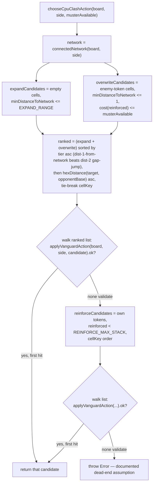

# Plan: Vanguard CPU — heuristic action selection

Plan folder: `.claude/contract/SCRUM-27-vanguard-cpu-heuristic/`
Execution status: see `tasks.md` in this folder.

---

## Part 1 — Alignment

### Task reference

**SCRUM-27** — "Vanguard CPU — heuristic action selection"

> **Problem Statement:** `skirmish-board-replacement.md`'s "Open, not yet decided" section flags
> that evaluating a partial Vanguard network's chance of reaching the Breach is "a similar class
> of problem" to what made Hex need Monte Carlo rollouts — the epic explicitly scopes this ticket
> down to heuristic/random-level play, not that harder problem, to keep this slice buildable.
>
> **User Story:** As a player, I want the CPU to spend its Muster on legal Expand/Overwrite/
> Reinforce actions using a simple heuristic, so that the Vanguard phase is playable end-to-end
> without the CPU stalling, wasting its whole Muster on no-op choices, or cheating on legality.
>
> **Acceptance Criteria:**
> 1. On each of its turns in The Clash, the CPU selects a legal action (per the Vanguard engine's
>    legality rules) with zero illegal actions across full simulated battles.
> 2. The CPU's action choice uses a stated, simple heuristic (e.g. "prefer Overwrite when adjacent
>    to an enemy token blocking the shortest path toward the opponent's base, otherwise Expand
>    toward that base, Reinforce only when no productive Expand/Overwrite is available") — not
>    uniformly random, and explicitly not full board-evaluation search (out of scope).
> 3. The CPU never spends an action that has no legal target when a legal alternative exists (i.e.
>    it doesn't pass or stall when it has moves and legal options remain).
> 4. Unit tests confirm zero illegal actions and non-degenerate play (the CPU's network grows over
>    the course of a battle, not just sits at its starting cluster) across several seeded simulated
>    battles.
>
> **Scope Boundaries:** In scope: legal action selection via a simple, stated heuristic informed by
> proximity to the opponent's base. Out of scope: genuine path-evaluation / lookahead of Breach
> probability (flagged as future, possibly Monte-Carlo-class difficulty — explicitly not this
> ticket); any awareness of the *next* War Council round's card play (cross-phase CPU awareness is
> future work, not this epic's scope).
>
> **Dependencies & Risks:** Depends on the Vanguard board engine, The Clash turn engine, and the
> battle loop orchestrator. Risk: "non-degenerate play" is a soft, judgement-shaped bar — write the
> test to check directional growth toward the opponent's base, not a specific win rate; a CPU that
> sometimes loses is fine and expected at heuristic level.

**Skill confirmation:** classification matched exactly one skill, `react-frontend` — the same
single-match outcome SCRUM-26 (the analogous War Council CPU ticket) reached. `AskUserQuestion`
requires at least two distinct options, so per that gate's own instructions this was **not**
re-asked as a confirmation prompt; `react-frontend` proceeds as the confirmed skill, stated here so
the execution session sees no developer override was possible, not that one was skipped.

### Restated goal

Give the Vanguard board engine a CPU opponent for The Clash that always spends its Muster on a
board-legal Expand, Overwrite, or Reinforce action, chosen by a small, pure, unit-testable
heuristic: advance toward the opponent's base when a legal, affordable Expand or Overwrite exists
(closest resulting distance to that base wins, which naturally prefers an Overwrite that's blocking
the shortest path over a farther Expand), and fall back to Reinforce only when no such advance is
available — so a full Clash phase can run to a Breach or Muster exhaustion without the CPU ever
submitting an illegal action or stalling with moves and legal options still open. A thin
`src/battle/` composition function makes it callable from the battle module wherever it's the CPU's
turn in the Clash, mirroring exactly how SCRUM-26 plugged the War Council CPU into
`submitWarCouncilCard`.

### In scope

- A pure heuristic function `chooseCpuClashAction` that picks a `VanguardAction` for a `PlayerSide`
  to spend Muster on, given the current `VanguardBoard`, side, and Muster available, that only ever
  returns an action confirmed legal by a dry-run call to the engine's own `applyVanguardAction` —
  so it can never select an action the engine itself would reject.
- A stated, simple ranking rule: legal, affordable Expand and Overwrite candidates are ranked
  together by their resulting hex-distance to the opponent's base (closest wins, `cellKey` as a
  deterministic tie-break); Reinforce is attempted only when no such candidate validates.
- A thin `src/battle/` composition function, `playCpuClashTurn`, that plugs the heuristic into the
  existing `submitClashAction` battle action, guarding phase and turn ownership the same way
  `playCpuWarCouncilTurn` guards `submitWarCouncilCard`.
- Unit tests for the heuristic's candidate ranking and fallback behaviour in isolation.
- Seeded simulation tests driving multiple full Clash rounds (and a short battle-level run through
  `playCpuClashTurn`) through the real engine, confirming zero illegal-action rejections and that
  the CPU's network grows over the course of a battle rather than sitting at its starting cluster.

### Explicitly out of scope

- Any lookahead, multi-step search, or evaluation of a partial network's probability of eventually
  reaching the Breach — the brief explicitly defers this as a possibly Monte-Carlo-class problem,
  matching how SCRUM-26 deferred determinized search for the War Council CPU.
- Any awareness of the War Council card layer (hand contents, trump, trick score) when choosing a
  Clash action — the Clash-phase CPU decides from `VanguardBoard` state and Muster only.
- Any UI surface for playing against the CPU — none exists in this repository and none is requested
  by this brief.
- Modifying `src/battle/__tests__/battleTestHelpers.ts`'s `scriptedClashAction`/
  `scriptedLocalAction`/`autoPlayWarCouncilRound` or `src/battle/__tests__/battleLoop.integration.test.ts`.
  Those functions are explicitly documented in their own comments as fixed, non-adaptive scripts —
  "not CPU decision-making" — used only to drive integration tests to completion quickly. This
  ticket adds the real decision-making version alongside them; swapping the existing integration
  test over to the real heuristic is a separate concern (it would couple an already-passing,
  War-Council-focused integration test to this ticket's CPU behaviour) and is flagged as a
  follow-up in Risks, exactly mirroring the precedent SCRUM-26 set for `autoPlayWarCouncilRound`.
- CPU decision-making for the War Council (card play) phase — already delivered by SCRUM-26.
- The "cost of holding ground" / redeploy idea and the stalemate/tiebreak rule flagged as open in
  `skirmish-board-replacement.md`'s "Open, not yet decided" section — unrelated to action
  selection and explicitly deferred there, not reopened by this ticket.

### Pattern Reference

- `src/vanguard/types.ts`, `src/vanguard/expand.ts`, `src/vanguard/overwrite.ts`,
  `src/vanguard/reinforce.ts`, `src/vanguard/applyVanguardAction.ts` — the authoritative Vanguard
  action-legality engine. The heuristic must only ever return an action `applyVanguardAction`
  itself confirms `ok: true` for, and must never re-implement or shadow one of its legality checks.
- `src/vanguard/network.ts` (`connectedNetwork`, `minDistanceToNetwork`) and `src/vanguard/hexGrid.ts`
  (`hexDistance`, `allBoardCoords`, `cellKey`) — the exact building blocks `applyExpand`/
  `applyOverwrite` themselves compose from; the heuristic's candidate *generation* reuses these
  same functions (not a re-derived predicate), and every candidate is still dry-run-validated
  through `applyVanguardAction` before being returned.
- `src/vanguard/config.ts` — `EXPAND_RANGE`, `OVERWRITE_COST`, `OVERWRITE_COST_REINFORCED`,
  `REINFORCE_MAX_STACK` — read, never re-derived, for candidate pre-filtering (e.g. skipping an
  Overwrite candidate whose cost obviously exceeds the Muster available before attempting the
  dry-run call).
- `src/warCouncil/cpuPlayer.ts` and its plan
  (`.claude/contract/SCRUM-26-war-council-cpu-heuristic/plan.md`) — the direct precedent for this
  ticket's shape: several small, individually exported, individually testable pure functions living
  alongside the engine they decide over, composed into one top-level `choose*` function, plus a
  thin `src/battle/` wrapper following the exact rejection-guard pattern below.
- `src/battle/playCpuWarCouncilTurn.ts` and `src/battle/submitClashAction.ts` — the pattern for a
  battle-level CPU action: phase-guard, turn-guard (reusing the existing
  `BattleRejectionReason.NotCpuTurn` SCRUM-26 already added — no new rejection reason is needed),
  delegate to the underlying engine action, and return its `BattleActionResult` unchanged.
- `src/battle/__tests__/battleTestHelpers.ts` (`scriptedClashAction`, `scriptedLocalAction`,
  `expandCandidates`, `affordableEnemyAdjacent`) — the project's own proven precedent for exactly
  this heuristic shape (rank Expand/Overwrite candidates by distance to the opponent's base,
  preferring contiguous cells over a gap-jump, Reinforce as fallback), already validated by the
  passing `battleLoop.integration.test.ts`. This ticket's module is the real, production version of
  that same shape — including the contiguous-vs-gap distinction, which turns out to be load-bearing
  for AC2's own "prefer Overwrite when blocking" example to hold (see Assumptions), not an
  optional refinement.
- `.docs/design/skirmish-board-replacement.md` → "Actions, spent during The Clash" and "The
  Breach — win condition" — the source of truth for what Expand/Overwrite/Reinforce cost and mean;
  this ticket cites it rather than re-deriving the rules it already states.

### Constraints flagged on the brief

- Zero illegal actions across full simulated battles (AC1).
- A stated, simple heuristic — not uniform-random, not full board-evaluation search (AC2).
- Never stalls or wastes an action when a legal alternative exists (AC3).
- Unit tests confirming zero illegal actions and non-degenerate (growing) play across several
  seeded simulated battles (AC4) — tested for directional growth, not a specific win rate, per the
  brief's own risk note.
- No lookahead/path-evaluation of Breach probability, no cross-phase (War Council) awareness
  (Scope Boundaries).

### Assumptions made

- **The candidate-ranking rule operationalizes AC2's example as a two-tier ranking: contiguity
  first, then distance to the opponent's base.** Every candidate is tiered by whether its target is
  distance-1 from the acting side's own network (tier 1 — an Overwrite target always qualifies,
  since Overwrite itself requires adjacency; an Expand target may or may not) or distance-2 (tier
  2 — only possible for Expand's gap-jump). Tier 1 always outranks tier 2; within a tier, closer to
  the opponent's base wins; `cellKey` breaks remaining ties. *Rationale:* a single flat
  distance-to-base ranking (tried first, then rejected while writing `tasks.md`'s Task 1 test —
  worked by hand against `hexGrid.ts`'s actual `hexDistance`/`hexNeighbors`) does **not** reproduce
  "prefer Overwrite when blocking the shortest path": because `EXPAND_RANGE` is 2, an Expand
  gap-jump straight past an adjacent blocker is *always* one hex closer to a distant base than
  overwriting that blocker is, so a flat ranking picks the leapfrog every time, never the Overwrite.
  The two-tier fix is grounded directly in `skirmish-board-replacement.md`'s own rule for why that
  would be a bad trade anyway: "a winning connection must be solid, no gaps... a gap left unfilled
  is exploitable" — a gap-jump doesn't count toward the Breach until it's filled in, so it's worth
  less than clearing the blocker even when it lands nominally closer. This is also, concretely, the
  same contiguous-first preference `battleTestHelpers.ts`'s `expandCandidates` already uses
  (Pattern Reference) — not dropped for simplicity as an earlier draft of this plan claimed, but
  adopted because it's load-bearing for AC2's own example to hold.
- **Every candidate the heuristic ranks is dry-run-validated through `applyVanguardAction` before
  being returned**, and the function walks to the next-ranked candidate on a validation failure
  rather than trusting candidate generation outright. *Rationale:* Vanguard has no single
  `legalMoves()`-style enumerator the way War Council does (SCRUM-26's `chooseCpuCard` filters
  from one), so this is the equivalent structural guarantee for AC1's "zero illegal actions" — the
  *returned* action is always engine-confirmed legal, not just legal per a re-derived predicate.
- **A true dead-end (no legal action at all, including Reinforce) throws a descriptive `Error`**,
  mirroring `scriptedClashAction`/`scriptedLocalAction`'s own existing precedent for the identical
  situation. *Rationale:* the brief's ACs describe never stalling *when a legal alternative
  exists* — they don't specify behaviour for the case where none exists at all, which the existing
  precedent already treats as an unmodeled dead end (a board this size, with only 5 fixed defense
  cells, realistically saturates only after the game should already have resolved). Flagged under
  Risks rather than silently guarded.
- **A thin `src/battle/playCpuClashTurn.ts` composition function is in scope**, taking `(state,
  rng)` — the `rng` is required because `submitClashAction` itself needs one for the
  Clash-Complete → next-round `dealRound` transition. *Rationale:* mirrors SCRUM-26's own
  `playCpuWarCouncilTurn` addition and the brief's Dependencies line naming "the battle loop
  orchestrator" as a dependency; reuses the existing `BattleRejectionReason.NotCpuTurn` and
  `NotClashPhase` members rather than adding new ones, since both already exist and mean exactly
  this.
- **`battleTestHelpers.ts` and `battleLoop.integration.test.ts` are left untouched** (see
  Explicitly out of scope), confirmed by the identical precedent SCRUM-26 already established for
  `autoPlayWarCouncilRound` for the same stated reason (avoiding coupling an unrelated, already-
  passing integration test to this ticket's CPU behaviour).
- **AC4's simulations drive `chooseCpuClashAction` for both `PlayerSide.Player` and
  `PlayerSide.Cpu`.** *Rationale:* the function is side-generic (takes `side` as a parameter, like
  `chooseCpuCard`), so running it for both sides is the most direct way to get "several seeded
  simulated battles" with real contested play, mirroring SCRUM-26's identical choice for
  `chooseCpuMove`.

### Config and persisted-shape audit

Skipped — this task adds no configuration key and renames nothing. It reuses four existing exported
constants (`EXPAND_RANGE`, `OVERWRITE_COST`, `OVERWRITE_COST_REINFORCED`, `REINFORCE_MAX_STACK`)
read-only, and reuses the existing `BattleRejectionReason.NotCpuTurn` / `NotClashPhase` members
SCRUM-26 and SCRUM-24 already added — no new enum member, no new string-bound name. There is no
persisted or stored shape anywhere in this project yet: `Select-String` for `localStorage` /
`sessionStorage` across `src/**` returns zero hits, confirming nothing is persisted for this change
to threaten.

---

## Part 2 — Technical design

### Approach

The heuristic lives entirely as pure logic in a new `src/vanguard/cpuPlayer.ts`, alongside the
engine it decides over — the same placement and shape SCRUM-26 established for
`src/warCouncil/cpuPlayer.ts`. Because Vanguard has no single `legalMoves()`-style enumerator (each
of `applyExpand`/`applyOverwrite`/`applyReinforce` only reports legality as a side effect of
attempting the action), the module composes two things instead of filtering one: cheap candidate
*generation* built from the engine's own exported building blocks (`connectedNetwork`,
`minDistanceToNetwork`, `hexDistance`, the four config constants), and a dry-run *validation* pass
through the engine's own `applyVanguardAction` on every candidate before it can be returned. This
gives AC1's "zero illegal actions" a structural guarantee — the returned action is always the one
the real engine just confirmed `ok: true` for — rather than relying solely on candidate generation
matching the engine's predicates by inspection.

`chooseCpuClashAction(board, side, musterAvailable)` is the single exported entry point. It computes
the acting side's `connectedNetwork` once, builds a combined list of Expand candidates (empty cells
within `EXPAND_RANGE` of that network) and Overwrite candidates (enemy-token cells within distance 1
of that network whose cost — `OVERWRITE_COST` or `OVERWRITE_COST_REINFORCED`, read directly off the
target cell's `reinforced` flag — doesn't exceed `musterAvailable`), ranks the combined list by tier
(distance-1-from-network beats a distance-2 Expand gap-jump) and then by ascending `hexDistance` to
the opponent's base within a tier, with `cellKey` as a final deterministic tie-break, then walks
that ranked list validating each through `applyVanguardAction` until one returns `ok: true`.
If none do, it falls back the same way over Reinforce candidates (the side's own unreinforced
tokens, `cellKey`-ordered). If nothing validates at all, it throws a descriptive `Error` — a
documented, unguarded assumption about an unmodeled dead end, matching the existing
`scriptedClashAction`/`scriptedLocalAction` precedent in `battleTestHelpers.ts` exactly.

At the battle level, `src/battle/playCpuClashTurn.ts` is a single function following the same shape
as `playCpuWarCouncilTurn.ts`: guard the phase (`BattleRejectionReason.NotClashPhase`), guard whose
turn it is (`BattleRejectionReason.NotCpuTurn` — both reused from the existing enum, no new
member), then call `chooseCpuClashAction` against `state.clash.board`/`state.clash.muster[side]`
and hand the result straight to the existing `submitClashAction`, threading through the `rng`
parameter that function already requires for its own Clash-Complete → next-round transition. It
introduces no new state-mutation path of its own — pure composition of two already-tested
primitives.

Everything here is pure TypeScript with no DOM or React access, matching the project's
(currently unenforced but established-by-convention) pure-core pattern the `react-frontend` skill
documents.

### Skills to invoke during execution

- `react-frontend` — owns everything under `src/`, including this pure-logic module: file
  placement (`src/vanguard/`, `__tests__/` beside it), the 400-line file budget, "pure logic tested
  without a renderer," and the requirement that any repeated meaningful value be named once (this
  module introduces no new named value — it reads the four existing config constants). Confirmed as
  the sole classification match; no developer override was possible (see Part 1 → Skill
  confirmation) since `AskUserQuestion` requires at least two options.
- No `.claude/rules/*.md` files apply — that folder holds only its `README.md` (empty index) as of
  this plan.
- `.claude/workflow/web-project.md` — read for verification commands and the correctness-trap list
  (module-level mutable state, `NaN` propagation, listener cleanup, etc.); none of those traps
  apply to this purely-functional, no-state, no-division, no-effect module, but the file is the
  canonical source for the `Run:` steps in `tasks.md`.

### Diagram



### Data shapes

```ts
// src/vanguard/cpuPlayer.ts

// The heuristic's single entry point. Returns an action already confirmed
// legal by applyVanguardAction — never re-derives legality on its own.
export function chooseCpuClashAction(
  board: VanguardBoard,
  side: PlayerSide,
  musterAvailable: number,
): VanguardAction
```

```ts
// src/vanguard/index.ts — additive export only
export { chooseCpuClashAction } from './cpuPlayer'
```

```ts
// src/battle/playCpuClashTurn.ts
export function playCpuClashTurn(state: BattleState, rng: () => number): BattleActionResult
```

```ts
// src/battle/index.ts — additive export only
export { playCpuClashTurn } from './playCpuClashTurn'
```

No new `BattleRejectionReason` member — `NotClashPhase` (added by SCRUM-24) and `NotCpuTurn` (added
by SCRUM-26) already say exactly what this ticket needs. No persisted or configuration shape
changes — see the Part 1 audit.

### Runtime quality notes

- **Purity and adjudication:** `cpuPlayer.ts` is 100% pure TypeScript — no `react`, no DOM global,
  no I/O. Candidate *generation* reuses the engine's own exported building blocks
  (`connectedNetwork`, `minDistanceToNetwork`, `hexDistance`, the four config constants) rather than
  re-deriving a legality predicate, and the *returned* action is always one `applyVanguardAction`
  itself has just confirmed `ok: true` for. There is no tunable to read from configuration — the
  heuristic has no numeric knob; it reads existing config constants read-only.
- **Effects, mount and teardown:** N/A — no component, no hook, no effect anywhere in this change.
  `playCpuClashTurn` is a plain function call, not a subscription or a timer.
- **Hot-path cost:** Called at most once per CPU Clash turn. Each call does one `connectedNetwork`
  BFS to rank candidates, cheap array filters/sorts over at most `board.size²` cells (121 for the
  current 11×11 board), and typically one to two `applyVanguardAction` dry-run calls (each
  triggering one more internal BFS) before the first candidate validates — validation only
  continues past the top-ranked candidate if that candidate somehow fails, which candidate
  generation is designed not to produce. No search, no recursion, no unbounded loop — trivially
  satisfies a synchronous per-turn time bound with wide margin, and nothing here is a
  high-frequency/per-frame path.
- **Determinism and numeric safety:** No `Math.random()` anywhere in the new code — every decision
  is a pure function of `VanguardBoard`, `side`, and `musterAvailable`, and the tie-break is fixed
  `cellKey` lexicographic order, so two calls against identical inputs always produce an identical
  action. No division occurs anywhere in this module, so there is no `NaN` surface to guard.
- **Error paths:** `chooseCpuClashAction` throws a descriptive `Error` only in the documented,
  unmodeled dead-end case (see Assumptions) — mirroring the existing, accepted
  `scriptedClashAction`/`scriptedLocalAction` precedent for the identical situation, not a new
  failure mode this ticket invents. `playCpuClashTurn` never throws itself; it returns the two
  existing, already-tested `BattleRejectionReason` values (`NotClashPhase`, `NotCpuTurn`) as typed
  `BattleActionResult`s for its two new ways to be misused, then hands off to the already-tested
  `submitClashAction` for everything else — introducing no new failure surface of its own.

### Risks and judgement calls

- **The two-tier (contiguity-then-distance) ranking is a design reading of AC2's example, not a
  literal transcription** (see Assumptions) — it's the reading that actually makes "prefer Overwrite
  when blocking the shortest path" hold given `EXPAND_RANGE`'s 2-hex reach (a flat distance ranking
  does not, as the worked hex-math in Assumptions shows). A developer who wants the two rules kept
  structurally separate (e.g. an explicit "always prefer any legal Overwrite over any Expand" rule
  regardless of tier) should redirect this in review.
- **A tier-1 Expand candidate still doesn't guarantee eventual contiguity beyond one step** — the
  heuristic only compares each candidate's own distance-to-network, not whether choosing it now
  keeps every *future* cell reachable without a gap; a run of turns could still produce an isolated
  arm that's contiguous at each individual step but not optimally shaped. Acceptable for
  "heuristic/random-level play" per the epic's own scoping — flagging so a developer evaluating
  board shape after a playtest knows this is a known property of the simple heuristic, not a
  defect.
- **`battleTestHelpers.ts` now duplicates a simplified version of the real heuristic** it was
  standing in for. Left untouched per Explicitly out of scope (matching SCRUM-26's identical
  precedent for `autoPlayWarCouncilRound`), but now that a real Vanguard CPU exists alongside a
  real War Council CPU, a follow-up ticket to swap `battleLoop.integration.test.ts` over to the
  real heuristics (removing the duplication entirely) is a reasonable next step — flagging so it
  isn't lost, not resolving it here.
- **The true-dead-end throw behaviour is a documented assumption, not brief-specified** — flagged
  for developer awareness even though it mirrors accepted existing precedent and is realistically
  unreachable at the current board scale (11×11, 5 fixed defense cells).
- **No tuning value is introduced by this ticket** — the heuristic has no numeric knob (search
  depth, randomness weight, etc.); it reads existing Vanguard config constants read-only. Confirmed
  nothing was silently invented here.
- **AC1's "zero illegal actions" is verified two ways**: structurally, by the dry-run validation
  every returned action passes through, and empirically, by the seeded simulation tests in AC4 — a
  developer reviewing test coverage should expect both, not treat the simulation tests as the sole
  evidence.
