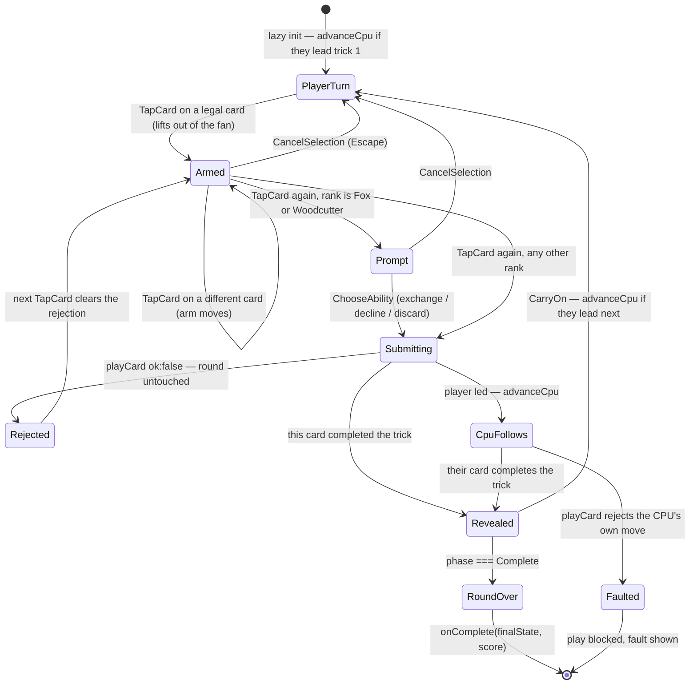

# Plan: War Council UI — hand, trick area, trump/decree, score

Plan folder: `.claude/contract/SCRUM-28-war-council-ui/`
Execution status: see `tasks.md` in this folder.

**The approved visual and interaction target is `mockup.html` in this folder.** It is not an illustration of the plan — it is the specification for what the finished screen looks like and how it behaves. Where this document and the mockup disagree, the mockup wins and this document is wrong.

---

## Part 1 — Alignment

### Task reference

Jira issue **SCRUM-28** — "War Council UI — hand, trick area, trump/decree, score" (Story, child of epic SCRUM-18). Moved `To Do → Planning` at the start of this run.

**Problem statement (verbatim):** "The player needs a real surface to play the War Council round on — select and play cards, see the current trick, see what's trump/decree, and see the running score. Without this, the War Council engine is unplayable by a human."

**User story (verbatim):** "As a player, I want to see my hand, the current trick, the trump/decree card, and both sides' trick counts, and to play a card by selecting it, so that I can actually play a War Council round."

**Acceptance criteria (verbatim):**

1. The player's hand renders as a set of selectable cards; selecting and confirming a card submits it to the engine and is rejected/disabled if illegal per the engine's own legality check (no client-side re-implementation of legality — the UI defers to the engine).
2. The current trick-in-progress (cards played so far this trick, by whom) is visible.
3. The active trump/decree card is visible and updates immediately when the odd-card ability mutates it mid-trick.
4. Running trick counts for both sides are visible and update after each trick resolves.
5. Component tests (Vitest, React Testing Library conventions per the react-frontend skill) query by accessible role and label — e.g. a card is a `button` with an accessible name identifying rank and suit — and cover: selecting and playing a legal card, and a disabled/rejected state for an illegal one.
6. No card art assets exist yet — this ticket may ship with CSS/text-based card faces (suit symbol + rank) as the default; see the visual-direction ticket for the decision this ticket should not block on.

**Scope boundaries (verbatim):** In scope — hand rendering, trick area, trump/decree display, score display, card selection/play interaction. Out of scope — the Vanguard board, the Muster/Clash HUD, final visual polish/art direction (this ticket ships a functional default, not final visuals).

**Dependencies & risks (verbatim):** "Depends on the War Council engine (to render/submit against) and the battle loop orchestrator (a loop to actually be shown inside). Also depends on SCRUM-37 (app shell — mode-select scaffold & game-mount contract) — do not start this ticket until SCRUM-37 is done, since it defines the mount-prop contract this UI must be built against. Risk: card art direction is a visual-judgement pause condition per `CLAUDE.md` — do not let this ticket stall on it; ship the CSS/text default and let the visual-direction ticket revisit if the developer wants more."

All three dependencies are landed: `src/warCouncil/` (SCRUM-19/20/26), `src/battle/` (SCRUM-19/25/26/27), `src/app/` (SCRUM-37).

**Decisions confirmed interactively, 2026-08-05, in the order they were taken:**

1. **Skills** — `react-frontend`, `implementation-doc-writer`, and `game-designer` confirmed. The last two were proposed as not applying; the developer ticked them.
2. **Test-environment dependencies** — `jsdom`, `@testing-library/react`, `@testing-library/dom` approved as devDependencies, with a second Vitest project scoped to `*.test.tsx`.
3. **Ability prompts** — the Fox/Woodcutter choice UI is **in scope**; without it the engine rejects those ranks with `MissingAbilityChoice` and a hand holding a Fox dead-ends.
4. **App wiring** — a minimal dev host in `App.tsx` is **in scope**, so the round is playable by hand and QA can drive it.
5. **Full-viewport, no scrolling** — the developer's own constraint: "any game you play will be full screen with no scrolling, so we'll have to match that." Research established that the unit for this is `dvh`/`svh`, not `vh`.
6. **Tap-twice to confirm** — the developer chose confirmation on the card itself over a separate confirm button.
7. **The mockup is the output.** The first mockup was rejected — "I hated [it] because it looked like a webpage." The rebuilt `mockup.html` was approved as the target, along with a correction moving the decree onto the felt.
8. **A `game-ux` skill was created** from the research in this session (`.claude/skills/game-ux/`) and now owns the game-screen standards this plan is built against.

### Restated goal

Build the playable War Council round as a real game screen, matching `mockup.html`. A new `src/app/warCouncil/` holds a mount component satisfying SCRUM-37's existing `WarCouncilMountProps`: it takes a dealt `WarCouncilState` in and reports the finished round through `onComplete`. The screen is one full-viewport grid that never scrolls — opponent plate and scoreboard along the top, a felt table holding the decree card, the draw pile, the trump mark and the trick well, and the player's hand fanned across the bottom. A card is played by tapping it once to lift it out of the fan and again to commit, with a Fox or Woodcutter opening its choice prompt on the felt in between. Every rules question is delegated to the existing engine — `legalMoves` decides what is tappable, `playCard` decides what commits, `chooseCpuMove` plays the opponent — and all sequencing lives in one pure reducer unit-tested with no renderer. `App.tsx` gains a minimal host that deals a round and mounts it, and this ticket resolves the DOM-test-environment decision SCRUM-37 deferred to it.

### In scope

**The surface** — every item below is specified by `mockup.html`:

- A full-viewport shell: `100dvh`, `width: 100%`, `overflow: hidden`, `display: grid` with `grid-template-rows: auto 1fr auto` (status / table / hand) and `env(safe-area-inset-*)` padding. No page scroll at any viewport size.
- Top band: an opponent plate (face-down card stack plus a held count) and a three-cell scoreboard — your tricks, the trick number, their tricks — anchored to opposite edges (**AC4**).
- The felt table: an inset play surface holding the decree card face-up with the draw pile stacked behind it, a `<suit> is trump` chip, the pile count, and a faintly-marked trick well in the centre (**AC3**).
- The trick well: each card played so far this trick labelled by side, and the just-resolved trick held on screen with its winner marked until the player taps to carry on (**AC2**).
- The hand: a fanned, overlapping row of cards, rotated and arced, each a `<button>` whose accessible name identifies rank and suit, lifting on hover and further when armed (**AC1**).
- Card faces in CSS and text — parchment ground, serif rank, an inline-SVG suit mark tinted per suit, and a brass pip on the five ability-bearing ranks (**AC6**).
- Ability prompts rendered on the felt rather than in a modal, so the hand stays visible while choosing which card to give away or discard.
- A round-over panel showing both sides' tricks and points, and a visible engine-fault state that blocks play.

**The interaction:**

- Tap once to arm a card — it lifts and a hint names it; tap the same card again to commit (**AC1**). Tapping a different card moves the arm. `Escape` disarms.
- Arming a Fox or Woodcutter and tapping again opens its prompt instead of playing; choosing an option commits the card with that `AbilityChoice`.
- Illegal cards are `disabled` and visually recessed, per `legalMoves`; a rejection from `playCard` renders the engine's own reason as human copy (**AC1**).
- Tap the table to carry on from a resolved trick; on the final trick that same action reports the round via `onComplete`.
- Roving tabindex across the hand: one card in the tab order, arrow keys within, `Enter`/`Space` to arm and commit, `Escape` to cancel.

**The plumbing:**

- A pure reducer owning every transition, plus pure modules for labels and fan geometry — all unit-tested in the node environment.
- `jsdom` + `@testing-library/react` + `@testing-library/dom` as devDependencies, and a second Vitest project in `vite.config.ts` scoped to `*.test.tsx`, leaving the existing 34 node-environment spec files untouched.
- Component specs querying by role and label, covering a legal play, a disabled illegal card, and the keyboard path (**AC5**).
- `viewport-fit=cover` on `index.html`'s viewport meta, without which every safe-area inset resolves to zero.
- `src/styles/global.css`: remove `min-height: 100vh` — the exact anti-pattern the research names — and stop the document scrolling.
- A minimal dev host in `App.tsx` that deals one round, mounts the component, and renders the `onComplete` result.
- Deleting `src/app/stubs/WarCouncilStub.tsx`, which `.docs/implementation/app.md` says this ticket replaces wholesale.
- Adding `sameCard` and `containsCard` to `src/warCouncil/index.ts`'s exports.
- Updating `.docs/implementation/app.md` and its `README.md`.

### Explicitly out of scope

- The Vanguard board UI (SCRUM-29), the Muster/Clash HUD, and `VanguardStub.tsx` — untouched.
- Battle-loop wiring. `.docs/implementation/app.md` assigns that to SCRUM-34, which should **replace** the `App.tsx` host added here rather than extend it.
- Card art assets, illustration, and animation beyond the mockup's card lift and the carry-on hint pulse.
- The Campaign/Test mode-select menu. `AppMode` keeps its existing state slot and deliberately-absent setter.
- Any change to the rules: no new legality check, no new scoring rule, no change to `playCard`, `legalMoves`, `resolveTrickWinner`, `scoreRound`, or `chooseCpuMove`. The only edit inside `src/warCouncil/` is widening the barrel's exports.
- Multi-round play. This mount spans exactly one round per `WarCouncilRoundResult`.
- Drag-to-play. The research is explicit that it is the wrong primary interaction, and tap-twice replaces it.
- A light theme for the game screen. The surface commits to one dark visual world (see Assumptions).
- Consolidating the duplicated `13` (`TRICKS_PER_ROUND` vs. `deal.ts` vs. `playCard.ts`) — acknowledged debt recorded in `app.md`.
- Persistence, save/replay, undo. Nothing in this repository stores state and this ticket does not start.
- Treasure's mid-round point bonus, and every other deferred engine behaviour in `.docs/implementation/war-council.md`.

### Pattern Reference

- **`mockup.html` in this folder — the authoritative layout, interaction, and visual reference.** Developer-approved. It carries the shell grid, the zone placement, the fan geometry, the palette, the SVG suit marks, the copy, and the tap-twice flow. Every UI task cites it.
- **`src/app/warCouncilMount.ts`** — the prop contract. `WarCouncilMountProps` (`initialState`, `onComplete`) and `WarCouncilRoundResult` (`finalState` with `phase === RoundPhase.Complete`, plus `score`).
- **`src/app/stubs/WarCouncilStub.tsx`** — the shape of a mount honouring that contract, and the file this ticket deletes.
- **`src/app/stubs/VanguardStub.tsx`** — the nearest existing non-trivial component: prop destructuring style, `as const` maps, derived-rather-than-assigned state.
- **`src/vanguard/__tests__/testBoard.ts`** and **`src/battle/__tests__/battleTestHelpers.ts`** — the precedent for a non-spec fixture helper inside `__tests__/`; the `*.test.ts` include pattern does not collect it.
- **`.claude/skills/game-ux/SKILL.md`** and its **`references/full-viewport-layout.md`** — the shell skeleton, the viewport-unit choice, zoning, interaction cost, and the roving-tabindex model. Written from this session's research.
- **`.docs/implementation/war-council.md`** — cited, never restated, for every rule this UI surfaces: the follow-suit and Monarch narrowing rules (§ *Legal-move validation*), the Fox's pre-resolution trump mutation (§ *The Fox's mid-trick trump mutation*), `playCard`'s rejection order (§ *`playCard` — the single reducer-shaped entry point*), and the CPU heuristic's guarantee that it only returns a move `playCard` accepts (§ *The CPU heuristic*).
- **`.docs/implementation/app.md`** § *The two stubs* — states SCRUM-28 replaces `WarCouncilStub` wholesale; § *Deferred* records the `.tsx`/jsdom decision as this ticket's.
- **`.claude/skills/react-frontend/SKILL.md`** — the MUST/NEVER contract, the reducer mandate, the accessibility floor, and § *Testing*'s instruction on the environment split.

### Constraints flagged on the brief

- **The screen fills the viewport and never scrolls** — the developer's own constraint, and the reason the shell is designed before any content is placed.
- **The UI must not re-implement legality.** Stated twice in AC1. Every legality question routes to `legalMoves` and `playCard`; nothing in the reducer compares a suit or a rank.
- **Card art is a visual-judgement pause condition and this ticket must not stall on it.** The mockup's approval converts the visual defaults from open questions into transcribed, developer-confirmed values.
- **Component tests query by accessible role and label**, a card being a `button` named by rank and suit.
- **Build against SCRUM-37's mount-prop contract**, unchanged.
- **Two runtime dependencies is deliberate.** The three additions are devDependencies with zero bundle cost.
- **Do not flip the global Vitest environment to `jsdom`** — `react-frontend` names this explicitly; it would remove the no-DOM guarantee from all 34 existing pure-logic specs at once.
- **Determinism** — the engine takes `rng` injected and holds no internal `Math.random()`. The single randomness site added here is the `App.tsx` host passing `Math.random` to `dealRound`, where the engine's own docs say production wiring belongs.

### Assumptions made

- **The mockup's values are transcribed, not invented.** Every colour, the `clamp()` card-size bounds, the fan rotation step and overlap, and all copy come from the approved mockup verbatim into named CSS custom properties and named constants. The developer approved the mockup as "the output I want to see", so these are confirmed defaults, each retunable in one line. Nothing in this plan invents a tuning value.
- **The game screen commits to a single dark theme.** A card table in a dark room is a deliberate visual world, which `artifact-design` and `game-ux` both permit as a choice rather than an omission. `global.css` keeps `color-scheme` for any future non-game screen; the game shell sets `color-scheme: dark` locally. Flagged under Risks as reversible.
- **`dvh`, not `svh`.** The shell never scrolls, so `dvh`'s reflow-on-toolbar-change — the reason to prefer `svh` on a scrolling page — cannot be triggered by scrolling here. `dvh` gives the fuller surface. One-word change if a mobile toolbar animation proves ugly.
- **The mount drives the CPU itself.** `WarCouncilMountProps` hands over a `WarCouncilState`, not a `BattleState`, so `src/battle/playCpuWarCouncilTurn` is unusable here. The mount calls `chooseCpuMove(round, PlayerSide.Cpu)` + `playCard` directly — the only way a round progresses under SCRUM-37's contract, and `chooseCpuMove` is documented as legality-generic per side.
- **A resolved trick is held until the player taps to carry on.** `playCard` clears `currentTrick` the instant the second card lands, so the winning card would otherwise never be seen. An explicit tap is deterministic, needs no timer, and invents no delay value.
- **The feature uses no `useEffect` at all.** Every transition is a user event or a lazy initializer, including the roving tabindex's focus moves, which happen inside the keydown handler. `.docs/implementation/app.md` records that a synchronous `setState` in an effect body fails this project's `react-hooks/set-state-in-effect` rule and SCRUM-37 hit it for real; an event-driven design sidesteps it honestly and leaves no listener, timer, or observer to clean up.
- **Ability cards carry a pip, not a printed name.** "WOODCUTTER" cannot fit at the card width without becoming unreadable — it truncated to "WOODCU" in the mockup's first pass and the developer saw it. The rank already identifies which ability; the full name lives in the accessible label and in the hint beneath the hand.
- **Roving tabindex is included in this ticket.** It is in `game-ux`'s hard floor, and thirteen individual tab stops is a worse keyboard path than none. Confined to `HandFan.tsx` plus one component test — strike it if you would rather ship narrower, and it becomes a follow-up.
- **Suit marks are inline SVG, not emoji or Unicode glyphs.** Emoji read as web chrome, and the Unicode candidates for a bell and a key have unreliable font coverage. Three short hand-authored paths give full control of colour and size.
- **Fox/Woodcutter prompts, the `App.tsx` host, and the three devDependencies** — developer-confirmed above.
- **New folder `src/app/warCouncil/`**, a sibling of `warCouncilMount.ts`. `app/` already consumes both engines and is expected to import React; `src/warCouncil/` is barred from importing React by `eslint.config.js:24`. No new ESLint boundary is added or needed.
- **No barrel for the new folder.** `App.tsx` imports the component directly — `src/app/index.ts` deliberately excludes components, and a `.ts` barrel re-exporting one is a needless brush with `react-refresh/only-export-components`.
- **Card equality comes from the engine.** `sameCard`/`containsCard` are added to `src/warCouncil/index.ts` rather than deep-imported or re-implemented.
- **`WarCouncilStub.tsx` is deleted.** Pre-authorised by `.docs/implementation/app.md`; grepped, and its only hits are its own definition and documentation prose.

### Config and persisted-shape audit

- **Configuration keys renamed, retyped, or removed: none.** No configuration key is added or changed. `WAR_COUNCIL_FIRST_DEALER` (`src/battle/config.ts`) is **read** by the new `App.tsx` host, not modified — it currently has exactly 1 consumer (`startBattle.ts`) and this adds a second. Its value stays SCRUM-25's placeholder.
- **Persisted shapes affected: none — nothing in this repository is persisted.** Grepped `src/` for `localStorage|sessionStorage|indexedDB|JSON.parse|JSON.stringify`: **2 hits, both in one test** (`src/vanguard/__tests__/expand.test.ts:61,63`, using `JSON.stringify` as a mutation guard). Recording explicitly that this window is open: round state lives only in a `useReducer`, so persistence can be added later with no migration. The first ticket that stores a `WarCouncilState` closes it.
- **Type changes for loss: none of the lossy kinds.** `WarCouncilMountProps` and `WarCouncilRoundResult` are consumed unchanged — no `number`→`string`, no array→object, no required→optional, no widened union. The only type-surface change is **additive**: two function exports on `src/warCouncil/index.ts`. `WarCouncilMountProps` has **4 hits** in `src/` (declaration, barrel re-export, two in `WarCouncilStub.tsx`); the two stub hits go with the deleted file and are replaced by the real mount.
- **Consumers of changed exported constants or predicates: none changed.** `legalMoves`, `playCard`, `chooseCpuMove`, `scoreRound`, `sameCard`, `containsCard` are all called, none altered. `sameCard` and `containsCard` currently have 5 and 4 internal call sites inside `src/warCouncil/`; a barrel export touches none of them.
- **String-bound names introduced, and where they bind.** Four surfaces:
  1. **`vite.config.ts` test globs** — `include: ['src/**/__tests__/**/*.test.ts']` (1 occurrence today) must keep collecting **exactly the 34 files / 268 tests** that pass now, while a second project adds `*.test.tsx`. There are **0** existing `.test.tsx` files. This is the one change that can silently un-run tests, so it carries a before/after count check.
  2. **CSS custom properties and class names** in the new `warCouncil.css`, bound by string from the `.tsx` files. `src/` has exactly **1** CSS file today (`src/styles/global.css`, 14 lines) and no per-component precedent, so this establishes one; classes are prefixed `wc-`.
  3. **SVG `<symbol>` ids** (`s-bells`, `s-keys`, `s-moons`) referenced by `<use href>`. A rename type-checks cleanly and renders nothing — the specific failure the traps list warns about. One task owns the symbol sheet and its only consumer.
  4. **Accessible names and labels**, bound by string from the component specs' `getByRole`/`getByLabelText` queries. `data-testid` has **0** hits in `src/` and this ticket adds none.
- **Architectural boundary not crossed.** `eslint.config.js:24` scopes the pure-core override to `src/warCouncil/**` and `src/vanguard/**`. Every file created here is under `src/app/`, which `.docs/implementation/app.md` records as deliberately outside that boundary. The one edit inside it — two export lines in `src/warCouncil/index.ts` — imports nothing and touches no DOM global. Verified by the boundary grep in Final verification.

---

## Part 2 — Technical design

### Approach

The design has two independent halves, and the order between them matters. The first is the **shell**, because `game-ux` is explicit that retrofitting a no-scroll grid around a laid-out screen is the expensive order: `warCouncil.css` defines a `100dvh`, `overflow: hidden`, `auto / 1fr / auto` grid with safe-area padding before any content exists, `index.html` gains `viewport-fit=cover` so those insets are non-zero, and `global.css` loses its `min-height: 100vh`. Everything placed afterwards is sized in `clamp()` and `vmin` so it scales into the space rather than pushing the layout out of it. One trap this sets is worth naming up front because the mockup hit it: **card rotation and lift are transforms, which do not affect layout size**, so a fanned hand's visual pixels spill outside its box and the shell's `overflow: hidden` crops them. The fix is to reserve the room explicitly on the fan container, not to loosen the overflow.

The second half is the **state machine**, and it is all in one pure reducer. The sequencing is genuinely non-trivial — an armed card, an ability choice, a rejection, an interleaved CPU turn, and a trick-reveal beat — which is exactly the condition under which `react-frontend` mandates a reducer. `roundReducer.ts` imports the engine and never React, so every interesting invariant is testable in the cheap node project and the components have nothing left to test but rendering. Tap-twice falls out of this cleanly rather than needing a second action: `TapCard` on an unarmed card arms it, and `TapCard` on the already-armed card commits it — or, for a Fox or Woodcutter, opens the prompt that will supply the `AbilityChoice`. There is no separate confirm action and no confirm button, which is the point: the research found Dire Wolf's own Fox in the Forest app criticised for exactly the extra trip a distant confirm control imposes.

Three details keep the reducer honest. Trick resolution is **derived, not recomputed** — a trick resolved iff `after.tricksPlayed > before.tricksPlayed`, and the winner is whichever side's `tricksWon` went up — so the UI never calls `resolveTrickWinner` itself and cannot pass it a stale trump suit. A rejection of the *player's* move sets `rejection` and leaves `round` untouched, matching the engine's no-partial-mutation guarantee. A rejection of the *CPU's own* move sets a separate `cpuFault`, renders as a visible error, and blocks play — because `chooseCpuMove` is documented to only ever return a move `playCard` accepts, so a rejection there is an engine bug that must not be laundered into a message reading as though the player erred.

The consequence worth calling out is that **this feature contains no `useEffect`**. The opponent's opening lead comes from a lazy `useReducer` initializer, pure and therefore safe under StrictMode's double-invocation; every other transition is a tap or a keypress. Even the roving tabindex's focus move is imperative inside the keydown handler rather than an effect reacting to a focus-index state change. The alternative — an effect watching for "it's the CPU's turn" and dispatching — is what a React developer reaches for first and is wrong twice here: it calls `setState` synchronously in an effect body, which `.docs/implementation/app.md` records as failing this project's `react-hooks/set-state-in-effect` rule, and it double-fires under StrictMode. With no effects there is no listener, timer, observer, or `AbortController` anywhere in the diff, and therefore no cleanup to get wrong.

Rendering splits along the mockup's zones, one small component each: `RoundStatusBand` (opponent plate + scoreboard), `DecreePile` (decree, draw pile, trump chip — on the felt, where the developer moved it), `TrickWell`, `HandFan`, `AbilityPrompt`, `RoundOverPanel`, with `PlayingCard` and `SuitMark` shared by all of them. `PlayingCard` taking a `variant` of `hand | table | pile` is what makes "a played card is a record, not a choice" a single prop rather than three near-duplicate components — table and pile cards render condensed and non-interactive. Fan geometry goes in its own pure `fanLayout.ts` so the rotation, arc, overlap, and z-order are unit-tested for symmetry rather than eyeballed in a browser.

Test infrastructure is narrow and deliberate. `vite.config.ts` grows a `test.projects` array: a `node` project keeping today's `environment: 'node'` and `*.test.ts` include, and a `dom` project on `jsdom` scoped to `*.test.tsx`, both `extends: true` so the React plugin is inherited. This is the shape `react-frontend` asks for; its other suggestion, `environmentMatchGlobs`, was removed from Vitest before the installed 4.1.10. Because the node project's include is unchanged, the pass criterion is exact: 34 files and 268 tests before, at least 34 and 268 after. One limitation is stated rather than worked around — **jsdom has no layout engine, so no Vitest test can prove the screen does not scroll.** That check belongs to QA in a real browser at named viewport sizes, and it has a right answer, so it is not a developer observation.

### Skills to invoke during execution

- **`react-frontend`** — governs every file under `src/`. Owns the reducer mandate that shapes the design, the `as const` object-map form for action kinds (`erasableSyntaxOnly` forbids `enum`), the file-order rule, the 400-line ceiling measured not estimated, plain CSS in a per-component file, the generic accessibility floor, the role-and-label testing posture, and § *Testing*'s instruction on the environment split.
- **`game-ux`** — created in this session and the authority for the shell and the interaction. Owns the `dvh`-not-`vh` choice, `overflow: hidden`, safe-area insets, the zone model, condensed table cards, the tap-cost rule behind tap-twice, the hover-only prohibition, the roving-tabindex model, and the statement that layout claims are verified in a browser rather than in jsdom. Read `references/full-viewport-layout.md` for the shell skeleton before writing CSS.
- **`implementation-doc-writer`** — owns the cumulative update to `.docs/implementation/app.md` and its `README.md`: the module graduates from `scaffold`, `WarCouncilStub` leaves, and several *Deferred* entries this ticket satisfies move out. Developer ticked it, so it is a planned task rather than a post-`/fb-apply` pass.
- **`game-designer`** — developer override; proposed as not applying and ticked anyway. Scoped narrowly: confirm the surface exposes what a round's decisions need — trump visible before a card is chosen, trick counts visible while the scoring threshold still matters — and confirm no design or tuning value is invented. Its own SKILL.md excludes implementing a mechanic and scoping work, so it governs no file here.

Also read during execution: **`.claude/workflow/web-project.md`** (paths, runners, correctness traps — the StrictMode double-invocation and string-bound-name traps apply directly). **`.claude/rules/`** was scanned and holds only `README.md` with an empty index — no rule file to read.

### Diagram



### Data shapes

#### `src/app/warCouncil/roundReducer.ts` (new, pure — no React import)

```ts
import type { AbilityChoice, Card, IllegalMoveReason, PlayerSide, TrickCard, WarCouncilState } from '../../warCouncil'

export interface ResolvedTrick {
  readonly cards: readonly TrickCard[] // [lead, follow] — the engine's load-bearing order
  readonly winner: PlayerSide
}

export interface RoundUiState {
  readonly round: WarCouncilState
  readonly armed: Card | null                  // tapped once, lifted, awaiting its second tap
  readonly prompt: Card | null                 // a Fox or Woodcutter awaiting its AbilityChoice
  readonly resolvedTrick: ResolvedTrick | null // held on screen until CarryOn
  readonly rejection: IllegalMoveReason | null // the player's own illegal move — recoverable
  readonly cpuFault: CpuFault | null           // a corrupt CPU turn — a bug, shown not swallowed
}

// `chooseCpuMove` throws rather than returning a rejection when the CPU has no legal
// move (`lowestCard([])` is `undefined`, then `card.rank` throws), so the reducer guards
// before calling it and names that case separately from a `playCard` rejection.
export type CpuFault = IllegalMoveReason | 'noLegalMove'

export const RoundUiActionKind = {
  TapCard: 'tapCard',
  ChooseAbility: 'chooseAbility',
  CancelSelection: 'cancelSelection',
  CarryOn: 'carryOn',
} as const
export type RoundUiActionKind = (typeof RoundUiActionKind)[keyof typeof RoundUiActionKind]

export type RoundUiAction =
  | { readonly kind: typeof RoundUiActionKind.TapCard; readonly card: Card }
  | { readonly kind: typeof RoundUiActionKind.ChooseAbility; readonly choice: AbilityChoice }
  | { readonly kind: typeof RoundUiActionKind.CancelSelection }
  | { readonly kind: typeof RoundUiActionKind.CarryOn }

/** Initial UI state — advances the CPU when it leads trick 1, so the player always sees the lead. */
export function createRoundUiState(initialState: WarCouncilState): RoundUiState

export function roundReducer(state: RoundUiState, action: RoundUiAction): RoundUiState
```

`TapCard` is the whole of tap-twice: an unarmed card arms; the already-armed card commits, or opens `prompt` when its rank is `CardRank.Fox` or `CardRank.Woodcutter`.

#### `src/app/warCouncil/labels.ts` (new, pure)

```ts
export const SUIT_NAME: Readonly<Record<Suit, string>>   // Bells | Keys | Moons
export const RANK_NAME: Readonly<Record<number, string>> // keyed by CardRank.Swan … .Monarch

/** "3 of Keys (Fox)" for a named rank, "7 of Bells" otherwise. */
export function cardAccessibleName(card: Card): string

// Exhaustive by construction — a widened IllegalMoveReason union fails to compile here
// rather than rendering `undefined`.
export const ILLEGAL_MOVE_MESSAGE: Readonly<Record<IllegalMoveReason, string>>
```

Copy transcribed from the mockup, including `MustFollowLeadSuit` → "You must follow the led suit." and `MustFollowMonarch` → "The Monarch was led — play your Swan or your highest card of that suit."

#### `src/app/warCouncil/fanLayout.ts` (new, pure)

```ts
export const FAN_ROTATION_STEP_DEG = 2.1
export const FAN_LIFT_FACTOR = 0.13
export const FAN_OVERLAP_PX = { loose: -4, medium: -10, tight: -18 } as const
export const FAN_ARMED_Z_INDEX = 20

export interface FanPlacement {
  readonly rotateDeg: number
  readonly liftPct: number
  readonly overlapPx: number
  readonly zIndex: number
}

export function fanPlacement(index: number, count: number, armed: boolean): FanPlacement
```

Values transcribed from the mockup. Invariants its spec asserts: symmetric about the centre, zero rotation at `count === 1`, `overlapPx === 0` at `index === 0`, and an armed card taking the top `zIndex`.

#### Component signatures (new)

```ts
// PlayingCard.tsx — one card, three renderings
interface PlayingCardProps {
  readonly card: Card
  readonly variant: 'hand' | 'table' | 'pile' // table and pile render condensed and inert
  readonly armed?: boolean
  readonly illegal?: boolean
  readonly winner?: boolean
  readonly tabIndex?: number                   // roving tabindex: 0 for one card, -1 for the rest
  readonly style?: React.CSSProperties         // fan placement, from fanPlacement()
  readonly onTap?: (card: Card) => void
}

// SuitMark.tsx — <use href="#s-bells|#s-keys|#s-moons"> against the inline symbol sheet
interface SuitMarkProps { readonly suit: Suit; readonly className?: string }

// RoundStatusBand.tsx — AC4
interface RoundStatusBandProps {
  readonly tricksWon: Readonly<Record<PlayerSide, number>>
  readonly tricksPlayed: number
  readonly opponentHandCount: number
  readonly roundComplete: boolean
}

// DecreePile.tsx — AC3, on the felt
interface DecreePileProps {
  readonly decree: Card
  readonly trumpSuit: Suit
  readonly drawPileCount: number
}

// TrickWell.tsx — AC2
interface TrickWellProps {
  readonly currentTrick: readonly TrickCard[]
  readonly resolvedTrick: ResolvedTrick | null
}

// HandFan.tsx — AC1, owns the roving tabindex
interface HandFanProps {
  readonly hand: readonly Card[]
  readonly legal: readonly Card[] // from legalMoves(round, PlayerSide.Player)
  readonly armed: Card | null
  readonly interactive: boolean
  readonly hint: string
  readonly onTap: (card: Card) => void
  readonly onCancel: () => void
}

// AbilityPrompt.tsx — rendered on the felt, not in a modal
interface AbilityPromptProps {
  readonly card: Card
  readonly decree: Card
  readonly hand: readonly Card[]  // hand minus the armed card
  readonly drawnCard: Card | null // drawPile[0] for Woodcutter, null for Fox
  readonly onChoose: (choice: AbilityChoice) => void
  readonly onCancel: () => void
}

// RoundOverPanel.tsx
interface RoundOverPanelProps {
  readonly tricksWon: Readonly<Record<PlayerSide, number>>
  readonly score: Readonly<Record<PlayerSide, number>> // from scoreRound
  readonly onFinish: () => void
}

// WarCouncilRound.tsx — default export, implements the SCRUM-37 contract
function WarCouncilRound({ initialState, onComplete }: WarCouncilMountProps): React.JSX.Element
```

#### `src/app/warCouncil/warCouncil.css` (new) — tokens transcribed from the mockup

| Property | Value | Owns |
|---|---|---|
| `--wc-chamber` | `#0c1013` | outer ground |
| `--wc-chamber-lift` | `#141a1f` | status plates |
| `--wc-felt` / `--wc-felt-lip` / `--wc-felt-line` | `#16241f` / `#0a1211` / `#2b4038` | the table |
| `--wc-parchment` / `--wc-parchment-shade` | `#e9e1cd` / `#d3c8ae` | card face |
| `--wc-ink` / `--wc-ink-soft` | `#191610` / `#5c5443` | card text |
| `--wc-brass` / `--wc-brass-dim` | `#c99a4e` / `#7d6132` | selection, trump, winner |
| `--wc-chalk` / `--wc-chalk-dim` | `#cdd6d2` / `#6f7d78` | on-felt text |
| `--wc-alarm` | `#d1705f` | rejection and fault |
| `--wc-bells` / `--wc-keys` / `--wc-moons` | `#c9873f` / `#5f93a8` / `#9c7cb8` | three distinct suit hues |
| `--wc-card-w` | `clamp(2.9rem, 6.2vmin, 4.3rem)` | hand card width; `aspect-ratio: 2 / 3` |
| `--wc-plate-card-w` | `clamp(2.3rem, 4.6vmin, 3.2rem)` | condensed table and pile cards |

Shell: `height: 100dvh; width: 100%; overflow: hidden; display: grid; grid-template-rows: auto 1fr auto;` plus `env(safe-area-inset-*)` padding and `color-scheme: dark`.

#### Modified files

```ts
// src/warCouncil/index.ts — additive
export { containsCard, sameCard } from './cardUtils'
```

```ts
// vite.config.ts
test: {
  projects: [
    { extends: true, test: { name: 'node', environment: 'node', include: ['src/**/__tests__/**/*.test.ts'] } },
    { extends: true, test: { name: 'dom', environment: 'jsdom', include: ['src/**/__tests__/**/*.test.tsx'] } },
  ],
}
```

```html
<!-- index.html — without viewport-fit=cover every safe-area inset resolves to 0 -->
<meta name="viewport" content="width=device-width, initial-scale=1.0, viewport-fit=cover" />
```

`src/styles/global.css` — remove `min-height: 100vh` from `body` and prevent document scrolling.

#### `package.json` — devDependencies only, no runtime dependency

| Package | Why | Cost |
|---|---|---|
| `jsdom` | The DOM environment AC5's component tests run in. Node has no DOM, so there is no platform alternative. | devDependency; zero bundle impact. |
| `@testing-library/react` | `render`, `screen`, `fireEvent`, `cleanup` — the role-and-label API AC5 names by convention. | devDependency; zero bundle impact. |
| `@testing-library/dom` | Peer dependency of `@testing-library/react` v16+; listed explicitly so the committed lockfile is unambiguous. | devDependency; zero bundle impact. |

No script names change. `npm test` stays `vitest run` and collects both projects.

#### Not changed

No configuration key added or renamed. No persisted shape. No change to any engine function's signature or behaviour.

### Runtime quality notes

- **Purity and adjudication:** `labels.ts`, `fanLayout.ts`, and `roundReducer.ts` import no React and touch no DOM global; all three are tested in the node project, which is itself the boundary check. The reducer contains **no suit comparison, no rank comparison, and no trick-winner computation** — `legalMoves` decides what is playable, `playCard` what commits, `chooseCpuMove` the opponent's move, `scoreRound` the reported score, and the trick winner is derived from the `tricksWon` delta. Card equality is the engine's `sameCard`/`containsCard`. No component decides a rule. Every visual value is a named CSS custom property or a named constant in `fanLayout.ts`, transcribed from the approved mockup — nothing is a bare literal at a use site.
- **Effects, mount and teardown:** **there are no effects in this feature**, so there is no listener, observer, timer, `requestAnimationFrame`, or `AbortController` to release and no cleanup to omit. The roving tabindex moves DOM focus imperatively inside its keydown handler rather than from an effect watching a focus index. Two lazy initializers run under StrictMode's double-invocation: `useReducer(roundReducer, initialState, createRoundUiState)` is pure and recomputes an identical value; `App.tsx`'s `useState(() => dealRound(…, Math.random))` is **not** idempotent, so a second invocation deals a hand React then discards — wasteful in development only, never two live rounds, and recorded here so it is a decision rather than a surprise. No module-level mutable state anywhere in the diff. `onComplete` is called from a tap handler, never an effect, so it cannot double-fire on a second mount.
- **Hot-path cost:** no high-frequency interaction exists — no drag, scroll, resize, or pointer-move handler — so nothing needs to be kept off the reconciler and no ref-mutation path is warranted. The heaviest per-tap work is one `legalMoves` over at most 13 cards plus one `playCard`; `chooseCpuMove` evaluates at most 13 candidates through `resolveTrickWinner`. Every collection is bounded by the 33-card deck. `fanPlacement` is called once per card per render — 13 calls of pure arithmetic. No `memo`, `useMemo`, or `useCallback` is added: there is no profiling evidence for any, and the skill forbids speculative memoisation.
- **Determinism and numeric safety:** the engine holds no internal `Math.random()` and this ticket adds none — the single randomness site is the `App.tsx` host passing `Math.random` to `dealRound`. The reducer is fully deterministic given its state, which is what lets its specs use hand-built fixtures with no seeding. `fanLayout.ts` is the only arithmetic added: it divides by nothing, but it does compute `index - (count - 1) / 2`, so its spec covers `count === 1` and `count === 0` explicitly to prove no `NaN` can reach a `transform` string — a `NaN` there renders an invalid declaration that is silently dropped, which is precisely the class of failure the traps list names. No other division exists in the diff, and every other rendered number is an integer read from `tricksWon`, `tricksPlayed`, or a `length`.
- **Error paths:** two distinct failure surfaces, neither swallowed. A player's illegal submission sets `rejection` to the engine's own named `IllegalMoveReason`, renders the mapped copy in a live region, and leaves `round` untouched — the play cannot commit. A corrupt CPU turn sets `cpuFault`, renders a visible error naming the cause, and blocks further play rather than retrying — it is an engine bug and must look like one. Its two cases are deliberately distinguished: **`'noLegalMove'`** is reachable and tested, because `chooseCpuMove` *throws* rather than rejecting when the CPU's legal set is empty (`lowestCard([])` yields `undefined`, then `card.rank` throws — the same sharp edge `battle.md` documents for `chooseCpuClashAction`), so the reducer checks `legalMoves` before calling it; a bubbled **`IllegalMoveReason`** covers a `playCard` rejection of a heuristic move, which is unreachable through today's engine and is therefore a defensive branch carried without a test rather than one faked with a contrived fixture. There is no `try`/`catch` in the diff and therefore no `catch { return DEFAULTS }`. **There is no async surface** — no promise, no fetch, no timer — so the four-async-states rule has nothing to apply to; the read-only zones do handle their empty cases (an empty trick well before the first card, a hand emptied by the final trick, a draw pile count of zero). No `console.log` or `console.debug` is introduced.

### Risks and judgement calls

- **The mockup is the specification, so a disagreement between it and the built screen is a defect, not a variation.** That is the intended reading, and it is stricter than a normal plan. If a mockup detail turns out to be impractical in React, the right move is to say so and get a decision, not to quietly diverge.
- **The visual defaults are transcribed but still yours.** Felt green, brass, parchment, the three suit hues, the SVG suit marks, the ability pip, the fan spread and overlap, and the `clamp()` card-size bounds are all one-line changes in `warCouncil.css` or `fanLayout.ts`. They are confirmed-by-mockup, not final.
- **Single dark theme is a commitment.** The game screen sets `color-scheme: dark` and does not offer a light variant. Reversible, but it means the game screen and any future non-game screen will not match by default.
- **Tap-twice's discoverability can only be judged by playing.** The hint under the hand names the armed card and says to tap again, which is the mitigation; whether a first-time player finds it without being told is a feel question no automated check answers.
- **Thirteen taps to arm plus thirteen to commit, plus thirteen to carry on.** That is the pacing cost of the chosen design, and it is the thing most likely to feel laborious over a full round. The timed auto-advance alternative needs a `TRICK_REVEAL_MS` value nobody has chosen, and the plan deliberately does not invent one.
- **Roving tabindex is assumed in.** Confined to `HandFan.tsx` plus one component test — say so and it becomes a follow-up ticket.
- **The `App.tsx` dev host will collide with SCRUM-34**, which should delete rather than extend it. Worth a note on that ticket.
- **`global.css` and `index.html` are app-wide edits made for one screen.** Removing `min-height: 100vh`, stopping document scroll, and adding `viewport-fit=cover` affect every future screen. Correct for a game, worth a conscious yes.
- **Three new devDependencies.** Approved in this session; recorded because the two-runtime-dependency rule is deliberate and this is the first addition since the scaffold.
- **The `vite.config.ts` split is the one change that can silently un-run tests.** Fumble the node project's include and specs stop being collected while the run still reports green. The plan pins the before/after numbers (34 files / 268 tests) and Final verification checks them, but it deserves your eye on the diff.
- **No test can prove the screen doesn't scroll.** jsdom has no layout engine. QA checks it in a browser at named viewport sizes; if that check is skipped, nothing else catches a regression.
- **`react-frontend`'s § *Testing* names a mechanism that no longer exists** — `environmentMatchGlobs`, removed from Vitest before 4.1.10. This plan uses `test.projects`. Fixing the skill is `/fb-issue` work.
- **`CLAUDE.md` and `.claude/workflow/web-project.md` both still describe this repository as an empty prototype scaffold** with only `App.tsx`, `main.tsx`, and one smoke test. There are 34 spec files, 268 tests, and four implemented modules. Out of scope here and genuinely `/fb-issue` work, but it is the most consequential stale fact in the repo: every plan written against those files starts from a false picture.
- **`WAR_COUNCIL_FIRST_DEALER` is `PlayerSide.Player`, SCRUM-25's placeholder.** The host reads it rather than choosing, so with today's value the *opponent* leads trick 1 (`dealRound` sets the leader to `otherSide(dealer)`) and the first thing the player sees is a card already on the table. Not this ticket's decision, but this is where it first becomes visible.
- **`game-designer` was loaded on developer override** and governs no file in this contract; its own SKILL.md excludes implementation and scoping.
