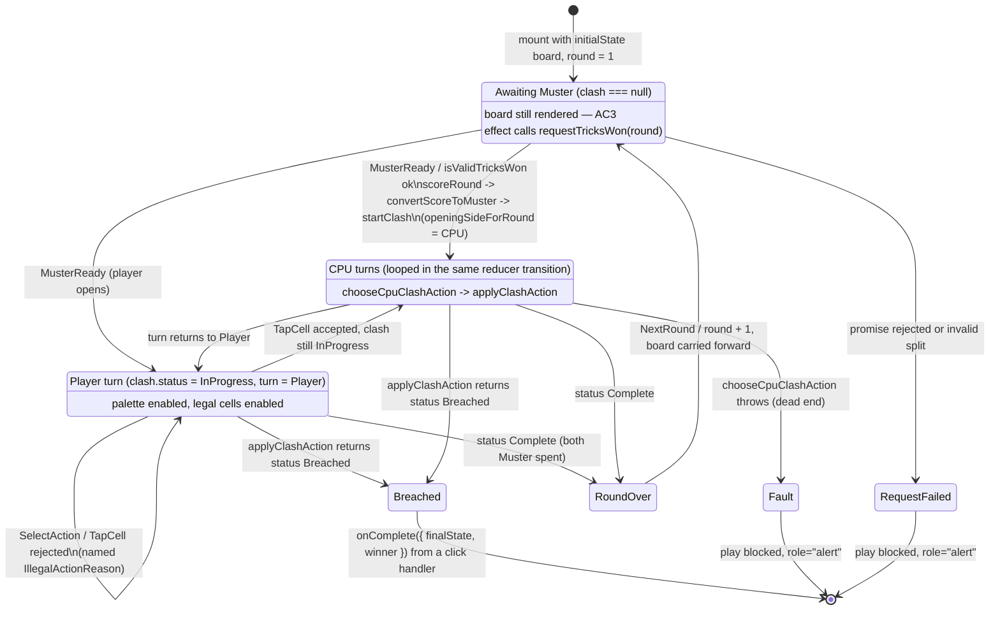

# Plan: Vanguard UI — hex board renderer and action selection

Plan folder: `.claude/contract/SCRUM-29-vanguard-ui/`
Execution status: see `tasks.md` in this folder.

---

## Part 1 — Alignment

### Task reference

[SCRUM-29 — Vanguard UI — hex board renderer and action selection](https://amazerbeam.atlassian.net/browse/SCRUM-29), a Story under epic SCRUM-18. Blocked by SCRUM-21 (board engine), SCRUM-25 (battle loop orchestrator), SCRUM-37 (app shell / mount contract) and SCRUM-22 (Muster conversion) — **all four are `Ready for Test`**, so this ticket is unblocked. It blocks SCRUM-30 (HUD), SCRUM-33 (polish), SCRUM-34 (loop wiring).

**Acceptance criteria, verbatim:**

1. The hex-grid rhombus renders with both bases, all currently placed tokens (owner distinguishable by colour, per `skirmish-board-replacement.md`: purple Player, green CPU), permanent defense cells, and the reinforced (+1) state of any token that holds it.
2. During the player's turn in The Clash, selecting an action (Expand/Overwrite/Reinforce) and then a target cell submits it to the engine and is rejected/disabled if illegal — no client-side re-implementation of legality.
3. The board remains visible (not hidden behind a phase transition) during the War Council phase, per `hybrid-concept.md`'s point that it's currently the only board→card information channel.
4. Component tests query by accessible role/label (a cell is e.g. a `button` with an accessible name identifying its coordinate and occupant) and cover: a legal Expand submission, a legal Overwrite submission, and a rejected/disabled illegal target.
5. Board and token visuals may ship as a functional default (solid-colour hex cells, simple token markers) — see the visual-direction ticket for final visual direction; this ticket should not block on it.
6. In Test mode (standalone Vanguard, per SCRUM-37's mount contract), the UI exposes a manual War Council score-entry control that runs through the SCRUM-22 Muster conversion to produce a move budget — reachable at the start of the session and again at the start of each subsequent round, instead of requiring a real War Council match. This control is Test-mode only and must not appear during Campaign.

**Scope boundaries, verbatim:** *In scope:* board rendering, token/base/defense-cell rendering, action + target selection UI, the Test-mode manual score-entry control. *Out of scope:* the Muster/turn HUD (whose-turn-is-it and moves-remaining live there), final visual polish.

**Dependencies & Risks, verbatim:** Depends on the Vanguard board engine (to render/submit against) and the battle loop orchestrator (loop to be shown inside). Also depends on SCRUM-37 (app shell — mode-select scaffold & game-mount contract) — do not start this ticket until SCRUM-37 is done, since it defines the mount-prop contract, including Vanguard's manual score-entry path, this UI must be built against — and on SCRUM-22 (Muster conversion) for that control's conversion logic. Risk: a full hex-grid board (illustrative size not yet fixed by the developer) needs a coordinate system decided early (axial/cube hex coordinates are the standard choice) — get this right before the HUD/wiring tickets build on top of it, since a coordinate-system change later touches every consumer.

**Follow-ups confirmed interactively (2026-08-05):**

- The developer delegated the Step 1.5c skill confirmation ("you pick the skills"). The skill list in Part 2 is therefore the planner's, with no developer override applied.
- **Board orientation, instructed at the approval gate:** "The home bases should be top and bottom, the players base on the bottom. Make the grid lean from left to right, so the bottom left corner is the most left." Applied to `hexPlacement` and the mockup; see Assumptions → *Board orientation*.

### Restated goal

Build the playable Vanguard board as a real game screen: a full-viewport, non-scrolling shell whose centre is the hex-grid rhombus, rendering both bases, every placed token in its owner's colour, the permanent defense cells, and which tokens carry the +1 reinforcement. Below it sits an action palette — Expand, Overwrite, Reinforce — and the player plays a Clash turn by choosing an action and then tapping a target cell, which submits it to the existing `applyClashAction` engine; the engine, never this layer, decides whether that action is legal and what it costs. The mount implements SCRUM-37's `VanguardMountProps`, so it spans a whole match: it asks its host for each round's trick split through `requestTricksWon`, converts that to a Muster through the existing scoring pipeline, runs The Clash to a Breach or a natural exhaustion, and reports the finished match through `onComplete`. Because the request is asynchronous and represents the War Council happening elsewhere, the board must stay on screen while it is pending rather than being replaced by a loading state. Alongside the mount this ticket builds the Test-mode host that fills `requestTricksWon` from a manual trick-entry form, so the Vanguard can be played standalone without a real War Council match — and that form must exist only in Test mode.

### In scope

- A new `src/app/vanguard/` module, mirroring `src/app/warCouncil/`'s structure and conventions.
- Pure axial-hex → fractional-position geometry so the rhombus can be laid out and unit-tested without a renderer.
- The hex board rendered as native `<button>` cells: both bases, every `TokenCell` coloured by owner (purple Player / green CPU per `skirmish-board-replacement.md`), every `DefenseCell`, and a non-colour form cue for `reinforced > 0`. **(AC1, AC5)**
- An accessible name per cell identifying its axial coordinate and its occupant. **(AC4)**
- An action palette selecting one of `VanguardActionKind`'s three values, then a target cell, submitting `applyClashAction` and surfacing its named rejection reason. **(AC2)**
- Legal-target highlighting and disabling computed by **dry-running the real engine** (`applyVanguardAction`) over every board coordinate — never by a re-derived legality predicate. **(AC2)**
- A single pure reducer owning the whole match: round number, the persistent board, the current `ClashState`, the selected action, the current rejection, and CPU-fault state — including driving the CPU's Clash turns through `chooseCpuClashAction`.
- The mount `VanguardMatch.tsx`, implementing `VanguardMountProps` (`initialState`, `requestTricksWon`, `onComplete`), with all four async states covered on the request.
- The board rendering unconditionally while a trick-split request is pending. **(AC3)**
- A Test-mode host owning `requestTricksWon` and rendering the manual trick-entry form, reachable at match start and again each round. **(AC6)**
- A temporary mode control in `src/App.tsx` so Test mode is reachable and QA can drive the screen.
- Deletion of `src/app/stubs/VanguardStub.tsx`, which this mount replaces wholesale.
- Component and unit tests per AC4, plus reducer, geometry, label and legal-target specs.
- Implementation docs: a new `.docs/implementation/vanguard-ui.md`, plus the affected rows/entries in `app.md` and `README.md`.

### Explicitly out of scope

- **The Muster/turn HUD** — remaining move budget for either side, the turn indicator proper, uncontested-spend messaging, and end-of-round "resolved not broken" copy. That is SCRUM-30, whose own scope boundary excludes "the board itself". This plan renders a single minimal hint line inside the action palette (see Assumptions) because the palette cannot be correctly enabled or disabled without knowing whose turn it is; everything else stays SCRUM-30's.
- **Final visual polish** — spacing, colour, interactive states, motion. That is SCRUM-33. Visuals here ship as the functional default AC5 permits.
- **Wiring the Campaign path.** Nothing here builds the Campaign host that derives `TricksWon` from a completed War Council round, and nothing swaps one game mount for another. That is SCRUM-34.
- **Any change to `src/vanguard/`, `src/warCouncil/`, or `src/battle/`.** All four engines are complete and this layer only consumes them. No new engine export is needed — everything required is already on `src/vanguard/index.ts`.
- **Retuning any engine tunable** — `BOARD_SIZE`, `DEFENSE_CELLS`, `MUSTER_BASELINE`, `MUSTER_BONUS`, `CLASH_FIRST_ROUND_OPENER` all keep their current values.
- **Fixing the stalemate gap.** `chooseCpuClashAction` throws when the CPU has Muster but no legal affordable action (`vanguard.md` → *Deferred*). This plan surfaces that throw as a visible fault; it does not resolve it.
- **Board art, token art, animation beyond a reduced-motion-safe state transition, and any theming beyond the module's own dark surface.**
- **Persistence, save/replay, undo.** Nothing in this repository stores state yet and this ticket does not start.
- **A shared/general mode-select screen.** `src/App.tsx` gains a deliberately temporary control, not the menu ticket's screen.

### Pattern Reference

The brief names three sources, all of which are cited rather than re-derived:

- **`.docs/design/skirmish-board-replacement.md`** — the board (hex-grid rhombus, two fixed base cells in opposite corners, grey permanent defenses), the colour assignment (purple Player, green CPU), the three actions and their legality/cost, and the Breach. Cited for AC1 and AC2; the mechanic itself is owned there and this plan restates none of it as a rule.
- **`.docs/design/hybrid-concept.md:190-192`** — "Two phases with different input models — War Council card selection and Vanguard actions — means two distinct UI surfaces, plus a **persistent Vanguard view that survives across War Council rounds**." This is the specification behind AC3. The one-way-coupling problem the ticket alludes to is `concept-critique.md` Problem 2, restated in `skirmish-board-replacement.md` → *Why Hex is being replaced*.
- **SCRUM-37's mount contract** — `src/app/vanguardMount.ts` (`VanguardMountProps`, `RequestTricksWon`, `VanguardMatchResult`) and `src/app/tricksWon.ts` (`TRICKS_PER_ROUND`, `isValidTricksWon`), documented in `.docs/implementation/app.md`.

The brief supplied no code pattern reference. The one chosen, and treated as authoritative for structure, naming, testing posture and layout, is **`src/app/warCouncil/`** — the only other real game screen in this repository, documented in `.docs/implementation/war-council-ui.md`. Specifically inherited: the `<module>.css` full-viewport `.wc-shell`-style grid; one pure reducer owning every transition; a `labels.ts` owning every accessible name and every rejection string; a pure geometry module tested in the `node` Vitest project; a roving tabindex over a large collection of sibling controls; and specs that query by accessible role and name only.

Engine behaviour is cited from `.docs/implementation/vanguard.md` (the board engine, the Clash turn engine, the CPU heuristic) and `.docs/implementation/battle.md`.

### Constraints flagged on the brief

- **The coordinate system must be decided now, because every later consumer builds on it.** It already is: `src/vanguard/types.ts` ships `HexCoord { q, r }` axial coordinates with `CellKey` as `"q,r"`, and `hexGrid.ts` owns all the math. This ticket adopts that system unchanged and adds no second one — the risk the brief raises is closed by *not* inventing anything, and this plan's geometry module converts axial coordinates to screen positions without redefining them.
- **No client-side re-implementation of legality** (AC2). Every legality and cost question routes through `applyVanguardAction` / `applyClashAction`.
- **Board size is not fixed by the developer** — `BOARD_SIZE = 11` is a documented placeholder (`vanguard.md` → *Developer decisions still outstanding*). The layout must therefore be a function of `board.size`, with no hard-coded 11 anywhere.
- **Two runtime dependencies only.** This ticket adds none — no hex library, no SVG library, no animation library. The DOM test dependencies SCRUM-28 added (`jsdom`, `@testing-library/react`, `@testing-library/dom`) are already present as devDependencies.
- **The pure-core ESLint boundary** bars `src/warCouncil/**` and `src/vanguard/**` from importing React. All work here lands under `src/app/`, which is exempt by design.
- **Accessibility:** cells are queried by accessible role and name (AC4), which is also `react-frontend`'s testing contract.
- **`RequestTricksWon` carries a documented referential-stability requirement** — an unstable identity re-fires the mount's effect and issues unbounded duplicate requests. The Test-mode host must memoize it.

### Assumptions made

- **AC6's control lives in the Test-mode *host*, not inside the mount.** SCRUM-37's central design idea is that `requestTricksWon` is the entire standalone-testing mechanism and "**Vanguard itself never knows which mode it is in**" (`app.md` → *The trick-request callback is the entire standalone-testing mechanism*). Putting a `mode` prop on the mount to gate the form would overturn that. Instead `TestModeVanguardHost.tsx` owns the form and resolves the promise; the mount only ever knows a request is pending. This satisfies "must not appear during Campaign" structurally — the Campaign host (SCRUM-34) simply never renders the form — rather than by a runtime check that could be got wrong. AC6 says "the UI exposes", not "the mount exposes", so this reading is within the text.
- **The mount owns the match loop, and SCRUM-30 layers onto it.** `VanguardMountProps` spans a match (`VanguardMatchResult`, and `requestTricksWon(round)` explicitly re-callable per round), so round sequencing must live here. SCRUM-30's own out-of-scope list says "the board itself", and its in-scope list is display-only, so the split is: this ticket owns the state, SCRUM-30 reads it.
- **A single minimal hint line inside the action palette is in scope; a HUD is not.** Whose turn it is is load-bearing for AC2 — the palette must be disabled when it is not the player's turn — so it cannot be deferred wholesale to SCRUM-30. One line of text, no Muster counts, no uncontested-spend messaging.
- **Module path is `src/app/vanguard/`, with no barrel**, mirroring `src/app/warCouncil/` exactly (`app.md`: `src/app/index.ts` deliberately excludes components, and a `.ts` barrel re-exporting one brushes `react-refresh/only-export-components`). `App.tsx` imports the host by path.
- **Legal-target computation is a dry run of the real engine, not a predicate.** `legalTargets.ts` walks `allBoardCoords(board.size)` and calls `applyVanguardAction(board, side, { kind, target })`, keeping the coordinates where `ok === true` and `cost <= musterAvailable`. This is the `firstValidated` pattern `chooseCpuClashAction` already uses (`vanguard.md` → *The Clash CPU heuristic*), so it is explicitly not a second implementation of legality. Cost: 121 dry runs per turn change at `BOARD_SIZE = 11`, each running one `connectedNetwork` BFS over ≤121 cells. That is a discrete turn-based recompute, not a pointer hot path — the same recompute-from-scratch stance `network.ts` already takes and documents.
- **Cells render as absolutely-positioned native `<button>` elements clipped to hexagons with CSS `clip-path`**, not as SVG `<polygon>`s. Native buttons keep free `Enter`/`Space` activation, real `disabled` semantics, and role/name queryability — all three of which AC4 depends on — and `clip-path` clips pointer events, so the hit area is the hexagon. The SVG alternative would need `role="button"` on a `<g>` and hand-rolled key handling, which SCRUM-28's review history shows is how keyboard traps get shipped.
- **Board keyboard navigation uses a new 2D `useHexRovingFocus` hook, not `src/app/warCouncil/useRovingTabIndex`.** That hook is 1D over a flat list; on an 11×11 board row-major arrow movement would make `ArrowUp` jump eleven cells backwards, which is worse than useless. The new hook maps the four arrow keys onto axial `q`/`r` steps. Deliberate near-duplication, flagged in Risks — moving the War Council hook to a shared location would mean editing a completed module for another ticket's benefit.
- **`chooseCpuClashAction`'s dead-end throw is caught and surfaced as a named `cpuFault`, blocking play.** There is no legal-move enumerator to guard with, unlike `roundReducer`'s `legalMoves(...).length === 0` check, so a guard is impossible without re-deriving legality — which AC2 forbids. A `try`/`catch` that converts the throw into visible, play-blocking fault state is not swallowing an error into a success shape; it is the opposite. `war-council-ui.md` → *The two `cpuFault` cases* is the precedent for showing an engine fault rather than laundering it.
- **The mount has exactly one effect** — the `requestTricksWon` call — following `VanguardStub`'s shape verbatim: `cancelled` flag in cleanup, outcome tagged with the round it resolved for, status derived at render time rather than a synchronous `setState` in the effect body (which fails this project's `react-hooks/set-state-in-effect` rule). Unlike the stub it adds a `.catch`, since `app.md` lists the unhandled rejection as a real implementation's decision and `react-frontend` requires all four async states.
- **`src/App.tsx` gains a temporary mode control and re-destructures `setMode`.** `app.md` anticipates this: "the menu ticket re-destructures both when it needs the setter". Without it Test mode is unreachable, AC6 is unverifiable, and the new screen is as invisible as `VanguardStub` is today. Explicitly temporary, like SCRUM-28's dev host, and SCRUM-34 deletes it.
- **`src/app/stubs/VanguardStub.tsx` is deleted, emptying `stubs/`.** `app.md` states it is "SCRUM-29 has not yet replaced it" and it is imported nowhere (audit below). Same wholesale replacement SCRUM-28 performed on `WarCouncilStub`.
- **Board orientation — developer-confirmed at the approval gate (2026-08-05).** The player's base sits at the **bottom** of the screen and the CPU's at the **top**, with the rhombus leaning left-to-right so its bottom-left corner is the leftmost cell. Because `createVanguardBoard` fixes `bases.player = {0, 0}` and `bases.cpu = {size-1, size-1}` and this ticket may not touch `src/vanguard/`, the orientation is achieved purely by flipping the `r` axis inside `hexPlacement` (see Data shapes). Beyond matching the developer's stated preference this satisfies `game-ux`'s zoning rule — your own resources sit adjacent to your own side, so the player's base is next to the action palette rather than diagonally opposite it — and matches how a Hex-family rhombus is conventionally presented. Not re-litigated in Risks: it is a settled instruction, not an open question.
- **The board's aspect ratio is derived, not chosen.** `hexLayout.ts` computes the rhombus bounding box from `board.size` and returns fractional positions in `[0,1]`; CSS maps them to `%` inside an `aspect-ratio`-constrained container. No `vh`/`vw` unit is introduced, and no board dimension is hard-coded.
- **Purple/green are read as hue families, not hex values.** `skirmish-board-replacement.md` fixes which side is which colour; the exact values are visual tuning, transcribed from the approved mockup into named CSS custom properties and listed for the developer.

### Config and persisted-shape audit

- **Nothing is persisted anywhere in this repository.** `Select-String` for `localStorage|sessionStorage|indexedDB` across `src/` returns **0 hits across 0 files**. `vanguard.md` states `ClashState` is "transient, in-memory only", and `war-council-ui.md` records the same for round state. No migration, no stored-shape rejection, and no save-compatibility concern applies to this ticket — and this plan does not open one. Recording that the window is still open is the point: a later persistence ticket inherits a clean slate.
- **No configuration key is renamed, retyped, or removed.** This ticket adds no entry to `src/vanguard/config.ts` and edits no existing one. The eleven constants there (`BOARD_SIZE`, `STARTING_CLUSTER_SIZE`, `DEFENSE_CELLS`, `EXPAND_RANGE`, `EXPAND_COST`, `OVERWRITE_COST`, `OVERWRITE_COST_REINFORCED`, `REINFORCE_COST`, `REINFORCE_MAX_STACK`, `MUSTER_BASELINE`, `MUSTER_BONUS`) plus `CLASH_FIRST_ROUND_OPENER` are read, never written. `BOARD_SIZE` in particular is read only as `board.size` off the passed board, never imported into a layout calculation.
- **No exported constant, predicate, or type changes**, so there is no consumer set to enumerate. `src/vanguard/index.ts` already exports everything this layer needs — `VanguardActionKind`, `IllegalActionReason`, `ClashStatus`, `ClashRejectionReason`, `applyVanguardAction`, `applyClashAction`, `startClash`, `openingSideForRound`, `chooseCpuClashAction`, `connectedNetwork`, `allBoardCoords`, `cellKey`, `hexDistance`, `convertScoreToMuster`, `hasReachedBreach` — and `src/app/index.ts` already exports `isValidTricksWon`, `TRICKS_PER_ROUND` and the mount types. **Zero additive engine exports are required**, unlike SCRUM-28, which had to add `sameCard`/`containsCard`.
- **`VanguardStub` has exactly 3 hits, all inside `src/app/stubs/VanguardStub.tsx` itself** (its own definition line 17, its default export line 68, and one mention in a comment at `src/app/vanguardMount.ts:11`). It is not in `src/app/index.ts` and is imported by no file. Deleting it therefore breaks nothing; the one comment reference in `vanguardMount.ts:11` is prose naming the consuming mount and is updated in the same task that deletes the file.
- **The new CSS namespace is free.** `Select-String` for `vg-` across `src/` returns **0 hits**. The `wc-` namespace has **95 hits across 5 files**, all under `src/app/warCouncil/` — no collision. Every new class and custom property takes a `vg-` / `--vg-` prefix, and these bind by string in both directions (a `.tsx` class name and a `.css` selector), so each is introduced in one task that owns both sides.
- **`data-testid` has 0 hits across `src/`.** This module adds none — every query is by accessible role and name, matching `war-council-ui.md`'s recorded invariant.
- **No `vh`/`vw` unit exists in shipped source.** `Select-String -Pattern "\d(vh|vw)\b"` over `*.css`, `*.tsx` and `*.html` returns exactly **1 hit, and it is in `.claude/contract/SCRUM-28-war-council-ui/mockup.html:101`** — a contract artefact, not shipped code. `src/` and `index.html` are clean, and this ticket keeps them clean.
- **The architectural boundary is not crossed.** The ESLint override in `eslint.config.js:24` scopes `no-restricted-imports`/`no-restricted-globals` to `src/warCouncil/**` and `src/vanguard/**`. Every file this ticket creates is under `src/app/vanguard/`, which is outside that glob and expected to import React — so the design needs no rule relaxed and no `eslint-disable`. The four modules that must nonetheless stay React-free to run in the cheap `node` Vitest project (`hexLayout.ts`, `labels.ts`, `legalTargets.ts`, `matchReducer.ts`) are verified by grep in Final verification, the same mechanism `war-council-ui.md` records for its three.
- **The Vitest project split is a string-bound trap that applies here.** `vite.config.ts:18,26` collects `.test.ts` into the `node` project and `.test.tsx` into `dom` — "put a component spec in a `.ts` file and it silently never runs". Every spec below is named for the project it must land in.

---

## Part 2 — Technical design

### Approach

The module is a direct structural mirror of `src/app/warCouncil/`: a mount component holding exactly one `useReducer`, a pure reducer owning every transition, pure helper modules for geometry, labels and legality lookup, and one stylesheet owning the full-viewport shell. Nothing decides a rule. The reducer's job is sequencing and the components' job is rendering state they are handed; every legality question, every cost, every turn transition and the Breach itself come back from `applyClashAction`, and every CPU move comes from `chooseCpuClashAction`. That is what makes AC2's "no client-side re-implementation of legality" structural rather than a promise.

The one genuinely new shape relative to the War Council screen is that **this mount spans a match, not a round**, and the match is driven by an asynchronous callback. `matchReducer.ts` therefore holds a `round` counter, the persistent `VanguardBoard`, and a `clash: ClashState | null` that is `null` precisely while that round's trick split is outstanding. `VanguardMatch.tsx` runs one effect keyed on `[round, requestTricksWon]` that calls `requestTricksWon(round)`, and dispatches `MusterReady` from the resolved `.then()` — never synchronously in the effect body, which this project's `react-hooks/set-state-in-effect` rule forbids and which `VanguardStub` already works around by deriving status at render time. Cleanup sets a `cancelled` flag so a promise resolving after unmount or after StrictMode's development double-invocation cannot dispatch into a dead instance. That `clash === null` window is exactly the War Council phase from this screen's point of view, so **AC3 is satisfied by the shell's own structure**: the board occupies the grid's `1fr` row unconditionally and only the palette row changes to an awaiting-band. There is no branch that can replace the board with a loading state, which is a stronger guarantee than remembering not to write one.

The reducer drives the CPU inside the same transition that commits the player's action, exactly as `roundReducer`'s `commit` calls `advanceCpu` — no effect watches "it's the CPU's turn". Because The Clash lets an exhausted side hand consecutive turns to the other (`vanguard.md` → step 7), the advance is a **loop** rather than a single step: while the clash is `InProgress` and `turn` is the CPU, choose and submit. That loop is bounded by `muster[cpu]`, since every accepted action costs at least `EXPAND_COST` (1), and it breaks immediately on any rejection so a repeatedly-rejected action cannot spin. `chooseCpuClashAction` throws on the documented dead end, and since there is no enumerator to guard with, the loop wraps that one call in `try`/`catch` and converts the throw into `cpuFault`, which blocks play and renders as a `role="alert"`. The alternative — guarding by computing whether any legal action exists — is available (`legalTargets.ts` could answer it) but was rejected as the primary mechanism because it would make the reducer's correctness depend on this layer's own legality view agreeing with the engine's, which is the thing AC2 exists to prevent; the `catch` depends on nothing.

Target legality reaches the UI through `legalTargets.ts`, a pure module that dry-runs `applyVanguardAction` over `allBoardCoords(board.size)` and returns the affordable, legal `CellKey` set for one action kind. Both halves of AC2 fall out of it: cells outside the set render `disabled` (so an illegal target is unreachable by pointer *and* skipped by the roving tabindex, since a `disabled` button cannot take focus), and any action that does reach the engine is adjudicated there, with its named `IllegalActionReason` or `ClashRejectionReason` surfaced through `labels.ts` copy. Keeping the submit path real rather than relying on disabling alone is deliberate: it is what makes the rejection branch testable and what stops a drift between the two views from becoming an illegal committed action.

Board geometry is pure and unit-tested without a renderer. `hexLayout.ts` converts axial `{q, r}` to a pointy-top fractional position and reports the rhombus's bounding aspect ratio for a given `size`; `VanguardBoardView.tsx` maps those fractions to `%` offsets inside an `aspect-ratio`-constrained container, and `vanguard.css` owns the hexagon `clip-path` and every colour. Nothing computes a dimension from `BOARD_SIZE` directly — the layout is a function of the board it is handed, which is what keeps the developer's still-unchosen board size a one-line retune. Per `game-ux`, the shell is built first: `height: 100dvh; overflow: hidden`, safe-area insets, `grid-template-rows: auto 1fr auto`, with the `1fr` on the board so the palette never grows at the board's expense.

### Skills to invoke during execution

- **`react-frontend`** — owns everything under `src/`: the reducer-per-screen rule, the ≤400-line file budget, effect cleanup and StrictMode safety, the no-speculative-memoisation rule, the four async states on the `requestTricksWon` surface, the two-runtime-dependency limit, and the Vitest posture including the `node`/`dom` project split. Applies to every code task in this contract.
- **`game-ux`** — owns the game-screen layer: the full-viewport no-scroll shell (read `references/full-viewport-layout.md` before writing `vanguard.css`), zoning with status at the edges, the tap cost of the most repeated action, the roving-tabindex requirement for a collection of more than about five sibling controls (121 cells), state that reads without colour or motion alone (the reinforced marker, and purple/green being distinguishable by form too), and the rule that no tuning value is invented.
- **`implementation-doc-writer`** — owns `.docs/implementation/`: the new `vanguard-ui.md`, and appending to rather than replacing `app.md`'s and `README.md`'s existing content, matching how SCRUM-28's Task 20 handled the same job.

Also read during execution: **`.claude/workflow/web-project.md`** (paths, runners, the correctness traps). **`.claude/rules/`** was scanned — `Glob .claude/rules/*.md` returns only `README.md`, so there are no rule files to read; the folder is correctly empty for this project.

No developer override was applied to this list: the developer delegated the choice ("you pick the skills") rather than reviewing options.

### Diagram



### Data shapes

#### `src/app/vanguard/hexLayout.ts`

```ts
/** Fractional position of one cell's centre inside the rhombus bounding box, both in [0, 1]. */
export interface HexPlacement {
  readonly xFraction: number
  readonly yFraction: number
}

/** The rhombus bounding box for a board of `size`, in hex-width units. */
export interface HexBoardMetrics {
  readonly widthUnits: number
  readonly heightUnits: number
  readonly aspectRatio: number // widthUnits / heightUnits — never 0, never NaN
  readonly cellWidthFraction: number // one hexagon's width as a fraction of widthUnits
}

export function hexBoardMetrics(size: number): HexBoardMetrics
export function hexPlacement(coord: HexCoord, size: number): HexPlacement
```

Pointy-top axial layout with the `r` axis flipped for screen space: unscaled centre `x = q + r / 2`, **`y = (size - 1 - r) * ROW_HEIGHT_RATIO`**. The flip is the whole of the board's orientation and is developer-confirmed (see Assumptions → *Board orientation*): increasing `r` moves **up** the screen, so the engine's fixed `bases.player` at `{0, 0}` renders at the bottom-left — simultaneously the lowest and the leftmost cell — and `bases.cpu` at `{size-1, size-1}` renders at the top-right. Rows therefore shift right as they climb, leaning the rhombus left-to-right off its bottom-left corner. Named constants in this file, both pure geometry rather than tunables: `ROW_HEIGHT_RATIO = 0.75` (a pointy-top hex row advances three quarters of a hex height) and `HEX_HEIGHT_TO_WIDTH = 2 / Math.sqrt(3)`. `size <= 0` returns a metrics object with `widthUnits`/`heightUnits` of `1` rather than dividing by zero, so `aspectRatio` can never be `NaN` or `Infinity` and no `NaN` can reach a rendered `%`.

The flip lives **only** here. No coordinate is rewritten, no base is reassigned, and nothing in `src/vanguard/` changes — `hexPlacement` is the single point where axial space becomes screen space, so a later re-orientation is one line rather than a sweep through every consumer. This is a specific answer to the coordinate-system risk the brief raises: the axial system stays exactly as SCRUM-21 shipped it and only its projection is opinionated.

#### `src/app/vanguard/labels.ts`

```ts
export const SIDE_NAME: Readonly<Record<PlayerSide, string>>
export const ACTION_NAME: Readonly<Record<VanguardActionKind, string>>
export const ACTION_DESCRIPTION: Readonly<Record<VanguardActionKind, string>>

/** The one accessible name every cell button binds to — AC4. */
export function cellAccessibleName(
  coord: HexCoord,
  cell: VanguardCell | undefined,
  bases: Readonly<Record<PlayerSide, HexCoord>>,
): string

/** Human copy for every reason the engine can return, from either union. */
export const REJECTION_MESSAGE: Readonly<
  Record<IllegalActionReason | ClashRejectionReason, string>
>

/** Stable React list key for a cell — the engine's own `cellKey`, re-exported by name. */
export { cellKey as cellReactKey } from '../../vanguard'
```

`cellAccessibleName` produces, for example, `"Cell 0, 0 — your base, your token"`, `"Cell 3, 4 — their token, reinforced"`, `"Cell 5, 5 — permanent defense"`, `"Cell 2, 7 — empty"`. Typing `REJECTION_MESSAGE` as a total `Record` over both unions means a future engine ticket widening either one fails to compile here rather than rendering `undefined` — the same guarantee `ILLEGAL_MOVE_MESSAGE` gives in the War Council module.

#### `src/app/vanguard/legalTargets.ts`

```ts
/**
 * Coordinates where `kind` is both legal and affordable for `side`, by dry-running the
 * real engine — never a re-derived predicate. AC2's "no client-side re-implementation".
 */
export function legalTargetsFor(
  board: VanguardBoard,
  side: PlayerSide,
  kind: VanguardActionKind,
  musterAvailable: number,
): ReadonlySet<CellKey>
```

Walks `allBoardCoords(board.size)`, calls `applyVanguardAction(board, side, { kind, target })`, and keeps the coordinate when `result.ok && result.cost <= musterAvailable`. A non-finite `musterAvailable` yields an empty set, mirroring `applyClashAction`'s own `Number.isFinite` guard so a malformed Muster cannot make every cell look affordable.

#### `src/app/vanguard/matchReducer.ts`

```ts
export type MatchRejection = IllegalActionReason | ClashRejectionReason
export type MatchFault =
  | { readonly kind: 'cpuDeadEnd'; readonly message: string }
  | { readonly kind: 'cpuRejected'; readonly reason: MatchRejection }
  | { readonly kind: 'requestFailed'; readonly message: string }
  | { readonly kind: 'invalidTricks' }

export interface MatchUiState {
  readonly round: number // 1-indexed, feeds openingSideForRound and requestTricksWon
  readonly board: VanguardBoard // persists across rounds — never rebuilt
  readonly clash: ClashState | null // null exactly while this round's Muster is outstanding
  readonly selectedAction: VanguardActionKind | null
  readonly rejection: MatchRejection | null // the player's own — recoverable
  readonly fault: MatchFault | null // an engine or host failure — blocks play
}

export const MatchActionKind = {
  MusterReady: 'musterReady',
  RequestFailed: 'requestFailed',
  SelectAction: 'selectAction',
  TapCell: 'tapCell',
  CancelSelection: 'cancelSelection',
  NextRound: 'nextRound',
} as const
export type MatchActionKind = (typeof MatchActionKind)[keyof typeof MatchActionKind]

export type MatchUiAction =
  | { readonly kind: typeof MatchActionKind.MusterReady; readonly tricks: TricksWon }
  | { readonly kind: typeof MatchActionKind.RequestFailed; readonly message: string }
  | { readonly kind: typeof MatchActionKind.SelectAction; readonly action: VanguardActionKind }
  | { readonly kind: typeof MatchActionKind.TapCell; readonly target: HexCoord }
  | { readonly kind: typeof MatchActionKind.CancelSelection }
  | { readonly kind: typeof MatchActionKind.NextRound }

export function createMatchUiState(initialState: VanguardState): MatchUiState
export function matchReducer(state: MatchUiState, action: MatchUiAction): MatchUiState
```

`MusterReady` validates with `isValidTricksWon` (faulting `invalidTricks` if not), then runs the documented pipeline unchanged — `scoreRound` → `convertScoreToMuster` → `startClash(state.board, muster, openingSideForRound(state.round))` — and immediately runs the CPU-advance loop, so a CPU-opened round shows the player its opening moves rather than an inert board. `TapCell` is ignored unless `clash?.status === InProgress`, `clash.turn === PlayerSide.Player`, `selectedAction !== null`, and `fault === null`. `NextRound` increments `round` and sets `clash` to `null`, carrying `board` forward from the finished clash — the same "board never resets between rounds" invariant `submitClashAction` holds structurally in `src/battle/`.

#### `src/app/vanguard/useHexRovingFocus.ts`

```ts
export interface HexRovingFocus {
  readonly groupRef: RefObject<HTMLDivElement | null>
  readonly tabStopKey: CellKey
  readonly handleKeyDown: (event: KeyboardEvent<HTMLDivElement>) => void
}

/**
 * One tab stop across the whole board. ArrowLeft/Right step q by ∓1; ArrowUp steps r by +1
 * and ArrowDown by -1, because `hexPlacement` flips the r axis so increasing r climbs the
 * screen — an arrow key must move focus the way it points, not the way the axis is signed.
 * Home/End jump to the first/last focusable cell, Escape calls onCancel. Focus moves
 * imperatively inside the keydown handler, never from an effect.
 */
export function useHexRovingFocus(
  board: VanguardBoard,
  isFocusable: (key: CellKey) => boolean,
  onCancel: () => void,
): HexRovingFocus
```

Locates its target with `groupRef.current?.querySelector<HTMLButtonElement>(\`[data-cell="${key}"]\`)` — the one string-bound invariant in this module, owned end to end by the single task that writes both this hook and `HexCell.tsx`'s attribute. Note this is a `data-cell` coordinate hook, not a `data-testid`: no spec queries it, and every test binds to role and accessible name.

#### Component props

```ts
interface HexCellProps {
  readonly coord: HexCoord
  readonly cell: VanguardCell | undefined
  readonly bases: Readonly<Record<PlayerSide, HexCoord>>
  readonly placement: HexPlacement
  readonly cellWidthFraction: number
  readonly selectable: boolean // a legal, affordable target for the armed action
  readonly tabStop: boolean
  readonly onTap: (coord: HexCoord) => void
}

interface VanguardBoardViewProps {
  readonly board: VanguardBoard
  readonly legalTargets: ReadonlySet<CellKey> // empty when no action is armed
  readonly interactive: boolean
  readonly onTapCell: (coord: HexCoord) => void
  readonly onCancel: () => void
}

interface ActionPaletteProps {
  readonly selected: VanguardActionKind | null
  readonly enabled: Readonly<Record<VanguardActionKind, boolean>>
  readonly interactive: boolean
  readonly hint: string
  readonly onSelect: (action: VanguardActionKind) => void
}

interface ClashOverPanelProps {
  readonly outcome: { readonly kind: 'breached'; readonly winner: PlayerSide } | { readonly kind: 'roundOver' }
  readonly onContinue: () => void // "Next round", or "Finish" which calls onComplete
}

interface TrickEntryFormProps {
  readonly round: number
  readonly onSubmit: (tricks: TricksWon) => void
}
```

`TrickEntryForm` renders **one** number input, for the player's trick count, and derives the CPU's as `TRICKS_PER_ROUND - player`, showing both. This makes an impossible split nearly unrepresentable rather than relying on `isValidTricksWon` as the primary defence — the open question `app.md` → *Deferred* poses for this ticket, answered. `isValidTricksWon` remains as the backstop in the reducer, unchanged.

#### Configuration and CSS custom properties

No TypeScript configuration key is added or changed. `vanguard.css` introduces named custom properties whose **values are the developer's**, transcribed from the approved mockup: `--vg-player` and `--vg-cpu` (the purple and green `skirmish-board-replacement.md` assigns), `--vg-defense`, `--vg-empty`, `--vg-board-bg`, `--vg-selectable`, `--vg-reinforce-mark`, and a `clamp()` bound pair for the board container's maximum size. No hex colour appears in any `.tsx`.

#### `package.json` / `vite.config.ts`

No change to either. Both Vitest projects, the React plugin, and all three DOM test devDependencies are already in place from SCRUM-28.

### Runtime quality notes

- **Purity and adjudication.** `hexLayout.ts`, `labels.ts`, `legalTargets.ts` and `matchReducer.ts` import no React and touch no DOM global, so all four run in the cheap `node` Vitest project and are verified by grep in Final verification. No component decides a rule: legality and cost come from `applyVanguardAction`, turn order and the Breach from `applyClashAction`, the CPU's move from `chooseCpuClashAction`, the Muster from `scoreRound` → `convertScoreToMuster`, the round opener from `openingSideForRound`. The reducer contains no distance comparison, no adjacency test, no cost arithmetic, and no `hasReachedBreach` call of its own — it reads `ClashState.status`. Every visual number is a named CSS custom property; every rule number stays in `src/vanguard/config.ts`, unread by this layer.
- **Effects, mount and teardown.** Exactly one effect exists in the module, in `VanguardMatch.tsx`, keyed on `[round, requestTricksWon]`, and a grep in Final verification confirms there is no second one. It registers no listener, timer, observer, `requestAnimationFrame` or `AbortController` — its only resource is a `cancelled` boolean set in cleanup, so the sole teardown obligation is met by construction. Under StrictMode the effect runs twice in development: the first run's cleanup sets its flag before the second begins, so at most one dispatch lands, and the outcome is additionally tagged with the round it resolved for so a stale resolution can never be applied to the current round. The Test-mode host must tolerate that double call — it stores the pending resolver keyed by round and overwrites rather than queueing, so a second request for the same round replaces the first instead of leaving an orphan promise. `createMatchUiState` and `matchReducer` are pure, so StrictMode's double-invocation of the initializer recomputes an identical value. There is no module-level mutable state anywhere in the module. `onComplete` is called from a click handler, never an effect, so it cannot double-fire on a second mount.
- **Hot-path cost.** There is no pointer hot path — every interaction is a discrete tap on a turn-based board, and nothing drags, scrolls or animates per frame. The heaviest per-render work is one `legalTargetsFor` call: 121 dry runs at `BOARD_SIZE = 11`, each an `applyVanguardAction` doing at most one `connectedNetwork` BFS over ≤121 cells. It runs once per render of the board while an action is armed, is bounded by `board.size²`, and matches the recompute-from-scratch stance `network.ts` already documents for exactly this reason. No `memo`, `useMemo` or `useCallback` is added — there is no profiling evidence for any, and `react-frontend` forbids speculative memoisation. The CPU-advance loop is bounded by `muster[cpu]` and breaks on the first rejection.
- **Determinism and numeric safety.** No `Math.random()` is reachable from this module: the board arrives via `initialState`, the Muster is derived from a trick split the host supplies, and the CPU heuristic is documented as deterministic with a `cellKey` tie-break. `hexLayout` is the only place division occurs, and `hexBoardMetrics` guards `size <= 0` so no divisor can be zero and no `NaN` can reach a `%` — the same class of silent failure `fanLayout.ts`'s `count > 1` guard exists to prevent, where an invalid `transform` is dropped with no error anywhere. `legalTargetsFor` guards a non-finite `musterAvailable`. `TrickEntryForm` derives the CPU count by subtraction from `TRICKS_PER_ROUND` and rejects a non-integer or out-of-range entry before it becomes a `TricksWon`, so `NaN` cannot enter the scoring pipeline; `isValidTricksWon` remains the backstop.
- **Error paths.** Four distinct failure surfaces, each named and each blocking rather than degrading. (1) The player's own illegal or unaffordable action — the engine's named `IllegalActionReason`/`ClashRejectionReason`, rendered through `REJECTION_MESSAGE` in an `aria-live="polite"` region, recoverable and cleared by the next selection; the board is returned unchanged because `applyClashAction` never partially commits. (2) `chooseCpuClashAction` throwing on its documented dead end — caught, converted to `fault: cpuDeadEnd`, rendered `role="alert"`, play stops; it is an engine gap, not a rule, and must look like one. (3) A `playCard`-style rejection of the CPU's own chosen action — `fault: cpuRejected` carrying the bubbled reason; unreachable through today's engine (the heuristic dry-run-validates before returning) and carried as a defensive branch. (4) The `requestTricksWon` promise rejecting, or resolving with a split `isValidTricksWon` refuses — `fault: requestFailed` / `invalidTricks`, `role="alert"`. All four async states are covered: pending is the awaiting-band with the board still on screen, success starts the clash, error is (4), and there is no meaningful empty state for a single-value request. No `catch` returns a success shape, and the one `try`/`catch` in the module converts a throw into explicit fault state rather than a default.

### Risks and judgement calls

- **AC6's control is placed in the Test-mode host, not the mount.** This is the single largest reading in the plan. It preserves SCRUM-37's mode-blind mount design and makes "must not appear during Campaign" structural, but if the developer intended the form to live inside the Vanguard mount behind a `mode` prop, the file split changes. Worth confirming at the gate.
- **This mount owns the match loop while `src/battle/` owns a parallel one.** `submitClashAction` already sequences rounds at the `BattleState` level. Two loops now exist for the same mechanic at different layers, and SCRUM-34 will have to decide which one Campaign actually runs. That is SCRUM-34's call, but the duplication starts here and is worth naming now.
- **A minimal whose-turn hint inside the action palette overlaps SCRUM-30's AC2.** Deliberate and argued above — the palette cannot be correctly disabled without it — but it is a boundary the developer may want drawn differently.
- **`useHexRovingFocus` near-duplicates `useRovingTabIndex`.** Two roving-tabindex hooks will exist in `src/app/`. Extracting a shared core would mean editing SCRUM-28's completed module, which this contract declines to do. If the developer prefers one hook, that is a small follow-up ticket rather than a change here.
- **Catching `chooseCpuClashAction`'s throw introduces the module's only `try`/`catch`**, where `war-council-ui.md` records that the War Council module has none. Justified by the absence of an enumerator to guard with, but it is a deviation from the established precedent and should be a conscious acceptance.
- **A 121-button board is a lot of DOM and a lot of accessible names.** It is bounded and static, and the roving tabindex keeps it to one tab stop, but whether a screen-reader user can actually navigate an 11×11 hex board this way is a question only real assistive-technology use answers. Not something QA's browser automation settles.
- **Every colour, size bound and clip-path inset in `vanguard.css` is a developer tuning value**, transcribed from the mockup and unchosen until then: `--vg-player` and `--vg-cpu` (hue families fixed by `skirmish-board-replacement.md`, exact values not), `--vg-defense`, `--vg-empty`, `--vg-board-bg`, `--vg-selectable`, `--vg-reinforce-mark`, and the board container's `clamp()` bounds. None is invented by this plan.
- **The reinforced marker's form is a design call.** AC1 requires the +1 state to be visible and `game-ux` requires it to read without colour alone; whether that is a ring, a pip, a doubled border or a numeral is the developer's to choose from the mockup.
- **Whether two taps per Clash action feels right** — one on the palette, one on the cell — is only answerable by playing. It is the mechanic's floor (an action needs a kind and a target) rather than an added confirm step, but the developer should judge whether the palette should stay armed across consecutive actions of the same kind, which is what would make a run of Expands cost one tap each after the first. This plan keeps the selection armed after a successful submission for exactly that reason; confirm it.
- **`BOARD_SIZE = 11` is still an unconfirmed placeholder** and the screen is being laid out against it. Nothing hard-codes it, so a retune is one line, but whether 121 cells is the right density to look at is a first-playtest question.
- **`src/App.tsx` gains a temporary mode control.** It is throwaway scaffolding that SCRUM-34 deletes, and it is the only way AC6 and this whole screen are reachable in the running app. Flagged so it is a decision rather than scope creep.
- **`npm test` is flaky on a cold Vite transform cache, and this contract makes that worse.** Measured during planning: a cold combined run failed with `[vitest-pool-runner]: Timeout waiting for worker to respond` on all three existing `.test.tsx` files — a worker-*start* timeout, not a test failure — while the `node` project passed 37 files / 292 tests in the same run. The `dom` project run alone passed 3 files / 22 tests (jsdom environment setup alone took 66s cold), and an immediate warm re-run of the full suite passed **40 files / 314 tests in 1.70s**. That is the true baseline. This contract adds four more `.test.tsx` files to the slow project, so Final verification runs the two projects separately before the combined run and treats a worker-start timeout as an infrastructure retry, never as a failing test. Worth knowing before someone reads it as a defect this ticket introduced.
- **Whether the board reads at a phone viewport** — an 11×11 rhombus is wide, and `aspect-ratio` plus `clamp()` will letterbox it. QA can confirm it does not scroll or crop at named sizes; whether it is legible at that size is the developer's eye.
