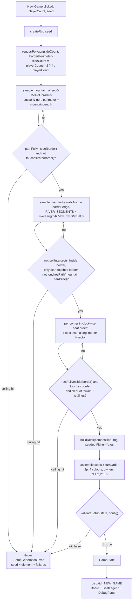

# Plan: Tuning config, debug toggles, and the New Game setup + board render

Plan folder: `.claude/contract/SCRUM-3-4-config-setup-and-board/`
Execution status: see `tasks.md` in this folder.

---

## Part 1 — Alignment

*(The shared understanding of what this task is doing. Restate it in your own words — this is how the developer confirms you read the brief correctly before any design happens. Mismatch here = stop and fix.)*

### Task reference

Two Jira stories, planned as **one contract** at the developer's explicit direction (2026-07-31, this session): "should we just do them together then?" → "you take both tickets now" → "all in one contract please", naming <https://amazerbeam.atlassian.net/browse/SCRUM-3> and <https://amazerbeam.atlassian.net/browse/SCRUM-4>.

**Why they are combined.** SCRUM-2's own plan (`.claude/contract/SCRUM-2-rules-engine/plan.md:37`) records the agreed epic sequence as SCRUM-2 → **SCRUM-3a (config load only)** → SCRUM-4 → SCRUM-5 → SCRUM-6. That "3a" split exists because SCRUM-3 and SCRUM-4 are mutually blocking: SCRUM-4 criteria 2, 5, 6 and 10–12 need real M2 values in the browser (SCRUM-3 AC 1–4), while SCRUM-3 AC 5–8 need seats with scores, a seeded generator to expose, and a board to overlay — all of which SCRUM-4 creates. Splitting into two contracts also ships an unexercised surface: a `parseRulesConfig` validator and a `useRulesConfig` hook that no UI consumes cannot be verified end-to-end until a board renders. One contract has one real verification point.

**SCRUM-3 — Tuning configuration and debug toggles.** Acceptance criteria, verbatim:

1. `rules.json` holds every §3 geometry constant — border length 4000, per-player-count edge lengths, card footprint 120×120, short string 350, long string 700, mountain 1400, river 700 and the ±2% tolerance — and the rules engine reads them from that file rather than from literals.
2. `rules.json` holds the §8.1 deck composition as station-type counts (6 Hamlet, 6 Village, 5 Town, 4 Scenic, 4 Rural, 3 Terminus, 3 Railyard, 2 Landmark, 2 Depot) and the deck is built from it.
3. Changing a value in `rules.json` and starting a new game applies the new value with no code edit and no rebuild step beyond Vite's normal reload.
4. The config is validated on load: totals that do not sum to 35, non-positive lengths, or a long string that is not longer than a short one produce a clear startup error rather than a silently broken board.
5. A debug panel, hidden behind a toggle, reveals all player scores during play — §10.5 calls this out as worth having while checking scoring against the page 7 example.
6. The debug panel exposes the setup RNG seed and allows entering a specific seed, so a board that produced an interesting or broken situation can be regenerated exactly.
7. The debug panel can show geometry overlays — station bounding rects, sampled string vertices and detected crossing points — so a scoring dispute can be inspected visually.
8. Debug affordances are visually distinct from normal UI and default to off, so a play-test does not accidentally run with scores revealed.

**SCRUM-4 — New Game workflow: setup generation and board render.** Acceptance criteria, verbatim:

1. A New Game action generates a complete setup per M3 for the chosen player count: border, mountain, river, and one starting station per corner.
2. The border is a regular polygon matching the player count per §6 — triangle for 3, square for 4, pentagon for 5 — centred on the play area, with total perimeter preserved at the configured value.
3. **Player count is selectable for 2, 3, 4 and 5 players.** Selecting 2 produces the four-player square setup per §9, not a two-corner board.
4. A 2-player game creates four colour-seats mapped to two owners, with turn order `[A1, B1, A2, B2]`, and each owner takes two starting stations in opposite-ish corners consistent with clockwise seat assignment.
5. The mountain is a closed loop of circumference 1400 whose centre is offset from the play-area centre by a random 0–15% of the border's inradius, and it touches neither the border nor the river (§4.1 step 4).
6. The river is an open arc of length 700 with exactly one end touching the border, curving inward, regenerated if it self-intersects or comes within one card width of the mountain.
7. Starting stations are placed one per corner in clockwise seat order, each fully inside the border and touching it (§4.1 steps 6–7).
8. Generation is seeded and deterministic — the same seed and player count produce an identical board, so a situation can be reproduced.
9. A generated board always passes the rules engine's own legality checks; generation retries rather than emitting an illegal board, and a retry ceiling surfaces an error instead of looping forever.
10. The board renders as SVG with border, river, mountain and stations visually distinguishable, scaled to fit the viewport at any window size without clipping.
11. Stations render as placeholder rects showing their type name, connection bonus values (black over grey) and player-limit pawn count — legible without final art.
12. In a 2-player game the board makes seat ownership readable at a glance — which two colours belong to which human — since that is not inferable from colour alone.

Both tickets' "Out of scope" lists are carried into **Explicitly out of scope** below. No spec file was consumed from `.claude/contract/specs/`.

### Restated goal

Turn the placeholder homepage into a playable-looking board. Move every M2 geometry constant and the M17 deck composition out of prose and into `public/rules.json`, load that file once at startup through a validator that fails loudly rather than defaulting, and build the deck from it. Then add a seeded, deterministic setup generator under `src/rules/` that produces a complete legal `GameState` for 2, 3, 4 or 5 players — regular-polygon border with its perimeter exactly preserved, an offset mountain loop, a rejection-sampled inward river, one starting station per corner in clockwise seat order, and the §9 four-colour-seats-two-owners mapping when the count is 2 — retrying on rejection and raising a clear error at a retry ceiling instead of hanging. Render that state as a self-scaling SVG board with placeholder station cards carrying their §8 printed values, make owner-to-colour pairing legible for the 2-player case, wire a New Game control with player-count selection, and put the whole debug surface — all scores, the seed with re-entry, and geometry overlays — behind a visually distinct toggle that defaults to off.

### In scope

- `public/rules.json` populated with §3's M2 geometry constants and §8.1's M17 deck composition (SCRUM-3 AC 1, 2)
- `RulesConfig` widened with the setup keys the generator needs, and `TEST_CONFIG` updated in the same task (SCRUM-3 AC 1)
- A pure `parseRulesConfig` validator with typed failure reasons: config version, presence, positivity, long > short, tolerance range, deck counts summing to the rulebook deck size (SCRUM-3 AC 4)
- A `useRulesConfig` loader hook covering all four async states, with no `catch`-to-defaults path (SCRUM-3 AC 3, 4)
- A seeded PRNG module and a seeded `buildDeck` from the M17 composition (SCRUM-3 AC 2; SCRUM-4 AC 8)
- `generateSetup(request, config)` implementing M3 for 2/3/4/5 players: border, mountain, river, starting stations, colour-seats, turn order (SCRUM-4 AC 1–8)
- A setup-specific `validateSetup` gate plus per-element rejection sampling with retry ceilings and a raised error (SCRUM-4 AC 9)
- SVG board render: terrain paths, placeholder station cards with type name / black-over-grey bonus / pawn count, viewport-fitting `viewBox` (SCRUM-4 AC 10, 11)
- A seat legend making owner-to-colour pairing readable, emphasised at 2 players (SCRUM-4 AC 12)
- A New Game entry point with 2/3/4/5 player-count selection, and the single reducer-backed game store the later stories dispatch into (SCRUM-4 AC 1, 3)
- A debug panel behind an off-by-default, visually distinct toggle: all seat scores, seed display and re-entry, and the three geometry overlays (SCRUM-3 AC 5–8)

### Explicitly out of scope

- **Interactive terrain placement** — deferred per §4.3 and both tickets' scope lists
- **Irregular border shapes** (§4.2) — regular polygons only, but the generator must not assume regularity so deeply that §4.2 becomes impossible later (SCRUM-4 risk note)
- **Pan and zoom controls**, animation, transitions, final art, textures, table background
- **Turn-order execution, station placement, string drag and scoring UI** — SCRUM-5, SCRUM-6, SCRUM-7. This contract establishes the seats and renders committed state; it dispatches no `Move`.
- **A graphical settings editor** for constants — editing `rules.json` by hand is sufficient (SCRUM-3 scope list)
- **Persisting preferences or config profiles between sessions** — nothing is written to storage
- **Retuning any constant** — this contract *moves* §3's values into a file; it does not change them (SCRUM-3 scope list)
- **Replacing M17 with the real deck composition** — that means counting physical cards, and it is the developer's
- **Component tests for the renderer** — see Assumptions; no jsdom, no new dependency
- **A `.claude/rules/determinism.md` shared rule** — its README names it as a candidate and this contract would justify it, but writing it is separate work

### Pattern Reference

The brief supplied no code reference beyond the rulebook. References chosen here:

- **`src/rules/search.ts`** is the closest existing equivalent for the new pure modules — it shows the house pattern for a bounded search with a named numeric bound (`REFINEMENT_DEPTH`), an explicit worst-case cost comment, and the `void param` idiom for a deliberately-unread parameter. `generateSetup`'s retry ceilings follow it.
- **`src/rules/containment.ts`** is the reference for predicate style and for the private-helper-plus-narrow-export shape; this contract adds one export to it.
- **`src/rules/__tests__/validate.test.ts` and `fixtures.ts`** are the reference for spec structure and for how a `RulesConfig` is constructed in tests.
- **`src/ui/HeroBanner.tsx` + `HeroBanner.css`** are the reference for component file order and the per-component plain-CSS pattern.
- **`.claude/skills/react-frontend/SKILL.md`** governs everything under `src/`; its `references/engineering-standards.md` owns the size budget, the four async states, and the constants-versus-tunables split.

Rulebook sections the behaviour comes from, cited rather than restated: **§3** (M2 constants), **§4.1** (setup steps 2–7), **§4.3** (M3 automation), **§6** (border shape and turn order per player count), **§7.1/§7.2** (player limit, black-over-grey connection bonus), **§8** (printed card values, already in `STATION_DEFINITIONS`), **§8.1** (M17 composition), **§9** (two-player variant), **§10** (data model), **§10.1** (predicates), **§10.5** (hidden information — why the debug reveal exists), **§14** (M-number index).

### Constraints flagged on the brief

- **Determinism is an acceptance criterion, not a nicety** (SCRUM-4 AC 8). `Math.random()` anywhere reachable from generation is a defect; `web-project.md` and the skill both name it.
- **The retry ceiling exists to convert a hang into an error** (SCRUM-4 AC 9, and its stated risk: "rejection sampling for the river could fail repeatedly on a cramped board if the constants are retuned downward").
- **Criterion 12 is called out on the brief as "easy to skip and genuinely matters"** — four colours, two humans, and no way to infer the pairing from colour alone.
- **§4.2 permits irregular borders** and warns "strange shapes can lead to strange games". The brief asks that regularity not be baked in so deeply that irregular shapes become impossible to add.
- **A malformed config must produce a clear startup error, never defaults nobody chose** (SCRUM-3 AC 4; the skill's `NEVER swallow an error into a success shape`).
- **Debug affordances default to off and look different** (SCRUM-3 AC 8) so a play-test cannot accidentally run with scores revealed.
- **Two runtime dependencies only.** Anything more needs a stated justification and a yes.
- **The config is read once.** A mid-game `rules.json` edit does not apply, and the panel must say so rather than let a play-tester believe it took effect.

### Assumptions made

Every decision made because the brief did not say. The developer red-lines this section.

- **All of SCRUM-3 is in scope, not just AC 1–4.** *(Developer-confirmed: "you take both tickets now", "all in one contract please".)* Because SCRUM-4's board and seeded generator land in the same contract, AC 5–8 are no longer blocked and go in as a later phase.
- **Per-player-count edge lengths are derived, not stored.** SCRUM-3 AC1 lists them as `rules.json` keys, but §3's 1333 / 1000 / 800 are just `4000 ÷ 3`, `÷ 4`, `÷ 5` rounded for display. Storing both perimeter and edges creates two sources of truth for one number, and SCRUM-4 AC2 ("total perimeter preserved at the configured value") is exact by construction only if the edge is derived. One key, `borderPerimeter`; edges computed as `borderPerimeter / sideCount`. **Raised in Risks** because it is a deliberate deviation from AC1's wording.
- **The generated board is validated against setup rules, not against §5.2.** §4.1 step 6 requires a starting station to be *touching* the border, while `validateStationPlacement` rejects any station touching any string — and the border is a `PlacedPath`. Running the in-play validator over a generated board would reject every legal setup. So SCRUM-4 AC9's "the rules engine's own legality checks" is implemented as a new `validateSetup` composed from the same §10.1 predicates, and §5.2's validator continues to govern in-play placements only. **Raised in Risks** — it is the one place the two criteria read as contradictory.
- **A starting station's `markerOwner` is its own seat's colour.** `STATION_DEFINITIONS.STARTING` carries `markerPenalty: true` but `needsMarker: false`, and `scoring.ts:99` only fires a marker effect when `markerOwner !== null`. Setting it at generation is what makes the §9 same-owner penalty fire at your own other colour's starting station — the assertion the skill calls the proof that the engine is colour-first. It does **not** spend from `markersLeft`: the starting station is its own component (§2), and §2.1's two player markers are for Landmark and Depot.
- **`markersLeft: 2`, `shortStringsLeft: 4`, `longStringsLeft: 1` per seat**, from §2.1's derived per-player split. Fixed rulebook-derived counts, so `src/constants/`, not `rules.json`.
- **Colour identities are constants, not tunables.** Five `ColourId`s with display hexes in `src/constants/setup.ts`. A colour never changes value, so per the engineering-standards constants-versus-tunables split it is not a `rules.json` key. The palette itself is **visual judgement** and appears under developer decisions.
- **The deck excludes `STARTING`.** §8.1's nine types sum to 35; the five starting stations are separate components (§2) placed by generation. The validator rejects a composition containing `STARTING`.
- **The expected deck total is a rulebook constant, not config-derived.** SCRUM-3 AC4 names 35 explicitly and §2 reads it off the components page, so `DECK_SIZE` sits in `src/constants/stations.ts` beside `STATION_DEFINITIONS`, following the precedent `turn.ts:23` set with `ROUNDS_PER_GAME`. M17 is the *distribution* across 35, not the total. **Raised in Risks** since counting the physical cards could contradict it.
- **Mountain and river are polygonised with exact perimeter, not approximated.** A regular N-gon whose perimeter is exactly `mountainLength`, and a fixed-step turtle walk whose segments sum to exactly `riverLength`. `arcLength` is a real predicate the engine applies, so a polygonised circle sized by radius would fail its own length check. Segment counts (`MOUNTAIN_SEGMENTS`, `RIVER_SEGMENTS`) are rendering-fidelity bounds in `src/constants/setup.ts`, not tunables — same category as `search.ts`'s `REFINEMENT_DEPTH`.
- **The 0–15% mountain offset fraction is a spec value in `src/constants/setup.ts`**, not a `rules.json` key. §4.3 and SCRUM-4 AC5 both state the range, so it is part of M3 rather than an unchosen number. Flagged in Risks as a candidate to promote to config if the developer wants to tune it.
- **The board fits the viewport via `viewBox` + `preserveAspectRatio`, with no resize listener.** SVG scales itself, which satisfies AC10 at any window size with no effect, no observer, and therefore no cleanup to get wrong.
- **The renderer is verified by developer observation, not by component tests.** `vite.config.ts` pins `environment: 'node'` and collects `*.test.ts` only; the skill's known-debt table warns that flipping it to `jsdom` would silently un-enforce the `src/rules/` purity boundary, so a component test needs an environment split plus two new dev dependencies. Criteria 10–12 are largely visual anyway ("visually distinguishable", "legible without final art", "readable at a glance"). Every pure thing — generation, validation, config parsing, deck build, board bounds — is unit-tested. **Raised in Risks**; the developer can overturn it by approving the dependencies.
- **New Game mints its seed from `Date.now()` in the click handler and displays it.** The prohibition is on `Date.now()` *in simulation*; capturing a seed at the UI boundary and recording it visibly is what makes a board reproducible. Seed *entry* is SCRUM-3 AC6 and is in scope via the debug panel.
- **The game store is one `useReducer` over `GameState | null`, wrapped by a `useGame` hook.** Its action union is `NEW_GAME | MOVE` — a UI-level action type, deliberately *not* added to `Move`, because `Move` is the persisted move-log union and widening it would force a new case through every existing `switch` and invalidate stored logs. `generateSetup` runs in the handler *before* dispatch so its throw becomes displayed error state rather than a render crash.
- **`AppShell` keeps `HeroBanner`** and shows the New Game panel beneath it before a game exists, swapping to the board once one does. Existing scaffold work is not discarded.
- **No Jira transitions.** `management-jira` was offered and not selected; both tickets are already In Progress.

### Config and persisted-shape audit

Performed in this session with `Grep`/`Bash` against the real tree, not paraphrased.

- **New `rules.json` keys have zero existing hits, so nothing is being renamed.** `borderPerimeter` → **0** hits across `src/` and `public/`; `mountainLength` → **0**; `riverLength` → **0**. All three are genuinely new keys, not dead or misspelled ones.
- **Existing `RulesConfig` field names are reused verbatim and not touched.** Hit counts across `src/` + `public/`: `shortStringLength` **5**, `longStringLength` **4**, `arcLengthTolerance` **4**, `tangencyTolerance` **12**, `cardSize` **13**. Read sites specifically: `cardSize` ×4 (`search.ts:96,100,111,134`), `tangencyTolerance` ×5 (`validate.ts:43,174,183,206`, `containment.ts:237` doc), `shortStringLength`/`longStringLength` ×2 each (`validate.ts:94`, `search.ts:275,278`), `arcLengthTolerance` ×2 (`validate.ts:96`, `search.ts:291`). None is renamed, retyped, or removed by this plan, so none of those sites changes.
- **`RulesConfig` is *constructed* in exactly one place.** `grep ": RulesConfig = "` → **1** hit: `src/rules/__tests__/fixtures.ts:24` (`TEST_CONFIG`). Widening the interface with four required fields is therefore a required→required addition that breaks exactly one construction site, and it must be updated in the **same task** as the interface. `RulesConfig` appears as a *type* in 8 files (`config.ts`, `geometry.ts` doc, `validate.ts` ×3, `scoring.ts` ×3, `search.ts` ×3, `turn.ts` ×5, `reducer.ts` ×5, `fixtures.ts` ×2) — all `import type` positions that need no change, since adding fields cannot break a consumer that only reads existing ones.
- **Type-change loss analysis: none applies.** No `number` → `string`, no array → object, no required → optional, no widened union. The one addition of substance is a new nested object type (`deckComposition`), which is new rather than changed. `Move` is **not** widened — the `NEW_GAME`/`MOVE` action union lives at the UI layer for exactly this reason.
- **Nothing is persisted yet, and this contract does not start.** `grep localStorage|sessionStorage|indexedDB|JSON.parse|JSON.stringify src` → **1** hit, `src/rules/__tests__/reducer.test.ts:226`, a round-trip *assertion* that the move log survives serialisation. No storage key, no saved game, no stored move log exists on disk. **The migration window is still fully open**, and recording that here is what lets a later change know it has closed. This contract writes nothing to storage — the seed input is transient UI state.
- **New string-bound names introduced, all declared once in `src/constants/`:** `CONFIG_FAILURE` reason codes, `SETUP_FAILURE` reason codes, `GAME_ACTION` kinds, `COLOUR_SEATS` colour ids, plus the `rules.json` key names themselves. The `rules.json` key ↔ `RulesConfig` field ↔ `parseRulesConfig` reader ↔ `TEST_CONFIG` fixture chain is checked by name in the Self-review of `tasks.md`, because the compiler cannot see the JSON side.
- **The `src/rules/` boundary currently holds and the design does not cross it.** `grep "from 'react'|window\.|document\.|localStorage|fetch(" src/rules` → **0** hits. Every new pure module (`rng.ts`, `deck.ts`, `setup.ts`, and `config.ts`'s validator) is DOM-free; the single `fetch` lives in `src/ui/useRulesConfig.ts`, on the React side of the line, and `parseRulesConfig` receives an already-parsed `unknown`.
- **One pre-existing grep hazard for the closing phase.** `src/ui/HeroScene.tsx:22,31` contain decorative SVG path coordinates that include the bare tokens `120` and `800`, so the skill's `\b(350|700|4000|120|1400)\b` hard-coded-tunable sweep produces **2** false positives there. `HeroScene.tsx:6` already documents that it reads nothing from `src/rules/`. The Final-verification grep excludes that one file with the reason stated inline, rather than being weakened.

---

## Part 2 — Technical design

### Approach

**The shape is a pure core with a thin React shell, and the split is where the acceptance criteria naturally fall.** Everything that decides something — what a legal board is, where a corner station sits, what the deck contains, whether a config file is usable — is a pure function under `src/rules/`, unit-tested with no renderer. Everything React does is fetch one file, hold one reducer, and draw SVG from committed state. That is not a stylistic preference here: SCRUM-4 AC 8 and 9 (determinism, and "always passes the legality checks") are only cheaply assertable if generation is a pure `(request, config) => GameState`, and AC 5–7's rejection sampling is only debuggable if a failing seed can be replayed in a test rather than in a browser.

**Generation is per-element rejection sampling behind one final gate.** Each element is drawn from the seeded RNG, tested against §10.1 predicates, and redrawn on rejection up to a named ceiling: the mountain against `pathFullyInside(border)` and `!touchesPath(border)`; the river against `selfIntersects`, `pathFullyInside(border)`, one-and-only-one border touch, and `!touchesPath(mountain, config.cardSize)` — that last tolerance being `cardSize` because §4.3 says "within one card width", not the tangency tolerance; each corner station against `rectFullyInside(border)`, touching the border, and not touching the other terrain or a sibling station. The assembled state then passes through `validateSetup` as a whole-board gate, so a bug in any single sampler surfaces as a named failure rather than a subtly illegal board. Exhausting a ceiling throws `SetupGenerationError` carrying the seed, the player count and the failed element — which is exactly the diagnostic the brief's stated river risk asks for. The alternative considered and rejected was a single monolithic sample-the-whole-board-and-retry loop: simpler to write, but it cannot tell you *which* element is over-constrained when the constants get retuned downward, which is the entire reason the ceiling exists.

**Lengths are exact by construction rather than approximated, because `arcLength` is a real predicate the engine will apply.** The border is a regular polygon with edge `borderPerimeter / sideCount` and circumradius `edge / (2·sin(π/n))`, so AC2's "total perimeter preserved" is arithmetic, not a tolerance. The mountain is a regular N-gon sized the same way from `mountainLength` — a circle polygonised by *radius* would have a perimeter shorter than 1400 and fail its own length check. The river is a turtle walk: `RIVER_SEGMENTS` steps of exactly `riverLength / RIVER_SEGMENTS`, each turning by a fixed per-river curvature drawn once from the RNG, which gives a smooth inward arc whose polyline length is exactly `riverLength` by construction and needs no rescaling pass. Starting stations are inset along each corner's interior bisector, with the inset distance found by bisection to the smallest value at which `rectFullyInside(border)` first holds — the position that is simultaneously inside and touching, per §4.1 step 6. Each one is built with `markerOwner` set to its own seat's colour rather than left `null`: `STATION_DEFINITIONS.STARTING` carries `markerPenalty: true` but `needsMarker: false`, and `scoring.ts:99` only fires a marker effect when `markerOwner !== null`, so leaving it null would silently disable §9's same-owner penalty at your own other colour's starting station — the assertion that proves the engine is colour-first. It does not spend from `markersLeft`, since §2's starting station is its own component and §2.1's two markers are for Landmark and Depot. Regularity is confined to one function, `regularPolygon`, and everything downstream consumes a `Polyline` plus a corner list, so §4.2's irregular borders later mean a second generator for that one function, not a rewrite.

**Config is loaded once, validated by a pure parser, and injected.** `parseRulesConfig(raw: unknown)` lives beside the `RulesConfig` interface in `src/rules/config.ts` and returns a discriminated result carrying `CONFIG_FAILURE` reason codes — never a partially-filled object and never a default. `useRulesConfig` does the one `fetch` in the project, aborts it on unmount, and exposes four honest states: loading, ready, load-failed, and loaded-but-invalid. That fourth state is what stops a typo in `rules.json` from becoming a silently differently-tuned play-test, and it is why "empty" is modelled as *invalid* rather than as a separate blank case — a `rules.json` with no keys is a validation failure with a specific message, not an empty collection.

**State is one reducer, and the New Game action deliberately does not become a `Move`.** `useGame` owns `useReducer` over `GameState | null` with a UI-level action union of `NEW_GAME | MOVE`; `MOVE` delegates straight to `gameReducer(state, move, config)`. Adding `NEW_GAME` to `Move` would have been tidier at the call site, but `Move` is the persisted move-log union — a new kind forces a case through every existing `switch` and invalidates any stored log, for an action that is not part of a game's history. Generation runs in the `newGame` handler before dispatch so `SetupGenerationError` becomes displayed error state instead of a render-time crash, keeping the reducer total.

**Rendering is declarative SVG over committed state, with the debug surface as an additive overlay layer.** `Board.tsx` emits a `viewBox` computed by a pure `boardBounds(state)` and lets `preserveAspectRatio="xMidYMid meet"` handle every window size, so AC10 needs no resize listener and has no cleanup to leak. Station cards, terrain and the overlay layer are sibling components so no file approaches the 400-line budget. Criterion 12 gets a `SeatLegend` rather than being smuggled into the board: at 2 players it groups the four colours under their two owners explicitly, which is the one thing colour alone cannot convey. The debug panel reads only from `GameState` and recomputes crossing points with the existing `crossings()` predicate rather than storing them — derived state stays derived. Note that at setup time there are no railway strings, so the crossing overlay renders nothing until SCRUM-6; the overlay exists and is correct, and that is worth saying plainly rather than appearing broken.

### Skills to invoke during execution

- **`react-frontend`** — developer-confirmed, and the only skill selected. Owns everything this contract touches under `src/`: the `src/rules/` purity boundary that `rng.ts` / `deck.ts` / `setup.ts` / `config.ts` must respect, colour-first `ColourId` keying for the §9 two-owner mapping, the constants-versus-tunables split that decides what goes in `rules.json` versus `src/constants/`, the SVG board conventions, the four async states for the config load, the 400-line component budget, and the Vitest posture. Its `references/engineering-standards.md` must be read too — the size budget, async-state table, data-loading rules and constants taxonomy are all load-bearing here.
- `management-jira` was offered and **not** selected by the developer; both tickets are already In Progress, so no transition is planned.

Executor must also Read: **`.claude/workflow/web-project.md`** (paths, runners, the boundary grep, developer-owned work, the correctness traps) and **`.docs/Game_Rules/Rules.md`** §3, §4.1, §4.3, §6, §8.1, §9, §10, §10.1, §10.5. `.claude/rules/` was scanned via `Glob .claude/rules/*.md` → only `README.md`, no rule files, so no shared-rule reject conditions apply.

### Diagram



### Data shapes

#### `public/rules.json` — the tuning surface

`configVersion` stays `1`. Every value below is transcribed from §3 and §8.1, **not invented** — but see Risks: putting them in the file is still the developer's confirmation to give.

| Key | Type | Unit | M# | Value from spec |
|---|---|---|---|---|
| `geometry.borderPerimeter` | `number` | world units | M2 | 4000 (§3) |
| `geometry.cardSize` | `number` | world units | M2 | 120 (§3, square footprint) |
| `geometry.shortStringLength` | `number` | world units | M2 | 350 (§3) |
| `geometry.longStringLength` | `number` | world units | M2 | 700 (§3) |
| `geometry.mountainLength` | `number` | world units | M2 | 1400 (§3, closed loop) |
| `geometry.riverLength` | `number` | world units | M2 | 700 (§3, open) |
| `geometry.arcLengthTolerance` | `number` | fraction | M6 | 0.02 (§3, ±2%, inclusive) |
| `geometry.tangencyTolerance` | `number` | world units | M8 | 0.5 (carried from SCRUM-2's developer decision) |
| `deck.composition.HAMLET` … `.DEPOT` | `number` | card count | M17 | 6, 6, 5, 4, 4, 3, 3, 2, 2 = 35 (§8.1) |

Per-player-count edge lengths are **not** keys — derived as `borderPerimeter / sideCount`. `_note` is retained and updated to name each M-number.

#### `src/rules/config.ts` — widened interface plus the validator

```ts
export const CONFIG_VERSION = 1

export type DeckStationType = Exclude<StationType, typeof STATION_TYPE.STARTING>
export type DeckComposition = Readonly<Record<DeckStationType, number>>

export interface RulesConfig {
  // existing — unchanged, no reader touched
  readonly shortStringLength: number
  readonly longStringLength: number
  readonly arcLengthTolerance: number
  readonly tangencyTolerance: number
  readonly cardSize: number
  // added by this contract
  /** M2 — total border string length, world units. Edge = this / sideCount. */
  readonly borderPerimeter: number
  /** M2 — mountain closed-loop perimeter, world units. */
  readonly mountainLength: number
  /** M2 — river open-arc length, world units. */
  readonly riverLength: number
  /** M17 — station-type counts, summing to DECK_SIZE. */
  readonly deckComposition: DeckComposition
}

export type ConfigFailureReason = (typeof CONFIG_FAILURE)[keyof typeof CONFIG_FAILURE]

export interface ConfigFailure {
  readonly reason: ConfigFailureReason
  /** Dotted path of the offending key, e.g. "geometry.riverLength". */
  readonly key: string
  readonly detail: string
}

export type ParseResult =
  | { readonly ok: true; readonly config: RulesConfig }
  | { readonly ok: false; readonly failures: readonly ConfigFailure[] }

export function parseRulesConfig(raw: unknown): ParseResult
/** Human-readable one-liner per failure, for the error UI. */
export function describeConfigFailures(failures: readonly ConfigFailure[]): string
```

#### `src/constants/game.ts` — additions

```ts
/** UI-level action kinds for useGame. Deliberately NOT part of Move: Move is
 *  the persisted move-log union, and NEW_GAME is not a game-history event. */
export const GAME_ACTION = { NEW_GAME: 'NEW_GAME', MOVE: 'MOVE' } as const

/** parseRulesConfig failure codes (SCRUM-3 AC4). */
export const CONFIG_FAILURE = {
  NOT_AN_OBJECT: 'NOT_AN_OBJECT',
  VERSION_MISMATCH: 'VERSION_MISMATCH',
  MISSING_KEY: 'MISSING_KEY',
  NOT_A_NUMBER: 'NOT_A_NUMBER',
  NOT_POSITIVE: 'NOT_POSITIVE',
  TOLERANCE_OUT_OF_RANGE: 'TOLERANCE_OUT_OF_RANGE',
  LONG_NOT_LONGER_THAN_SHORT: 'LONG_NOT_LONGER_THAN_SHORT',
  DECK_COUNT_NOT_INTEGER: 'DECK_COUNT_NOT_INTEGER',
  DECK_TOTAL_MISMATCH: 'DECK_TOTAL_MISMATCH',
  DECK_TYPE_NOT_ALLOWED: 'DECK_TYPE_NOT_ALLOWED',
} as const

/** validateSetup failure codes (SCRUM-4 AC9). */
export const SETUP_FAILURE = {
  BORDER_SELF_INTERSECTS: 'BORDER_SELF_INTERSECTS',
  BORDER_WRONG_PERIMETER: 'BORDER_WRONG_PERIMETER',
  MOUNTAIN_SELF_INTERSECTS: 'MOUNTAIN_SELF_INTERSECTS',
  MOUNTAIN_WRONG_LENGTH: 'MOUNTAIN_WRONG_LENGTH',
  MOUNTAIN_OUTSIDE_BORDER: 'MOUNTAIN_OUTSIDE_BORDER',
  MOUNTAIN_TOUCHES_BORDER: 'MOUNTAIN_TOUCHES_BORDER',
  MOUNTAIN_TOUCHES_RIVER: 'MOUNTAIN_TOUCHES_RIVER',
  RIVER_SELF_INTERSECTS: 'RIVER_SELF_INTERSECTS',
  RIVER_WRONG_LENGTH: 'RIVER_WRONG_LENGTH',
  RIVER_OUTSIDE_BORDER: 'RIVER_OUTSIDE_BORDER',
  RIVER_BORDER_TOUCH_COUNT: 'RIVER_BORDER_TOUCH_COUNT',
  RIVER_TOO_NEAR_MOUNTAIN: 'RIVER_TOO_NEAR_MOUNTAIN',
  STATION_OUTSIDE_BORDER: 'STATION_OUTSIDE_BORDER',
  STATION_NOT_TOUCHING_BORDER: 'STATION_NOT_TOUCHING_BORDER',
  STATION_TOUCHES_TERRAIN: 'STATION_TOUCHES_TERRAIN',
  STATION_TOUCHES_STATION: 'STATION_TOUCHES_STATION',
  SEAT_COUNT_MISMATCH: 'SEAT_COUNT_MISMATCH',
  SEAT_STARTING_STATION_MISSING: 'SEAT_STARTING_STATION_MISSING',
} as const
```

#### `src/constants/stations.ts` — one addition

```ts
/** §2 — 35 station cards in the box. The M17 tunable is the DISTRIBUTION across
 *  this total, not the total. Rulebook constant, like turn.ts's ROUNDS_PER_GAME. */
export const DECK_SIZE = 35
```

#### `src/constants/setup.ts` — new file

```ts
/** The five player colours. A colour never changes value, so this is a constant,
 *  not a rules.json tunable. `display` is the SVG stroke/fill hex. */
export const COLOUR_SEATS = [
  { id: 'RED',    label: 'Red',    display: '#e0403f' },
  { id: 'BLUE',   label: 'Blue',   display: '#2f7fd4' },
  { id: 'YELLOW', label: 'Yellow', display: '#e6b52c' },
  { id: 'GREEN',  label: 'Green',  display: '#3aa757' },
  { id: 'PINK',   label: 'Pink',   display: '#c760a8' },
] as const

/** §4.3 / SCRUM-4 AC5 — mountain centre offset, as a fraction of the border's
 *  inradius. A stated spec range, not an unchosen tunable. */
export const MOUNTAIN_OFFSET_FRACTION = 0.15

/** Rendering-fidelity bounds, not tuning levers (cf. search.ts REFINEMENT_DEPTH).
 *  Raising them costs vertices and generation time; both preserve exact arc length. */
export const MOUNTAIN_SEGMENTS = 48
export const RIVER_SEGMENTS = 32
/** Total turn the river may accumulate across its whole walk, radians. */
export const RIVER_MAX_TOTAL_TURN = Math.PI * 0.75
/** Fraction of a border edge, from each end, where the river may not start —
 *  keeps its mouth clear of the corners the starting stations occupy. */
export const RIVER_EDGE_MARGIN = 0.2

/** Retry ceilings — bounds that convert a hang into a raised error (AC9). */
export const MAX_MOUNTAIN_ATTEMPTS = 40
export const MAX_RIVER_ATTEMPTS = 200
export const MAX_STATION_ATTEMPTS = 60
/** Bisection depth for the corner-station inset search. */
export const STATION_INSET_DEPTH = 24

/** §2.1 derived per-seat supply. */
export const SHORT_STRINGS_PER_SEAT = 4
export const LONG_STRINGS_PER_SEAT = 1
export const MARKERS_PER_SEAT = 2
```

#### `src/rules/rng.ts` — new, pure

```ts
/** Seeded PRNG (mulberry32). Hand-rolled: ~15 lines, no dependency, and
 *  determinism is an acceptance criterion (SCRUM-4 AC8). */
export interface Rng {
  /** Uniform in [0, 1). */
  nextFloat(): number
  /** Uniform integer in [0, maxExclusive). Throws for maxExclusive <= 0. */
  nextInt(maxExclusive: number): number
  /** Uniform in [min, max). */
  nextRange(min: number, max: number): number
}
export function createRng(seed: number): Rng
/** Deterministic 32-bit hash of a user-typed seed string (SCRUM-3 AC6). */
export function hashSeed(text: string): number
```

#### `src/rules/deck.ts` — new, pure

```ts
/** §4.1 step 5 + §8.1 — builds the shuffled deck from the M17 composition.
 *  Card ids are `${TYPE}-${n}`, 1-based, stable for a given composition, so a
 *  move log naming a card id replays identically. Seeded Fisher-Yates. */
export function buildDeck(composition: DeckComposition, rng: Rng): readonly StationCard[]
```

#### `src/rules/setup.ts` — new, pure

```ts
export type PlayerCount = 2 | 3 | 4 | 5

export interface SetupRequest {
  readonly playerCount: PlayerCount
  readonly seed: number
}

export type SetupFailureReason = (typeof SETUP_FAILURE)[keyof typeof SETUP_FAILURE]

export interface SetupFailure {
  readonly reason: SetupFailureReason
  readonly detail: string
}

export type SetupValidationResult =
  | { readonly ok: true }
  | { readonly ok: false; readonly failures: readonly SetupFailure[] }

/** Carries the seed so a rejected board is reproducible from the message alone. */
export class SetupGenerationError extends Error {
  readonly seed: number
  readonly playerCount: PlayerCount
  readonly failures: readonly SetupFailure[]
}

/** §6 / §9 — 2 players play the four-player square. */
export function sideCountFor(playerCount: PlayerCount): 3 | 4 | 5

/** Regular polygon with EXACTLY the given perimeter, clockwise from the top.
 *  The single place regularity is assumed (§4.2 extensibility). */
export function regularPolygon(centre: Point, sideCount: number, perimeter: number): Polyline

/** Distance from centre to edge midpoint — the mountain offset basis (AC5). */
export function inradius(sideCount: number, perimeter: number): number

/** §4.1 / §4.3 — M3 generation. Throws SetupGenerationError at a ceiling (AC9). */
export function generateSetup(request: SetupRequest, config: RulesConfig): GameState

/** AC9's gate. §4.1 setup invariants — NOT §5.2, which forbids a station
 *  touching any string and would reject every legal starting station. */
export function validateSetup(state: GameState, config: RulesConfig): SetupValidationResult

/** Axis-aligned bounds of every path and station, padded by one card width.
 *  Pure, so the SVG viewBox is testable without a renderer (AC10). */
export function boardBounds(state: GameState, config: RulesConfig): Rect
```

#### `src/rules/containment.ts` — one new export

```ts
/** Point-to-polyline closeness, inclusive. Needed by the river's
 *  "exactly one end touches the border" check; delegates to the existing
 *  private distancePointToSegment rather than duplicating it. */
export function pointTouchesPath(point: Point, other: Polyline, tolerance: number): boolean
```

#### `src/ui/useRulesConfig.ts` — new hook

```ts
export type RulesConfigState =
  | { readonly status: 'loading' }
  | { readonly status: 'ready'; readonly config: RulesConfig }
  | { readonly status: 'load-failed'; readonly message: string }
  | { readonly status: 'invalid'; readonly message: string }

/** The project's only fetch. `${import.meta.env.BASE_URL}rules.json`, aborted on
 *  unmount. Never returns a default on failure. */
export function useRulesConfig(): RulesConfigState
```

#### `src/ui/useGame.ts` — new hook

```ts
export type GameAction =
  | { readonly kind: typeof GAME_ACTION.NEW_GAME; readonly state: GameState }
  | { readonly kind: typeof GAME_ACTION.MOVE; readonly move: Move }

export interface UseGameResult {
  readonly state: GameState | null
  readonly seed: number | null
  readonly playerCount: PlayerCount | null
  readonly setupError: string | null
  /** Generates BEFORE dispatch so SetupGenerationError becomes error state,
   *  never a render-time throw. */
  newGame(playerCount: PlayerCount, seed?: number): void
  dispatchMove(move: Move): void
}

export function useGame(config: RulesConfig): UseGameResult
```

#### Component props

```ts
// src/ui/Board.tsx
interface BoardProps { state: GameState; config: RulesConfig; overlays: OverlayFlags }
// src/ui/BoardTerrain.tsx
interface BoardTerrainProps { paths: readonly PlacedPath[] }
// src/ui/StationCard.tsx  (AC11)
interface StationCardProps { station: PlacedStation; colour: string | null }
// src/ui/BoardOverlays.tsx  (SCRUM-3 AC7)
interface BoardOverlaysProps { state: GameState; flags: OverlayFlags }
export interface OverlayFlags { rects: boolean; vertices: boolean; crossings: boolean }
// src/ui/SeatLegend.tsx  (AC12)
interface SeatLegendProps { seats: readonly ColourSeat[]; playerCount: PlayerCount }
// src/ui/NewGamePanel.tsx  (AC1, AC3)
interface NewGamePanelProps { onNewGame: (count: PlayerCount) => void; disabled: boolean }
// src/ui/DebugPanel.tsx  (SCRUM-3 AC5-8)
interface DebugPanelProps {
  state: GameState; seed: number
  flags: OverlayFlags; onFlagsChange: (flags: OverlayFlags) => void
  onRegenerate: (seed: number) => void
}
```

No `package.json`, `tsconfig`, `vite.config.ts` or ESLint change is required: `tsconfig.app.json` already sets `types: ["vite/client"]`, so `import.meta.env.BASE_URL` type-checks, and the ESLint `src/rules/**` + `src/constants/**` boundary override already covers every new pure module. No new dependency of any kind.

### Runtime quality notes

- **Purity and adjudication.** `rng.ts`, `deck.ts`, `setup.ts`, `containment.ts`'s addition, and `config.ts`'s validator are all pure and DOM-free; `parseRulesConfig` takes an already-parsed `unknown` so `fetch` and `JSON.parse` both stay in `useRulesConfig`. No component decides legality: `validateSetup` and `parseRulesConfig` are the only adjudicators, both under `src/rules/`, and the UI only renders their verdicts. Limits, markers and connection maps are untouched by this contract, but the seats it *creates* are keyed on `ColourId` throughout — `PlayerId` appears only as `ColourSeat.owner` and only for the §9 owner grouping in `SeatLegend`, never in a lookup key. Every tunable named in §3 and §8.1 is read from `rules.json` via `RulesConfig`; the values that stay in `src/constants/setup.ts` are the ones the constants-versus-tunables split assigns there (colours, segment counts, retry ceilings, §2.1 supply counts, §4.3's stated offset fraction), each with its reason in a doc comment.
- **Effects, mount and teardown.** Exactly one effect ships: `useRulesConfig`'s fetch. It creates an `AbortController`, aborts it in the cleanup, and ignores an `AbortError` rather than reporting it as a load failure — otherwise StrictMode's double mount shows a spurious error on every dev boot. The effect's dep array is empty and its only external input is `import.meta.env.BASE_URL`, so StrictMode's second invocation re-fetches and re-resolves identically; the state setter is guarded by the abort signal so the discarded first pass cannot write after teardown. **No resize listener, no `ResizeObserver`, no `requestAnimationFrame`, no timer, and no pointer capture anywhere in this contract** — AC10's viewport fit is `viewBox` + `preserveAspectRatio`, which is why there is nothing to release. No module-level mutable state: `createRng` closes over its own counter per instance, so two generators never share a stream and no test leaks into the next. A second New Game re-enters `newGame`, which mints a fresh `Rng` and replaces the whole `GameState` via `NEW_GAME` — no accumulation, and `setupError` is cleared on entry so a previous failure cannot persist behind a successful board.
- **Hot-path cost.** No pointer hot path exists yet; the drag is SCRUM-6. The one bounded-search concern is generation, and every loop in it has a named ceiling: `MAX_MOUNTAIN_ATTEMPTS` 40, `MAX_RIVER_ATTEMPTS` 200, `MAX_STATION_ATTEMPTS` 60 per corner, and `STATION_INSET_DEPTH` 24 bisection steps. Worst case is bounded by those constants times the §10.1 predicate cost, which is itself O(border vertices) — a fixed `sideCount` for the border and `MOUNTAIN_SEGMENTS`/`RIVER_SEGMENTS` for terrain, so generation cost does not scale with board area. `validateSetup` runs once per generation, not per sample. The board render is ~60 SVG nodes at a full board and re-renders once per committed change; the overlay layer is computed from `GameState` on render rather than stored, and `crossings()` over the terrain pairs is a handful of segment tests at setup. **No `memo`, `useMemo` or `useCallback` is planned** — there is no profiling evidence, and the skill forbids adding them without it.
- **Determinism and numeric safety.** The seed path is `newGame` → `createRng(seed)` → every sampling decision, with the seed retained in `useGame` and displayed. `Math.random()` appears nowhere reachable from generation, and the Final-verification phase greps `src/rules/` for it. `Date.now()` is used once, in the New Game click handler, purely to mint the seed that is then recorded — never inside a sampler. Iteration is over arrays and a `Map`, never over object keys or a `Set`, so ordering is insertion-defined. The existing `EPSILON = 1e-9` in `geometry.ts` is reused as the float-noise guard and is not redefined; the *geometric* thresholds stay `config.tangencyTolerance` (M8) and `config.cardSize` (§4.3's one-card-width river clearance), so no new epsilon is introduced. Divisors guarded: `sideCount` is validated `>= 3` before `perimeter / sideCount` and before `sin(π/n)`; `RIVER_SEGMENTS` and `MOUNTAIN_SEGMENTS` are compile-time positive; `regularPolygon` rejects a non-positive perimeter; `nextInt` throws for `maxExclusive <= 0` rather than returning `NaN`. `validateSetup`'s length checks use the **inclusive** `arcLengthTolerance` comparison already established at `validate.ts:96` (`Math.abs(length - nominal) > nominal * tolerance`), so a board exactly at ±2% passes, matching M6.
- **Error paths.** Three failure surfaces, none swallowed. (1) `rules.json` fails to fetch → `load-failed` with a human-readable message naming the URL; there is no `catch { return DEFAULTS }` anywhere, because a defaulted config plays a differently-tuned game and silently corrupts every conclusion drawn from the session. (2) `rules.json` parses but is invalid → `invalid`, with `describeConfigFailures` listing each offending key by dotted path and reason, distinct copy from a load failure. (3) Generation exhausts a ceiling → `SetupGenerationError` carrying seed, player count and the specific `SETUP_FAILURE` codes; `newGame` catches *that error type only* and sets `setupError` for display, so an unexpected exception still propagates rather than being disguised as a generation failure. No illegal board can reach the reducer: `validateSetup` gates `generateSetup`'s return, and a failing gate throws instead of returning a partial state. Nothing is logged to `console`. The one async surface, `useRulesConfig`, handles all four states — loading shows a visible indicator, ready renders, and both failure states render a message with the reason rather than a blank screen.

### Risks and judgement calls

- **Contract size.** Twenty acceptance criteria across two stories, in one contract. The phases are independently stoppable and each ends type-checking, but this is a long `/fb-apply` run. If you would rather split it, the clean seam is after Phase 3 (config + generation + render) with the New Game wiring and debug panel as a second contract — the board would be testable but not yet reachable from the UI.
- **Per-player-count edge lengths are derived, not stored — a deliberate deviation from SCRUM-3 AC1.** §3's 1333 / 1000 / 800 are `4000 ÷ n` rounded, so storing them alongside `borderPerimeter` would give one number two owners and make SCRUM-4 AC2's "perimeter preserved" a tolerance rather than an identity. Say so if you want the keys present anyway.
- **SCRUM-4 AC9 versus §5.2 is a genuine contradiction, resolved by a new validator.** §4.1 step 6 requires a starting station to *touch* the border; `validateStationPlacement` rejects any station touching any string, and the border is a `PlacedPath`. So "passes the rules engine's own legality checks" is implemented as `validateSetup` over the §4.1 invariants, built from the same §10.1 predicates, with §5.2 continuing to govern in-play placement only. **This is a rule reading, so it is yours to confirm** — the alternative is exempting the border inside `validateStationPlacement`, which would weaken an in-play check to serve setup.
- **`DECK_SIZE = 35` as a rulebook constant rather than a config-derived total.** SCRUM-3 AC4 names 35 explicitly, so the validator asserts the composition sums to it. If counting the physical cards (the M17 correction, which is yours) reveals a different total, that constant changes with the rulebook — but it does mean a play-tester cannot experiment with a 40-card deck by editing `rules.json` alone. Tell me if you would rather the total be derived from the composition and only the *non-emptiness* validated.
- **§3's values transcribed into `rules.json` still need your yes.** Changing a value in `rules.json` is developer-owned work, and this contract puts nine of them there for the first time. They are transcriptions of §3 and §8.1, not inventions, but the file becoming non-empty is the moment the prototype acquires a difficulty setting — and §3 itself says to tune the string lengths first. Confirm the table in Data shapes reads correctly before Phase 1 runs.
- **`tangencyTolerance: 0.5` is inherited, not re-derived.** SCRUM-2 recorded it as your decision and its `pr-description.md` flags "whether `tangencyTolerance: 0.5` survives contact with play" as still open. This contract carries the number forward into the file unchanged; it does not revisit it.
- **The colour palette is visual judgement.** Five hexes chosen for distinguishability against each other and against the terrain strokes, but WCAG contrast and whether they read as distinct on your monitor are things only you can check. Criterion 12's legibility depends on it.
- **The renderer has no automated coverage.** All pure logic is unit-tested; `Board.tsx`, `StationCard.tsx`, `SeatLegend.tsx`, `NewGamePanel.tsx`, `DebugPanel.tsx` and `BoardOverlays.tsx` are verified by you looking at them. Reversing this means approving `jsdom` and `@testing-library/react` as dev dependencies plus a Vitest environment split — which would also pay off the known-debt item in `SKILL.md`. Two new dev dependencies is your call, not mine.
- **The river sampler is the piece most likely to need tuning.** A fixed-curvature turtle walk gives exact arc length and a smooth inward arc, but it explores a narrower space than a Bézier would, so on a cramped board it may hit `MAX_RIVER_ATTEMPTS` where a wigglier generator would have found room. That is the brief's own stated risk; the ceiling turns it into a legible error naming the seed. If it fires in practice the fix is §12's table — a `rules.json` change, therefore yours.
- **`MOUNTAIN_OFFSET_FRACTION = 0.15` sits in `src/constants/`, not `rules.json`.** §4.3 and AC5 both state the 0–15% range so it is not an unchosen value, but it *is* a difficulty lever — a mountain always near the centre plays differently from one that can sit off to one side. Promote it to config if you want to tune it.
- **The crossing overlay renders nothing until SCRUM-6.** SCRUM-3 AC7 asks for detected crossing points, and at setup there are no railway strings to cross anything. The overlay is correct and computed from the real `crossings()` predicate; it will simply be empty on a fresh board, which is worth knowing before it reads as broken.
- **Whether the generated board is any good is unanswerable here.** Whether a 4000-perimeter square with a 1400 mountain and 120 cards makes a tight puzzle or a cramped one, and whether the corners leave usable room, is exactly what §12 says to watch for on a first play. It needs the app running, which is yours.
- **One stale artefact I could not clean up.** `.claude/contract/SCRUM-3-tuning-config-and-debug-shell/` is an empty folder left by the session you stopped; `rmdir` failed with "Device or resource busy", so a process still holds it. It contains no `plan.md`, so plan resolution will offer it as a malformed candidate until it is removed. Separately, `SCRUM-10-deploy-prototype-to-hosted-url/tasks.md` still reads `Status: PLANNED` although `deploy.yml` is committed and Jira says Done — it will keep being offered to `/fb-apply`. Neither is in this contract's scope.
