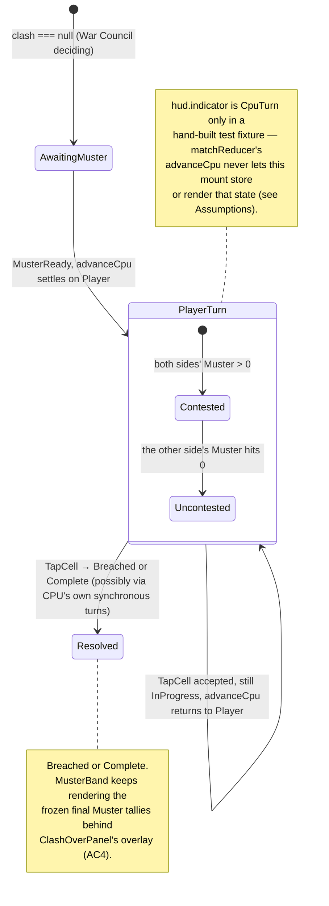

# Plan: Muster / Clash HUD — move budget, turn indicator, action feedback

Plan folder: `.claude/contract/SCRUM-30-clash-hud/`
Execution status: see `tasks.md` in this folder.

---

## Part 1 — Alignment

### Task reference

**SCRUM-30** — https://amazerbeam.atlassian.net/browse/SCRUM-30

> `concept-critique.md`'s "Smaller findings" explicitly warns that a segment ending with unspent
> moves "needs to look like a resolved battle, not a bug" — the player needs to see their Muster,
> whose turn it is in The Clash, and when leftover moves are being spent uncontested, or the whole
> phase reads as broken.

Acceptance criteria (verbatim from the ticket):

1. Both sides' remaining Muster (moves left this round) is visible and updates after every action.
2. Whose turn it currently is in The Clash's alternation is visually unambiguous.
3. When one side is spending leftover moves uncontested, the UI clearly indicates this is happening
   and why (e.g. "CPU is out of moves — you're spending your remaining N moves").
4. When a round ends with moves unspent (Muster exhausted or a Breach fired mid-exchange), the UI
   state clearly reads as a resolved, intentional end — not a stuck or broken screen.
5. Component tests query by accessible role/label and cover: Muster counts updating after an
   action, and the turn indicator switching between sides.

Scope boundaries (verbatim): **In scope:** Muster display, turn indicator, uncontested-spend
indicator, unspent-moves-at-end messaging. **Out of scope:** the board itself, the card hand,
round-transition and win/loss screens.

Dependencies (verbatim): Muster conversion, The Clash turn engine, the War Council UI, and the
Vanguard UI — all four are already shipped (SCRUM-22, SCRUM-24, SCRUM-28, SCRUM-29/40/41).

### Restated goal

Give the Vanguard match screen a persistent, always-visible HUD — living in the existing `.vg-band`
status row — that shows both sides' remaining Muster, makes whose turn it is unambiguous without
relying on colour alone, explains in words when a side is spending leftover moves uncontested and
why, and keeps showing the final tallies once The Clash ends so a round that finishes with moves
unspent reads as a deliberate, resolved outcome rather than a stuck screen. `VanguardMatch.tsx`
today literally renders the placeholder text "Muster counts and turn indicator are SCRUM-30" in
that spot — this ticket replaces it with the real thing. No rule, cost, or turn-order logic is
computed here; every number and every state name is read off `ClashState`, which `src/vanguard/`
already produces in full.

### In scope

- A new pure module deriving a small "what does the HUD say right now" shape from `ClashState |
  null` — both sides' Muster, a turn/lifecycle indicator, and an uncontested flag — plus the hint
  copy already computed inline in `VanguardMatch.tsx` today, moved here so it's unit-testable.
- A new presentational component rendering that shape as the status-band HUD: two Muster counts and
  a turn/lifecycle badge, anchored in `.vg-band` per `game-ux`'s edge-anchoring rule.
- Replacing `VanguardMatch.tsx`'s placeholder note with the real HUD, and de-duplicating the
  `playerTurn`/`musterAvailable` values it already computes inline against the same derivation.
- Extending the existing hint line's copy (still owned by `ActionPalette`, unchanged in shape) to
  name the uncontested case explicitly, matching the ticket's own example text.
- Component tests (AC5): Muster counts changing after a real tap, and the turn/lifecycle indicator
  switching between the states this mount can actually reach, plus a direct-fixture test of the
  `Player`/`Cpu` switch the mount itself cannot organically reach (see Assumptions).
- `.docs/implementation/vanguard-ui.md` refresh, closing out its own "Muster counts and a turn
  indicator are not shown ... SCRUM-30" Deferred bullet.

### Explicitly out of scope

- `VanguardBoardView.tsx`, `HexCell.tsx`, hex-board rendering, or anything about the board itself.
- The War Council card-hand screen (`src/app/warCouncil/`) — untouched.
- `ClashOverPanel.tsx` — the Breach/round-over overlay is a round-transition/win-loss screen, named
  explicitly out of scope on the ticket. AC4 is satisfied by the new HUD continuing to render the
  frozen final Muster tallies *behind* that overlay (see Approach), not by editing the overlay's own
  copy.
- Any change to `src/vanguard/` or `src/battle/` — no rule, cost, or turn-order logic changes; the
  HUD only reads fields `ClashState` already carries on every one of its three variants.
- A Campaign/menu screen, or anything about `App.tsx`'s Test-mode scaffolding — untouched, matches
  every prior Vanguard-UI contract's own scope line.

### Pattern Reference

- `src/app/warCouncil/RoundStatusBand.tsx` — the closest existing sibling: an edge-anchored header
  rendering two sides' live counts as a three-cell `role="group"` scoreboard, with no `aria-live`
  region (counts just update via normal re-render), highlighting the leading side via a data-driven
  class rather than colour alone (`wc-is-lead`). This ticket's Muster/turn band follows the same
  shape for the same reason — it is the same class of problem, already solved once in this repo.
- `src/app/vanguard/legalTargets.ts`, `matchReducer.ts` — pattern for a pure, DOM-free module living
  beside `VanguardMatch.tsx` that computes something the mount used to compute inline, so it becomes
  independently unit-testable in the cheap `node` Vitest project.
- `src/app/vanguard/ActionPalette.tsx`'s existing `vg-hint` line and `REJECTION_MESSAGE` — the hint
  cascade this ticket extends already lives there and stays there; only its inline `deriveHint`
  helper (currently defined in `VanguardMatch.tsx`) moves into the new pure module.
- `.docs/design/concept-critique.md` → "Smaller findings" → "Unspent moves are lost." — the
  design-level statement of the problem this ticket answers ("make it visible... needs to look like
  a resolved battle, not a bug").

### Constraints flagged on the brief

- AC5 requires component tests querying by accessible role/label — no `data-testid`, matching this
  module's existing zero-hit convention (`vanguard-ui.md` → Rules & invariants).
- The ticket's own AC3 example text — "CPU is out of moves — you're spending your remaining N
  moves" — is treated as load-bearing wording to match as closely as the mockup allows, not just an
  illustrative gloss.
- No new runtime dependency, no new configuration key, no persisted-shape change (see Config and
  persisted-shape audit, below) — this is a pure display ticket over already-shipped engine state.

### Assumptions made

- **"CPU's turn" and "CPU spending uncontested" are unreachable through this mount's real render
  output — confirmed by tracing the code, not guessed.** `matchReducer.ts`'s `advanceCpu` loops
  `while (current.status === InProgress && current.turn === Cpu)` and is called synchronously
  inside both `handleMusterReady` and `handleTapCell`, *before* the result is ever stored in
  `MatchUiState` or rendered. Every branch of `applyClashAction`'s turn-alternation rule
  (`vanguard.md` → _The Clash turn engine_, step 7) that could leave `turn === Cpu` keeps that loop
  running until either the turn returns to `Player` or the status leaves `InProgress` — so
  `ui.clash.turn` is provably always `Player` whenever `status === InProgress`, in every state this
  mount ever stores. The symmetric case — the *CPU* going uncontested because the player is
  exhausted — always drains to `Breached` or `Complete` inside that same synchronous batch, so it
  is never a live, waiting-for-the-player HUD state either. **Consequence for design:** the only
  uncontested state a player can actually see, turn after turn, is their own continuing after the
  CPU is exhausted — which is exactly the ticket's own AC3 example ("CPU is out of moves — you're
  spending..."), so the design targets that case as the real, tested, reachable one. The `Cpu`-turn
  branch of the derived type is kept for completeness (a future engine change could remove the
  synchronous drain) and is defensively implemented and tested via a direct component fixture, the
  same "typed but currently unreachable through today's caller" pattern this module already uses
  for `cpuRejected` (`vanguard-ui.md` → Deferred). **This is the single most consequential judgement
  call in this plan — flagged here for the developer to red-line if the reasoning is wrong.**
- **HUD derivation is a new pure module (`clashHud.ts`), not an addition to `matchReducer.ts`.**
  Every field the HUD needs (`muster`, `turn`) already exists on `ClashState` as shipped — no new
  state, no new reducer action. Matches this module's existing convention that the reducer "decides
  no rule" (`vanguard-ui.md`) and that a derived read belongs beside it, not inside it, exactly as
  `legalTargets.ts` already does for legal-target computation.
- **AC4 for the Complete case needs no new copy.** `ClashOverPanel`'s existing round-over text
  ("Both sides spent their Muster and neither reached the Breach...") already states the resolved
  reading, and `Complete` is structurally reachable only when both sides' Muster is exactly zero
  (`vanguard.md` → turn-engine step 7) — there is never an unspent-moves Complete state to describe.
  AC4's real, reachable target is the `Breached` case, where a side can end with Muster still on the
  board; the new HUD's persistence behind the overlay (see Approach) is what actually closes that
  gap, not a `ClashOverPanel` edit, which the ticket places out of scope anyway.
- **The HUD's group is `role="group"`, not `aria-live`.** Matches `RoundStatusBand`'s existing
  precedent exactly (no `aria-live` on its own three-cell scoreboard) rather than inventing a new
  announcement pattern for the same class of "counts that just update on re-render" UI.
- **No new CSS custom property beyond what's needed for the uncontested badge and the turn-active
  highlight.** Reuses `--vg-brass`/`--vg-chalk-dim`/`--vg-alarm`, already defined in `vanguard.css`,
  rather than inventing new colour tokens — consistent with the file's own "transcribed from the
  approved mockup" convention; exact treatment is confirmed at the mockup gate, not invented here.

### Config and persisted-shape audit

No configuration key, `localStorage` key, persisted shape, exported constant map, or rejection
reason code is added, renamed, or removed by this ticket — skipped. `Grep -r "MUSTER_BASELINE|MUSTER_BONUS"
src/vanguard/config.ts` confirms both existing Muster tunables are untouched (2 hits, both in
`config.ts`'s own declaration and nowhere this ticket edits). The only new string-bound surface is
copy text (the turn/uncontested labels), which is a developer/mockup call, not a config key.

---

## Part 2 — Technical design

### Approach

The HUD is built as one new pure derivation and one new presentational component, wired into
`VanguardMatch.tsx` with no reducer change. `clashHud.ts` exports `deriveClashHud(clash: ClashState
| null): ClashHudState` — a total function reading `clash.muster[Player]`, `clash.muster[Cpu]`, and
(when `status === InProgress`) `clash.turn`, plus computing `uncontested` as "the mover's own Muster
is non-zero and the other side's is zero," directly mirroring the turn-engine's own exhaustion rule
rather than re-deriving a different one. It also exports `deriveHint(ui, hud): string`, moved
verbatim in spirit from `VanguardMatch.tsx`'s existing inline `deriveHint` but now taking the
derived `ClashHudState` so its uncontested branch can name the mover's remaining Muster count, per
the ticket's own example copy.

`MusterBand.tsx` is a new, purely presentational sibling to `ActionPalette.tsx` — no state, no
handler, one prop (`hud: ClashHudState`). It renders a `role="group" aria-label="Muster and turn"`
element, structurally identical in shape to `RoundStatusBand`'s three-cell scoreboard: a Muster cell
for the player, a turn/lifecycle badge in the middle, a Muster cell for the CPU. The badge text
switches on `hud.indicator` (`AwaitingMuster` / `PlayerTurn` / `CpuTurn` / `Resolved`) and appends a
small "Uncontested" marker — a second, separately-styled span, not a colour change alone — when
`hud.uncontested` is true, satisfying `game-ux`'s "state reads without motion or colour alone" rule.

`VanguardMatch.tsx` computes `const hud = deriveClashHud(clash)` once per render, alongside the
`clash`/`board` values it already destructures, and uses it to replace three things that already
exist inline: the `playerTurn` boolean (now `hud.indicator === TurnIndicator.PlayerTurn`), the
`musterAvailable` number (now `hud.playerMuster ?? 0`), and the `deriveHint` call (now imported from
`clashHud.ts` and passed `hud`). This removes duplicate logic rather than adding a parallel copy of
it. `MusterBand` is rendered inside the existing `<header className="vg-band">`, replacing the
placeholder `<span className="vg-band-note">` line.

AC4's "reads as resolved, not stuck" requirement is met structurally rather than by touching
`ClashOverPanel` (out of scope): `.vg-panel` is absolutely positioned over the *board* grid area
only (`vanguard-ui.md` confirms the shell's `auto 1fr auto` rows keep `status` as its own row), so
`MusterBand` stays visible, unobstructed, and showing the frozen final Muster tallies the whole time
the Breach/round-over overlay is shown on top of the board beneath it — concrete, visible evidence
of what was and wasn't spent, exactly what the design critique asks for, with zero change to the
overlay component itself.

Everything above is pure UI-layer work. The one thing that is *not* pure UI is the finding in
Assumptions about `advanceCpu`'s synchronous CPU-turn draining — that's a fact about the existing
`matchReducer.ts`, discovered by tracing it, and it directly shapes which HUD states this plan
treats as "really tested end-to-end" versus "typed and fixture-tested for completeness."

### Skills to invoke during execution

- **`react-frontend`** — owns everything under `src/`: the pure-module-for-testability convention,
  the ≤400-line file budget, no speculative memoisation, the `node`/`dom` Vitest project split this
  ticket's new test files must land in correctly. Applies to every code task in this contract.
- **`game-ux`** — owns edge-anchored status displays and "state reads without colour alone," both
  directly on point for a HUD ticket answering a legibility complaint from `concept-critique.md`.
- **`implementation-doc-writer`** — owns `.docs/implementation/vanguard-ui.md`: appends the new
  `clashHud.ts`/`MusterBand.tsx` exports and a new How-it-works subsection, and closes out the
  existing "Muster counts and a turn indicator are not shown" Deferred bullet.

Also read during execution: **`.claude/workflow/web-project.md`** (paths, runners, correctness
traps). **`.claude/rules/`** was scanned — `Glob .claude/rules/*.md` returns only `README.md`, so
there are no rule files to read; the folder is correctly empty for this project.

No developer override was applied to this list — all three matched skills were confirmed as-is at
the classification gate.

### Diagram



### Data shapes

#### `src/app/vanguard/clashHud.ts` (new — pure, no React/DOM import)

```ts
import { ClashStatus, type ClashState } from '../../vanguard'
import { PlayerSide } from '../../warCouncil'
import type { MatchRejection, MatchUiState } from './matchReducer'
import { REJECTION_MESSAGE } from './labels'

export const TurnIndicator = {
  AwaitingMuster: 'awaitingMuster', // clash is null — War Council still deciding this round
  PlayerTurn: 'playerTurn',
  CpuTurn: 'cpuTurn', // unreachable via VanguardMatch's advanceCpu — see plan.md Assumptions
  Resolved: 'resolved', // Breached or Complete
} as const
export type TurnIndicator = (typeof TurnIndicator)[keyof typeof TurnIndicator]

export interface ClashHudState {
  readonly playerMuster: number | null // null only when indicator is AwaitingMuster
  readonly cpuMuster: number | null
  readonly indicator: TurnIndicator
  readonly uncontested: boolean // meaningful only when indicator is PlayerTurn or CpuTurn
}

export function deriveClashHud(clash: ClashState | null): ClashHudState

export function deriveHint(ui: MatchUiState, hud: ClashHudState): string
```

`deriveClashHud`'s `uncontested` rule: for the mover's side `S` (from `clash.turn`) and the other
side `O`, `uncontested = clash.muster[S] > 0 && clash.muster[O] === 0` — the identical predicate
`applyClashAction`'s own step 7 already uses to decide whether to lock the turn, re-read off the
committed state rather than re-derived independently.

#### `src/app/vanguard/MusterBand.tsx` (new — presentational, no state)

```ts
export interface MusterBandProps {
  readonly hud: ClashHudState
}
export default function MusterBand({ hud }: MusterBandProps): ReactNode
```

Renders (structure, not final copy — copy is confirmed at the mockup gate per Step 3.5):

```html
<div class="vg-muster" role="group" aria-label="Muster and turn">
  <span class="vg-muster-cell" data-side="player">
    <span class="vg-muster-label">You</span>
    <span class="vg-muster-value">{playerMuster ?? '—'}</span>
  </span>
  <span class="vg-turn-indicator" data-indicator="{indicator}">
    {turnLabel}
    <span class="vg-turn-uncontested" data-visible={uncontested}>Uncontested</span>
  </span>
  <span class="vg-muster-cell" data-side="cpu">
    <span class="vg-muster-label">CPU</span>
    <span class="vg-muster-value">{cpuMuster ?? '—'}</span>
  </span>
</div>
```

#### `src/app/vanguard/VanguardMatch.tsx` (modified)

- Removes the placeholder `<span className="vg-band-note">…</span>`.
- Adds `const hud = deriveClashHud(clash)`.
- Replaces the inline `playerTurn` boolean, `musterAvailable` number, and the module-local
  `deriveHint` function/call with `hud`-derived equivalents (see Approach). No new props, no new
  state.

#### `src/app/vanguard/vanguard.css` (modified)

New rules only, no changes to existing selectors: `.vg-band` gains a second flex row (or the header
becomes a two-row grid — final layout decided against the mockup) holding `.vg-muster`; new
selectors `.vg-muster`, `.vg-muster-cell`, `.vg-muster-label`, `.vg-muster-value`,
`.vg-turn-indicator`, `.vg-turn-uncontested`, and a `[data-uncontested='true']`-equivalent styled
state reusing `--vg-brass` (already declared). No new custom property is required by the design as
specified; if the mockup reveals one is genuinely needed, it is declared in the same `:root` block
as every other `--vg-*` token, matching the file's own convention.

No type, config, or `localStorage` change anywhere else in the codebase.

### Runtime quality notes

- **Purity and adjudication:** `clashHud.ts` computes no legality, no cost, and no turn-order rule
  of its own — `uncontested` and every Muster number are read straight off `ClashState`, which
  `applyClashAction` already computed. `MusterBand.tsx` decides nothing; it renders exactly what
  `ClashHudState` hands it. No tunable is hard-coded — the only new "values" are copy strings, which
  are a developer/mockup call, not a numeric tunable.
- **Effects, mount and teardown:** No new effect. `MusterBand` is a pure function of props; `clashHud.ts`
  has no listener, timer, or observer. `VanguardMatch.tsx`'s existing single effect (the
  `requestTricksWon` request) is untouched.
- **Hot-path cost:** Not a hot path — Clash actions are discrete, turn-based taps, not a pointer
  stream. `deriveClashHud` is O(1) (three field reads, one comparison), computed once per render
  alongside the mount's existing per-render `legalTargetsFor` calls. No memoisation — no profiling
  evidence, and none is needed for O(1) work.
- **Determinism and numeric safety:** No `Math.random()` anywhere in this change. `playerMuster`/
  `cpuMuster` are read directly from `ClashState.muster`, which `applyClashAction` already guards
  with `Number.isFinite` before ever committing a value (`vanguard.md` → turn-engine step 4) — this
  ticket adds no new divisor and no new place a `NaN` could originate. The `?? '—'` fallback covers
  the one legitimate "no value yet" case (`AwaitingMuster`, before a `ClashState` exists at all),
  distinguishing "not started" from "zero" so the HUD never falsely reads "you have 0 moves" before
  the round has even begun.
- **Error paths:** No new async surface, no new rejection path. `deriveClashHud` and `deriveHint`
  are both total over their declared parameter types (every `ClashStatus` variant and `clash ===
  null` are handled), so there is no `default` case to silently swallow into a wrong-but-plausible
  value.

### Risks and judgement calls

- **The unreachable-`CpuTurn` finding (see Assumptions) is the one to sanity-check first.** If it's
  wrong — if there's some path through `VanguardMatch` that does render `turn === Cpu` mid-InProgress
  — the test plan below needs an end-to-end case added, not just a fixture-level one. Re-traced
  carefully against the shipped `advanceCpu` loop, but this is exactly the kind of claim worth a
  second look before approval.
- **Exact copy for every HUD string is a mockup call, not fixed by this plan.** "Your move" / "Their
  move" / "Awaiting Muster" / "Exchange resolved" / "Uncontested" and the uncontested hint sentence
  are proposed defaults; the mockup (Step 3.5) is where the developer actually signs off on wording,
  matching how every prior Vanguard-UI ticket's copy was confirmed.
- **Exact visual treatment of the turn-active/uncontested state (colour, badge shape, whether it
  pulses) is a developer call**, per `game-ux` → "Decisions that are not yours." The plan reuses
  existing `--vg-*` tokens rather than inventing new ones, but the mockup is where the actual look is
  judged.
- **Header layout (one row vs. two) is a design/space call**, not fixed here — `.vg-band` is
  currently a single thin flex row; fitting a three-cell Muster/turn group in it might want a second
  row, which changes the band's height and therefore the board's available space at short viewports.
  Worth judging on a real phone-sized viewport, which is QA's job once implemented, not something to
  guess at during planning.
- **`ownedCells`/breach-adjacent behaviour is untouched** — confirmed no engine file is in scope,
  listed here only so the developer doesn't have to re-derive that from the diff.
- **No dependency, config key, or tuning value is introduced** — nothing here needs developer
  sign-off beyond the copy/visual calls above.
