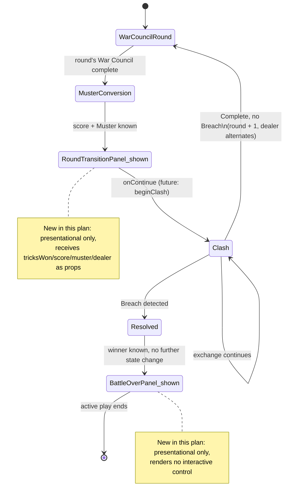

# Plan: Battle-flow screens — round transition and Breach win/loss

Plan folder: `.claude/contract/SCRUM-31-battle-flow-screens/`
Execution status: see `tasks.md` in this folder.

---

## Part 1 — Alignment

### Task reference

**SCRUM-31 — Battle-flow screens — round transition and Breach win/loss**

> ## Problem Statement
> The Definition of Done requires "a battle ends in a clear win/loss for one side" — without a dedicated screen for that, and for the transition between War Council rounds, the battle loop has no player-visible framing and a Breach would just silently stop updating the board.
>
> ## User Story
> As a player, I want a clear transition between War Council rounds and an unambiguous win/loss screen when the Breach is reached, so that I always know what phase I'm in and how the battle ended.
>
> ## Acceptance Criteria
> 1. A visible transition marks the end of one War Council round and the start of the next (e.g. a brief summary of that round's score-band result and the Muster it produced), consistent with the battle loop's dealer-alternation and board-persistence behaviour.
> 2. When the Breach is detected, a dedicated screen names the winning side unambiguously and ends active play — no further card or board interaction is possible after this screen appears.
> 3. Component tests query by accessible role/label and cover: the round-transition summary appearing with the correct score-band result, and the win/loss screen naming the correct winner for both a Player-Breach and a CPU-Breach fixture.
>
> ## Scope Boundaries
> **In scope:** round-transition summary, win/loss screen.
> **Out of scope:** any "play again" / restart flow beyond what's trivially needed to satisfy the DoD (a restart flow is reasonable to include if cheap, but is not itself a DoD requirement — don't let it expand this ticket).
>
> ## Dependencies & Risks
> Depends on the battle loop orchestrator (the loop and its Breach signal). Low risk, mostly a display concern once the orchestrator's state shape is settled.
>
> ## Design Assets
> N/A

### Restated goal

Add two standalone, presentational React components that give the Battle layer (`src/battle`) the two screens its Definition of Done requires but currently has no UI for: a round-transition summary shown once a War Council round's score and Muster are known but before The Clash begins, and a Breach win/loss screen shown once `BattleState.phase === 'resolved'`. Both consume already-computed data as props — neither calls into the engine — so they can be built, tested, and approved now even though the component that will actually mount them (`SCRUM-34`, the battle-loop orchestrator UI, not yet planned) does not exist yet.

### In scope

- A round-transition panel component summarising: the round number, tricks and score for both sides, the Muster each side was awarded for the round, and which side dealt (with the next dealer named via `otherSide`), plus a single control to proceed into The Clash.
- A Breach win/loss panel component naming the winning side unambiguously, with no interactive board or card control rendered — active play structurally ends because the component renders nothing else.
- Component tests for both, querying by accessible role/label, covering the two scenarios AC3 names: the round-transition summary's score-band result, and the win/loss screen's winner naming for a Player-Breach fixture and a CPU-Breach fixture.
- A small shared `src/app/battle/labels.ts` (`SIDE_LABEL`) so both new components name sides identically, following the existing per-feature `labels.ts` pattern (`src/app/warCouncil/labels.ts`, `src/app/vanguard/labels.ts`).
- A full-viewport shell stylesheet (`src/app/battle/battle.css`) per the `game-ux` skill's shell pattern, since both screens are standalone full-screen states, not widgets nested in an existing shell.

### Explicitly out of scope

- **Wiring either component into `App.tsx` or any orchestrator.** `App.tsx`'s own comment states "SCRUM-34 owns real battle-loop orchestration and should delete this host rather than extend it" — mounting these screens into the current dev host would extend exactly the code SCRUM-34 is meant to delete. Both components ship tested against hand-built fixture props, ready for SCRUM-34 to import by path.
- **A restart / "play again" flow.** The brief calls this optional and explicitly warns against letting it expand the ticket; no reset action exists anywhere in the app yet (that's App-shell-level state SCRUM-34 owns), so adding one here would invent orchestration ahead of its ticket.
- **Rendering a snapshot of the final Vanguard board on the win/loss screen.** Not required by either the Definition of Done or AC2 ("names the winning side unambiguously"); would pull in `VanguardBoardView` and a non-interactive board-rendering mode that has no other caller yet.
- **Calling the battle engine.** `scoreRound`, `convertScoreToMuster`, and `beginClash`/`submitClashAction` are not invoked by these components — they receive the engine's output as props, matching the existing `RoundOverPanel` / `ClashOverPanel` contract (props arrive pre-computed).
- **Any change to `src/battle/*`.** The engine's `BattlePhase`/`BattleState` shapes are already settled (`SCRUM-25`, complete) and are read, not modified.

### Pattern Reference

- `src/app/warCouncil/RoundOverPanel.tsx` — the closest existing precedent for a round-summary panel: a heading, a tally table of tricks/score per side, one control. This plan's round-transition panel extends that shape with a Muster row and dealer copy.
- `src/app/vanguard/ClashOverPanel.tsx` — the closest existing precedent for an outcome screen naming a winner unambiguously ("The Breach" / winner copy), including the convention that copy is plain prose, not restated engine strings.
- `src/app/warCouncil/TrickWell.tsx` — precedent for a file-local `SIDE_LABEL` map translating `PlayerSide` into player-facing copy ("You" / "Them"), with the comment "Copy, not an engine string leaking into the UI." This plan's `src/app/battle/labels.ts` follows the same shape, shared across the two new components rather than duplicated per-file, because both need identical wording.
- `src/battle/battleState.ts`, `src/battle/battlePhase.ts` — the `BattleState` union and `BattlePhase` this plan's props are shaped to eventually receive (once SCRUM-34 wires them).
- `.claude/skills/game-ux/references/full-viewport-layout.md` — the shell skeleton (`100dvh`/`svh`, `overflow: hidden`, `grid-template-areas`, safe-area insets) both new screens are built on.

### Constraints flagged on the brief

- AC3 is explicit about test shape: role/label queries, and two named fixtures (Player-Breach, CPU-Breach) for the win/loss screen.
- The brief's own scope boundary: a restart flow is permitted only if trivially cheap, and is not to expand the ticket. This plan takes the brief at its word and omits it (see Explicitly out of scope).
- "Consistent with the battle loop's dealer-alternation and board-persistence behaviour" (AC1) is a copy constraint, not a data constraint — the round-transition panel's text must not claim anything the engine doesn't actually do (e.g. must not imply the board resets between rounds, since `submitClashAction` carries `vanguard` forward unchanged in shape).

### Assumptions made

- **The round-transition screen renders at the `MusterConversion` boundary, not after `Clash` completes.** `BattlePhase.MusterConversion` is the only point in the engine where a round's score and its resulting Muster are both live in state at once (`beginClash` reads `state.warCouncil.tricksWon` and computes `convertScoreToMuster` in the same call that produces the `Clash` state) — and `MusterConversion` currently has no UI at all. AC1's example ("a brief summary of that round's score-band result and the Muster it produced") matches this data exactly. *Rationale: this is the one phase boundary where both facts the AC asks for co-exist; showing them anywhere else means recomputing or threading extra state the engine doesn't otherwise carry.*
- **Props are pre-computed, not a raw `BattleState` slice.** Matches `RoundOverPanel`'s existing contract (it receives `score`, not `RoundState`) and keeps both new components callable from a fixture in a test with no engine import. *Rationale: consistency with the one existing precedent for this exact kind of screen, and it keeps the component pure-presentational per `react-frontend`'s "components render UI, hooks hold logic."*
- **Neither component is wired into `App.tsx`.** See Explicitly out of scope. *Rationale: `App.tsx`'s own comment reserves that wiring for SCRUM-34; extending the throwaway dev host now creates code that ticket would need to delete rather than build on.*
- **New shared module at `src/app/battle/`,** mirroring the existing per-subgame `src/app/warCouncil/` and `src/app/vanguard/` folders. *Rationale: these two screens belong to neither subgame — they read `PlayerSide` from `warCouncil` and `Muster` from `vanguard` but are Battle-level concepts, so a third sibling folder under `src/app/` is the naming precedent already established rather than a new pattern.*
- **`src/app/battle/labels.ts` exports one `SIDE_LABEL` map, not a function.** A static `Record<PlayerSide, string>` has no invariant worth a dedicated unit test (nothing branches); its two entries are exercised indirectly by both components' own tests. *Rationale: avoids an empty-feeling test file asserting nothing but a literal.*
- **The win/loss screen carries no control at all** (no button), since AC2's "ends active play" is satisfied structurally by rendering nothing else, and Explicitly out of scope rules out a restart action. *Rationale: adding a button with no destination would either dead-end or invent App-level state this ticket doesn't own.*
- **`battle.css` declares its own `:root` block reusing the chamber/felt/brass/chalk/parchment values already shared verbatim by `vanguard.css` and `warCouncil.css`.** Both subgame stylesheets carry the identical palette (`--vg-chamber`/`--wc-chamber` etc. are the same hex values) — it is this game's one design system, stated twice for each stylesheet's independence, not two competing ones. Battle-level screens follow the same sibling-file precedent rather than inventing a third palette. *Rationale: "honour what's already there" — an existing, already-approved design system beats a novel one for screens that belong to the same game.*

### Config and persisted-shape audit

- No configuration key is added, renamed, or removed by this plan.
- No persisted or stored shape exists anywhere in this codebase yet (confirmed: `grep -r "localStorage|sessionStorage" src` → zero hits) — nothing here opens or closes that window.
- One new exported constant map is introduced, `SIDE_LABEL` in `src/app/battle/labels.ts`. Grepped for the name across `src/**`: zero existing hits outside a same-named but **file-local, unexported** `const SIDE_LABEL` in `src/app/warCouncil/TrickWell.tsx:8` — a different, unrelated binding in its own module scope, so there is no collision to resolve.
- Two new component names, `RoundTransitionPanel` and `BattleOverPanel`: grepped across `src/**`, zero existing hits — both are new.
- No existing type is renamed, retyped, narrowed, or widened by this plan; `BattleState`, `Muster`, and `PlayerSide` are consumed as already defined.

---

## Part 2 — Technical design

### Approach

Both screens are pure, props-in/markup-out components living in a new `src/app/battle/` folder — the third sibling to `src/app/warCouncil/` and `src/app/vanguard/`, for the same reason those two exist: a folder per UI concern, not per file. Neither component imports from `src/battle`, `src/warCouncil`, or `src/vanguard` beyond types and the two already-pure helpers (`otherSide`, and the `Muster`/`PlayerSide` type imports) — no engine function (`scoreRound`, `convertScoreToMuster`, `beginClash`, `submitClashAction`) is called from inside either component. This mirrors `RoundOverPanel`, which receives `score` already computed by `WarCouncilRound.tsx` rather than computing it itself, and keeps both components trivially testable with hand-built fixtures instead of a running battle.

`RoundTransitionPanel` takes the round number, both sides' `tricksWon` and `score` (the same shape `RoundOverPanel` already takes, so a caller that has just called `scoreRound` can hand the result to either), a `muster: Muster`, the round's `dealer`, and an `onContinue` callback. Its only derived value is the *next* dealer, computed inline via the already-exported `otherSide(dealer)` — narration of already-known information, not new game logic, so it stays in the component rather than becoming a hook. `BattleOverPanel` takes the round number and the `winner: PlayerSide`, and renders no interactive element at all: AC2's "no further card or board interaction is possible" is satisfied structurally, because the component has nothing else to render, rather than by disabling controls that exist. This also reflects `BattleState`'s own shape — the `Resolved` variant of `BattleState` (`src/battle/battleState.ts`) carries no `warCouncil` or `clash` field, so a future caller switching on `state.phase` cannot accidentally keep an interactive layer mounted alongside this screen even before SCRUM-34 writes that switch.

Both screens are full-viewport shells per the `game-ux` skill, built from its reference skeleton (`100dvh`, `overflow: hidden`, safe-area insets), because each is a standalone game *screen* — the player sees nothing else while it's up — rather than a panel layered over a board, which is what `RoundOverPanel` and `ClashOverPanel` are (both render inside their subgame's own shell). A single shared `battle.css` covers both, since they share one visual language (a centered card on a full-bleed background) and together stay well under the 400-line budget. Its `:root` block reuses the exact chamber/felt/brass/chalk/parchment values `vanguard.css` and `warCouncil.css` already declare identically — this game's one established palette, not a third one invented for the Battle layer. Copy uses one shared `src/app/battle/labels.ts` (`SIDE_LABEL`), so "You" / "The opponent" reads identically on both screens — the same DRY move `TrickWell.tsx` already makes locally, promoted to a shared module because two components need it instead of one.

### Skills to invoke during execution

- `react-frontend` — owns everything under `src/`: component structure, the `props in → markup out` shape for both new components, the reducer-vs-local-state decision (neither needs any — no internal state at all), the 400-line file budget, and the Vitest/`getByRole` testing posture.
- `game-ux` — owns the full-viewport no-scroll shell and screen zoning both new screens are built on, since each is a standalone game screen rather than a widget nested in an existing shell.
- No developer override — both skills were confirmed via the Step 1.5c `AskUserQuestion` gate as proposed.
- Read on demand: `.claude/rules/` is currently empty (confirmed via directory listing) — no rule file applies.
- Always: `.claude/workflow/web-project.md` for verification commands and the correctness traps (listener cleanup, `NaN` propagation, string-bound-name renames) — this plan trips none of them, but the executor should still read it.

### Diagram



The state names above `RoundTransitionPanel_shown` and `BattleOverPanel_shown` are not new `BattlePhase` values — they annotate where, within the existing `MusterConversion` and `Resolved` phases, this plan's two components sit. No change is made to `src/battle/battlePhase.ts`.

### Data shapes

#### `src/app/battle/RoundTransitionPanel.tsx`

```ts
import type { Muster } from '../../vanguard'
import type { PlayerSide } from '../../warCouncil'

export interface RoundTransitionPanelProps {
  readonly round: number
  readonly dealer: PlayerSide
  readonly tricksWon: Readonly<Record<PlayerSide, number>>
  readonly score: Readonly<Record<PlayerSide, number>>
  readonly muster: Muster
  readonly onContinue: () => void
}

export default function RoundTransitionPanel(props: RoundTransitionPanelProps): JSX.Element
```

#### `src/app/battle/BattleOverPanel.tsx`

```ts
import type { PlayerSide } from '../../warCouncil'

export interface BattleOverPanelProps {
  readonly round: number
  readonly winner: PlayerSide
}

export default function BattleOverPanel(props: BattleOverPanelProps): JSX.Element
```

#### `src/app/battle/labels.ts`

```ts
import type { PlayerSide } from '../../warCouncil'

// Copy, not an engine string leaking into the UI — mirrors the convention
// already established in src/app/warCouncil/TrickWell.tsx, shared here
// because two components need identical wording.
export const SIDE_LABEL: Readonly<Record<PlayerSide, string>> = {
  player: 'You',
  cpu: 'The opponent',
}
```

No `src/battle/*`, `src/warCouncil/*`, or `src/vanguard/*` file changes shape. No configuration key is added. No `package.json` dependency or script changes — both components use only `react` and the existing `@testing-library/react` dev dependency already in the tree.

### Runtime quality notes

- **Purity and adjudication:** Both components are pure functions of their props with zero internal state and zero calls into `src/battle`, `src/warCouncil`, or `src/vanguard` beyond type imports and the one pure helper `otherSide`. Neither adjudicates a rule — `score`, `muster`, and `winner` all arrive pre-decided by the engine (or, in tests, a fixture standing in for it). No tunable value is read or hard-coded; the only "configuration-shaped" thing here, `SIDE_LABEL`, is copy, not a tunable.
- **Effects, mount and teardown:** Trivial — neither component uses `useEffect`, a listener, a timer, or a ref. Nothing to clean up, nothing StrictMode's double-invocation can break.
- **Hot-path cost:** Trivial — each screen renders once per battle-level phase transition (at most a few times per battle), not on a pointer or animation frame path. No memoisation is needed or added.
- **Determinism and numeric safety:** No division, no `Math.random()`, no derived arithmetic beyond object-literal lookups (`SIDE_LABEL[side]`, `tricksWon[side]`, `score[side]`, `muster[side]`) against a `Record<PlayerSide, T>` the type system already guarantees is total for both enum members — no `NaN` or `undefined` is reachable through a valid `PlayerSide`.
- **Error paths:** Neither component has an async surface, so the four async states don't apply. Both render unconditionally from their required props — there is no loading, error, or empty variant to guard, because a caller that doesn't yet have `score`/`muster`/`winner` simply doesn't mount the component yet (that gating is the future orchestrator's job, not this plan's).

### Risks and judgement calls

- **Where the round-transition screen sits (`MusterConversion`, before Clash) is this plan's reading of an AC that names no explicit phase boundary.** Flagged in Assumptions with rationale; sanity-check against the intended player experience before treating it as settled — an alternative reading (showing it after Clash resolves *without* Breach, i.e. `ClashStatus.Complete`) is also defensible but would need to re-derive or re-thread the Muster value, since `submitClashAction`'s `Complete` branch no longer carries it.
- **No restart/"play again" control on the win/loss screen** — deliberate, per the brief's own scope boundary, but worth a developer sanity-check that a dead-end screen (no button at all) reads as acceptable until SCRUM-34 exists, rather than as an oversight.
- **Neither screen is wired into `App.tsx`.** They ship complete and tested but unreachable from the running app until SCRUM-34 mounts them — confirm this reads as correct scope (build the screens now, orchestrate them later) rather than as an incomplete ticket. This is exactly the same relationship `RoundOverPanel`/`ClashOverPanel` already have to their own subgame's dev host.
- **Visual styling (`battle.css` colours, type scale) is a structural placeholder**, not a final visual pass — colour and exact typography are the developer's call per `CLAUDE.md`'s pause conditions, and the mockup in Step 3.5 exists precisely so this can be judged before `tasks.md` is written.
- **No dependency change.** Both components use only `react` + the existing `@testing-library/react`/`jsdom` already installed for `.tsx` component tests elsewhere in the tree — nothing new to approve.
- **Whether `BattleOverPanel` should show the round number at all** is a minor copy call (included in this plan's props since it's free and already available on `BattleState`'s `Resolved` variant) — drop it if it reads as clutter once seen in the mockup.
