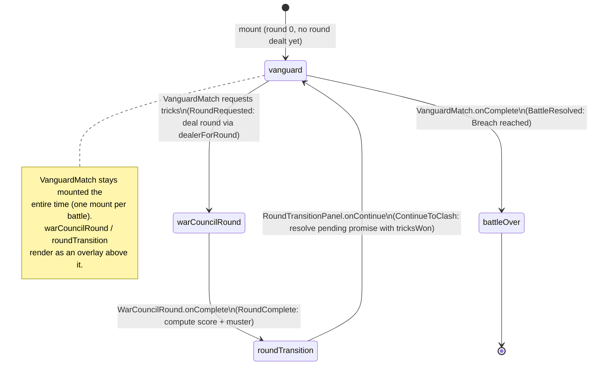

# Plan: Wire the end-to-end battle loop into the app shell

Plan folder: `.claude/contract/SCRUM-34-wire-battle-loop-into-app-shell/`
Execution status: see `tasks.md` in this folder.

---

## Part 1 — Alignment

### Task reference

**SCRUM-34** — https://amazerbeam.atlassian.net/browse/SCRUM-34 — "Wire the end-to-end battle loop into the app shell"

Full acceptance criteria (from the ticket body):

1. `App.tsx` (replacing the current placeholder) mounts the battle loop with both CPU opponents and all UI surfaces (styled per the UI polish pass) wired together, with no manual setup required to start a battle.
2. A player can complete an entire battle — one or more War Council rounds, Muster, Clash, and a final Breach — using only the UI, with no console errors during play.
3. All engines' legal-move constraints are enforced end-to-end through the UI (no illegal action reachable via a button click).
4. `npm run typecheck`, `npm run lint`, and the full `npm test` suite pass with everything wired together.

Scope boundaries (from the ticket body): **In scope:** app-shell wiring only — every piece it wires already exists from prior tickets. **Out of scope:** any new game logic or UI surface not already built in earlier phases; deploy; final QA sign-off.

**Developer-confirmed sequencing decision (2026-08-07, this session):** AC1's parenthetical "(styled per the UI polish pass)" depends on SCRUM-33, which has no contract folder and is still `To Do` in Jira. Raised to the developer before planning began. Decision: wire the loop now against the current, unstyled UI; SCRUM-33 becomes its own epic, broken into smaller tickets, sequenced *after* this ticket so it can polish against a playable loop instead of guessing blind. This plan proceeds on that basis — the "(styled per the UI polish pass)" clause of AC1 is deferred, not satisfied by this contract.

### Restated goal

Replace `App.tsx`'s temporary dev host with a real orchestrator that mounts the already-built, already-tested War Council and Vanguard UI screens into one continuous, playable loop: a War Council round, a round-transition summary, The Clash, and either a Breach win/loss screen or another War Council round — repeating until someone breaches, with both CPU opponents already driving themselves (no orchestrator-level CPU wiring needed, since each screen's own reducer already plays the CPU's turns internally). No new game logic, no new engine behaviour — this ticket composes existing, tested pieces.

### In scope

- A new orchestrator component that mounts `VanguardMatch` for the life of the whole battle and, on demand, overlays a freshly-dealt `WarCouncilRound` followed by `RoundTransitionPanel`, fulfilling `VanguardMatch`'s `requestTricksWon` promise contract.
- A pure `dealerForRound` helper computing the alternating dealer for each round, reusing `WAR_COUNCIL_FIRST_DEALER` from `src/battle`.
- A small reducer (`battleHostReducer`) modelling which screen the orchestrator currently shows, per `react-frontend`'s single-reducer rule for non-trivial state.
- Mounting `BattleOverPanel` once `VanguardMatch` reports a Breach.
- Rewriting `App.tsx` to mount the new orchestrator directly, deleting the temporary dev-host content (the inline round-dealing, the direct `WarCouncilRound` mount, and the "Switch to Test mode" toggle button).
- One new CSS rule so the War Council round / round-transition overlay takes over the full viewport above the persistently-mounted Vanguard board.
- Tests for the new pure logic (`dealerForRound`) and the new orchestration logic (`battleHostReducer`, and the orchestrator component itself with its children mocked).

### Explicitly out of scope

- Any change to `WarCouncilRound`, `VanguardMatch`, `RoundTransitionPanel`, `BattleOverPanel`, `ClashOverPanel`, or any engine module (`src/warCouncil/`, `src/vanguard/`) — all already built, tested, and complete per prior tickets.
- Driving the loop through `src/battle`'s state machine (`BattleState`, `startBattle`, `submitWarCouncilCard`, `beginClash`, `submitClashAction`, `playCpuWarCouncilTurn`, `playCpuClashTurn`) — see Assumptions and Risks for why.
- The UI polish pass (SCRUM-33) and any visual/asset direction (SCRUM-32) — deferred per the developer's sequencing decision above.
- Deleting `TestModeVanguardHost.tsx`, `TrickEntryForm.tsx`, or `appMode.ts` — left on disk, unreferenced from `App.tsx`.
- Deploy and final QA sign-off (explicit ticket scope boundary).
- A round-count cap or any other new win/loss condition — `battle.md` documents no round cap as a deliberate non-requirement; this plan doesn't add one.
- Seeded/injectable randomness as a product feature — `Math.random` is reused directly, matching current `App.tsx` precedent.

### Pattern Reference

- `.docs/implementation/app.md`, `battle.md`, `battle-ui.md`, `vanguard-ui.md`, `war-council-ui.md` — read in full; each names SCRUM-34 as the ticket that wires what it documents.
- `src/app/vanguard/VanguardMatch.tsx` and `src/app/warCouncil/WarCouncilRound.tsx` — the two mount-prop-contract components this ticket composes, read in full.
- `src/app/vanguard/TestModeVanguardHost.tsx` — the existing, closest precedent for fulfilling `requestTricksWon` (there, via a manual entry form; here, via a real `WarCouncilRound` mount). Its `pendingRef` + `useCallback` pattern for a referentially-stable `requestTricksWon` is the pattern to follow.
- `src/app/vanguard/matchReducer.ts` and `src/app/warCouncil/roundReducer.ts` — the existing reducer-per-mount convention this plan's `battleHostReducer` follows.
- `src/app/battle/RoundTransitionPanel.tsx` and `BattleOverPanel.tsx` — already-built, prop-driven (not self-reducing) screens this ticket is the first to mount.
- `.claude/skills/react-frontend/SKILL.md` — the single-reducer-for-non-trivial-state MUST, the file-order convention, effect/StrictMode rules.
- `.claude/skills/game-ux/SKILL.md` — the full-viewport, no-scroll shell and zoning rules, applied to the new overlay layering.

### Constraints flagged on the brief

- AC1: no manual setup required to start a battle — the orchestrator must be self-sufficient from mount (deals the board, deals round 1, no dev-only controls).
- AC2: a full battle must be completable start to finish via the UI alone, with no console errors.
- AC3: no illegal action reachable via a button click — satisfied by construction, since every interactive control still belongs to an already-tested child component; this plan adds no new interactive control that touches engine legality.
- AC4: `npm run typecheck`, `npm run lint`, `npm test` all green.
- Two-runtime-dependency limit (`web-project.md`) — this plan adds no dependency.

### Assumptions made

1. **Composition model: the UI components are the real integration surface, not `src/battle`'s state machine.** `WarCouncilRound` and `VanguardMatch` each own a private reducer and only ever report back once (per round, per whole match) via a callback — neither accepts an externally-dispatched per-action update. `src/battle`'s `submitWarCouncilCard` / `submitClashAction` / `playCpuWarCouncilTurn` / `playCpuClashTurn` are push-based, expecting one call per player action. Driving the built UI through that state machine would require rewriting `WarCouncilRound` and `VanguardMatch` to accept external dispatch — out of scope per the ticket's own "every piece it wires already exists" boundary. This plan therefore composes the UI components directly via their existing mount-prop contracts, and does not import `src/battle`'s reducer functions at all (only its `WAR_COUNCIL_FIRST_DEALER` constant). **Flagged in Risks — this is the plan's biggest structural call and the developer should confirm it before approving.**
2. **`RoundTransitionPanel` mounts between a War Council round's completion and the next Clash, and dismissing it is what fulfils `VanguardMatch`'s pending `requestTricksWon` promise.** `battle-ui.md` itself calls this phase placement "an assumption, not an engine-enforced fact... flagged for the developer to sanity-check once SCRUM-34 wires it in." This plan is that sanity-check, and answers it this way — confirm or redirect at the gate.
3. **Dealer alternates strictly by round parity** — round 1 uses `WAR_COUNCIL_FIRST_DEALER`, every subsequent round flips — computed as a pure function of the round number alone. Matches `battle.md`'s documented rule that the dealer flips exactly once per completed round with no other trigger.
4. **`App.tsx`'s Test-mode toggle and inline round-dealing are deleted** (the dev host's own doc comment: "SCRUM-34 owns real battle-loop orchestration and should delete this host rather than extend it"). `TestModeVanguardHost.tsx`, `TrickEntryForm.tsx`, and `appMode.ts` are left on disk, unreferenced, rather than deleted outright — deleting a standalone dev sandbox wasn't asked for and is easily reversible either way. Developer may override.
5. **No round cap is added** — matches `battle.md`'s documented "deliberately no round cap."
6. **`Math.random` is reused directly**, matching current `App.tsx` precedent (no seeding requirement stated anywhere in the brief). The new orchestrator accepts an optional `rng` prop (default `Math.random`) purely so its own component test can drive a deterministic sequence — not a product-facing seeding feature.
7. **The War Council round / transition screens render as a fixed, full-viewport overlay above the persistently-mounted `VanguardMatch`**, rather than unmounting and remounting it, because `VanguardMatch` exposes no way to extract its live board state for a later remount — its own doc comment states a whole match is one mount. This needs exactly one new CSS rule, the only new visual surface this plan introduces (governed by `game-ux`, not a redesign).

### Config and persisted-shape audit

Skipped — `Select-String -Path src\**\*.ts,src\**\*.tsx -Pattern "localStorage|sessionStorage"` returns zero hits anywhere in `src/`. No configuration key is added, renamed, or removed; nothing is persisted; nothing in this plan touches a stored or serialised shape.

---

## Part 2 — Technical design

### Approach

The orchestrator (`BattleHost`) is deliberately thin: it owns one `useReducer` for "which screen is currently showing," one `useState` for the Vanguard board's stable initial value, and one `useRef` for the in-flight `requestTricksWon` promise's resolver — no other state, and no effect of its own. Every piece of actual game logic — legal moves, CPU turns, scoring, Muster conversion, Breach detection — already lives inside `WarCouncilRound`'s and `VanguardMatch`'s own reducers, or in the pure `src/warCouncil`/`src/vanguard` functions those reducers call. `BattleHost`'s job is sequencing screens and threading already-computed values between them, which is exactly what "app-shell wiring only" means.

The alternative considered and rejected was driving everything through `src/battle`'s `BattleState` state machine, treating it as the single source of truth and having `WarCouncilRound`/`VanguardMatch` read/write through it. That state machine is push-based (one call per player action) while the built components are pull-based (one callback per completed round or match) — reconciling the two would mean rewriting either component's internals, which the ticket's own scope boundary rules out. So `src/battle`'s reducer functions go unused by the running app under this plan; only its `WAR_COUNCIL_FIRST_DEALER` constant is reused, to keep the "first dealer" fact stated once.

`VanguardMatch` stays mounted for the entire battle (its own contract: "a whole match, spanning multiple rounds, is one mount"). Each time it needs a new round's trick split, it calls `requestTricksWon(round)` and awaits the promise. `BattleHost` fulfils that promise by: dealing a fresh `WarCouncilState` for that round (dealer from `dealerForRound(round)`), overlaying `WarCouncilRound` above the (visually frozen but still-mounted) Vanguard board, and — once that round completes — overlaying `RoundTransitionPanel` with the computed score and Muster. Continuing from that panel resolves the pending promise with the round's `TricksWon`, dismisses both overlays, and hands control back to `VanguardMatch`, which now has what it needs to start The Clash. This exact sequence handles round 1 identically to every later round — no special-casing, since `VanguardMatch`'s own reducer already requests round 1's tricks the instant it mounts.

`battleHostReducer` models this as a four-variant discriminated union (`vanguard` / `warCouncilRound` / `roundTransition` / `battleOver`), each variant carrying the `round` number so `BattleOverPanel` always has one to display. `BattleHost` dispatches into it from three places: the `requestTricksWon` callback (→ `warCouncilRound`), `WarCouncilRound`'s `onComplete` (→ `roundTransition`, computing `score`/`muster` from the round result), and `RoundTransitionPanel`'s `onContinue` (→ back to `vanguard`, and this is also where the pending promise resolves) — plus `VanguardMatch`'s `onComplete` (→ `battleOver`).

### Skills to invoke during execution

- `react-frontend` — owns everything under `src/`: the single-reducer-for-non-trivial-state rule this plan's `battleHostReducer` follows, the file-order convention, effect/StrictMode safety, and the Vitest testing posture for the new pure and component tests.
- `game-ux` — the full-viewport, no-scroll shell and zoning rules apply to the new overlay layer (War Council round / round-transition screens stacking above the Vanguard board). The overlay is minimal (one CSS rule reusing each child's own existing full-shell markup) but is still a real screen-composition decision this skill owns.
- Both confirmed by the developer via `AskUserQuestion` during planning (multiSelect, both selected) — no override.
- Also read: `.claude/workflow/web-project.md` (runners, traps, developer-owned work). `.claude/rules/README.md` was scanned — it is currently empty, so no `.claude/rules/*.md` file applies to this plan.

### Diagram



### Data shapes

#### `src/app/battle/dealerForRound.ts` (new, pure)

```ts
import { otherSide, PlayerSide } from '../../warCouncil'
import { WAR_COUNCIL_FIRST_DEALER } from '../../battle'

/** Round 1 uses WAR_COUNCIL_FIRST_DEALER; every later round alternates by
 * parity alone — matches battle.md's rule that the dealer flips exactly
 * once per completed round, with no other trigger. */
export function dealerForRound(round: number): PlayerSide {
  const usesFirstDealer = (round - 1) % 2 === 0
  return usesFirstDealer ? WAR_COUNCIL_FIRST_DEALER : otherSide(WAR_COUNCIL_FIRST_DEALER)
}
```

#### `src/app/battle/battleHostReducer.ts` (new)

```ts
import type { PlayerSide, WarCouncilState } from '../../warCouncil'
import type { Muster } from '../../vanguard'
import type { TricksWon } from '../tricksWon'
import type { WarCouncilRoundResult } from '../warCouncilMount'
import type { VanguardMatchResult } from '../vanguardMount'

export type BattleHostUiState =
  | { readonly kind: 'vanguard'; readonly round: number }
  | {
      readonly kind: 'warCouncilRound'
      readonly round: number
      readonly dealer: PlayerSide
      readonly dealt: WarCouncilState
    }
  | {
      readonly kind: 'roundTransition'
      readonly round: number
      readonly dealer: PlayerSide
      readonly tricksWon: TricksWon
      readonly score: Readonly<Record<PlayerSide, number>>
      readonly muster: Muster
    }
  | { readonly kind: 'battleOver'; readonly round: number; readonly winner: PlayerSide }

export const BattleHostActionKind = {
  RoundRequested: 'roundRequested',
  RoundComplete: 'roundComplete',
  ContinueToClash: 'continueToClash',
  BattleResolved: 'battleResolved',
} as const
export type BattleHostActionKind = (typeof BattleHostActionKind)[keyof typeof BattleHostActionKind]

export type BattleHostUiAction =
  | {
      readonly kind: typeof BattleHostActionKind.RoundRequested
      readonly round: number
      readonly dealer: PlayerSide
      readonly dealt: WarCouncilState
    }
  | { readonly kind: typeof BattleHostActionKind.RoundComplete; readonly result: WarCouncilRoundResult }
  | { readonly kind: typeof BattleHostActionKind.ContinueToClash }
  | { readonly kind: typeof BattleHostActionKind.BattleResolved; readonly result: VanguardMatchResult }

export function createBattleHostUiState(): BattleHostUiState // returns { kind: 'vanguard', round: 0 }

export function battleHostReducer(
  state: BattleHostUiState,
  action: BattleHostUiAction,
): BattleHostUiState
```

`RoundComplete` and `BattleResolved` read `state.round`/`state.dealer` off the *current* state (guarded: `RoundComplete` only transitions when `state.kind === 'warCouncilRound'`; `BattleResolved` only when `state.kind === 'vanguard'`; any other current state returns `state` unchanged — defensive, since `BattleHost`'s own render logic never fires either dispatch outside those states). `RoundComplete` computes `score` from `result.score` (already provided — no recomputation) and `muster` via `convertScoreToMuster(result.score)` (imported from `../../vanguard`, the same pure function `src/battle/beginClash.ts` itself wraps).

#### `src/app/battle/BattleHost.tsx` (new)

```ts
export interface BattleHostProps {
  readonly rng?: () => number // default Math.random — test seam only, not a product feature
}

export default function BattleHost({ rng = Math.random }: BattleHostProps)
```

Holds: `useState<VanguardState>(() => createVanguardBoard())` (stable initial board), `useReducer(battleHostReducer, undefined, createBattleHostUiState)`, and `useRef<{ round: number; resolve: (tricks: TricksWon) => void } | null>(null)` for the pending `requestTricksWon` call — mirroring `TestModeVanguardHost`'s existing `pendingRef` pattern. `requestTricksWon` is a `useCallback` with deps `[rng]`, matching `VanguardMountProps`'s documented referential-stability requirement.

#### `src/app/battle/battle.css` (modified — one addition)

```css
.battle-overlay {
  position: fixed;
  inset: 0;
  z-index: 10;
}
```

No other type, config, or contract change. Nothing here is persisted.

### Runtime quality notes

- **Purity and adjudication:** `dealerForRound` and `battleHostReducer` are both pure — no DOM, no randomness, no engine calls beyond the already-pure `convertScoreToMuster`. `BattleHost` itself decides no game-legality question; every interactive control the player touches still belongs to an already-tested child component enforcing its own engine's rules.
- **Effects, mount and teardown:** `BattleHost` introduces **zero effects** of its own — no listener, timer, observer, or `AbortController` to clean up. The one effect in the whole subtree (`VanguardMatch`'s `requestTricksWon` effect) is pre-existing and out of scope. `useState(() => createVanguardBoard())` and `useReducer(battleHostReducer, undefined, createBattleHostUiState)` both use pure lazy initializers — safe under StrictMode's development double-invocation, same pattern `WarCouncilRound` already documents for its own lazy initializer. `pendingRef` starts `null` and is only ever read/written synchronously from user-triggered callbacks, never subscribed to anything, so it needs no cleanup.
- **Hot-path cost:** Trivial — no per-frame or per-pointer-event work. `BattleHost`'s render is an O(1) branch over a four-variant union; nothing here runs on a drag, scroll, or resize path.
- **Determinism and numeric safety:** `Math.random` is the default `rng`, matching existing `App.tsx` precedent; no seeding requirement was stated in the brief. The `rng` prop exists solely so the new component test can inject a deterministic sequence. No division anywhere in the new code, so no epsilon or `NaN` risk.
- **Error paths:** `requestTricksWon`'s returned promise has no natural rejection source in this plan — `WarCouncilRound` always eventually calls `onComplete` with a valid result; there is no failure mode between mounting it and that call. The reject path is therefore not wired from `BattleHost` (nothing to reject with); if `VanguardMatch`'s own `RequestFailed` handling is ever exercised, that is pre-existing, already-tested behaviour in `matchReducer.ts`, unchanged by this plan. No new async surface beyond this promise bridge, and no `catch` anywhere swallows a failure into a success shape.

### Risks and judgement calls

- **Biggest call in this plan: `src/battle`'s state machine is not wired into the running app.** Confirm this is acceptable before approving — the alternative (rewriting `WarCouncilRound`/`VanguardMatch` to be externally driven by `BattleState`) is a materially larger ticket than "wire existing pieces together," and would need its own scope/approval.
- `RoundTransitionPanel`'s phase placement (between round-complete and Clash-begin) was `battle-ui.md`'s own flagged assumption; this plan resolves it by wiring it there. Sanity-check once you play a round.
- `TestModeVanguardHost.tsx`, `TrickEntryForm.tsx`, and `appMode.ts` are left on disk but unreferenced after this change. Say if you'd rather they were deleted outright, or kept reachable behind a dev-only entry point.
- The full-viewport overlay approach (War Council round / transition screens stacking above a still-mounted, frozen Vanguard board) is functionally sound but is a real visual layering choice — worth a look once running, even before any SCRUM-33 polish.
- No round cap exists (matches documented intent) — a sufficiently poor CPU-vs-CPU-equivalent matchup could in principle loop for a long time before a Breach. Not this ticket's problem to solve, flagging only for awareness.
- `BattleHost`'s optional `rng` prop is a new public surface, test-seam only — not a tuning value, but worth knowing it exists if anything else ever mounts `BattleHost`.
