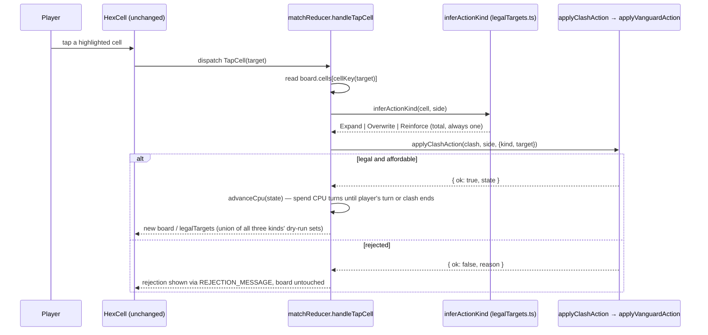

# Plan: Vanguard targeting-and-layout fixes (SCRUM-40, SCRUM-41, SCRUM-42)

Plan folder: `.claude/contract/SCRUM-40-vanguard-targeting-and-layout-fixes/`
Execution status: see `tasks.md` in this folder.

---

## Part 1 — Alignment

### Task reference

Three related Vanguard bug tickets, developer-confirmed to be sequenced together because all three
change `src/app/vanguard/legalTargets.ts`'s consumption shape and the board's opening position:

**SCRUM-40** — https://amazerbeam.atlassian.net/browse/SCRUM-40
> Expand and Overwrite's legal-target rules should key off any owned cell, not the connected chain
> — each keeps its own range (2, adjacent)

Full acceptance criteria (from the ticket body): Expand and Overwrite currently compute legality
from `connectedNetwork` — the BFS-reachable chain from `board.bases[side]`. The intended rule: a
target is legal if it is within the action's range of **any** cell the player currently owns,
regardless of chain connectivity. Expand's range stays `EXPAND_RANGE` (2); Overwrite's stays
adjacent (1) — only the reference set changes, for both actions identically. **Confirmed
2026-08-06 on the ticket itself: both actions change together, same reference-set relaxation, each
keeping its own existing range.** `breach.ts`'s Breach condition stays connectivity-based —
unchanged. `src/app/vanguard/legalTargets.ts` needs no code change itself (it dry-runs the engine)
but its tests need updating alongside the engine fix. `cpuPlayer.ts`'s heuristic also currently
keys off `connectedNetwork` and needs the same reference-set change. Documentation to update:
`.docs/design/skirmish-board-replacement.md` (Expand/Overwrite rows) and
`.docs/implementation/vanguard.md`.

**SCRUM-41** — https://amazerbeam.atlassian.net/browse/SCRUM-41
> click-to-act, no palette-first step

Full acceptance criteria: submitting a Clash action currently requires arming an action from
`ActionPalette` first, then tapping a target cell. The intended interaction removes the arming
step: the player taps a target cell directly, and the action type is inferred from what currently
occupies that cell — empty within range → Expand, the player's own eligible token → Reinforce, an
adjacent enemy token → Overwrite. Every currently-legal target across all three action kinds is
highlighted continuously, not just one armed kind's targets. This is a deliberate revision of
SCRUM-29's own AC2 ("selecting an action... and then a target cell"), not a defect in SCRUM-29.
Open question the ticket poses, resolved during planning (see Approach): confirm each occupancy
state maps to exactly one action with no overlap, and define what renders when a cell has no
eligible action at all (e.g. a fully-reinforced own token). Documentation to update:
`.docs/implementation/vanguard-ui.md`.

**SCRUM-42** — https://amazerbeam.atlassian.net/browse/SCRUM-42
> bases to top-center/bottom-center, cluster = base + all touching hexes all as once

Full acceptance criteria: `createVanguardBoard` currently fixes bases at opposite corners
(`{0,0}` / `{size-1,size-1}`) with a `STARTING_CLUSTER_SIZE`-capped BFS cluster grown outward from
the corner. The intended layout: the player's base at `{q: floor(size/2), r: 0}`, the CPU's at
`{q: floor(size/2), r: size-1}` — matching the bottom/top split confirmed at SCRUM-29's approval
gate. The starting cluster is **the base cell plus every on-board hex adjacent to it** —
definitionally "all the hexes that touch the home base," derived from geometry and the base's
position, never chosen. At a center-of-edge base that is 4 neighbours, 5 cells total. Both sides'
clusters are built by the same rule, so the opening position is symmetric. **Confirmed out of
scope: `src/app/vanguard/` needs no change** — nothing there hard-codes a corner coordinate.
`STARTING_CLUSTER_SIZE` becomes dead configuration and must be removed deliberately, not left
orphaned. One existing UI test (`hexLayout.test.ts`'s `'makes the player base the leftmost cell on
the board'`) is documented, expected fallout, not a sign of a defect. `DEFENSE_CELLS`
repositioning is explicitly a separate, later play-feel decision — not part of this fix.
Documentation to update: `.docs/design/skirmish-board-replacement.md` (base-placement paragraph)
and `.docs/implementation/vanguard.md`.

### Restated goal

Three coordinated corrections to the Vanguard board engine and its Clash UI: (1) Expand and
Overwrite legality is computed against every cell a side owns, not just the base-connected chain,
so a scouted gap cell actually extends both actions' reach the way the design doc's own 1-cell-gap
Expand rule implies it should; (2) the Clash interaction drops its "arm an action, then tap a
target" two-step in favour of tapping any highlighted cell directly, with the action type inferred
from what's on that cell; (3) both home bases move from opposite board corners to the horizontal
center of their own edge row, with the starting cluster redefined as "the base plus everything
touching it" instead of a separately-tunable BFS size. All three are engine/UI corrections to
already-shipped SCRUM-21/27/29 work, not new mechanics.

### In scope

- `ownedCells`, a new network query in `src/vanguard/network.ts` returning every cell a side owns
  regardless of chain connectivity, exported alongside the unchanged `connectedNetwork`.
- `applyExpand` and `applyOverwrite` (`src/vanguard/expand.ts`, `overwrite.ts`) keying their
  distance check off `ownedCells` instead of `connectedNetwork`.
- `chooseCpuClashAction`'s candidate generation and tiering (`src/vanguard/cpuPlayer.ts`) keying
  off the same broadened reference set, so the CPU heuristic never drifts from the engine it
  dry-run-validates against.
- A total, pure `inferActionKind` function (occupancy → `VanguardActionKind`) and an
  `allLegalTargets` union helper, both in `src/app/vanguard/legalTargets.ts`.
- `matchReducer.ts`'s `handleTapCell` submitting the inferred action directly; removal of the
  `selectedAction` field and the `SelectAction` dispatch; `CancelSelection` renamed to
  `ClearRejection` (Escape now only dismisses a rejection banner, since there is no longer
  anything to "cancel" an arming of).
- `ActionPalette.tsx` becoming a non-interactive legend (name + cost/range copy, dimmed when a
  kind has no legal target this turn) — no buttons, no click handler, no armed/selected state.
- `VanguardMatch.tsx` wiring the board's highlight to the union of every action kind's legal
  targets whenever it's the player's turn, and updated hint copy for the no-arming flow.
  `vanguard.css`'s `.vg-action`/`.vg-actions` rules updated for the new non-interactive markup.
  `.vg-cell[data-selectable]`'s existing brass-ring visual is reused unchanged — no new CSS custom
  property.
- `createVanguardBoard` (`src/vanguard/createBoard.ts`) placing both bases at their row's
  horizontal center and building each starting cluster as "base + in-bounds neighbours."
  `STARTING_CLUSTER_SIZE` removed from `config.ts` and the `src/vanguard/index.ts` barrel.
- Test coverage for all of the above (see File map in `tasks.md`), including new tests that lock in
  the gapped-owned-cell fix, the tap-infers-action behaviour, and the new base geometry.
- `.docs/design/skirmish-board-replacement.md`'s Expand/Overwrite rule text and base-placement
  paragraph, and `.docs/implementation/vanguard.md` / `vanguard-ui.md`, refreshed to describe the
  shipped state.

### Explicitly out of scope

- `breach.ts` / `hasReachedBreach` — the Breach condition stays chain-connectivity-based per
  SCRUM-40's own text; no code or test change.
- `src/battle/__tests__/battleTestHelpers.ts`'s `scriptedClashAction`/`scriptedLocalAction` — they
  call `connectedNetwork` directly as a deliberately more conservative scripting strategy (see
  Config and persisted-shape audit). `ownedCells` is a strict superset of `connectedNetwork`, so
  broadening the engine's own rule cannot make an already-legal scripted candidate illegal; nothing
  there needs to change for these tickets to be correct.
- `DEFENSE_CELLS`'s fixed 5-cell layout — SCRUM-42's own text calls repositioning it a separate,
  later play-feel decision, not part of this fix.
- Any change to `hexLayout.ts`/`hexPlacement`'s own logic — SCRUM-42 confirms it is already
  generic over any base coordinate; only the stale test that encoded the old corner assumption
  changes.
- `useHexRovingFocus.ts` — its `isFocusable` closure already takes an opaque `(key) => boolean`
  predicate; the widened, always-shown `legalTargets` set requires no change to the hook itself.
- Muster/turn-indicator display (SCRUM-30, still not built) and any other already-documented
  deferred item in `vanguard-ui.md` unrelated to these three tickets.
- Any redesign of the cell highlight's visual language (colour-coding per inferred action kind,
  etc.) — the existing single brass-ring `data-selectable` treatment is reused as-is; see Risks.

### Pattern Reference

- `src/vanguard/network.ts`, `expand.ts`, `overwrite.ts`, `cpuPlayer.ts`, `breach.ts`,
  `createBoard.ts`, `config.ts`, `index.ts` — the engine modules this plan edits or reads, all
  following the existing "bounds check → cell-state check → distance check → immutable update"
  shape documented in `.docs/implementation/vanguard.md`.
- `src/app/vanguard/legalTargets.ts`'s existing dry-run-validate pattern (call the real engine,
  never re-derive legality) is the pattern `inferActionKind`/`allLegalTargets` extend, and the same
  pattern `chooseCpuClashAction`'s `firstValidated` already uses.
- `src/app/vanguard/matchReducer.ts`, `ActionPalette.tsx`, `VanguardMatch.tsx`,
  `useHexRovingFocus.ts`, `vanguard.css` — the UI layer SCRUM-41 touches.
- `.docs/implementation/vanguard.md` and `vanguard-ui.md` are cited throughout this plan as the
  authoritative description of current shipped behaviour; `.docs/design/skirmish-board-replacement.md`
  is cited for the design intent each ticket corrects the implementation toward.

### Constraints flagged on the brief

- Expand keeps `EXPAND_RANGE` (2); Overwrite keeps adjacency (1) — SCRUM-40 changes the reference
  set only, never either action's own range.
- The Breach's connectivity requirement (no gap counts) is unchanged — SCRUM-40 explicitly does
  not touch it.
- SCRUM-41 is a deliberate revision of SCRUM-29's own shipped AC2, not a defect fix on top of it.
- SCRUM-42's base coordinates and cluster definition are exact, ticket-stated formulas
  (`q: floor(size/2)`, `r: 0` / `size-1`; cluster = base + in-bounds neighbours) — not open design
  questions.
- No new runtime dependency, no new CSS custom property, no new `data-*` attribute is required by
  any of the three tickets as scoped in this plan (see Risks for where a richer visual treatment
  was considered and set aside).

### Assumptions made

- **`ownedCells` lives in `network.ts`, not a new file.** SCRUM-40's own Dependencies & Risks
  section names this location explicitly ("or a new 'all owned cells' helper alongside
  `connectedNetwork`"). Confirmed by the ticket text, not an assumption in the flagged sense.
- **`minDistanceToNetwork` is not renamed.** Its signature (`target`, `network: readonly HexCoord[]`)
  is already generic over any coordinate array; nothing about "network" is baked into its
  implementation. Renaming it would touch every one of its 9+ call sites for a cosmetic gain — not
  worth the diff.
- **`inferActionKind` maps a `Defense` cell to `Expand`, not to "no action."** The function is total
  (always returns a kind) so a tap never has an undefined outcome; `applyExpand`'s own
  `CellIsDefense` check runs before any distance check, so this choice makes the engine's own
  correct rejection reason ("permanent defense") surface for a defense-cell tap, rather than
  inventing a client-side "not a legal target" concept `applyClashAction` doesn't have a reason
  code for. This directly answers SCRUM-41's own open question about "what renders when a cell has
  no eligible action at all" — an own token at the reinforcement cap still infers `Reinforce`, and
  the engine's own `ReinforcementCapReached` rejection is what the player sees, exactly like every
  other rejection.
- **`ActionPalette` becomes a read-only legend rather than being deleted.** SCRUM-41's brief says
  "no palette-first step," not "no palette" — the cost/range reference (`ACTION_DESCRIPTION`) is
  still useful with no arming step attached. Flagged as a judgement call in Risks since deleting it
  entirely was a real alternative.
- **The highlighted-cell visual stays the single existing brass ring (`data-selectable`), applied
  to the union of all three kinds' legal targets, rather than three colour-coded rings.** The
  cell's own existing `data-owner`/`data-kind` colouring (empty/dark, player/purple, cpu/green)
  already signals which action a highlighted cell means once the player learns the mapping — adding
  a second colour axis on top would be a new tunable with no ticket text requesting it. Flagged in
  Risks since this is exactly the kind of visual call that's the developer's per `CLAUDE.md`.
  Because this reuses the shipped `--vg-selectable` custom property unchanged, it is a case where no
  new mockup content is strictly required by legalTargets’ shape — the mockup instead exists to
  prove the *behavioural* union-highlight, direct-tap flow.
- **`CancelSelection` is renamed `ClearRejection`, not deleted.** With no `selectedAction` left to
  cancel, its only remaining job is dismissing a rejection banner on Escape — kept because
  `useHexRovingFocus`'s `onCancel` prop is mandatory and Escape-dismisses-the-banner is a real,
  small UX affordance already wired through the roving-focus hook, and the change costs one rename,
  not a new mechanism.
- **The cluster-build in `createVanguardBoard` still filters out a neighbour that's already
  occupied** (mirroring the removed `hexBfs`'s own `canEnter` guard), even though at
  `BOARD_SIZE = 11` with the current `DEFENSE_CELLS` layout no edge-row base neighbour actually
  collides with a defense cell or the other side's cluster today. Kept as a defensive invariant
  (a cell can never be both `Defense` and `Token`) rather than removed for being currently unused.
- **The plan slug anchors on SCRUM-40** (the lowest ticket number) per `plan-resolution.md`'s
  single-jira-key grammar; all three tickets are cited by key throughout `plan.md` and `tasks.md`
  so the folder is discoverable from any of the three.

### Config and persisted-shape audit

- **`STARTING_CLUSTER_SIZE` removal** — grepped project-wide: 35 total occurrences across 10 files.
  Live source needing this task's edit: `src/vanguard/config.ts:1` (the export),
  `src/vanguard/createBoard.ts:2` (import + BFS-slice usage), `src/vanguard/index.ts:1` (barrel
  re-export), `src/vanguard/__tests__/createBoard.test.ts:4` (import + two assertions) — **8 hits
  in 4 live files**, all covered by Phase 2's tasks. `.docs/implementation/vanguard.md:4` hits are
  covered by the doc-refresh task. The remaining 22 hits are inside `.claude/contract/SCRUM-21-*`,
  `SCRUM-22-*`, and `SCRUM-29-*`'s own `plan.md`/`tasks.md`/`pr-description.md` — historical
  contract records for already-archived-in-spirit work, never edited by a later plan.
- **`connectedNetwork` consumers** — grepped project-wide: 23 files. Live source that changes in
  this plan: `src/vanguard/expand.ts`, `overwrite.ts`, `cpuPlayer.ts` (swap to `ownedCells`).
  Live source that does **not** change: `src/vanguard/network.ts` (defines it, unchanged),
  `src/vanguard/breach.ts` (explicitly unchanged per SCRUM-40), `src/app/vanguard/legalTargets.ts`
  (one hit, a comment only — no code reference),
  `src/battle/__tests__/battleTestHelpers.ts` (4 hits — a battle-level test script, confirmed
  out of scope above). Test files updated for other reasons in this plan
  (`src/vanguard/__tests__/network.test.ts`, `createBoard.test.ts`) keep their existing
  `connectedNetwork` assertions untouched and add new, separate `ownedCells` coverage. The rest are
  archived contract records and `.docs/implementation/vanguard.md`, covered by the doc-refresh task.
- **`selectedAction` / `SelectAction` / `CancelSelection` consumers** — grepped project-wide: live
  source needing this task's edit: `src/app/vanguard/matchReducer.ts` (definition/state/reducer),
  `src/app/vanguard/VanguardMatch.tsx` (props passed to `ActionPalette`, the `onCancel` dispatch),
  `src/app/vanguard/__tests__/matchReducer.test.ts` (the `armed()` test helper and its dependent
  assertions) — **3 live files**. `src/app/warCouncil/roundReducer.ts` and its test, and
  `WarCouncilRound.tsx`, share only the string `SelectAction`/`selectedAction` as an unrelated
  reducer's own action-kind name in a different module tree — confirmed independent, not touched.
  `.docs/implementation/vanguard-ui.md` and the archived `SCRUM-29-vanguard-ui` plan/tasks are the
  remaining hits, covered by the doc-refresh task.
- **Type change shape:** `MatchUiState.selectedAction: VanguardActionKind | null` is removed
  (a field deletion, not a retype) — every reader is one of the 3 live files above, all edited in
  the same task per the mandatory config-change task shape. No persisted storage is involved
  anywhere in this plan; `ClashState`/`MatchUiState` are transient, in-memory only, matching
  `vanguard.md`'s existing documented stance — this is a cheap window, and it stays open after
  this plan (nothing here adds persistence).
- **Names align across the chain:** `ownedCells` (network.ts) ↔ its two call sites (expand.ts,
  overwrite.ts) ↔ `cpuPlayer.ts`'s own internal `owned` variable name ↔ the barrel export in
  `index.ts` ↔ its test coverage in `network.test.ts` — one name, checked at every step in
  Phase 1's tasks. `inferActionKind`/`allLegalTargets` similarly checked across `legalTargets.ts`,
  `matchReducer.ts`, `VanguardMatch.tsx`, and their tests in Phase 3.
- **Architectural boundary:** the pure-core ESLint override (`eslint.config.js` lines 23–58) scopes
  `no-restricted-imports`/`no-restricted-globals` to `src/warCouncil/**` and `src/vanguard/**`.
  None of this plan's `src/vanguard/` edits (network.ts, expand.ts, overwrite.ts, cpuPlayer.ts,
  createBoard.ts, config.ts, index.ts) import React or touch a DOM global — confirmed by inspection
  of every edit in this plan, and re-confirmed by Phase 5's boundary grep. `legalTargets.ts` and
  `matchReducer.ts` under `src/app/vanguard/` are outside that boundary but are documented
  (`vanguard-ui.md`) as themselves importing no React and touching no DOM global — Phase 5's grep
  re-confirms this holds after `inferActionKind`/`allLegalTargets` are added.

---

## Part 2 — Technical design

### Approach

**SCRUM-40 (engine reference-set fix).** `network.ts` gains one new export, `ownedCells(board,
side)`, sitting beside the unchanged `connectedNetwork`: it filters `allBoardCoords(board.size)` to
cells the side owns, with no BFS and no dependency on the base cell at all. This is the same
`allBoardCoords`-filter idiom `cpuPlayer.ts`'s own `expandCandidates`/`overwriteCandidates` already
use, so it introduces no new traversal primitive — a `O(size²)` filter on a per-Clash-action
computation, not a hot path, matching the existing performance stance `network.ts` documents for
`connectedNetwork`. `applyExpand` and `applyOverwrite` swap their `connectedNetwork(board, side)`
call for `ownedCells(board, side)` — a one-line change each, since both already pass the result
straight into the unchanged, already-generic `minDistanceToNetwork`. `cpuPlayer.ts`'s candidate
generation and tiering make the identical swap, so the CPU's own advance-ranking heuristic never
generates a candidate the engine it dry-run-validates against would reject for a reason the
heuristic didn't model. `breach.ts` is untouched — the Breach still walks `connectedNetwork`, so a
gapped owned island that newly extends Expand/Overwrite's reach still does not count toward a
Breach until something fills the gap, exactly as `skirmish-board-replacement.md`'s "Breach" section
already states.

**SCRUM-41 (click-to-act).** The key design decision is that **no new legality logic is needed at
all** — `legalTargetsFor(board, side, kind, musterAvailable)` already dry-runs the real engine for
every coordinate and every kind, and because the three action kinds are legal on structurally
disjoint occupancy classes (Expand only succeeds on an empty cell, Overwrite only on an enemy
token, Reinforce only on the acting side's own token — enforced by each `apply*` function's own
first cell-state check), the union of the three existing per-kind sets is already exactly "every
cell the player can currently tap to do something." `allLegalTargets` is therefore a small, pure
union of three already-computed `ReadonlySet<CellKey>`s — it does not re-run the engine a fourth
time. `VanguardMatch.tsx` already computes all three per-kind sets today (for `ActionPalette`'s
`enabled` map); this plan only changes what it does with them — union them into the board's
`legalTargets` prop whenever it's the player's turn, instead of gating on an armed
`selectedAction`. Because `HexCell`/`VanguardBoardView`/`useHexRovingFocus` only ever consumed
`legalTargets` as an opaque `ReadonlySet<CellKey>` membership check, **none of those three files
need to change** — the type and the call shape are identical, only which keys are in the set
changes. The one place that genuinely needs new logic is choosing *which* action a tap means:
`inferActionKind(cell, side)` in `legalTargets.ts` is a small, total, pure mapping from a cell's
occupancy to a `VanguardActionKind` — it decides nothing about legality (that's still entirely
`applyClashAction`'s job), only which candidate action to attempt, mirroring the same
"ask-the-engine" posture `vanguard-ui.md` documents for the rest of this module.
`matchReducer.ts`'s `handleTapCell` calls it once per tap and submits the result — removing the
`selectedAction`/`SelectAction` machinery entirely, since there is nothing left to arm.
`ActionPalette.tsx` loses its `onSelect`/`selected` props and its `<button>`s become plain `<li>`
legend items — it still shows cost/range copy and dims a kind with `enabled[kind] === false`, but
commits nothing.

**SCRUM-42 (base placement and cluster).** `createVanguardBoard` computes
`centerColumn = Math.floor(BOARD_SIZE / 2)` once and places both bases at that column, `r: 0` and
`r: BOARD_SIZE - 1`. The cluster-building loop drops its `hexBfs` call (there is no growth or
traversal left — "the base plus everything touching it" is a one-hop neighbour lookup, not a
search) in favour of `[base, ...hexNeighbors(base)]` filtered to in-bounds, non-defense,
not-yet-occupied cells — the same defense/overlap guard the old `hexBfs`'s `canEnter` predicate
provided, now inlined directly since there's no traversal predicate to hang it on.
`STARTING_CLUSTER_SIZE` is deleted from `config.ts` and its barrel export in `index.ts`, per the
ticket's own instruction that it is now dead configuration, not a retunable value — the cluster
size is a derived fact of hex geometry and the base's own position, checked by a test that computes
its expectation the same way (`1 + hexNeighbors(base).filter(inBounds).length`) rather than a
hard-coded literal, so the assertion stays correct if `BOARD_SIZE` is ever retuned.

**Why not touch `src/app/vanguard/legalTargets.ts`'s engine-facing legality for SCRUM-40, or
`hexLayout.ts` for SCRUM-42?** Both tickets' own text confirms these layers are already correctly
generic — `legalTargetsFor` dry-runs whatever `applyVanguardAction` currently accepts, so
broadening Expand/Overwrite's engine-level rule changes `legalTargetsFor`'s output with zero edit
there; `hexPlacement` takes any `HexCoord` and was never told which one is "the base," so moving
the base is invisible to it. Touching either file to "make SCRUM-40/42 work" would be redundant
work the ticket text explicitly rules out.

### Skills to invoke during execution

- `react-frontend` — governs every file this plan touches under `src/`: the engine modules
  (`src/vanguard/`), the UI/reducer layer (`src/app/vanguard/`), and their Vitest coverage. Applies
  to all three tickets' code changes.
- `game-ux` — SCRUM-41 is a direct application of this skill's "count the taps on the most repeated
  action" rule (removes a tap from the most-repeated Clash action) and its "state reads without
  colour alone" rule (the reused single-colour highlight still differs by the cell's own
  `data-kind`/`data-owner`, not by colour alone). Read before touching `ActionPalette.tsx`,
  `VanguardBoardView.tsx`'s consumption, or the mockup.
- `game-designer` — owns `.docs/design/skirmish-board-replacement.md`; the Expand/Overwrite
  legality-text edit and the base-placement paragraph edit both live there.
- `implementation-doc-writer` — refreshes `.docs/implementation/vanguard.md` and `vanguard-ui.md`
  once all three tickets' code has landed, so both docs describe the final shipped state in one
  pass rather than three partial ones.
- Also read: `.claude/workflow/web-project.md` (runner commands, the pure-core boundary, the
  correctness traps this plan's config-key removal and string-bound renames must respect).
  `.claude/rules/` was scanned (Glob `.claude/rules/*.md`) and is empty — no project-wide rule
  file applies beyond `web-project.md`'s own traps section, already folded into this plan's audit.

### Diagram



### Data shapes

#### `src/vanguard/network.ts`

```ts
// New export, alongside the unchanged connectedNetwork/minDistanceToNetwork.
// SCRUM-40's reference set for Expand/Overwrite legality — every cell `side`
// owns, chain-connected or not. connectedNetwork stays the Breach's own,
// narrower reference set (breach.ts is unchanged).
export function ownedCells(board: VanguardBoard, side: PlayerSide): readonly HexCoord[]
```

#### `src/vanguard/index.ts`

```ts
// Barrel export gains ownedCells, loses STARTING_CLUSTER_SIZE:
export { connectedNetwork, minDistanceToNetwork, ownedCells } from './network'
export {
  BOARD_SIZE,
  DEFENSE_CELLS,
  EXPAND_RANGE,
  EXPAND_COST,
  OVERWRITE_COST,
  OVERWRITE_COST_REINFORCED,
  REINFORCE_COST,
  REINFORCE_MAX_STACK,
} from './config'
```

#### `src/vanguard/config.ts`

`STARTING_CLUSTER_SIZE` (currently `export const STARTING_CLUSTER_SIZE = 4`) is deleted outright —
not retyped, not deprecated. No replacement key: the cluster size is derived, not configured.

#### `src/vanguard/createBoard.ts`

```ts
// Signature unchanged (createVanguardBoard(): VanguardBoard); only the base
// coordinates and cluster-building body change. No new exported symbol.
```

#### `src/app/vanguard/legalTargets.ts`

```ts
// New, total, pure — decides which action a tap on this cell means; decides
// no legality (applyVanguardAction/applyClashAction still do that entirely).
export function inferActionKind(
  cell: VanguardCell | undefined,
  side: PlayerSide,
): VanguardActionKind

// New — the union of every action kind's already-computed legal-target set,
// for the board's continuous highlight. Takes the by-kind record the caller
// already built (VanguardMatch.tsx computes it today for ActionPalette's
// `enabled` map) rather than re-dry-running the engine a fourth time.
export function allLegalTargets(
  byAction: Readonly<Record<VanguardActionKind, ReadonlySet<CellKey>>>,
): ReadonlySet<CellKey>

// legalTargetsFor's own signature and behaviour are unchanged.
```

#### `src/app/vanguard/matchReducer.ts`

```ts
// MatchUiState loses selectedAction:
export interface MatchUiState {
  readonly round: number
  readonly board: VanguardState
  readonly clash: ClashState | null
  readonly rejection: MatchRejection | null
  readonly fault: MatchFault | null
}

// MatchActionKind loses SelectAction, renames CancelSelection -> ClearRejection:
export const MatchActionKind = {
  MusterReady: 'musterReady',
  RequestFailed: 'requestFailed',
  TapCell: 'tapCell',
  ClearRejection: 'clearRejection',
  NextRound: 'nextRound',
} as const

// MatchUiAction loses the SelectAction variant, renames CancelSelection -> ClearRejection:
export type MatchUiAction =
  | { readonly kind: typeof MatchActionKind.MusterReady; readonly tricks: TricksWon }
  | { readonly kind: typeof MatchActionKind.RequestFailed; readonly message: string }
  | { readonly kind: typeof MatchActionKind.TapCell; readonly target: HexCoord }
  | { readonly kind: typeof MatchActionKind.ClearRejection }
  | { readonly kind: typeof MatchActionKind.NextRound }
```

#### `src/app/vanguard/ActionPalette.tsx`

```ts
// Props lose selected and onSelect:
export interface ActionPaletteProps {
  readonly enabled: Readonly<Record<VanguardActionKind, boolean>>
  readonly interactive: boolean
  readonly hint: string
}
```

No configuration key, persisted shape, or `package.json`/`tsconfig.json`/`vite.config.ts`/
`eslint.config.js` change anywhere in this plan.

### Runtime quality notes

- **Purity and adjudication:** `ownedCells` and `inferActionKind` both decide nothing about
  legality — `ownedCells` is a pure filter feeding the existing `minDistanceToNetwork`, and
  `inferActionKind`'s only job is picking which candidate action `applyClashAction` gets asked to
  adjudicate. No tunable is introduced by this plan; `EXPAND_RANGE`/`OVERWRITE_COST`/etc. are
  read, never duplicated. `matchReducer.ts` still decides no rule of its own, matching
  `vanguard-ui.md`'s documented invariant — `handleTapCell` reads `ClashState.status`/`.turn` and
  translates the engine's own result into UI state, exactly as before.
- **Effects, mount and teardown:** No new effect, listener, observer, timer, or
  `requestAnimationFrame` anywhere in this plan. `VanguardMatch.tsx`'s one existing effect (the
  `requestTricksWon` request) is untouched by these changes — none of the three tickets touch its
  dependency array or its `cancelled` guard.
- **Hot-path cost:** `ownedCells` is `O(size²)` per Expand/Overwrite attempt or CPU-candidate pass
  — identical order to the `connectedNetwork` call it replaces, and this remains a discrete,
  turn-based action, not a pointer hot path. `allLegalTargets` is `O(size²)` in the number of
  already-computed set entries (a plain union, no engine call), strictly cheaper than the
  `3 × size²` engine dry-run pass `VanguardMatch.tsx` already pays for the per-kind sets it still
  needs for `ActionPalette`. No new state is high-frequency; nothing here is read on a pointer-move
  or drag path.
- **Determinism and numeric safety:** No `Math.random()` anywhere in this plan's scope. `createBoard.ts`'s
  new cluster construction has no divisor at all (a filter over a fixed 6-neighbour list), so there
  is no new `NaN`/divide-by-zero surface — a stricter safety profile than the `hexBfs` call it
  replaces, not a weaker one. `centerColumn = Math.floor(BOARD_SIZE / 2)` is well-defined for any
  `BOARD_SIZE >= 1`.
- **Error paths:** `inferActionKind` is total — it always returns a `VanguardActionKind`, never
  `undefined` and never throws, so `handleTapCell` never needs a "no inferred action" branch; every
  tap either commits or comes back with a named `IllegalActionReason`/`ClashRejectionReason` exactly
  as today. No new async surface, no new `catch`, no new swallowed error anywhere in this plan.

### Risks and judgement calls

- **`ActionPalette` kept as a read-only legend rather than deleted outright.** The ticket says "no
  palette-first step," which this plan reads as "no arming step," not "no palette at all." An
  alternative reading — remove `ActionPalette` entirely and let the board's own highlighting carry
  all the information — was considered and set aside because the cost/range copy
  (`ACTION_DESCRIPTION`) has no other home on screen. Worth a look once the mockup is in front of
  the developer.
- **The highlighted-cell visual reuses the single existing brass ring for all three simultaneously-
  visible action kinds, rather than introducing a colour per kind.** This is the plan's one real
  visual judgement call — see Approach and Assumptions. The mockup demonstrates this reading so the
  developer can react to it directly rather than to a description of it.
- **`inferActionKind` mapping a `Defense`-cell tap to `Expand`** (so the engine's own
  `CellIsDefense` rejection is what surfaces) is a small design choice with no alternative reason
  code available in `IllegalActionReason` today — flagged so it's a decision, not an accident.
- Everything else in this plan (base coordinates, cluster definition, Expand/Overwrite's reference
  set) is a formula the tickets themselves state exactly, not an open question — no tuning value is
  outstanding anywhere in this plan's scope.
