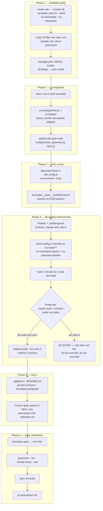

# Plan: Scaffold the Vite + React + TypeScript application

Plan folder: `.claude/contract/SCRUM-8-scaffold-vite-app/`
Execution status: see `tasks.md` in this folder.

---

## Part 1 — Alignment

### Task reference

**Jira:** [SCRUM-8 — Scaffold the Vite + React + TypeScript application](https://amazerbeam.atlassian.net/browse/SCRUM-8) · Task under epic SCRUM-1 (String Railway — playable browser prototype) · Status `To Do` · no sub-tasks, no issue links.

**Problem statement (verbatim):** "The repository currently contains only `.docs` and `.claude` — there is no application. Both the rules engine story and the board render story assume a project already exists with a test runner, a TypeScript config and a dev server, so neither can start until something creates it. Beyond running `npm create vite`, this task fixes the one architectural decision the whole epic rests on: game logic lives in `src/rules/` as pure TypeScript with zero React imports. That boundary is cheap to establish now and expensive to retrofit once components have started importing geometry helpers directly."

**User story (verbatim):** "As a developer picking up any story in this epic, I want a scaffolded project with the folder boundary and test runner already in place, so that I can start on my story's actual work rather than on setup."

**Acceptance criteria (verbatim):**

1. `npm create vite@latest` with the `react-ts` template produces a running app; `npm run dev` serves it and `npm run build` succeeds.
2. The folder structure separates concerns as agreed: `src/rules/` for pure logic, `src/rules/__tests__/` for its tests, `src/ui/` for components, with `App.tsx` at the root.
3. Vitest is installed and configured; `npm test` runs and passes at least one placeholder test in `src/rules/__tests__/`.
4. A lint rule or an equivalent test fails the build if anything under `src/rules/` imports `react`, `react-dom` or a DOM global — the boundary is enforced, not merely documented.
5. TypeScript runs in strict mode, and `npm run typecheck` (or equivalent) reports no errors.
6. ESLint and Prettier are configured and pass on the scaffolded source.
7. A `.gitignore` covering `node_modules`, `dist` and local environment files is present.
8. `README.md` records how to install, run, test and build, plus a one-paragraph statement of the `src/rules/` boundary and why it exists.
9. An empty but valid `rules.json` shell exists at the agreed path so the configuration task has a known location to populate.
10. No backend, server, API route or database dependency is introduced.

**Scope boundaries (verbatim).** In scope: Vite + React + TypeScript scaffold and folder structure; Vitest, ESLint, Prettier, strict TypeScript, `.gitignore`, `README.md`; the import-boundary rule protecting `src/rules/`; placeholder `rules.json`. Out of scope: any game logic, geometry or rendering; populating `rules.json` with real constants; git remote creation and CI; component library, CSS framework or state management library (`useReducer` is sufficient); routing.

**Dependencies and risks (verbatim).** "Blocks all six stories in practice, since none of them have anywhere to put code until this lands. Per the epic's structure, no cross-issue links are recorded; the Epic is the only relationship. Risk: scaffolding tools change their defaults between versions. Pin the Node and template versions in the README so a second developer gets the same starting point."

**Design assets:** "N/A — no visual surface."

**Follow-up decisions confirmed interactively (2026-07-31):**

- **React version — confirmed.** Developer: *"Use React 19 + Vite 8 and update the skill to reflect."* The contract takes the current `create-vite` output rather than hand-downgrading, and corrects `react-frontend/SKILL.md`, which still documents React 18 + Vite 5.
- **`rules.json` location — confirmed.** `public/rules.json`, not the repo root. Vite copies only `public/` into `dist/`, so a root-level file is fetchable in dev and 404s in a production build. The layout blocks in `.claude/workflow/web-project.md` and `react-frontend/SKILL.md` both say root and are corrected by this contract.
- **Skills — confirmed.** `react-frontend` only. `management-jira` was offered and declined, so this contract performs no Jira transitions or comments; moving SCRUM-8 to Done stays manual.

### Restated goal

**The outcome is a localhost running a placeholder homepage.** `npm install` then `npm run dev` serves a page at the printed `http://localhost:5173` showing the String Railway placeholder — and `npm run build` plus `npm run preview` serve that same page out of `dist/`. Everything else in this contract exists to make that page's foundations correct rather than merely present.

Concretely, that means turning a repository holding nothing but documentation and the `/fb-*` pipeline into a working Vite + React + TypeScript skeleton every later story can build inside: a real scaffold with the resolved dependency versions pinned and recorded, the `src/rules/` · `src/rules/__tests__/` · `src/ui/` folder split established, Vitest wired so `npm test` runs a passing spec without hanging in watch mode, strict TypeScript, ESLint plus Prettier both green, a `.gitignore` and a README, and an empty-but-valid `public/rules.json` waiting for the configuration story. The one piece of this that is architecture rather than setup is criterion 4: an ESLint rule that actually fails when something under `src/rules/` imports React or touches a DOM global, verified by deliberately tripping it rather than assumed from the config text. No game logic, no geometry, no rendering, no backend.

The homepage is a *placeholder* in the strict sense — a page that proves the toolchain end-to-end and names what is coming, holding no board, no card, no rule, and no tunable. The board story replaces it.

### In scope

- **A placeholder homepage that renders on localhost** — served by `npm run dev` in development and by `npm run preview` from a production `dist/`. This is the contract's observable deliverable; the items below are what make it trustworthy.
- Scaffold the app from `create-vite`'s `react-ts` template into the repo root without destroying the existing `.claude/` and `.docs/` trees.
- Pin and record the resolved toolchain: Node, npm, `create-vite`, and the exact `react` / `vite` / `typescript` / `vitest` / `eslint` / `prettier` versions installed.
- `package.json` identity and the five scripts the pipeline depends on: `dev`, `build`, `typecheck`, `lint`, `format`, `format:check`, `test`.
- Strict TypeScript, added explicitly to `tsconfig.app.json` and `tsconfig.node.json` — the generated template does not set it.
- The folder layout of criterion 2, plus `src/styles/`, with the Vite demo counter replaced by a minimal `src/ui/AppShell.tsx` so `src/ui/` and `src/styles/` hold real files rather than demo cruft.
- Vitest configured in `vite.config.ts` with a `node` environment, and one passing placeholder spec in `src/rules/__tests__/`.
- ESLint flat-config override enforcing the `src/rules/` boundary for both imports and DOM globals, wired into `npm run build` so it genuinely fails the build, and verified by a throwaway probe file that must fail lint and is then deleted.
- Prettier configured, with a `.prettierignore` that protects `.claude/`, `.docs/`, and `CLAUDE.md` from being reformatted.
- `.gitignore` extended to cover local environment files and `coverage/`.
- `README.md` covering install / run / test / build, the pinned versions, and the boundary paragraph.
- `public/rules.json` — a valid, value-free shell.
- Correcting the four documentation claims this contract makes false: the React/Vite version and the `rules.json` path in `react-frontend/SKILL.md`, the `rules.json` path in `.claude/workflow/web-project.md`, and the stack line in `.claude/agents/defender.md`.

### Explicitly out of scope

- Any game logic, geometry predicate, validation, scoring, reducer, or board rendering — each story owns its own code (§11 build order).
- Choosing any value inside `rules.json`. The shell ships with empty sections; M2 geometry constants and M17 deck composition are the configuration story's work and the developer's decision.
- Git remote creation, CI, and any commit. The repo is not currently a git repository and this contract does not make it one.
- A component library, CSS framework, router, or state-management library. `useReducer` is sufficient and arrives with the story that needs it.
- `src/constants/` — creating it now means an empty directory with nothing to declare. The first story that needs a constant map creates it; the README records that.
- A jsdom environment for component tests. Nothing presentational is tested here; the story that adds the first component test adds the environment override.
- Any backend, API client, server route, database, or `VITE_*` secret.
- Populating the `Known debt` table in `react-frontend/SKILL.md`, and any `.claude/` edit beyond the four false claims listed above.

### Pattern Reference

No code reference was supplied — there is no code. The references chosen, in precedence order:

- **`.claude/skills/react-frontend/SKILL.md`** and its `references/engineering-standards.md` — the MUST/NEVER contract, the project layout block, the constants-versus-tunables distinction, and the testing posture. Loaded during planning; the execution session loads it again.
- **`.claude/workflow/web-project.md`** — the layout, the runner table, the boundary grep, and the correctness traps. Every `Run:` step in `tasks.md` comes from its table.
- **`.docs/Game_Rules/Rules.md`** — cited only for what the scaffold must not pre-empt: §11 gives the build order this contract sits at the head of, §14 indexes the `[MADE UP — M#]` decisions, and M2 (geometry constants) and M17 (deck composition) are the two sections `public/rules.json` reserves space for. No rule is implemented here.
- **The generated `react-ts` template itself** — the executor keeps the template's own conventions (no semicolons, single quotes, flat ESLint config, project-references `tsconfig`) rather than imposing a house style on generated files, so Prettier produces a near-empty diff.

### Constraints flagged on the brief

- **The `src/rules/` boundary must be enforced, not documented** (criterion 4). Explicitly "a lint rule or an equivalent test" that "fails the build" — a comment in the README does not satisfy it.
- **Version drift is a named risk.** "Pin the Node and template versions in the README so a second developer gets the same starting point."
- **No backend, server, API route, or database dependency** (criterion 10), reinforced by the skill's NEVER list — the only fetch this app ever performs is `rules.json`.
- **Two runtime dependencies only** (`react`, `react-dom`), per the skill's Stack section. Everything this contract adds is a `devDependency`; no third runtime dependency is introduced.
- **`npm run dev` must never be invoked by an agent** — it is a non-terminating server (`web-project.md` → Hard constraints on runners). Criterion 1's "`npm run dev` serves it" is verified by the developer, not by the pipeline.
- **Vitest must run via the `run` subcommand** — bare `vitest` is watch mode and hangs the executor indefinitely.
- **`rules.json` must be valid but hold no chosen values.** An agent inventing a string length or a deck count is a defect, not a helpful default.

### Assumptions made

- **Scaffold via a temporary directory, then copy in.** `create-vite` refuses to scaffold into a non-empty directory without `--overwrite`, and `--overwrite` *deletes existing files* — pointing it at this repo root risks `.claude/` and `.docs/`. The contract scaffolds into a scratch directory outside the repo and copies the result in. Verified against the real CLI help during planning, not assumed.
- **`--eslint` must be passed explicitly.** `create-vite` 9's React templates default to **Oxlint**; the flag `--eslint / --no-eslint` is documented as "use ESLint instead of Oxlint (only for React templates)". Criterion 6 names ESLint, so the flag is mandatory. Without it the whole lint task targets the wrong tool.
- **`--no-immediate --no-interactive` are required.** `-i / --immediate` "install dependencies and start dev" would launch the non-terminating dev server inside the executor; `--no-interactive` forces non-interactive mode so a prompt cannot hang the run.
- **Strict mode is added by hand.** The generated `tsconfig.app.json` sets `noUnusedLocals`, `noUnusedParameters`, `erasableSyntaxOnly`, and `noFallthroughCasesInSwitch` but **not** `strict`. Read from the real generated file during planning. Criterion 5 requires it, so both `tsconfig.app.json` and `tsconfig.node.json` get `"strict": true`.
- **`typecheck` is `tsc -b`.** Both generated configs already set `noEmit: true`, so the project-references build emits nothing and serves as the fast gate. No separate `--noEmit` flag is needed.
- **Lint is wired into `build`** as `npm run lint && tsc -b && vite build`. Criterion 4 says the boundary must fail *the build*; with CI out of scope, the build script is the only place that phrase can be made true locally.
- **Boundary enforcement keeps `globals.browser` in scope for `src/rules/`.** `no-restricted-globals` only fires on globals ESLint knows about. Dropping the browser globals for that directory would leave `window` merely undefined, and `no-undef` is switched off by `typescript-eslint`'s recommended config — so the rule would silently never fire. Keeping the globals declared and restricting them by name is what actually enforces the boundary.
- **The boundary rule is verified by tripping it.** A throwaway `src/rules/__boundary-probe.ts` importing `react` and touching `window` must make `npm run lint` exit non-zero, after which it is deleted and lint must return to zero. A config that merely *looks* correct is not evidence.
- **The placeholder spec asserts something real** — that no DOM exists in the rules-engine test environment — rather than `expect(true).toBe(true)`. It is the smallest honest test of what this ticket establishes, and it is written to avoid the literal token the Final-verification boundary grep searches for.
- **The Vite demo is replaced, not kept.** `App.tsx` renders a minimal `src/ui/AppShell.tsx`; the demo counter, `src/assets/`, and the demo CSS go. Keeping them would leave dead files and an unused `hero.png` in a repo whose next six stories all build here, and criterion 2 needs `src/ui/` to hold something real.
- **`src/index.css` moves to `src/styles/global.css`** so the layout in the skill is true from the first commit rather than after a later tidy-up.
- **The `.prettierignore` protects the documentation trees.** `prettier --write .` would otherwise reformat every file under `.claude/` and `.docs/`, rewriting the pipeline and the rulebook extraction as a side effect of a formatting command.
- **Documentation corrections are limited to claims this contract makes false** — the React/Vite version and the `rules.json` path. Conceptual mentions of `rules.json` stay as they are; the `Known debt` table and the wider docs are untouched.
- **No git.** The environment reports this is not a git repository, so `.gitignore` is written as a deliverable (criterion 7) without any repository being initialised.

### Config and persisted-shape audit

- **`rules.json` key renames — none possible.** Grep for `rules\.json` across the repo returns **85 occurrences across 15 files**, and *every one is prose in a `.md` file* (`CLAUDE.md` ×7, `.claude/commands/fb-plan.md` ×17, `.claude/agents/defender.md` ×11, `.claude/commands/fb-apply.md` ×10, `.claude/skills/react-frontend/SKILL.md` ×8, `.claude/agents/implementer.md` ×7, plus nine more). There is no `rules.json` file and no code reader — this contract creates the first one. No key is renamed, retyped, or removed, because none exists.
- **The file's *path* does change against documentation.** `.claude/workflow/web-project.md` (4 hits) and `react-frontend/SKILL.md` (8 hits) both place it at the repo root; the confirmed decision is `public/rules.json`. The layout block in each is corrected in one task. The remaining hits are conceptual ("a `rules.json` key", "validate `rules.json` on load") and stay accurate at either path, so they are deliberately left alone.
- **Persisted shapes — nothing is persisted yet, and that is worth recording.** There is no `localStorage` key, no `Move` kind, no saved-game format, and no move log anywhere on disk. This contract adds none. The window for changing those shapes freely is therefore still fully open as of 2026-07-31; the first story that writes a `Move` closes it, and `.claude/rules/README.md` already names save-data versioning as a candidate rule for that moment.
- **Type changes — none.** No existing type is widened, narrowed, or made optional, because no TypeScript file exists in the repository. Every type this contract introduces is new.
- **Consumers of changed exported constants or predicates — none.** No exported constant, predicate, or reason code exists. `src/constants/` is deliberately not created.
- **Name-chain alignment.** The chain this contract establishes is: `public/rules.json` (data, two empty sections) → *no* TypeScript reader yet → *no* `src/constants/` entry → *no* tutorial copy. Only the first link exists, so nothing can be misaligned. The `configVersion` key is the one name later stories bind to, and it is stated once, in the shell file.
- **The `src/rules/` boundary is not crossed by this design.** The only file the contract places under `src/rules/` is `__tests__/scaffold.test.ts`, which imports from `vitest` alone and asserts the *absence* of a DOM. The boundary grep from `web-project.md` is run in Final verification and must return zero hits; the spec is written so its own text cannot trip it.
- **Shared rules scan: empty.** `Glob .claude/rules/*.md` returns only `README.md` — no rule files exist, so no reject condition applies. Recorded rather than skipped, because the README names three rules likely to land soon and a later reader should know they were absent here.

---

## Part 2 — Technical design

### Approach

The work splits into three genuinely different kinds of task, and the phase boundaries follow that split rather than the order of the acceptance criteria. First, **get a real scaffold on disk safely**. `create-vite` will not write into a non-empty directory unless given `--overwrite`, and that flag removes what is already there — aimed at this repo root it would take `.claude/` and `.docs/` with it. So the scaffold runs into a scratch directory outside the repository and the result is copied in. This is the single highest-consequence step in the contract and the reason it is alone in Phase 1 alongside the install. Two template details were confirmed against the real CLI during planning rather than recalled: `--eslint` is required because the React templates now default to Oxlint, and `--no-immediate` is required because the default behaviour installs and *starts the dev server*, which never terminates.

Second, **make the generated project match what this project actually promises**. The template is close but not compliant: it does not enable `strict`, it has no test runner, its ESLint config knows nothing about `src/rules/`, and it ships a demo counter with an unused `hero.png`. Each of those is a small, verifiable edit, and they are grouped so that every phase boundary type-checks. Strict mode goes in before any code is written against the compiler, because turning it on later means fixing whatever was written in the meantime. The demo is replaced with a minimal `src/ui/AppShell.tsx` — the smallest thing that makes criterion 2's `src/ui/` real without pre-empting the board story's rendering work.

Third, and the only part that is architecture rather than setup, **make the `src/rules/` boundary fail things**. The design uses a single ESLint flat-config override scoped to `src/rules/**/*.ts`, combining `no-restricted-imports` for `react` and `react-dom` with `no-restricted-globals` for `window`, `document`, `navigator`, and `localStorage`. The alternative considered and rejected was stripping `globals.browser` from that override so the DOM identifiers become undefined: it reads cleaner, and it does nothing, because `typescript-eslint`'s recommended config disables `no-undef`. The other rejected alternative was a Vitest spec that reads `src/rules/` off disk and asserts no forbidden pattern appears — it works, but it puts filesystem IO inside the tree that is supposed to be pure, and the spec would itself contain the strings the Final-verification grep hunts for, so the boundary check would flag its own enforcement. Lint is then wired into `npm run build` so criterion 4's "fails the build" is literally true, and the rule is proven by a probe file that must fail lint before being deleted. Type-level enforcement is deliberately *not* relied on: `tsconfig.app.json` includes the `DOM` lib across all of `src`, so `window` type-checks fine under `src/rules/` and ESLint is the only real gate.

No logic goes in `src/rules/` at all in this contract — that tree ships with a single spec and no production module, by design. The only React that exists is `main.tsx`, `App.tsx`, and `AppShell.tsx`, none of which decide anything. `public/rules.json` is data with two empty sections and a version marker; nothing reads it yet, so none of the four async states apply until the configuration story adds the loader. Nothing depends on a rulebook rule or an M-number for behaviour here — M2 and M17 are referenced only as the labels for the two empty sections the shell reserves.

### Skills to invoke during execution

- **`react-frontend`** — confirmed by the developer, and the governing skill for every task that writes under `src/`, plus `package.json`, `tsconfig`, `vite.config.ts`, and `eslint.config.js`. It owns the project layout this contract builds, the `src/rules/` purity contract the boundary rule enforces, the constants-versus-tunables split that keeps `public/rules.json` value-free, the Vitest posture, and the strict-TypeScript requirement. Its `references/engineering-standards.md` is explicitly the file to read "when scaffolding something new" — the executor reads both.
- **`none`** — *documentation correction under `.claude/`, outside any skill's scope* — for the task that fixes the React/Vite version and `rules.json` path claims in `react-frontend/SKILL.md`, `.claude/workflow/web-project.md`, and `.claude/agents/defender.md`. The `react-frontend` skill's own "Do not use when" section names anything under `.claude/`, so invoking it there would be wrong.

**Also read, not a skill:** `.claude/workflow/web-project.md` — mandatory, and the source of every `Run:` command in `tasks.md`.

**Shared rules:** `Glob .claude/rules/*.md` returns only `README.md`. No rule file exists, so none is loaded. Re-scan at execution time rather than trusting this line.

**Developer override:** `management-jira` was offered during classification and declined. No task in this contract touches Jira; transitioning SCRUM-8 stays a manual step for the developer.

### Diagram



### Data shapes

#### `package.json` — scripts (final state)

```json
{
  "name": "string-railway",
  "private": true,
  "version": "0.0.0",
  "type": "module",
  "scripts": {
    "dev": "vite",
    "build": "npm run lint && tsc -b && vite build",
    "typecheck": "tsc -b",
    "lint": "eslint .",
    "format": "prettier --write .",
    "format:check": "prettier --check .",
    "test": "vitest run",
    "test:watch": "vitest",
    "preview": "vite preview"
  }
}
```

`test` is `vitest run`, never bare `vitest` — the bare form is watch mode and hangs any agent that calls `npm test`. `test:watch` exists for the developer, who has a TTY.

#### `package.json` — dependencies

Runtime dependencies stay at exactly two, unchanged from the template: `react` and `react-dom`. Added as **devDependencies** only:

| Package | Purpose | Criterion |
|---|---|---|
| `vitest` | test runner | 3 |
| `prettier` | formatter | 6 |
| `eslint-config-prettier` | disables ESLint rules that fight Prettier | 6 |

Template devDependencies (`@eslint/js`, `@types/node`, `@types/react`, `@types/react-dom`, `@vitejs/plugin-react`, `eslint`, `eslint-plugin-react-hooks`, `eslint-plugin-react-refresh`, `globals`, `typescript`, `typescript-eslint`, `vite`) are kept as generated. `package-lock.json` is written by `npm install` and never hand-edited.

#### `tsconfig.app.json` and `tsconfig.node.json` — added key

```jsonc
{
  "compilerOptions": {
    "strict": true   // NOT present in the generated template — criterion 5
  }
}
```

Added to the `/* Linting */` block of both files, alongside the template's existing `noUnusedLocals`, `noUnusedParameters`, `erasableSyntaxOnly`, `noFallthroughCasesInSwitch`.

Note for later stories, recorded in the README: `erasableSyntaxOnly: true` forbids `enum` and `namespace`. Constant maps use the `as const` object form the skill already prescribes, so this constrains nothing that was planned.

#### `vite.config.ts` — Vitest block

```ts
import { defineConfig } from 'vitest/config'
import react from '@vitejs/plugin-react'

export default defineConfig({
  plugins: [react()],
  test: {
    environment: 'node',
    include: ['src/**/__tests__/**/*.test.ts'],
  },
})
```

`defineConfig` is imported from `vitest/config`, not `vite`, so the `test` field is typed. `environment: 'node'` is the enforcement half of the purity contract at runtime: a rules spec that reaches for `document` fails rather than silently passing under a DOM shim.

#### `eslint.config.js` — the boundary override

Appended to the generated `defineConfig([...])` array, after the existing `**/*.{ts,tsx}` block and before `eslintConfigPrettier`:

```js
{
  files: ['src/rules/**/*.ts'],
  rules: {
    'no-restricted-imports': ['error', {
      patterns: [{
        group: ['react', 'react-dom', 'react/*', 'react-dom/*'],
        message: 'src/rules/ is pure TypeScript — no React. See README, "The src/rules/ boundary".',
      }],
    }],
    'no-restricted-globals': [
      'error',
      { name: 'window', message: 'src/rules/ must not touch the DOM.' },
      { name: 'document', message: 'src/rules/ must not touch the DOM.' },
      { name: 'navigator', message: 'src/rules/ must not touch the DOM.' },
      { name: 'localStorage', message: 'src/rules/ must not touch browser storage.' },
    ],
  },
}
```

The override deliberately does **not** change `languageOptions.globals`; it inherits `globals.browser` from the block above. `no-restricted-globals` matches only declared globals, and `typescript-eslint`'s recommended config disables `no-undef`, so removing the browser globals here would disable the rule instead of tightening it.

#### `public/rules.json` — the shell

```json
{
  "configVersion": 1,
  "_note": "Tuning surface for String Railway. 'geometry' holds the M2 constants (border perimeter, per-player-count edge lengths, card footprint, string lengths, arc-length tolerance); 'deck' holds the M17 composition. Values are developer decisions — see .docs/Game_Rules/Rules.md §12 and §14. SCRUM-8 ships the shell only.",
  "geometry": {},
  "deck": {}
}
```

Valid JSON, no invented value. `configVersion: 1` is the one name later stories bind to; `_note` is documentation, not a tunable. Nothing reads this file in this contract.

#### `src/ui/AppShell.tsx` — component contract

```ts
// No props. Renders a <main> landmark with the app name and a one-line
// placeholder stating the board arrives in a later story.
export default function AppShell(): React.JSX.Element
```

`App.tsx` renders `<AppShell />` and nothing else. Neither file holds state, logic, or any rule.

#### `src/rules/__tests__/scaffold.test.ts` — the placeholder spec

```ts
import { describe, expect, it } from 'vitest'

describe('rules engine test harness', () => {
  it('runs pure TypeScript specs with no DOM available', () => {
    expect('document' in globalThis).toBe(false)
  })
})
```

Written as `'document' in globalThis` rather than a direct reference, so the Final-verification boundary grep (`\bdocument\.`) cannot match the spec's own text.

#### Files with no shape change

`index.html` (title only), `.gitignore` (three appended lines), `README.md` (rewritten prose), `.prettierrc.json` and `.prettierignore` (new, config only). No type, no persisted shape, and no exported contract is modified anywhere — nothing exists to modify.

### Runtime quality notes

- **Purity and adjudication:** `src/rules/` receives exactly one file — a spec that imports only `vitest`. No production module, no React, no DOM, no `PlayerId`/`ColourId` distinction yet because no type exists. The boundary is enforced at three independent layers: the ESLint override (fails `npm run lint` and therefore `npm run build`), the `node` Vitest environment (a rules spec touching the DOM throws at runtime), and the Final-verification grep. No component adjudicates anything — `AppShell` renders static text. Every tunable requirement is satisfied vacuously: `public/rules.json` contains no value, and no source file contains a number that belongs in it.
- **Effects, mount and teardown:** No `useEffect`, no listener, no observer, no timer, no `requestAnimationFrame`, no `AbortController`, and no pointer capture is introduced — `AppShell` is a pure render. StrictMode stays as the template generates it in `main.tsx`, and double-invocation is harmless against a component with no effects. No module-level mutable state exists in any file this contract writes, so nothing survives HMR or leaks between tests. "A second new game" is not reachable; there is no game.
- **Hot-path cost:** No pointer handler, no drag, no crossing detection, no legal-placement search, and no per-frame work of any kind. Nothing is memoised, correctly — the skill forbids `memo`/`useMemo`/`useCallback` without profiling evidence, and there is nothing to profile. The one performance-shaped decision is that `npm run build` now runs ESLint first, adding a few seconds to a command reserved for Final verification; `npm run typecheck` stays the fast gate and is unaffected.
- **Determinism and numeric safety:** No randomness, no seed path, no `Math.random()`, no `Date.now()`, no arithmetic, no division, and no coordinate anywhere in the contract. No epsilon is chosen — the intersection epsilon is the geometry story's decision and inventing one here would pre-empt it. The ±2% arc-length tolerance (M6) is not implemented; it is reserved as a future key under `geometry` in the shell, unset.
- **Error paths:** The failure modes belong to the toolchain, and each is an explicit, non-silent stop. `create-vite` refusing a non-empty directory is why the scaffold runs into a scratch directory. The probe step is an *inverted* check — lint exiting **zero** while the probe file exists means the boundary rule does not fire, and the contract treats that as BLOCKED rather than proceeding, because a boundary believed to be enforced but silently inert is worse than a documented one. Nothing is caught and converted to a success shape; there is no `catch` in the contract at all, and no config load to swallow, since `public/rules.json` has no reader yet. All four async states are inapplicable — no async surface is introduced.

### Risks and judgement calls

- **`--overwrite` would delete `.claude/` and `.docs/`.** The CLI help reads "remove existing files if target directory is not empty". The contract never uses it and never runs `create-vite` in the repo root; the scaffold lands in a scratch directory and is copied in. If the executor is tempted to "simplify" this into a direct root scaffold, that is the one step in this plan that can destroy unrecoverable work. Worth the developer's eye at approval.
- **React 19 + Vite 8 instead of the documented React 18 + Vite 5** — confirmed by the developer. The follow-on is that `react-frontend/SKILL.md` line 78 and its `description:` line, plus `.claude/agents/defender.md` line 32, currently state a stack that will be false the moment this lands. This contract corrects them. Nothing in the prototype's design depends on the React version: `useReducer`, refs, SVG, and StrictMode behave identically.
- **TypeScript 6.0 arrives with the template** (`~6.0.2`), while the registry's `latest` is already 7.0.2. The contract takes the template's pin rather than upgrading — an unrequested major-version jump on the compiler is exactly the drift the ticket's risk note warns about. Flagging it because the README will record `~6.0.2` and a developer reading "TypeScript 7 is out" may wonder.
- **`erasableSyntaxOnly: true` forbids `enum` and `namespace`** across the project. This aligns with the skill's `as const` constant maps, so it costs nothing — but it is a constraint every later story inherits, and it was chosen by the template rather than by anyone here. Say the word and the contract removes it.
- **Wiring `lint` into `build` is an interpretation of criterion 4.** "Fails the build" has no CI to refer to, so the build script is the only local place the phrase can be made true. The cost is a slower `npm run build`. The alternative reading — that the ESLint rule alone satisfies it — would leave `npm run build` passing on code that violates the boundary.
- **`public/rules.json` versus the documented root path** — confirmed by the developer, and the reason two pipeline documents get corrected. The trade-off accepted: a play-tester can edit the deployed file and reload, which is what makes the M2/M17 tuning loop work at all.
- **`src/constants/` is not created.** An empty directory holds nothing and does not survive a git add. The first story needing a constant map creates it. If the developer would rather the folder exist from day one with a stub, that is a one-line change to the contract.
- **Replacing the Vite demo is a judgement call beyond the literal criteria.** Criterion 2 asks for the folder structure; it does not ask for the counter to go. Keeping it would leave `hero.png`, `react.svg`, `vite.svg`, and demo CSS as dead weight in the tree six stories are about to build in. The contract deletes them and ships a minimal shell instead.
- **No value in `rules.json` is chosen, deliberately** — no tuning value is invented anywhere in this contract. Every M2 geometry constant and the whole M17 deck composition remain the developer's to decide, in the configuration story. Nothing here is blocked on them.
- **The goal is a running localhost, and the pipeline cannot run one.** Both `npm run dev` and `npm run preview` are non-terminating servers, so no agent may start either. The pipeline gets as close as static checks allow: `npm run build` must exit 0, `dist/index.html` must carry the String Railway title, and the emitted bundle must contain the homepage's own copy — proving the page was really compiled in rather than merely type-checking. The last step, seeing it painted in a browser, is the developer's and is listed under "Developer decides or observes" with what to look for.
- **Visual judgement of `AppShell` is the developer's.** It is deliberately plain — an `<h1>` and a line of text. Whether the prototype wants any styling identity at this stage is not a call the pipeline should make.
