# Plan: Set up the GitHub repository and CI

Plan folder: `.claude/contract/SCRUM-9-github-repo-and-ci/`
Execution status: see `tasks.md` in this folder.

---

## Part 1 — Alignment

*(The shared understanding of what this task is doing. Restate it in your own words — this is how the developer confirms you read the brief correctly before any design happens. Mismatch here = stop and fix.)*

### Task reference

**Jira:** [SCRUM-9 — Set up the GitHub repository and CI](https://amazerbeam.atlassian.net/browse/SCRUM-9) · Task under epic SCRUM-1 (String Railway — playable browser prototype) · Status `In Progress` · no sub-tasks, no issue links, no labels, unassigned.

**Problem statement (verbatim):** "The working directory is not a git repository, so there is currently no version control at all. For a prototype whose entire purpose is iterating on invented constants (M1–M17), that is a real risk: a tuning change that makes the game worse has no way back, and there is no history showing which constants produced which play-test outcome. A remote also unblocks anything beyond a single machine — a second developer, and the hosted deployment that makes the prototype playable by people who cannot run a dev server."

**User story (verbatim):** "As a developer iterating on the prototype, I want the project under version control on GitHub with checks running on every push, so that I can experiment freely and always get back to a known-good state."

**Acceptance criteria (verbatim):**

1. A git repository is initialised in the project root with the scaffolded application and the existing `.docs` content committed.
2. A GitHub remote exists and the default branch is pushed and tracking.
3. `.gitignore` correctly excludes `node_modules`, `dist` and local environment files — a clean clone plus install plus build succeeds with nothing untracked that should be ignored.
4. A GitHub Actions workflow runs on every push and pull request, executing install, lint, typecheck, test and build.
5. The workflow fails the run when any of those steps fail, and the result is visible on the commit and any pull request.
6. `README.md` documents clone, install and run for a developer starting from nothing.
7. Repository visibility is a deliberate decision, recorded in the README — see the note under Dependencies & Risks.
8. Node version is pinned consistently between local development and CI so the two cannot diverge.

**Scope boundaries (verbatim).** In scope: `git init`, initial commit, GitHub remote, default branch push; GitHub Actions workflow covering lint, typecheck, test and build; README developer setup section; Node version pinning. Out of scope: deployment and hosting, which is a separate task; branch protection rules, required reviewers or a PR template — overhead a prototype does not need yet; release tagging, changelogs or semantic versioning; issue templates and repository automation; any secret or credential; nothing in this epic needs one.

**Dependencies and risks (verbatim).** "Pairs with the scaffold task — practically, scaffold first, then commit and push. The hosted deployment depends on this remote existing. Per the epic's structure, no cross-issue links are recorded; the Epic is the only relationship. Note on visibility, which is why criterion 7 asks for a deliberate decision: `.docs/Game_Rules/` contains a full rules extraction of String Railway, a published game credited to Hisashi Hayashi with art, development and design by named contributors at Forgenext. Publishing that transcription in a public repository republishes someone else's rulebook content. A private repository avoids the question entirely and costs nothing for a prototype."

**Design assets:** "N/A — no visual surface."

**Follow-up decisions confirmed interactively (2026-07-31):**

- **Repository visibility — confirmed `private`.** The developer took the ticket's own recommendation. The README records the decision and both reasons: the third-party rulebook extraction under `.docs/Game_Rules/`, and keeping the commit-author email out of public view.
- **Owner and repository name — confirmed `amazerbeam/string-railway`.** Remote URL `https://github.com/amazerbeam/string-railway.git`. Matches the `name` field SCRUM-8 sets in `package.json`, so the repo name and the package name agree.
- **Scaffold precondition — satisfied and verified against disk (2026-07-31).** `SCRUM-8-scaffold-vite-app/tasks.md` reads `Status: COMPLETE` and the scaffold is present. Every fact this contract previously took from SCRUM-8's `plan.md` has been re-read from the real files: `package.json` declares `lint` = `eslint .`, `typecheck` = `tsc -b`, `test` = `vitest run`, `build` = `npm run lint && tsc -b && vite build`; `node --version` is still `v24.16.0` and npm `11.13.0`; `.gitignore` and `README.md` exist; `.git/` is still absent and git is still off `PATH`. Phase 1's preflight is therefore a regression check rather than a gamble — it stays in because the workflow names four scripts by string and a later contract could rename one.
- **README shape — corrected against the real file.** SCRUM-8's README already contains `## Getting started` and already states Node v24.16.0 under `## Requirements`, so this contract's original plan to append a `## Getting started` and a `## Node version` section would have produced duplicate headings and a contradictory second version statement. The design now modifies those two sections in place and appends only two new ones.
- **Skills — confirmed `react-frontend` only.** `management-jira` was offered and declined, so this contract performs no Jira transition and posts no comment; moving SCRUM-9 to Done stays manual.

### Restated goal

Put the project under version control and make every push tell the developer whether the prototype still builds. Concretely: initialise a git repository in the project root with `main` as the default branch, prove the ignore rules actually work before anything is staged, normalise line endings for a Windows-developer / Linux-CI split, pin Node in one place that both local development and CI read, author a GitHub Actions workflow that runs install → lint → typecheck → test → build as five separate visible steps on every push and pull request, extend the README with a clone-install-run section plus a recorded private-visibility decision, and make one honest initial commit containing the scaffolded application, `.docs/`, and the `/fb-*` pipeline. Creating the GitHub repository itself and pushing to it stay with the developer — this machine has no `gh` CLI and no configured git credential helper, so no agent can authenticate. The pipeline delivers a repository that is one `git remote add` plus one `git push` away from satisfying every criterion, and states exactly which criteria only that push can close.

### In scope

- **Preflight gate:** confirm SCRUM-8's scaffold is on disk and that `package.json` actually declares the four scripts CI will invoke by name (`lint`, `typecheck`, `test`, `build`). Stop as `BLOCKED` if not — CI that names a missing script fails as `Missing script`, which reads like a defect and is not one.
- **Repository initialisation:** `git init -b main` in the project root, using git's absolute path because it is not on this shell's `PATH`. Default branch explicitly `main`, since `init.defaultBranch` is unset on this machine and would otherwise produce `master`.
- **Ignore rules (criterion 3):** verify SCRUM-8's `.gitignore` with `git check-ignore` rather than by reading it, and append only the entries genuinely absent — `.vite/`, `*.tsbuildinfo`, and `.claude/settings.local.json`.
- **Line-ending normalisation:** a `.gitattributes` with `* text=auto eol=lf` plus explicit `binary` for the committed asset types, so a Windows working tree and an Ubuntu CI runner cannot disagree about what the source says.
- **Node pinning (criterion 8):** `.nvmrc` holding `24.16.0`, `package.json` `engines.node` holding the matching floor, CI consuming the same `.nvmrc` through `node-version-file`, and a scripted consistency check that fails if the two drift.
- **CI workflow (criteria 4 and 5):** `.github/workflows/ci.yml` — one `verify` job on `ubuntu-latest`, triggered on `push` and `pull_request`, with `npm ci`, `npm run lint`, `npm run typecheck`, `npm test`, `npm run build` as five separately named steps, least-privilege `permissions`, and no `continue-on-error` anywhere.
- **README extension (criteria 6, 7, 8):** a `Getting started` section written for someone with nothing but the clone URL, a `Node version` section explaining the single pin, a `Continuous integration` section naming what runs and where the result appears, and a `Repository visibility` section recording the private decision and its reasoning.
- **Initial commit (criterion 1):** one commit containing the scaffold, `.docs/`, `.claude/`, `CLAUDE.md`, and everything this contract adds — after a staged-file review that proves no `node_modules`, `dist`, or env file crept in.
- **Correcting `.claude/workflow/web-project.md`:** its Layout block gains the four repo-root files this contract adds; its runner table gains the git and CI rows; and its Developer-owned work bullet — currently "Git remote creation and CI — explicitly out of scope on SCRUM-8, and not an agent's to set up unasked" — is rewritten to state what is now agent work and what remains the developer's, and why.
- **Local dry-run of CI:** running the same five commands locally in Final verification, then proving `git status` is clean afterwards — which is precisely how criterion 3's "nothing untracked that should be ignored" is demonstrated.
- **`pr-description.md`** in this plan folder, listing the handoff steps the developer must perform.

### Explicitly out of scope

- **Creating the GitHub repository, adding the remote, and pushing** (criterion 2, and the visible-result half of criterion 5). No `gh` CLI is installed and no credential helper is configured; an agent cannot authenticate to GitHub from this machine and must not try. These are enumerated as developer steps with exact commands.
- **Deployment and hosting** — the ticket's own out-of-scope list; a separate task depends on this remote existing.
- **Branch protection, required reviewers, a PR template, CODEOWNERS** — the ticket rules these out as overhead a prototype does not need.
- **Release tagging, changelogs, semantic versioning, issue templates, repository automation, Dependabot.**
- **Any secret, credential, repository variable, or environment** — the ticket states nothing in this epic needs one, and none is created.
- **Anything under `src/`, `rules.json`, or any game rule.** This contract writes no TypeScript and touches no tunable. No M-number decision is made or overturned.
- **Changing SCRUM-8's `.gitignore` or `README.md` wholesale.** SCRUM-8 owns creating both; this contract verifies and extends them, and does not rewrite what it did not author.
- **Correcting `CLAUDE.md` line 16** ("`package.json`, `src/`, `node_modules/`, `rules.json` do **not** exist"). That sentence is made false by SCRUM-8 landing, not by this contract, so it belongs to SCRUM-8's completion rather than here. Raised under Risks.
- **A second CI job for `format:check`, a matrix across Node versions or operating systems, or artefact upload.** Criterion 4 names five steps; adding more is unrequested cost on every push.
- **Pinning GitHub Actions to commit SHAs.** Major-version tags are the documented convention and appropriate for a private prototype; SHA pinning is a supply-chain hardening measure raised under Risks rather than applied unasked.
- **Any Jira transition or comment** — `management-jira` was offered and declined.

### Pattern Reference

No code reference was supplied; the repository contains no CI configuration and no `.github/` directory. The references chosen, in precedence order:

- **`.claude/workflow/web-project.md`** — the runner table is the source of every `npm` command in this contract, and its "Hard constraints on runners" section is why the workflow calls `npm test` (wired to `vitest run` by SCRUM-8) and never a bare `vitest`, and why no step anywhere invokes `npm run dev`.
- **`.claude/contract/SCRUM-8-scaffold-vite-app/plan.md` → Part 2 → Data shapes** — the authoritative statement of the script names, dependency set, and `.gitignore` starting point this contract builds on. Cited rather than trusted: the preflight task re-reads the real `package.json`, because `plan.md` is a promise and `package.json` is the fact.
- **`.claude/skills/react-frontend/SKILL.md`** — governs the `package.json` edit and keeps the README's stack and script claims true. Its `references/engineering-standards.md` → Security supplies the "never commit credentials" check applied before the initial commit.
- **The ticket's own visibility note** — treated as authoritative reasoning for criterion 7, quoted into the README rather than paraphrased.
- **`.docs/Game_Rules/Rules.md`** — cited only as the artefact whose committed presence drives the visibility decision (§ headings not otherwise relevant; this contract implements no rule). §12's symptom-to-cause tuning table is the reason the ticket wants history at all: a tuning change with no way back is the risk version control removes.

### Constraints flagged on the brief

- **"Scaffold first, then commit and push."** The ticket states the ordering itself, and it is satisfied: SCRUM-8 reads `COMPLETE` and its output was verified on disk on 2026-07-31. The preflight gate remains as a regression check rather than a hope.
- **Criterion 8's "so the two cannot diverge"** rules out documenting a version in prose and hoping. The design has exactly one file holding the number, read by both CI and the local version manager, plus a scripted check.
- **Criterion 5's "fails the run when any of those steps fail"** rules out `continue-on-error` and any shell-level `|| true`. Verified by grep as well as by design.
- **Criterion 3's "a clean clone plus install plus build succeeds with nothing untracked that should be ignored"** is a behavioural claim, not a file-content claim. Verified by running the build and then asserting `git status --porcelain` is empty.
- **Criterion 7 requires the decision to be *recorded*,** not merely made. The README carries it and the reasoning, so it survives this chat session.
- **No secret or credential anywhere** — the ticket is explicit. The workflow needs none: it reads no private registry and calls no external service beyond the default `GITHUB_TOKEN`, which it downgrades to `contents: read`.
- **Two runtime dependencies stay two.** This contract adds no dependency of any kind, runtime or dev. Every tool it uses (`git`, `node`, `npm`, and `prettier` for YAML syntax validation) is already present.

### Assumptions made

- **SCRUM-8 completing was a precondition, and it is met.** Criteria 1, 3, 4 and 5 all reference the scaffolded application, and criterion 4 names four npm scripts. Those scripts have now been read from the real `package.json` rather than inferred, so the workflow is written against verified strings. Phase 1 Task 1 keeps the gate as a regression check and still stops as `BLOCKED` if a later change removes one.
- **Git is invoked by absolute path with a per-step `PATH` prepend.** `Get-Command git` finds nothing in this shell, but `C:\Program Files\Git\cmd\git.exe` exists and reports `2.55.0.windows.3`. Shell state does not persist between tool calls, so every git step opens with `$env:Path = "C:\Program Files\Git\cmd;$env:Path"`. This is recorded in `web-project.md` so the next contract does not rediscover it.
- **`git init -b main`, explicitly.** `init.defaultBranch` is unset globally on this machine, so a bare `git init` produces `master` plus a hint. Criterion 2 says "the default branch is pushed and tracking" and the GitHub default is `main`; naming it at init is one flag versus a later rename.
- **The existing global git identity is used unchanged** — `amazerbeam <jossduffy.jd@gmail.com>`. Setting a repo-local identity would be inventing a decision the developer did not ask for. Flagged under Risks because a public repo would publish that address; on the confirmed private repo it is visible only to collaborators.
- **`.gitignore` is verified behaviourally, then extended minimally.** SCRUM-8 creates it (its criterion 7) from the Vite template plus env files and `coverage/`. This contract runs `git check-ignore -v` against real paths rather than reading patterns and reasoning about them, then appends only `.vite/`, `*.tsbuildinfo`, and `.claude/settings.local.json` if absent. Rewriting a file another contract owns invites a conflict for no gain.
- **`.claude/settings.local.json` is ignored even though it does not exist yet.** Claude Code writes it the first time a permission is allowed locally; it is a local environment file by nature and criterion 3 asks for those to be excluded. Cheaper to ignore now than to un-commit later.
- **`.gitattributes` with `* text=auto eol=lf` is in scope.** Development is on Windows and CI runs on Ubuntu. Prettier's default `endOfLine` is `lf`, so a CRLF working tree makes `format:check` fail for reasons that have nothing to do with the code. Normalising at the git layer fixes it once for every future contributor. Flagged under Risks as an addition beyond the literal criteria.
- **Node pins to `24.16.0`, the version on this machine** (npm `11.13.0`). Node 24 is the Active LTS line as of 2026-07-31, so this is the conservative choice as well as the local one. An exact pin rather than a major-only pin is what criterion 8's "cannot diverge" asks for. Flagged under Risks in case the developer wants a different line.
- **`.nvmrc` is the single source of the Node version.** `actions/setup-node` reads it via `node-version-file`, and `nvm`/`fnm`/`volta` read it locally, so both sides consume one file. `package.json` `engines.node` states the matching floor as documentation and as an `npm install` guard — it is a second mention, so a scripted check asserts the two agree.
- **`ubuntu-latest`, single job, no matrix.** Criterion 4 asks for one workflow running five steps, not a compatibility grid. Ubuntu is the cheaper runner on a private repository and its case-sensitive filesystem catches import-casing bugs a Windows runner would hide.
- **Actions pinned to major tags — `actions/checkout@v5`, `actions/setup-node@v5`.** The documented convention, and both are the current majors. SHA pinning is raised under Risks rather than applied.
- **`npm ci`, never `npm install`, in CI.** `npm ci` installs exactly the lockfile, which is what makes a CI result reproducible; `npm install` may silently update it.
- **The workflow's YAML is syntax-checked with the Prettier that SCRUM-8 already installs.** No PyYAML is present (`python -c "import yaml"` fails) and Node has no YAML parser in its standard library, so `npx prettier --check` on the workflow file is the only local validation available that does not add a dependency. It proves the file parses; it does not validate the Actions schema. Schema validity is confirmed by the developer's first push, and GitHub reports a malformed workflow on the commit.
- **This contract plans commit steps, which the pipeline normally forbids.** `/fb-plan` bans planned commits so plans do not dictate git hygiene. Here the commit *is* acceptance criterion 1, so the ban does not apply — it is the deliverable rather than punctuation between phases. Exactly one commit is planned, in its own phase, after a staged-file review.
- **`README.md` is extended in place, not rewritten.** SCRUM-8's file has seven `##` sections: `Requirements`, `Getting started`, `Pinned versions`, `Project layout`, `The src/rules/ boundary`, `Configuration`, `Two constraints later stories inherit`. Two are modified — `Requirements` gains the `.nvmrc` pin sentence, `Getting started` gains the clone and `nvm use` steps ahead of its existing `npm ci` — and two are appended: `Continuous integration` and `Repository visibility`. No new heading duplicates an existing one and no existing prose is deleted.
- **The clone URL is written concretely** as `https://github.com/amazerbeam/string-railway.git`, from the confirmed answer, so the README carries no placeholder to substitute later.
- **CI runs `npm run lint` even though SCRUM-8 wires lint into `build`.** Criterion 4 names lint as its own step and a separately named step is what makes a lint failure legible in the Actions UI. The duplicate run costs a few seconds. Flagged under Risks.

### Config and persisted-shape audit

- **`rules.json` keys — none touched.** This contract reads, writes, renames, and retypes zero `rules.json` keys, and creates no reader for one. `public/rules.json` is SCRUM-8's deliverable and stays exactly as that contract leaves it. No M2 or M17 value is chosen, quoted, or hard-coded anywhere in a workflow file, a README, or a dotfile.
- **The npm script names are this contract's real string-bound surface, and all four are verified present.** Read from the real `package.json` on 2026-07-31: `lint` = `eslint .`, `typecheck` = `tsc -b`, `test` = `vitest run`, `build` = `npm run lint && tsc -b && vite build`. `test` resolving to `vitest run` rather than bare `vitest` is the one that matters most — a bare `vitest` is watch mode and would hang the CI runner until it timed out. `.github/workflows/ci.yml` invokes all four as strings, and a rename breaks CI with `npm ERR! Missing script` — loud, but only after a push. Across the documentation trees those four names already appear **18 hits in 7 files** (`npm run lint`), **26 hits in 8 files** (`npm run typecheck`), **24 hits in 9 files** (`npm test`), and **26 hits in 8 files** (`npm run build`), every hit being prose in a `.md` file with no executable consumer. Phase 1 Task 1 asserts all four exist in the real `package.json` by name before the workflow is written, and Phase 6 Task M.4 re-asserts it against the finished workflow file.
- **`.nvmrc` and `engines.node` are a new two-mention pair, and that is the divergence risk criterion 8 names.** Grep confirms both are new: `\.nvmrc` returns **0 hits in 0 files** and `engines` returns **0 hits in 0 files** across `CLAUDE.md`, `.claude/**`, and `.docs/**`. Because the value appears twice, a scripted check reads `.nvmrc`, reads `engines.node`, and prints `CONSISTENT` or `DIVERGED` — run in the pinning task and again in Final verification. `node-version-file` also returns **0 hits**, confirming no existing CI configuration to reconcile.
- **`.github/` is new — 0 hits in 0 files.** No workflow, action, or issue template exists anywhere in the repository, so there is nothing to migrate and no workflow name to collide with. The path `.github/workflows/ci.yml` is bound by GitHub's directory convention, not by any file in this repo.
- **`.gitignore` is referenced 18 times across exactly 2 files**, both inside `.claude/contract/SCRUM-8-scaffold-vite-app/` (`plan.md` ×7, `tasks.md` ×11) — that is SCRUM-8 planning its own deliverable, not a consumer this contract can break. No skill, agent, command, or workflow document names a `.gitignore` pattern, so extending the file breaks no documented claim. **The real file has been read:** it covers `node_modules`, `dist`, `dist-ssr`, `*.local`, log and editor patterns, `.env`, `.env.*`, `!.env.example`, and `coverage`. All three of this contract's candidate additions — `.vite/`, `*.tsbuildinfo`, `.claude/settings.local.json` — are confirmed **absent**, so Task 3 appends all three rather than a conditional subset.
- **`.prettierignore` does not exclude `.github/`.** Its entries are `node_modules`, `dist`, `coverage`, `package-lock.json`, `.claude`, `.docs`, `CLAUDE.md`. That makes `npx prettier --check .github/workflows/ci.yml` a real check rather than a vacuous one, and it means `npm run format:check` will cover both the workflow and the edited README — so both must be left Prettier-clean or an existing local gate starts failing.
- **Persisted shapes — still nothing persisted, and the window is still open.** There is no `localStorage` key, no `Move` kind, no saved-game format, and no move log on disk. This contract adds none: git history is not application state and no code reads it. SCRUM-8's audit recorded this window as open on 2026-07-31 and it remains open after this contract; the first story that writes a `Move` closes it, and `.claude/rules/README.md` already names save-data versioning as the rule for that moment.
- **Type changes — none.** This contract writes no TypeScript. The only structural edit to a typed artefact is adding an `engines` object to `package.json`, which npm reads and no compiler consumes. No type is widened, narrowed, or made optional; no union grows a member; no `switch` needs a new case.
- **Consumers of changed exported constants or predicates — none.** No exported constant, function, predicate, reason code, `data-testid`, CSS class, or SVG/`aria-*` id is added, renamed, or removed.
- **One documentation claim is falsified and is fixed in this contract.** `.claude/workflow/web-project.md:101` reads "**Git remote creation and CI** — explicitly out of scope on SCRUM-8, and not an agent's to set up unasked." SCRUM-9 *is* the asking, so the bullet is rewritten to split what is now agent work (init, ignore rules, workflow authoring, the commit) from what stays the developer's (repo creation, remote, push, reading the CI result) and to state the reason: no `gh` CLI and no credential helper on this machine. The same file's Layout block and runner table gain the new files and the git invocation.
- **One neighbouring claim is deliberately left alone.** `CLAUDE.md:11` and `:16` state that no application exists and that `package.json`, `src/`, `node_modules/` and `rules.json` do not exist. SCRUM-8 landing is what makes those false, not this contract; grep confirms `CLAUDE.md` contains **no** `git`, `Git`, `CI`, `GitHub`, or `commit` reference outside that line, so this contract falsifies nothing in it. Raised under Risks so the ordering is a decision rather than an oversight.
- **The `src/rules/` boundary is not approached, let alone crossed.** This contract creates and modifies no file under `src/`. The boundary grep from `web-project.md` still runs in Final verification as a regression check, and must return zero hits.
- **Shared rules scan: still empty.** `Glob .claude/rules/*.md` returns only `README.md`. No rule file exists, so no reject condition applies. Recorded rather than skipped, and the executor re-scans rather than trusting this line.

---

## Part 2 — Technical design

### Approach

The work divides on a hard line: what an agent can do on this machine, and what needs a credential. Everything on the near side of that line — initialising the repository, proving the ignore rules work, normalising line endings, pinning Node, authoring the workflow, extending the README, making the commit — is ordinary file and git work, and it is all this contract executes. Everything on the far side — creating `amazerbeam/string-railway` on GitHub, adding the remote, pushing `main`, and watching the first Actions run go green — needs authentication that does not exist here: `gh` is not installed and `git config credential.helper` is empty. So the contract stops at a repository that is one `git remote add` plus one `git push -u origin main` from done, and hands the developer those two commands plus the four checks only a real push can close (criterion 2 entirely, criterion 5's "visible on the commit and any pull request", and criterion 4's confirmation that the workflow schema is valid). Pretending an agent can verify a green CI run would be the one way to make this contract dishonest, so it does not.

The phase order is chosen so each boundary is a place where stopping leaves something true. Phase 1 gates on the scaffold and initialises the repository, which is the only phase that can hard-stop: if `package.json` lacks the four script names CI will invoke, everything downstream is fiction, and the honest outcome is `BLOCKED` with "apply `SCRUM-8-scaffold-vite-app` first". Phase 2 establishes the three properties of the tree that must be true *before* anything is staged — ignore rules that demonstrably work, line endings that are normalised, and a Node version pinned in one place. That ordering matters: staging first and fixing `.gitignore` afterwards means the initial commit permanently contains `node_modules`, and un-committing it is the kind of history surgery a prototype should never need. Phase 3 writes the workflow, Phase 4 the README and the pipeline-doc correction, Phase 5 makes the single commit, and Phase 6 verifies. The commit is deliberately isolated in its own phase after everything it will contain already exists and has been checked.

Two design decisions are worth naming against their rejected alternatives. First, **`.nvmrc` as the single source of the Node version, consumed by `node-version-file`**, rather than writing `node-version: '24.16.0'` directly in the workflow. The inline form is shorter and reads fine, and it is exactly the shape criterion 8 forbids: two literals in two files that drift the first time one is bumped. Reading `.nvmrc` means the version manager a developer already runs and the CI runner consume the same bytes. `engines.node` is a third mention and cannot be eliminated — it is how `npm install` warns a contributor on the wrong major — so a scripted comparison guards it instead of a convention. Second, **verifying `.gitignore` with `git check-ignore -v` rather than by reading the file**. Reading patterns and reasoning about whether they match is exactly the reasoning that produces a repository with `node_modules` in it; `check-ignore -v` answers the real question — *is this path ignored, and by which line* — against the paths that actually exist on disk. The same instinct drives Phase 6's central check: rather than inspecting `.gitignore` a second time, it runs the full build and then asserts `git status --porcelain` is empty, which is criterion 3's own wording turned into a command.

Nothing in this contract goes near `src/`, so the purity boundary, the reducer, colour-first keying, and every tunable are untouched by construction rather than by discipline. The `react-frontend` skill governs exactly one edit here — adding `engines` to `package.json` — and it earns its place mainly by keeping the README's stack and script claims consistent with what `package.json` actually says. Its "Do not use when" section excludes anything under `.claude/`, so the `web-project.md` correction task runs without it. No rulebook section defines any behaviour in this contract and no M-number decision is depended upon, made, or overturned; §12's tuning table is cited only as the reason the ticket wants history in the first place.

### Skills to invoke during execution

- **`react-frontend`** — confirmed by the developer. Governs the `package.json` `engines` edit (the skill and its `references/engineering-standards.md` own `package.json`, the dependency policy this contract must not violate, and the Security rule "never commit API keys, credentials, or secrets" that Phase 5's staged-file review implements), and keeps the README's stack, script, and Node claims consistent with the real `package.json`. It is *not* the authority for the workflow YAML or the `.claude/` correction — see below.
- **`none` — `.claude/workflow/web-project.md` correction** — the skill's own "Do not use when" names anything under `.claude/`, so invoking it on the pipeline-documentation task would be wrong.
- **`none` — `.github/workflows/ci.yml`, `.gitattributes`, `.gitignore`, and the git operations (`init`, `add`, `commit`, `status`, `check-ignore`, `check-attr`, `ls-files`)** — no skill on disk covers CI configuration, git plumbing, or repository hygiene. `Glob .claude/skills/*/SKILL.md` returns exactly `management-jira`, `react-frontend`, and `skill-creator`; none claims this territory. This is a candidate for `/skill-creator` if CI work recurs, and that would be its own piece of work, not smuggled into this contract.

**Also read, not a skill:** `.claude/workflow/web-project.md` — mandatory, and the source of every `npm` command in `tasks.md`. Also read `.claude/contract/SCRUM-8-scaffold-vite-app/plan.md` → Part 2 → Data shapes for the script and dependency set this contract builds on, treating the real `package.json` as authoritative where they differ.

**Shared rules:** `Glob .claude/rules/*.md` returns only `README.md`. No rule file exists, so none is loaded. Re-scan at execution time rather than trusting this line.

**Developer override:** `management-jira` was offered during classification and declined. No task in this contract touches Jira; transitioning SCRUM-9 stays a manual step.

### Diagram

```mermaid
flowchart TD
    subgraph P1["Phase 1 — Preflight and repository initialisation"]
        A{"package.json has<br/>lint · typecheck · test · build?<br/>node_modules present?"}
        A -->|no| BLK["BLOCKED — apply<br/>SCRUM-8-scaffold-vite-app first"]
        A -->|yes| B["git init -b main<br/>via C:\Program Files\Git\cmd\git.exe"]
        B --> C["symbolic-ref → main<br/>identity: amazerbeam"]
    end
    subgraph P2["Phase 2 — Make the tree safe to stage"]
        D["git check-ignore -v node_modules dist<br/>append .vite/ *.tsbuildinfo<br/>.claude/settings.local.json"]
        E[".gitattributes<br/>* text=auto eol=lf · *.pdf binary"]
        F[".nvmrc 24.16.0<br/>package.json engines.node<br/>scripted CONSISTENT check"]
        D --> E --> F
    end
    subgraph P3["Phase 3 — CI workflow"]
        G[".github/workflows/ci.yml<br/>push + pull_request · ubuntu-latest<br/>contents: read"]
        H["5 named steps:<br/>npm ci · lint · typecheck<br/>test · build"]
        I["prettier --check → YAML parses<br/>grep continue-on-error → 0 hits"]
        G --> H --> I
    end
    subgraph P4["Phase 4 — Documentation"]
        J["README: Getting started ·<br/>Node version · CI ·<br/>Repository visibility = private"]
        K["web-project.md: layout rows,<br/>git runner row, rewrite the<br/>developer-owned git bullet"]
        J --> K
    end
    subgraph P5["Phase 5 — Initial commit"]
        L["git add -A"]
        M{"staged review:<br/>no node_modules · no dist<br/>no .env · sane file count"}
        M -->|clean| N["git commit — the single<br/>commit criterion 1 asks for"]
        M -->|dirty| O["STOP — fix ignore rules,<br/>git reset, re-stage"]
        L --> M
    end
    subgraph P6["Phase 6 — Final verification"]
        P["boundary grep → 0 hits"]
        Q["lint · typecheck · test · build<br/>= a local dry-run of CI"]
        R["git status --porcelain empty<br/>→ criterion 3 proven"]
        S["Node pin consistent across<br/>.nvmrc · engines · README · ci.yml"]
        T["pr-description.md"]
        P --> Q --> R --> S --> T
    end
    C --> D
    F --> G
    I --> J
    K --> L
    N --> P
    T --> DEV["DEVELOPER: create private repo,<br/>git remote add origin,<br/>git push -u origin main,<br/>confirm Actions run is green<br/>→ closes criteria 2 and 5"]
```



### Data shapes

This contract introduces no TypeScript type, no `rules.json` key, no `Move` variant, no component prop, and no reducer action. The shapes below are configuration files and one `package.json` field.

#### `.github/workflows/ci.yml` — new file

```yaml
name: CI

on:
  push:
  pull_request:

permissions:
  contents: read

concurrency:
  group: ci-${{ github.ref }}
  cancel-in-progress: true

jobs:
  verify:
    name: Lint, typecheck, test, build
    runs-on: ubuntu-latest
    steps:
      - name: Check out the repository
        uses: actions/checkout@v5

      - name: Set up Node from .nvmrc
        uses: actions/setup-node@v5
        with:
          node-version-file: .nvmrc
          cache: npm

      - name: Install dependencies
        run: npm ci

      - name: Lint
        run: npm run lint

      - name: Typecheck
        run: npm run typecheck

      - name: Test
        run: npm test

      - name: Build
        run: npm run build
```

Five `run` steps, matching criterion 4's five named actions. Each is a separate step so a failure names itself in the Actions UI. `permissions: contents: read` downgrades the default `GITHUB_TOKEN` to the least privilege the job needs; the ticket forbids secrets and this job needs none. `cache: npm` keys on `package-lock.json` and requires it to exist, which it does after SCRUM-8's install. No `continue-on-error` and no shell-level `|| true` anywhere — that absence is criterion 5, and it is grep-verified.

#### `.nvmrc` — new file

```
24.16.0
```

Exactly one line, no `v` prefix, trailing newline. Read by `actions/setup-node` via `node-version-file` and by `nvm` / `fnm` / `volta` locally. This is the single source of the Node version (criterion 8).

#### `package.json` — added field

```jsonc
{
  "engines": {
    "node": ">=24.16.0"
  }
}
```

Type: object of string ranges. Unit: semver range. No M-number — a toolchain version is not a game tunable and does not belong in `rules.json`. The floor matches `.nvmrc` exactly; the relationship is asserted by script rather than by convention, because it is the second mention of the same number. Placed after `"type": "module"` and before `"scripts"`, following npm's conventional field order. No dependency is added or changed by this contract.

#### `.gitattributes` — new file

```
# Windows development, Linux CI: normalise line endings once, at the git layer,
# so a CRLF working tree cannot fail Prettier's lf default in CI.
* text=auto eol=lf

# Binary assets — never diffed, never line-ending converted.
*.pdf binary
*.png binary
*.jpg binary
*.jpeg binary
*.ico binary
*.svg text eol=lf
```

`svg` is listed as text deliberately — it is XML and benefits from diffing, and SCRUM-8 may leave `vite.svg` behind.

#### `.gitignore` — appended block

Appended only where an entry is not already present (SCRUM-8 supplies the Vite template's block plus env files and `coverage/`):

```
# Vite and TypeScript build caches
.vite/
*.tsbuildinfo

# Claude Code local permissions — machine-specific
.claude/settings.local.json
```

No pattern is removed or reordered. Verification is behavioural (`git check-ignore -v`), not textual.

#### `README.md` — two sections modified, two appended

SCRUM-8's file is 78 lines with seven `##` sections. The edits below are keyed to the real file, not to a plan:

| Section | Action | Content | Criterion |
|---|---|---|---|
| `## Requirements` (L5-12) | **Modify** — insert a paragraph after the `create-vite` line | The Node version is pinned in one place, `.nvmrc`; `nvm use` / `fnm use` / `volta` read it locally and `actions/setup-node` reads the same file via `node-version-file`, so local and CI cannot diverge; `package.json` `engines.node` states the matching floor. The existing `Node **v24.16.0**` / `npm **11.13.0**` bullets stay and are not restated. | 8 |
| `## Getting started` (L14-20) | **Modify** — replace the `Install dependencies from the committed lockfile:` lead-in and its `npm ci` block | A single starting-from-nothing block: `git clone https://github.com/amazerbeam/string-railway.git`, `cd string-railway`, `nvm use`, `npm ci`, `npm run dev`, plus one sentence on why `npm ci` rather than `npm install` and that `npm run dev` does not terminate. The existing script table at L22-34 stays untouched below it. | 6 |
| `## Continuous integration` | **Append** after L77 | Workflow `CI` at `.github/workflows/ci.yml`, on every push and pull request, running install → lint → typecheck → test → build on `ubuntu-latest`; any failing step fails the run; results appear on the commit and on pull-request checks; the job requests `contents: read` only. Running the same five commands locally is a dry-run of CI. | 4, 5 |
| `## Repository visibility` | **Append** last | **Private**, deliberately. Two reasons, recorded: `.docs/Game_Rules/` holds a full rules extraction of String Railway, a published game credited to Hisashi Hayashi with art, development and design by named contributors at Forgenext — publishing it would republish someone else's rulebook content; and a private repository keeps commit-author email addresses out of public view. Both files enter the initial commit, so going public later republishes them from history. | 7 |

No existing heading is duplicated, no existing prose is deleted, and no number that belongs in `rules.json` appears in any of it. `.prettierignore` does not cover `README.md`, so the result must stay Prettier-clean.

#### `.claude/workflow/web-project.md` — three edits

1. **Layout block** — add `.gitignore`, `.gitattributes`, `.nvmrc`, and `.github/workflows/ci.yml` as repo-root entries with one-line purposes.
2. **Verification commands table** — add three rows: git invocation (`$env:Path = "C:\Program Files\Git\cmd;$env:Path"; git <args>` — git is installed but not on `PATH`), the working-tree-clean check (`git status --porcelain` → empty), and a note that CI runs `npm ci; npm run lint; npm run typecheck; npm test; npm run build`, so a clean local Final-verification pass predicts the CI result.
3. **Developer-owned work** — replace the bullet at line 101 with one that splits agent work (init, ignore rules, `.gitattributes`, workflow authoring, commits) from developer work (creating the GitHub repository, `git remote add`, `git push`, reading the Actions result), and states the reason: no `gh` CLI and no configured credential helper on this machine.

#### Files with no shape change

No file under `src/`, no `public/rules.json`, no `tsconfig*.json`, no `vite.config.ts`, no `eslint.config.js`, and no `package-lock.json` edit. `package-lock.json` is not touched at all — this contract changes no dependency, so no `npm install` is needed and the lockfile stays byte-identical.

### Runtime quality notes

- **Purity and adjudication:** vacuously satisfied and worth stating precisely rather than waving at. This contract creates zero files under `src/` and modifies zero, so `src/rules/` stays exactly as SCRUM-8 leaves it: no React import, no DOM global, no `PlayerId` in a limit path, no adjudication in a component. No tunable is read, written, or quoted — no geometry constant, string length, tolerance, or deck count appears in any workflow file, dotfile, or README section this contract writes, so the `rules.json`-as-sole-tuning-surface rule is not weakened. The boundary grep from `web-project.md` still runs in Final verification as a regression check.
- **Effects, mount and teardown:** no React code, no `useEffect`, no listener, observer, timer, `requestAnimationFrame`, `AbortController`, or pointer capture is introduced, so there is nothing to clean up and StrictMode double-invocation is not reachable. No module-level mutable state is created. The nearest analogue to a lifecycle concern is process-level and it is handled: no step invokes `npm run dev` (a non-terminating server) and no step invokes bare `vitest` (watch mode), which are the two ways this pipeline hangs. Every Vitest invocation is `npm test`, which SCRUM-8 wires to `vitest run`; the preflight task confirms that by reading the real script string rather than assuming it.
- **Hot-path cost:** no pointer handler, no drag, no crossing detection, no per-frame work, and nothing memoised. The only cost this contract adds to a developer's loop is CI wall-clock on every push: five sequential steps, of which `npm ci` dominates and is mitigated by `cache: npm` keyed on `package-lock.json`. `concurrency` with `cancel-in-progress` stops a rapid series of pushes from queueing redundant runs. One knowingly accepted inefficiency: `npm run lint` runs twice per CI run, because SCRUM-8 wires lint into `build` and criterion 4 also wants lint as its own named step — a few seconds, bought for a legible failure in the Actions UI, and flagged below.
- **Determinism and numeric safety:** no randomness, no seed, no `Math.random()`, no `Date.now()`, no arithmetic, no division, no epsilon, and no coordinate. Reproducibility appears in a different form and is designed for: `npm ci` installs exactly `package-lock.json` (never `npm install`, which may mutate it), and the Node version comes from one file both sides read, so a CI failure is reproducible locally by construction. The scripted `.nvmrc` ↔ `engines.node` comparison exists specifically because a silent drift between two copies of the same number is this contract's only real correctness hazard.
- **Error paths:** every failure mode is a loud stop with a named cause, and none is converted into a success shape. A missing or wrong-shaped `package.json` fails the preflight and the contract stops as `BLOCKED` naming `SCRUM-8-scaffold-vite-app` — it does not proceed to write a workflow that would fail on the first push. A path that is expected to be ignored but is not makes `git check-ignore` exit non-zero, before anything is staged. A staged-file review that finds `node_modules`, `dist`, or an env file stops the phase for a `git reset` rather than committing and repairing history afterwards. Malformed YAML fails `npx prettier --check`; a workflow that is valid YAML but an invalid Actions schema is not locally detectable and is stated as such rather than claimed verified — GitHub surfaces it on the commit after the developer's push. No step swallows an exit code, no `|| true` or `continue-on-error` exists in the workflow, and there is no `catch` and no config load anywhere in the contract. All four async states are inapplicable: no async surface is introduced.

### Risks and judgement calls

- **~~SCRUM-8 must be `COMPLETE` before this contract runs.~~ Resolved 2026-07-31** — SCRUM-8 reads `COMPLETE`, the scaffold is on disk, and every script name, version, and file this contract depends on has been re-verified against the real files rather than against SCRUM-8's plan. Phase 1's preflight is retained as a regression check. The one thing that verification changed: the README already had a `## Getting started` section and already stated Node v24.16.0, so the two would-be-new sections became in-place edits — a duplicate heading and a second, contradictory version statement avoided.
- **Creating the repository and pushing are yours, and they close four criteria.** No `gh` CLI is installed and `git config credential.helper` is empty, so no agent can authenticate to GitHub here. Criterion 2 in full, criterion 5's "visible on the commit and any pull request", and the schema-validity half of criterion 4 can only be closed by your push. The contract hands you the exact commands; it does not claim a green run it cannot see.
- **Node pins to `24.16.0` because that is what this machine runs**, and Node 24 is the Active LTS line. If you would rather track a different line — a newer major, or a `24` major-only pin that picks up patch releases automatically — that is a one-line change to `.nvmrc` and a matching `engines` floor, and it is your call rather than mine. An exact pin is what criterion 8's "cannot diverge" asks for; a major-only pin trades that for automatic security patches.
- **Your commit-author email will be `jossduffy.jd@gmail.com`**, from the global git config, on every commit. On the confirmed private repository that is visible only to collaborators. Two things to know: it is a personal address rather than your `eidasolutions.com` one, and if the repository is ever made public that address becomes public along with the whole history. Setting a repo-local `user.email` is one command and I have not planned it, because choosing your identity is not mine to choose.
- **Making the repository public later is not a clean switch.** The visibility decision is load-bearing for a copyright reason, not a preference: `.docs/Game_Rules/Rules.md` is a full extraction of a published rulebook and `Rules.pdf` is 4.46 MB of the rulebook itself, both of which enter git history in the initial commit. Flipping to public later republishes them, and removing them at that point means rewriting history, not deleting a file. The README records this so the constraint outlives this session.
- **`.gitattributes` is an addition beyond the literal criteria.** No criterion asks for it. I included it because Windows development with Ubuntu CI plus Prettier's `lf` default is a reliable source of failures that look like code problems and are not. Say the word and it comes out — the cost of omitting it is phantom whole-file diffs and a `format:check` that can disagree between your machine and CI.
- **`npm run lint` runs twice in CI.** SCRUM-8 wires lint into `build` to make its criterion 4 ("fails the build") literally true, and this ticket's criterion 4 also wants lint as a named step. I kept both: a separate step names the failure in the Actions UI, and the duplicate costs a few seconds. The alternative is dropping lint from `build`, which would weaken SCRUM-8's interpretation of its own criterion — not a change this contract should make unilaterally.
- **`on: push` with no branch filter means a same-repo pull request triggers two runs** — one for the push, one for the PR. Criterion 4 says "every push and pull request", so the workflow is literal. Restricting `push` to `main` would halve the runs and technically narrow criterion 4; I chose the literal reading. Trivially changed if the duplicate runs annoy you.
- **GitHub Actions are pinned to major tags, not commit SHAs.** `actions/checkout@v5` and `actions/setup-node@v5` follow the documented convention and pick up fixes automatically, at the cost of trusting the tag. SHA pinning is the supply-chain-hardened alternative and is real hardening, but it is maintenance overhead the ticket's own out-of-scope list ("repository automation") argues against for a prototype. Flagging rather than deciding silently.
- **The workflow's YAML syntax is validated locally; its Actions schema is not.** PyYAML is absent and Node has no YAML parser, so `npx prettier --check` on the file is the only dependency-free check available — it proves the file parses, not that GitHub accepts it. Adding a schema-validating dev dependency would need your approval and is not worth it for one file. GitHub reports a malformed workflow on the commit, which is the first thing your push will tell you.
- **This contract plans commit steps, which `/fb-plan` normally forbids.** The rule exists so plans do not dictate git hygiene; here the commit is literally acceptance criterion 1. Exactly one commit is planned, isolated in its own phase after a staged-file review. Calling it out so a reviewer reads it as a deliberate exception rather than a planning defect.
- **`CLAUDE.md` will still say the application does not exist.** Lines 11 and 16 claim the repository holds only `.claude/` and `.docs/` and that `package.json`, `src/`, `node_modules/` and `rules.json` do not exist. SCRUM-8 landing is what makes that false, and SCRUM-8's own scope excludes fixing it, so nothing currently owns the correction. I left it out of this contract because editing it here would take a claim SCRUM-8 owns; if you would rather it be fixed in the same commit as the initial history, that is one small task to add.
- **No skill covers CI or git work.** Two of this contract's tasks carry `Skill: none` for that reason, and the roster on disk (`management-jira`, `react-frontend`, `skill-creator`) genuinely has no candidate. If repository and CI work recurs — and the hosted-deployment task suggests it will — `/skill-creator` is how that skill gets written, as its own piece of work.
- **Nothing here can be judged by playing, and nothing needs a tuning value.** Unusually for this project, this contract has no `rules.json` decision and no feel-based question in it. The only judgement calls are the ones above.
